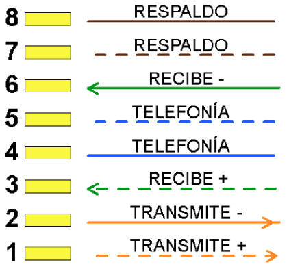
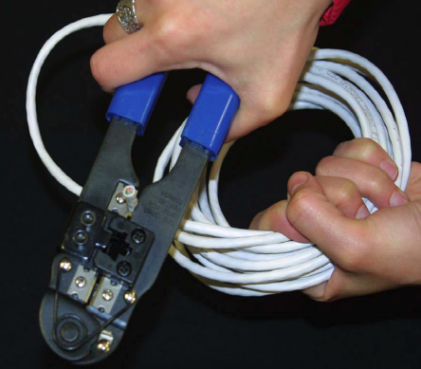
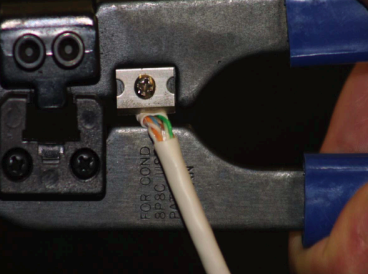
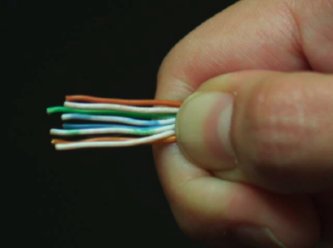
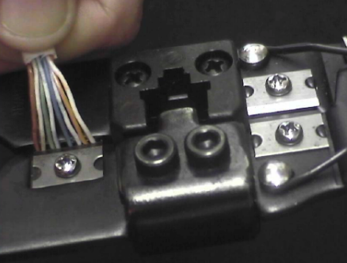
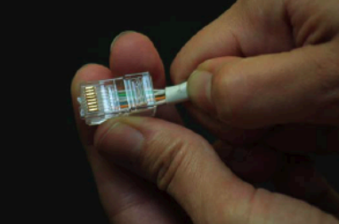
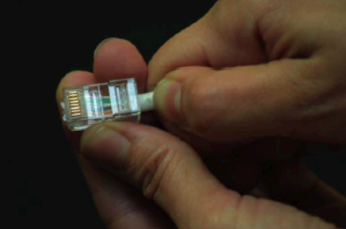
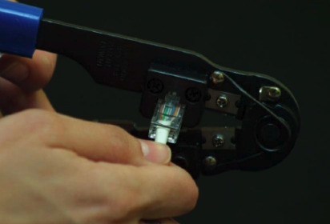
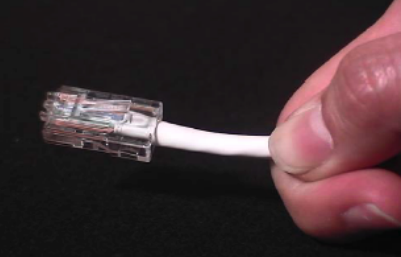
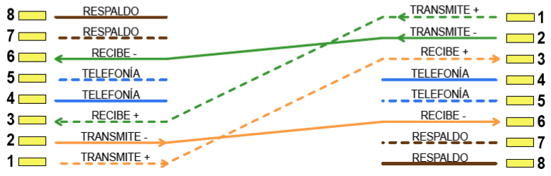

# Práctica 2.1 - Creación de un cable de red directo y cruzado con conectores RJ45

## Parte 1 - Creación de los cables

### Descripción

Los cables de red proporcionan el medio de conexión de las redes de ordenadores. Se emplean para la conexión de equipos a switch, hub, rosetas, etc.

### Materiales

- Cable de red de categoría 5 ó 6.
- Crimpadora.
- Pelacables.
- 2 conectores RJ45.

### Explicación

Las tarjetas de red de los ordenadores emplean 4 de sus 8 conectores para transmitir paquetes de datos. La conexión de los pares de cables en un determinado orden permiten que se comuniquen directamente equipos y dispositivos concentradores o conmutadores. La función de cada una de las conexiones está descrita en la imagen adjunta. A este tipo de cable se le conoce como cable directo.

{ widht="400px" }

### Desarrollo de la práctica

Cortamos un trozo del cable disponible (éste tendrá que ser de entre 1 y 1,5 metros). En cualquier caso, la distancia máxima entre el concentrador o conmutador y el equipo no podrá superar, nunca, los 100 metros. Se debe calcular de forma correcta la medida final del cable añadiendo unos diez centímetros por si debemos repetir el proceso de pelado en alguno de los extremos.

Cortamos un poco el aislante con la punta de la crimpadora y pellizcamos el aislamiento o funda externa del
cable creando una muesca a su alrededor (debemos separar algo más de 2 cm).

{ widht="400px" }

Cuando ya esté cortado tira del aislamiento hasta dejar ver los 8 hilos cruzados en 4 pares.

{ widht="400px" }

Separamos y desenrollamos los pares de cables.

Los ponemos en orden teniendo en cuenta esta combinación (T568B) en los dos extremos: Blanco-Naranja, Naranja, Blanco-Verde, Azul, Blanco-Azul, Verde, Blanco-Marrón, Marrón. Aunque la especificación IEEE para Ethernet 10/100 Base T requiere usar sólo dos pares trenzados, un par es conectado a los pines 1 (Blanco-Naranja) y 2 (Naranja) y el segundo a los pines 3 (Blanco-Verde) y 6 (Verde). Los dos primeros son para la emisión de datos y los otros para la recepción. El resto no realiza ninguna función en el cable de datos, aunque el estándar permite su posible utilización para integrar telefonía y datos en un mismo cable.

{ widht="400px" }

Se cortan con la crimpadora dejando unos 12 ó 13 milímetros de cable pelado. Conviene no quedarse corto ni excederse en la medida de los cables para evitar su rápido deterioro.

{ widht="400px" }

Después introduciremos los hilos dentro del conector vigilando que entren por su carril hasta que hagan tope con el fondo. Comprobamos el conector visto de frente, de manera que podamos ver las puntas de cobre de los hilos pegadas a la parte frontal. Es importante que la funda del cable esté perfectamente introducida en la clavija.

{ widht="400px" }

{ widht="400px" }

Introducimos el conector dentro de la crimpadora poniendo especial cuidado en que, en la manipulación, no se desplacen los hilos que habíamos introducido en el conector Se comprueba si hemos presionado bien tirando del cable hacia atrás. Si se desplaza respecto al conector deberemos tirar éste último y comenzar el proceso con uno nuevo.

{ widht="400px" }

Presionaremos fuertemente la crimpadora para que se claven bien los contactos en el cable y la funda de plástico del mismo.

{ widht="400px" }

Repite este proceso con el otro extremo del mismo cable.

Una vez finalizado el cable directo, deberás realizar uno cruzado. El cable cruzado permite la conexión directa de dos equipos mediante tarjetas de red. Cruzamos los pares de cables para asociar físicamente las distintas entradas y salidas de las tarjetas de los equipos. Este cable se debe emplear, igualmente, para conectar hubs entre sí. Este tipo de cableado sigue la norma T568B y T568A, para cada uno de los extremos del cable.

Por tanto, la combinación en un extremo será Blanco-Naranja, Naranja, Blanco-Verde, Azul, Blanco-Azul, Verde, Blanco-Marrón, Marrón. En el otro extremo será Blanco-Verde, Verde, Blanco-Naranja, Azul, Blanco-Azul, Naranja, Blanco-Marrón, Marrón.

{ widht="400px" }

## Parte 2 - Comprobación del funcionamiento de los cables

### Descripción

Una vez hechos los cables, comprueba que funcionan correctamente.

### Materiales

- Cables terminados de la parte 1.
- Tester.

### Explicación

El tester realiza pruebas secuenciales de continuidad y cruces sobre cada conductor. Es un equipo de prueba muy sencillo y económico que lógicamente no realiza pruebas de respuesta en frecuencia ni diafonía, y por tanto, no caracteriza la  ategoría de la conexión. Las pruebas se tienen que realizar sobre los cables desconectados, no sometidos a tensión. Al introducir el cable en el conector del tester este envía unos impulsos eléctricos y si están bien conectados los leds se encienden.

## Criterios evaluación

Esta práctica evalúa los criterios de evaluación **a)**, **b)** y **c)** del **RA2**. Para su corrección se tendrá en cuenta:

- Montaje y comprobación correcto del cable cruzado (40%).
- Montaje y comprobación correcto del cable directo (40%).
- Documentación (20%).

## Entrega de la tarea

Documenta todo el proceso con fotografías realizadas por ti, además de escribir el proceso completo que has realizado. Entrega el documento .PDF en el lugar de la plataforma Moodle Centros habilitado para ello, con el siguiente nombre:

**Apellido1Apellido2_Nombre_PAR_UD2_P1.pdf**

Además, el profesor deberá comprobar cuando termines de testear el cable que está correcto.