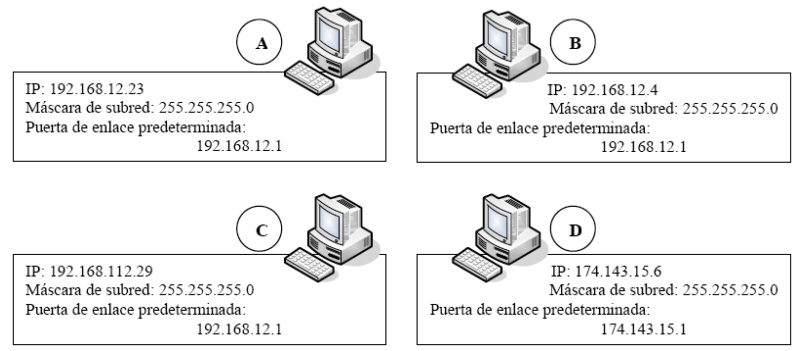

# Práctica 2.2 - Configuración TCP/IP en el ordenador

Utilizando un ordenador conectado a Internet, vamos a localizar el nombre de nuestro host, dirección MAC e información sobre la dirección de red.

En primer lugar hay que conectarse a Internet y a continuación, abre una terminal del sistema operativo que estemos usando.

## Primera parte

Introduce el comando **ipconfig /all** (Windows) y **ifconfig** (Linux) y pulsa intro. La información mostrada se debe utilizar para responder a las siguientes cuestiones:

1. ¿Cuál es la dirección IP del ordenador? ¿En qué sistema de numeración viene expresada?
2. ¿Cuál es la máscara de subred?
3. ¿Cuál es la puerta de enlace predeterminada?
4. ¿Observas alguna similitud entre la dirección IP y la de la puerta de enlace predeterminada?
5. Anota otras dos IP de los ordenadores de tus compañeros. ¿Existen similitudes entre la IP de tu PC y la de los ordenadores de tus compañeros? ¿Y entre las puertas de enlace?
6. Compara los datos que obtienes entre Windows y Linux.

## Segunda parte

Con la misma información obtenida anteriormente responde a las siguientes cuestiones:

1. ¿Cuál es la dirección MAC? ¿En qué sistema de numeración viene expresada?
2. Anota las direcciones MAC de otros dos ordenadores de la red, ¿observas alguna similitud entre ellos?
3. ¿Cuál es el nombre del host de tu ordenador?
4. Anota los nombres de los hosts de otros dos ordenadores
6. ¿Cuál es la dirección del servidor DNS? Busca información en Internet sobre lo que es un servidor DNS y coméntalo brevemente.

## Tercera parte

Utiliza las conclusiones obtenidas a lo largo de las cuestiones anteriores para resolver razonadamente el siguiente supuesto.

Supongamos que tenemos cuatro ordenadores en las que hemos usado el comando ipconfig. Tras ello, hemos obtenido sus direcciones de red, máscaras de subred y puerta de enlace predeterminadas:

{ width="700" }

Responde a las siguientes cuestiones:

1. ¿Pueden comunicarse los ordenadores A y B entre sí? ¿Por qué?
2. ¿Están los ordenadores A, B y C en la misma red? ¿Por qué? ¿Observas algún error?
3. ¿Están los ordenadores A, B y D en la misma red? ¿Por qué?
4. ¿Podrían comunicarse los ordenadores A y D? ¿Cómo?
5. ¿Podrían comunicarse los ordenadores B y D? ¿Cómo?
6. ¿Podrían comunicarse los ordenadores C y D? ¿Por qué?
7. ¿Es necesario un router para establecer la comunicación entre los ordenadores A y B?
8. ¿Se solucionaría el problema de comunicación entre los ordenadores A y C? ¿Y entre B y C?

## Criterios de evaluación

Esta práctica evalúa los criterios de evaluación **a)**, **d)**, **e)** **f)**, y **g)** del **RA2**. Para su corrección se tendrá en cuenta:

- Comprensión y aplicación de conceptos técnicos (40%)
    - Demostrar una comprensión clara de los conceptos de redes: direcciones IP, máscaras de subred, puertas de enlace, direcciones MAC, servidores DNS, etc.
    - Aplicar correctamente estos conceptos para responder a las preguntas de manera precisa.
- Análisis y razonamiento lógico (25%)
	- Capacidad para analizar la información proporcionada y extraída de los comandos.
	- Razonamiento sólido en la resolución de los supuestos planteados, justificando las respuestas de forma coherente.
- Exactitud y completitud de las respuestas (20%)
	- Responder todas las preguntas de la práctica de manera completa.
	- Proporcionar información precisa y datos correctos según lo obtenido en las pruebas realizadas.
- Claridad y coherencia en la redacción (10%)
	- Presentar las respuestas de forma clara y organizada.
	- Mantener una estructura lógica y utilizar correctamente la gramática y ortografía.
- Uso adecuado de terminología técnica (5%)
	- Emplear correctamente los términos y conceptos técnicos relacionados con la materia.
	- Demostrar familiaridad y precisión en el vocabulario específico de redes y sistemas operativos.

## Entrega de la práctica

Contesta a las cuestiones, genera un documento .PDF, y súbelo en el lugar de la plataforma Moodle Centros habilitado para ello, con el siguiente nombre:

**Apellido1Apellido2_Nombre_PAR_UD2_P2.pdf**