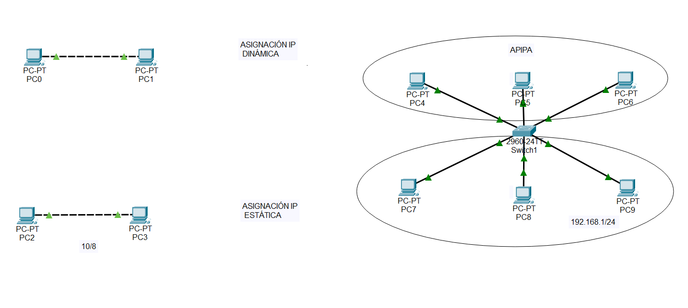

# Práctica 2.3 - Configuración de asignaciones IP

## Desarrollo de la tarea

En las redes de área local cada host necesita una dirección IPv4. Las direcciones lógicas o IPv4 se configuran en la conexión de la interfaz de red (NIC). Algunos servidores pueden tener más de una NIC, y cada una de ellas tiene su propia dirección IPv4. 

Utiliza el simulador Cisco Packet Tracer para reproducir el escenario adjunto. Configura las asignaciones IP como indican las instrucciones:

- Los equipos de la parte superior tendrán configuración IP dinámica: las tarjetas FastEthernet activarán el cliente DHCP. 
- Los equipos de la parte inferior tendrán configuración IP estática: las tarjetas FastEthernet activarán la configuración IP estática.
- Confirma la comunicación entre equipos usando los comandos ipconfig y ping.
- Confirma que dos equipos con conexión física no tienen por qué comunicarse si no están en la misma red lógica.

{ width="800" }

A continuación, realiza los siguientes comandos:

- ipconfig y ping exitoso entre PC0 y PC1
- ipconfig y ping exitoso entre PC2 y PC3
- ipconfig y ping exitoso entre PC4 y PC6
- ipconfig y ping exitoso entre PC7 y PC9 
- ipconfig y ping fallido entre PC5 y PC8

Documenta con capturas estos resultados y genera un documento .pdf con ellas.

## Criterios de evaluación

Esta práctica evalúa los criterios de evaluación **a)**, **d)**, **e)** **f)**, y **g)** del **RA2**. Para su corrección se tendrá en cuenta:

- Configuración correcta del escenario en Cisco Packet Tracer (30%)
	- Reproducción fiel del esquema de red proporcionado.
	- Conexión adecuada de todos los dispositivos según las instrucciones dadas.
	- Verificación de que la topología y las conexiones físicas corresponden al diagrama.
- Asignación y configuración de direcciones IP (25%)
	- Configuración correcta de IP dinámica (DHCP) en los equipos de la parte superior.
	- Configuración correcta de IP estática en los equipos de la parte inferior.
	- Asegurarse de que las direcciones IP asignadas estén en las subredes correctas y sin conflictos.
- Verificación y documentación de la comunicación entre equipos (25%)
	- Ejecución exitosa de los comandos ipconfig y ping entre los pares de equipos especificados (PC0-PC1, PC2-PC3, PC4-PC6, PC7-PC9).
	- Capturas de pantalla claras que evidencien la comunicación exitosa.
	- Inclusión de resultados que demuestren la conectividad correcta entre los equipos mencionados.
- Demostración de la falta de comunicación entre equipos en diferentes redes lógicas (10%)
	- Ejecución del comando ping fallido entre PC5 y PC8.
	- Capturas de pantalla que muestren el fallo en la comunicación.
	- Breve explicación de por qué dos equipos con conexión física no se comunican si no están en la misma red lógica.
- Presentación y organización del documento final (10%)
	- El documento .pdf debe estar bien estructurado, con todas las capturas ordenadas y correctamente etiquetadas.
	- Uso de un lenguaje claro y técnico apropiado.
	- Cumplimiento de las instrucciones de entrega y formato solicitado.

## Entrega de la práctica

Crea un archivo ZIP con el PDF y el archivo del escenario de Cisco Packet Tracer, y súbelo en el lugar de la plataforma Moodle Centros habilitado para ello, con el siguiente nombre:

**Apellido1Apellido2_Nombre_PAR_UD2_P3.zip**