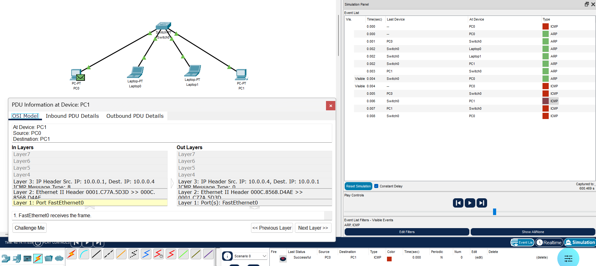

# Práctica 2.4 - Servidor DHCP y Broadcast o difusión en las redes LAN

## Parte 1 - Servidor DHCP

Las direcciones IP se pueden establecer utilizando el método estático o el método dinámico.

Si decidimos establecer la dirección IP de forma estática, deberemos configurar manualmente la dirección de cada equipo de la red. Esto implica asignar individualmente una dirección IP a cada dispositivo.

Si optamos por establecer la dirección IP automáticamente, podremos configurar las direcciones IP para toda una red desde una sola ubicación y asignarlas dinámicamente a cada equipo mediante protocolos como DHCP.

Una vez hemos establecido la dirección IP, podemos ver su configuración TCP/IP utilizando herramientas como el comando ipconfig o la interfaz de configuración de red del sistema operativo.

### Direccionamiento Estático

El direccionamiento IP estático hace referencia a la configuración manual de direcciones IP. En este método, utilizamos una utilidad proporcionada por el sistema operativo para asignar una dirección IP. Generalmente, accedemos a la configuración de red y elegimos la opción “Usar la siguiente dirección IP”, introduciendo manualmente los distintos parámetros como la dirección IP, la máscara de subred y la puerta de enlace predeterminada.

En general, la mayoría de equipos solo tienen un adaptador de red instalado y, por ello, únicamente requieren una sola dirección IP. Si un dispositivo, como un router, tiene instalados múltiples adaptadores de red, cada adaptador necesita su propia dirección IP.

### Direccionamiento Dinámico

De forma predeterminada, muchos sistemas operativos están configurados para obtener una dirección IP automáticamente utilizando protocolos como DHCP (Dynamic Host Configuration Protocol).

DHCP utiliza un servidor DHCP para gestionar la asignación dinámica de direcciones IP. Los servidores DHCP contienen una base de datos de direcciones IP que pueden asignarse a los hosts de la red. Para utilizar DHCP en una red, los hosts deben estar habilitados para usar este protocolo. Para habilitar DHCP, seleccionamos la opción “Obtener una dirección IP automáticamente”, que suele estar activada por defecto en muchos sistemas operativos.

Cuando movemos un equipo de una subred a otra, debemos cambiar su dirección IP para reflejar el nuevo ID de red. Sin embargo, DHCP nos permite asignar automáticamente una dirección IP a un host, denominado también cliente DHCP, desde una base de datos asignada a una subred. Además, cuando un equipo está sin conexión durante un determinado periodo de tiempo, DHCP puede reasignar su dirección IP a otro dispositivo.

La difusión es imprescindible en las redes LAN. Cuando un host quiere comunicarse con otro dentro de la misma red utiliza el broadcast o difusión para localizarlo. No se necesita la puerta de enlace o el router. Para demostrar el proceso, a continuación se explica el proceso del ping entre dos equipos dentro de la misma red local.

### Ejercicio 1

Documenta el proceso de creación de una red con cuatro equipos y un servidor DHCP, donde este asigne direcciones de la red 192.168.1.0, y que asigne direcciones en el rango 11 hasta la 50. Documentar tanto el proceso de creación con la configuración del servidor, así como el resultado.

## Parte 2

### Dominio de colisión

Un dominio de colisión es un grupo de dispositivos conectados al mismo medio físico, de tal manera que si dos dispositivos acceden al medio al mismo tiempo, el resultado será una colisión entre las dos señales. Como resultado de estas colisiones se produce un consumo inadecuado de recursos y de ancho de banda.

En las redes antiguas con topología en bus, y en las que hacen uso de hubs, el medio se comparte, por lo que se producen colisiones. Cuanto menor sea la cantidad de dispositivos afectados a un dominio de colisión mejor es el desempeño de la red.
Hay que evitar, por tanto, los dominios de colisión, y dentro de ellos, mejor que sean pequeños: pocos dispositivos.

### Dominio de broadcast

Grupo de dispositivos de la red que envían y reciben mensajes de difusión entre ellos. Una cantidad inapropiada de estos mensajes de difusión (broadcast) provocara un bajo rendimiento en la red, una cantidad exagerada (tormenta de broadcast) dará como resultado el mal funcionamiento de la red hasta tal punto de poder dejarla completamente congestionada.

### Hubs
El hub fue el primer dispositivo central de la topología en estrella. Recibe datos y los hace llegar a todos los dispositivos que tiene conectados (hosts), lo hace transmitiendo en modo semidúplex (ambas direcciones, pero no a la misma vez).

Los hubs o concentradores tienen un único dominio de colisión que incluye todos los dispositivos de red conectados. Eso quiere decir que si dos equipos provocan una colisión en un segmento asociado a un puerto del hubs, todos los demás dispositivos aun estando en diferentes puertos se verán afectados. De igual manera se verían afectados si una estación envía un broadcast, debido a que un hub también tiene un solo dominio de difusión. 

### Ping entre dos host dentro de la misma red local

Cuando la comunicación se realiza entre dos hosts de la misma red la puerta de enlace no se ve involucrada. Supongamos un ping entre dos equipos de una LAN:

- El equipo emisor del ping detecta que el destino está dentro de la misma red. Lo averigua mediante  operaciones binarias:
    - AND(IP_destino, Máscara) 
    - AND(IP_origen, Máscara)
    - Si coinciden con la dirección de red del equipo local significa que están en la misma red IP o red lógica
- El ICMP (capa de red) solicita a la capa inferior que envíe la trama. Se necesita la MAC de destino para encapsular la trama. Si no se tiene (no aparece en arp -a) se usa el protocolo ARP.
- El protocolo ARP 
    - Origen: pregunta a toda la red (request IP)
    - Destino: contesta con su dirección MAC. 
    - Origen: Se actualiza la tabla de MACs del origen
- Ya con la MAC destino:
    - echo request se encapsula en la trama
    - echo reply vuelve

### Ejercicio 2

Responde a las siguientes preguntas y documenta aquello que sea necesario. Utiliza el modo simulación de Cisco Packet Tracer para las capturas de pantalla de los protocolos.

1. Realiza el Packet Tracer del escenario que se muestra (lo entregarás cuando finalices la tarea). La dirección de red es la 10.0.0.0, y las IPs de los distintos dispositivos son consecutivas desde la primera disponible.
2. Crea una PDU simple que envía un ping del PC de la izquierda al de la derecha. Usa el icono "Add Simple PDU" (el sobre cerrado) arriba a la izquierda. Pincha primero en el origen y después en el destino del ping.
3. Usa arp -d para limpiar la cache de las resoluciones arp del equipo origen. Así nos aseguramos de que se va a preguntar a toda la red por la MAC del equipo destino.
4. Entra en el modo simulación, limpia todos los protocolos y añade sólo los protocolos ARP e ICMP.
5. ¿Cuál es el dominio de difusión o de broadcast en el escenario? Envía una captura de pantalla de Cisco Packet Tracer que lo demuestre e indica el protocolo que lo usa y para qué.
6. Indica el escenario y la trama donde se realiza la resolución ARP. En el modelo OSI marca la capa donde se realiza y captura de pantalla. Indica:
    - Capa donde se realiza la resolución ARP.
    - Dirección IP por la que se preguntaba.
    - Dirección MAC devuelta.
7. Nada más solucionarse el problema de la MAC mediante el broadcast, ¿cuál es la siguiente trama que se envía?
8. Repite la simulación. Ya no se realizará el broadcast. Explica por qué.

## Criterios de calificación

Esta práctica evalúa los criterios de evaluación **a)**, **d)**, **e)** **f)**, y **g)** del **RA2**. Para su corrección se tendrá en cuenta:

1. Configuración y Documentación de la Red con Servidor DHCP (25%)
	- Configuración correcta de la red con cuatro equipos y un servidor DHCP en Cisco Packet Tracer.
	- Configuración del servidor DHCP para asignar direcciones de la red 192.168.1.0, en el rango del 11 al 50.
	- Documentación detallada del proceso de creación y configuración, incluyendo capturas de pantalla y explicaciones claras.
	- Verificación del resultado, mostrando que los equipos reciben correctamente las direcciones IP asignadas por DHCP.
2. Configuración del Escenario y Ejecución de la PDU Simple (20%)
	- Creación correcta del escenario según la imagen proporcionada, utilizando la dirección de red 10.0.0.0 y asignando IPs consecutivas desde la primera disponible.
	- Creación y envío de una PDU simple (ping) desde el PC de la izquierda al de la derecha utilizando el ícono “Add Simple PDU”.
	- Presentación del escenario en Cisco Packet Tracer, incluyendo las direcciones IP asignadas y la conectividad entre dispositivos.
3. Configuración y Uso del Modo Simulación en Cisco Packet Tracer (20%)
	- Uso del comando arp -d para limpiar la caché ARP del equipo origen.
	- Configuración adecuada del modo simulación, eliminando todos los protocolos y añadiendo solo ARP e ICMP.
	- Capturas de pantalla que demuestren la configuración y los pasos realizados.
4. Análisis del Dominio de Difusión y Resolución ARP (20%)
	- Identificación del dominio de difusión (broadcast) en el escenario.
	- Captura de pantalla que lo demuestre, indicando el protocolo que lo utiliza y su propósito.
	- Análisis detallado del escenario y la trama donde se realiza la resolución ARP, incluyendo:
	- Capa del modelo OSI donde se realiza la resolución ARP.
	- Dirección IP consultada.
	- Dirección MAC devuelta.
	- Capturas de pantalla y referencias al modelo OSI.
5. Comprensión del Proceso de Comunicación y de la Caché ARP (15%)
	- Descripción de la siguiente trama que se envía después de solucionarse el problema de la MAC mediante el broadcast.
	- Repetición de la simulación y explicación de por qué ya no se realiza el broadcast.
	- Explicación clara del funcionamiento de la caché ARP y su impacto en la comunicación en redes.

## Entrega de la práctica

Crea un archivo ZIP con el PDF y los archivos de los escenarios de Cisco Packet Tracer, y súbelo en el lugar de la plataforma Moodle Centros habilitado para ello, con el siguiente nombre:

**Apellido1Apellido2_Nombre_PAR_UD2_P4.pdf**

