# Práctica 2.5 - Redes inalámbricas

## Configuración del router WRT300N

El router inalámbrico WRT300N de Cisco cuenta con una interfaz web para su configuración. Dado que tiene activado por defecto un servidor DHCP, podemos conectar un ordenador a cualquiera de las interfaces Ethernet del router para que este obtenga parámetros IP que permitan la conexión con el router. Una vez que nuestro PC haya recibido una dirección IP del router, abrimos un navegador y escribimos en la barra de direcciones http://192.168.0.1.

Antes de acceder al router, se nos pedirá autenticarnos. Aparecerá un formulario de incio de sesión en el que debemos ingresar el nombre de usuario administrador y la contraseña. Si el router es nuevo o ha sido reiniciado a valores de fábrica, el usuario administrador por defecto es admin y la contraseña también es admin. Una vez autenticados, deberíamos ver la siguiente pantalla:

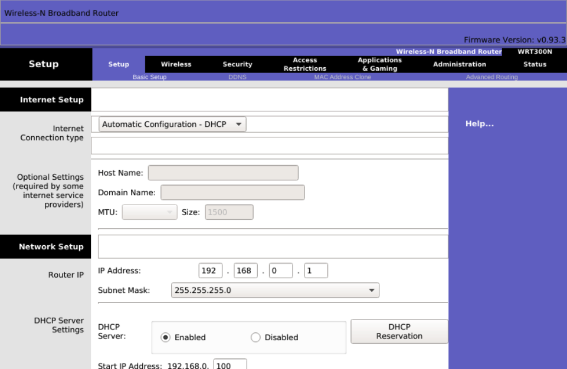{ width="700" }

### Parámetros Wi-Fi

Una red WLAN tiene los siguientes parámetros configurables:

- SSID (Service Set Identifier): Es una cadena alfanumérica de hasta 32 caracteres que identifica a la red.
- Protocolo: Especifica la versión del estándar 802.11 que utilizaremos.
- Canal: Frecuencia de transmisión utilizada.
- Seguridad: Parámetros que afectan tanto a la autenticación del cliente inalámbrico con el punto de acceso como al cifrado de las comunicaciones. Estos se abordarán en una sección posterior.

Para configurar los parámetros de la red inalámbrica, debemos hacer clic en el enlace Wireless del menú principal. Desde aquí, especificaremos los siguientes valores:

- Network Mode: Indica la versión del estándar 802.11 que utilizará la WLAN. Las opciones disponibles son:
- Mixed: Para redes con dispositivos de diferentes estándares.
- BG-Mixed: Permite la conexión de dispositivos 802.11b y 802.11g, que son compatibles entre sí.
- Wireless-B Only: Solo conecta dispositivos que operan bajo 802.11b.
- Wireless-G Only: Solo conecta dispositivos que operan bajo 802.11g.
- Wireless-N Only: Solo conecta dispositivos que operan bajo 802.11n.
- Disabled: Deshabilita la red inalámbrica.
- SSID: Es el identificador de nuestra red, por ejemplo, CISCO. Todos los clientes inalámbricos reconocerán esta red por este SSID. Si dejamos activado SSID Broadcast, este nombre se difundirá por la red.
- Radio Band: Indicamos si usaremos canales de 20 MHz o 40 MHz. Esta opción solo está disponible si en el modo de red hemos seleccionado el estándar 802.11n.
- Wide Channel: Establecemos el canal de emisión en caso de haber seleccionado 40 MHz en el campo anterior.
- Standard Channel: Canal o frecuencia de emisión. Es muy importante asegurarnos de utilizar uno que tenga una separación mínima de 5 canales (o 25 MHz) respecto a los canales de operación de otras redes inalámbricas cercanas, para evitar solapamientos de señal e interferencias. En caso de emplear 802.11n, este canal es secundario para aumentar la tasa de transmisión.
- SSID Broadcast: Establece si se difunde o no el nombre de la red en el entorno para que los clientes puedan conectarse.

Una vez establecidos estos parámetros, debemos hacer clic en el botón Save Settings en la parte inferior de la pantalla.

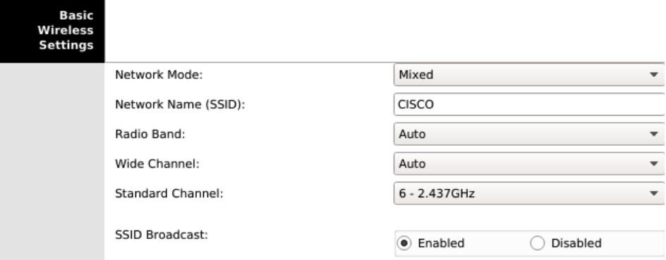{ width="700" }

### Servidor DHCP

Los clientes de la red, tanto inalámbricos como cableados, necesitarán configurar sus parámetros IP para que los usuarios o el administrador no tengan que hacerlo manualmente. Para ello, el router WRT300N incluye un servidor DHCP que podemos configurar según nuestras necesidades. Los pasos a seguir son los siguientes:

1. Acceder a la interfaz web de configuración del router y autenticarse como administrador.
2. En la primera opción del menú, Setup, encontraremos el apartado Network Setup desde donde podremos configurar tanto la dirección IP de LAN del router como los parámetros del servidor DHCP.
3. En el campo Router IP, indicar la dirección IP y la máscara de subred del router en la LAN. Por ejemplo, 192.168.1.1 con máscara 255.255.255.0. Recordemos que las LAN operan internamente con direcciones privadas, por lo que podemos utilizar cualquier red dentro del rango de redes privadas establecido.
4. En el campo Start IP Address, indicar la primera dirección IP que se asignará a los dispositivos de la red.
5. En el campo Maximum Number of Users, establecer el número máximo de direcciones IP que se asignarán. La primera será la que se haya establecido en el campo anterior, y sumando a esta el valor indicado aquí se obtendrá la última dirección.

No es necesario especificar un servidor DNS en la configuración del rango de direcciones del servidor DHCP, ya que el router asignará el mismo que haya obtenido de la conexión a Internet.

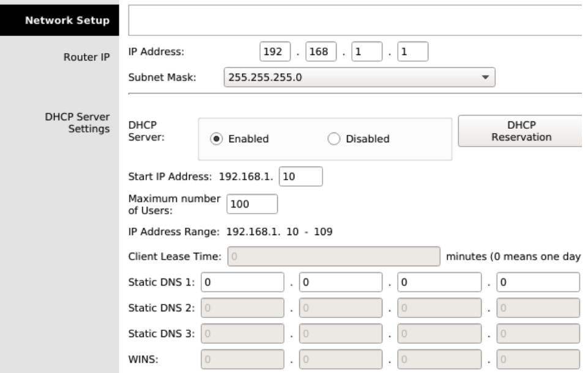{ width="700" }

Si hemos cambiado la red en la que operaba por defecto el router (192.168.0.0/24), quedaremos desconectados, ya que nuestros parámetros IP pertenecían a la red anterior. Por lo tanto, debemos cerrar el navegador, renovar la configuración de red en nuestro PC desactivando y reactivando la tarjeta de red, y volver a conectar con la interfaz web de configuración del router para continuar. Esta vez, en el navegador deberemos ingresar la dirección IP de LAN que asignamos al router, en nuestro caso 192.168.1.1.

### Seguridad en la WiFi

En esta sección, veremos cómo establecer una seguridad básica en nuestro router para evitar conexiones no autorizadas. Los pasos a seguir son:

1. Acceder a la interfaz web de configuración del router y autenticarse como administrador.
2. En el menú, ir a Wireless → Wireless Security, desplegar la lista Security Mode y elegir WPA2 Personal.
3. En el campo Encryption, seleccionar el algoritmo AES, que es preferible a TKIP.
4. En el campo Passphrase, establecer la clave que los usuarios deben utilizar para conectar sus dispositivos a la red inalámbrica.
5. Hacer clic en el botón Save Settings en la parte inferior de la pantalla.

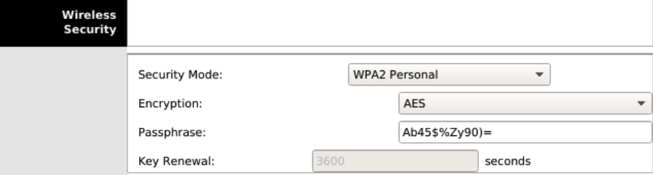{ width="700" }

Una parte crucial de la seguridad de una red inalámbrica reside en la contraseña elegida. Al crear una clave inalámbrica, se recomienda:

- Que tenga una longitud mínima de ocho caracteres.
- Combinar letras (mayúsculas y minúsculas), símbolos y números.
- No utilizar palabras comunes, números o fechas.

### Filtrado MAC

Una buena práctica para aumentar la seguridad de nuestra red inalámbrica es habilitar el filtrado MAC. Esto se basa en utilizar una lista de direcciones MAC correspondientes a dispositivos de confianza. Podemos configurar esta lista en el router de manera que solo los dispositivos cuyas direcciones MAC coincidan con alguna de la lista puedan unirse a la red; en caso contrario, serán rechazados.

Para habilitar y configurar el filtrado MAC, seguir estos pasos:

1. Acceder a la interfaz web de configuración del router y autenticarse como administrador.
2. Ir a la opción de menú Wireless → Wireless MAC Filter.
3. Hacer clic en Enabled para activar el filtrado MAC.
4. Seleccionar Permit PCs listed below to access wireless network.
5. Introducir todas las direcciones MAC de los dispositivos conocidos. Aquí debemos incluir los PCs, portátiles, smartphones, tablets, etc., que queremos conectar a nuestra red.
6. Hacer clic en el botón Save Settings en la parte inferior de la pantalla.

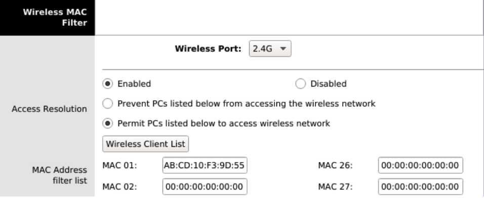{ width="700" }

2.3.2 Servidor RADIUS

Una alternativa más segura que utilizar autenticación y cifrado a través del router WiFi con los modos de seguridad tradicionales WPA o WPA2 es emplear un servicio RADIUS (Remote Authentication Dial-In User Server). Este servicio, que se ejecuta en un servidor conectado a la misma red cableada que el router WiFi, permite autenticar clientes inalámbricos, cada uno de los cuales dispone de credenciales propias formadas por un par usuario/contraseña para conectarse a la red inalámbrica. El proceso de conexión a la red WiFi sería el siguiente:

1. Un dispositivo inalámbrico solicita conexión a la red inalámbrica del router WiFi, enviando un nombre de usuario y una contraseña proporcionados por el administrador de la red.
2. El router WiFi no autentica al dispositivo directamente, sino que envía las credenciales al servidor RADIUS para su autenticación.
3. El servidor RADIUS verifica si las credenciales del dispositivo son válidas, consultando una base de datos que almacena las credenciales de todos los usuarios que se conectan a la red inalámbrica. Si no son válidas, no se concede autorización para acceder a la red y se informa al cliente (autenticación incorrecta).
4. Si las credenciales del usuario son correctas, el servidor RADIUS autoriza al cliente para acceder a la red, comunicándoselo al router WiFi.
5. El router WiFi, a través del protocolo DHCP, envía la dirección IP, máscara, puerta de enlace y DNS al cliente para que pueda acceder a la red WiFi.

Gráficamente, el proceso sería así:

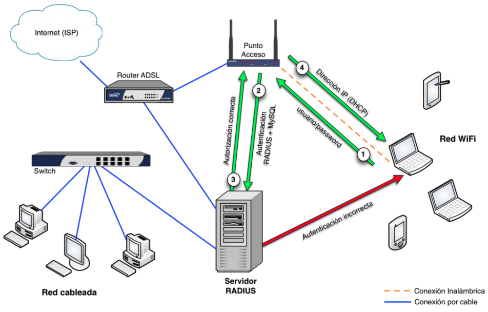{ width="700" }

Para realizar la configuración, crearemos el siguiente esquema de red en Packet Tracer.

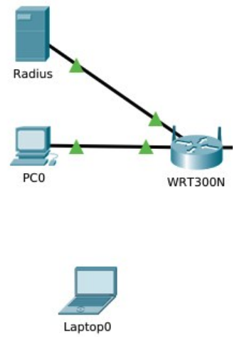{ width="300" }

Como podemos observar, disponemos de un router WiFi con dirección IP 192.168.1.1 conectado a un servidor RADIUS con dirección IP 192.168.1.2. Hay dos clientes inalámbricos que se conectarán al router WiFi tras autenticarse en el servidor RADIUS. La configuración que debemos realizar consiste en:

1. Habilitar el servicio AAA en el servidor RADIUS. Debemos incluir el router WiFi como cliente de autenticación y añadir dos credenciales en la base de datos de usuarios para que el portátil y el smartphone puedan autenticarse.
2. Configurar la seguridad inalámbrica en el router WiFi para que las autenticaciones de los clientes inalámbricos se realicen en el servidor RADIUS.
3. Configurar los clientes para que, al conectarse a la red inalámbrica, envíen sus credenciales de autenticación.

Para el punto 1, debemos acceder al servidor y seleccionar la pestaña Services. Seleccionamos AAA y establecemos la siguiente configuración.

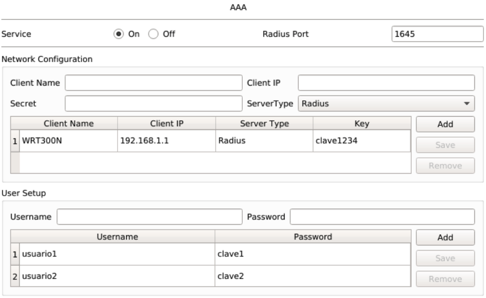{ width="700" }

Observamos que hay configurado un cliente inalámbrico (el WRT300N), el cual se identifica por su dirección IP y la clave de acceso. El puerto utilizado para las solicitudes de autenticación al servidor RADIUS es el 1645. Además, se han incluido dos credenciales de usuario en la base de datos.

En el router WiFi, debemos acceder a la interfaz web de configuración, en la opción de menú Wireless → Wireless Security.

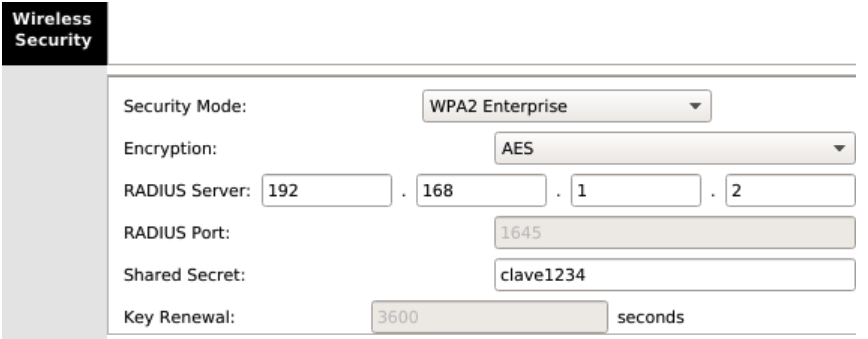{ width="700" }

Vemos que en el modo de seguridad, debemos seleccionar WPA2 Enterprise, establecer la dirección IP del servidor RADIUS y la clave que configuramos al incluir este cliente de autenticación en el servidor RADIUS.

Finalmente, debemos configurar los clientes inalámbricos para que se autentiquen enviando sus credenciales al router WiFi. En el siguiente ejemplo, configuraremos el ordenador portátil:

1. Acceder al portátil y hacer clic en la pestaña _Desktop_.
2. Seleccionar _PC Wireless_.
3. Hacer clic en la pestaña _Profiles_ y seleccionar _New_.
4. Introducir un nombre para el perfil, por ejemplo, RADIUS.
5. De las redes inalámbricas disponibles, seleccionar CISCO y hacer clic en _Advanced Setup_.
6. En _Wireless Mode_, dejar _Infrastructure Mode_ y hacer clic en _Next_.
7. Dejar activada la opción _Obtain network settings automatically (DHCP)_ para obtener los parámetros IP y hacer clic en _Next_.
8. En _Wireless Security_, seleccionar WPA2-Enterprise y hacer clic en _Next_.

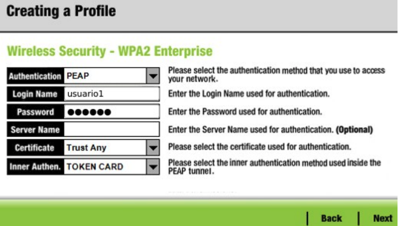{ width="700" }

9. Rellenar los campos _Login name_ y _password_ con usuario1 y clave1 respectivamente. Hacer clic en _Next_.
10. Confirmar la creación del perfil haciendo clic en _Save._
11. Finalmente hacer clic en _Connect to Network_ para iniciar el proceso de conexión.

El portátil habrá conectado a la WiFi después de autenticarse en el servidor RADIUS. Si consultamos su configuración IP veremos que el router WiFi le ha servidor sus parámetros después de tener éxito la autenticación.

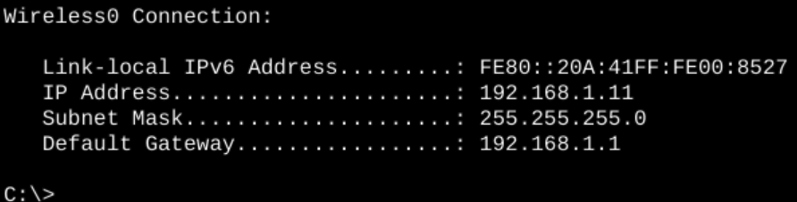{ width="700" }

### Administración del router

Por último debemos de asegurarnos de que nadie pueda conectar con el router WiFi para realizar labores de administración. Para ello tendremos que cambiar el usuario y la contraseña de acceso a la interfaz web de configuración. Seguiremos el siguiente proceso:

1. Abrir la interfaz web de configuración del router y autenticarnos como administrador.
2. Vamos a la opción de menú _Administration_.
3. En el campo Router _password_ introducimos nuestra clave.
4. Repetimos la clave en el campo _Re-enter to confirm_.
5. Hacer clic en el botón _Save settings_ en la parte inferior de la pantalla.

## Parte 1

1. Descarga el [siguiente archivo de Cisco Packet Tracer](assets/practica2.5.pka) y sigue las instrucciones que se indican en él. Documenta el proceso.

2. Replica el escenario anterior en uno nuevo creado por ti. Documenta el proceso y entrega el archivo .pka, modificando las siguientes configuraciones:
    - SSID.
    - Contraseña.
    - Tipo de seguridad en la contraseña.
    - Añade filtrado MAC, de tipo _whitelist_.
    - Añade un nuevo equipo que no debería poder conectarse debido al filtrado MAC.

## Parte 2

Crea un escenario de una red con un router inalámbrico en el que configuraremos un servidor de autenticación Radius. Añade un ordenador portátil que deberá conectarse a dicha red. La autenticación a través del servidor Radius deberá poseer una clave robusta, puedes seguir [los siguientes pasos](assets/images/ud2/img34.png) para generarla.

## Criterios de calificación

Esta práctica evalúa los criterios de evaluación **a)**, **d)**, **e)** **f)**, y **g)** del **RA2**. Para su corrección se tendrá en cuenta:

Parte 1 (50%)

- Descarga y Seguimiento de Instrucciones en el Archivo de Cisco Packet Tracer (20%).
- Replicación del Escenario con Modificaciones y Documentación (30%).

Parte 2 (50%)

- Creación del Escenario de Red con Router Inalámbrico (10%).
- Configuración de un Servidor de Autenticación Radius (20%).
- Conexión de un Ordenador Portátil a la red (10%).
- Uso de una Clave Robusta para la Autenticación (10%).

## Entrega de la práctica

Crea un archivo ZIP con la documentación y los archivos de los escenarios de Cisco Packet Tracer, y súbelo en el lugar de la plataforma Moodle Centros habilitado para ello, con el siguiente nombre:

**Apellido1Apellido2_Nombre_PAR_UD2_P5.pdf**