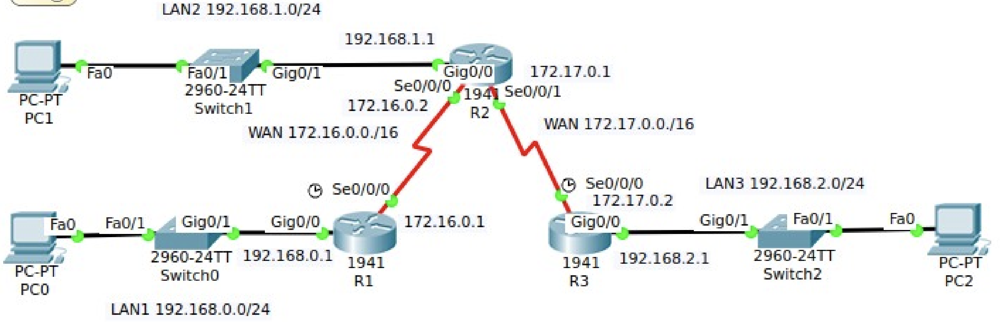

# Práctica 4.1 - Configuración de las interfaces del router

Dado el siguiente escenario:

{ width="700" }

Configura las interfaces que se presentan usando los pasos que se indican en los apuntes.

## Entrega de la práctica

Crea y configura el escenario y súbelo en el lugar de la plataforma Moodle Centros habilitado para ello, con el siguiente nombre:

**Apellido1Apellido2_Nombre_PAR_UD4_P1.pkt**