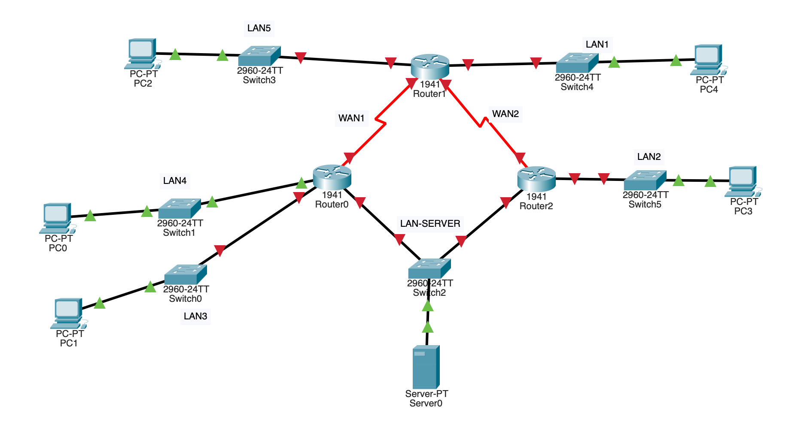

# Práctica 4.3 - Configuración de rutas estáticas (no evaluable)

Dado el [siguiente escenario](assets/pr4.3.pkt) de Cisco Packet Tracer:

{ width="700" }

Configura las rutas estáticas para que todos los hosts sean alcanzables entre sí, dadas las siguientes condiciones:

- Las direcciones de red son las siguientes:
    - WAN1: 172.16.0.0/16
    - WAN2: 172.17.0.0/16
    - LAN1: 192.168.1.0/24
    - LAN2: 192.168.2.0/24
    - LAN3: 192.168.3.0/24
    - LAN4: 192.168.4.0/24
    - LAN5: 192.168.5.0/24
    - LAN-SERVER: 10.0.0.0/24
- Asigna las últimas direcciones del rango de la red a los routers.
- Asigna las primera direcciones del rango de la red a los dispositivos terminales.
- Enrutamiento estático:
    - Configura todas las rutas del Router0 como estáticas de siguiente salto.
    - Configura todas las rutas del Router1 como estáticas conectadas directamente.
    - Configura todas las rutas del Router2 como estáticas completamente especificadas.