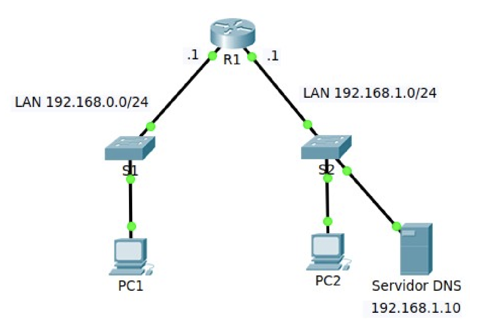

# Práctica 4.5 - DHCP

## Introducción

Todo dispositivo que se conecta a una red necesita contar con una dirección IP única. En general, los administradores de red asignan direcciones IP estáticas a aquellos dispositivos cuya ubicación, tanto física como lógica, permanece estable en el tiempo. Esto incluye equipos como routers, servidores, impresoras y otros dispositivos de infraestructura que proporcionan servicios esenciales dentro de la red.

Estas direcciones deben ser constantes, ya que la estabilidad facilita su administración remota. Resulta mucho más sencillo para un administrador localizar y gestionar un dispositivo cuando su dirección IP es conocida y no cambia.

Por el contrario, los equipos de usuario, como PCs o dispositivos móviles, pueden cambiar de ubicación con frecuencia. En estos casos, asignar manualmente una nueva dirección IP cada vez que el dispositivo cambia de red o de ubicación puede ser una tarea lenta y propensa a errores. Esto se complica aún más cuando se trata de empleados móviles o usuarios que trabajan desde sedes remotas, donde la configuración manual de parámetros de red puede ser poco práctica o inviable.

Incluso en entornos de escritorio, la asignación manual de direcciones IP y parámetros relacionados supone una carga considerable de trabajo para los administradores, especialmente cuando la red crece y se vuelve más compleja.

Para simplificar esta tarea, se recurre a un servidor DHCP (Dynamic Host Configuration Protocol) en la red local. La incorporación de este servicio permite asignar direcciones IP de forma automática tanto a dispositivos de escritorio como a dispositivos móviles. Gracias a un servidor DHCP centralizado, las organizaciones pueden gestionar todas las asignaciones desde un único punto, lo que mejora la eficiencia administrativa y garantiza la coherencia en la configuración de red en toda la infraestructura.

El protocolo DHCP está disponible tanto para direcciones IPv4 (DHCPv4) como para IPv6 (DHCPv6).

### Terminología DHCP

Antes de proceder con la configuración del servicio DHCP, es fundamental comprender algunos términos clave que se utilizarán a lo largo del proceso:

- **Ámbito**: Es el rango completo y consecutivo de direcciones IP que pertenecen a una subred específica. Por ejemplo, en la subred 192.168.0.0/24, el ámbito comprende desde 192.168.0.1 hasta 192.168.0.254. El ámbito es el elemento principal que gestiona un servidor DHCP, ya que define el conjunto de direcciones IP y parámetros de red que se asignarán dinámicamente a los dispositivos de la red.
- **Intervalo de exclusión**: Es una serie específica de direcciones IP dentro del ámbito que el servidor no asignará a los clientes. Estas direcciones suelen reservarse para dispositivos con direcciones IP estáticas o para evitar conflictos.
- **Conjunto de direcciones**: Una vez definido el ámbito y establecidos los intervalos de exclusión, las direcciones IP restantes forman el pool disponible que el servidor DHCP puede utilizar para asignar direcciones dinámicamente a los clientes de la red.
- **Concesión**: Es el periodo de tiempo durante el cual un cliente puede utilizar una dirección IP que le ha sido asignada por el servidor DHCP. La concesión está activa mientras no haya expirado. Antes de que termine dicho plazo, el cliente debe intentar renovar la concesión. Una concesión se considera inactiva cuando ha expirado o ha sido eliminada del servidor.
- **Reserva**: Se trata de una asignación fija de dirección IP a un cliente concreto dentro de la red. La dirección es gestionada por el servidor DHCP, pero está reservada exclusivamente para ese dispositivo. Este método se utiliza con frecuencia en equipos que prestan servicios específicos, como servidores de impresión o servidores web.
- **Tipos de opciones**: Son parámetros adicionales de configuración que el servidor DHCP puede proporcionar junto con la dirección IP. Entre las más comunes se incluyen:
    - Dirección IP de la puerta de enlace predeterminada (router)
	- Servidor DNS
	- Servidor WINS

Estas opciones suelen configurarse por ámbito, para garantizar que todos los clientes reciban la información necesaria para operar correctamente en la red.

La eficacia del servicio DHCP reside en el concepto de concesión, ya que permite gestionar dinámicamente la asignación de direcciones IP. Para optimizar este proceso, es recomendable planificar adecuadamente la duración de las concesiones, en función del tipo de red y del comportamiento de los dispositivos conectados.

Uno de los riesgos asociados es que, si las direcciones IP no se liberan correctamente al finalizar su uso, el servidor DHCP puede quedarse sin direcciones disponibles, lo que impediría atender nuevas solicitudes de asignación por parte de los clientes.

En entornos donde los dispositivos se conectan y desconectan frecuentemente, como en redes escolares o oficinas comerciales, conviene configurar concesiones de corta duración. Esto permite que las direcciones se reciclen con rapidez y estén disponibles para otros dispositivos.

Por el contrario, en redes donde predominan equipos estáticos que permanecen conectados de forma continua y rara vez se reinician, resulta más adecuado asignar concesiones de mayor duración, reduciendo así la necesidad de renovaciones frecuentes y el tráfico asociado.

## DHCPv4

El protocolo DHCPv4 se encarga de asignar direcciones IPv4 y otros parámetros de configuración de red a los dispositivos de forma dinámica. Dado que los clientes de escritorio suelen representar una parte significativa de los nodos en una red, DHCPv4 se convierte en una herramienta esencial para los administradores de red.

En redes de mayor tamaño, se suele utilizar un servidor DHCPv4 dedicado, ya que ofrece escalabilidad y facilidad de gestión. Sin embargo, en entornos más reducidos, es posible configurar un router como servidor DHCPv4, sin necesidad de incorporar un servidor específico. El sistema operativo Cisco IOS incluye soporte para funciones completas de servidor DHCPv4.

El servidor DHCPv4 asigna dinámicamente (o alquila) direcciones IPv4 a los dispositivos a partir de un conjunto definido de direcciones disponibles, durante un período de tiempo limitado. Este intervalo de tiempo es establecido por el servidor o hasta que el cliente deje de necesitar la dirección asignada.

La duración del arrendamiento puede configurarse de forma administrativa. Generalmente, oscila entre 24 horas y una semana o más, según las necesidades de la red. Una vez que el arrendamiento expira, el cliente debe solicitar una nueva dirección, aunque normalmente el servidor vuelve a asignar la misma IP, siempre que esté disponible.

### Funcionamiento del protocolo

En una red con servidor DHCP, este dispositivo es el encargado de proporcionar automáticamente la configuración IP a todos los dispositivos conectados. Por lo general, el servidor DHCP tiene una dirección IP configurada de forma estática, asignada por el administrador de red.

Cuando un dispositivo se conecta a la red, solicita su configuración IP al servidor, que le asigna una dirección disponible dentro del rango gestionado. Es posible establecer que ciertos equipos reciban siempre la misma dirección IP (mediante reservas) o excluir determinadas direcciones del rango disponible para que se asignen manualmente a equipos específicos (como servidores o impresoras).

Si, por error, se dejara un equipo con direccionamiento IP estático dentro del mismo rango gestionado por el servidor DHCP, podría producirse un conflicto de direcciones IP. En ese caso, cuando el servidor conceda una dirección a otro cliente, podría coincidir con la IP ya usada por el equipo con configuración manual.

Para prevenir este tipo de conflictos, los servidores DHCP incorporan mecanismos de detección de duplicados, como el uso de mensajes ARP antes de confirmar una concesión.

El comportamiento del protocolo DHCP puede variar dependiendo de si el cliente ya contaba anteriormente con una concesión o si está realizando la primera solicitud de configuración IP.

#### El cliente dispone de una concesión previa

Cuando un cliente DHCP ha obtenido previamente una concesión de un servidor DHCP, y se inicia de nuevo, su comportamiento depende del estado de dicha concesión:

- Si la concesión ha expirado, el cliente solicitará una nueva concesión al servidor DHCP. En muchos casos, el servidor puede optar por asignarle la misma dirección IP anterior.
- Si la concesión aún es válida en el momento del arranque, el cliente intentará renovar la concesión para seguir utilizando la misma dirección IP.
- Si, al intentar renovar la concesión, el cliente no logra contactar con un servidor DHCP, procederá de la siguiente manera:
- Enviará un ping a la puerta de enlace predeterminada asociada a su concesión anterior.
- Si el resultado del ping es positivo, el cliente asumirá que sigue conectado a la misma red y continuará utilizando la configuración existente.
- Si el resultado del ping es negativo, el cliente considerará que ha sido movido a otra red, posiblemente sin servicio DHCP disponible. En ese caso, se autoconfigurará con una dirección link-local de clase B, perteneciente al rango 169.254.0.0/16.
- Una vez asignada esta dirección temporal, el cliente continuará buscando en segundo plano un servidor DHCP disponible cada cinco minutos. Si lo encuentra, desechará la configuración automática y aceptará los nuevos parámetros ofrecidos por el servidor.

#### El cliente no dispone de una concesión previa

Si el cliente nunca ha recibido una concesión anterior de un servidor DHCP, el proceso es el siguiente:

1. El cliente intenta localizar un servidor DHCP en la red y obtener de él una configuración válida (dirección IP, máscara de subred, puerta de enlace, etc.).
2. Si no se encuentra ningún servidor DHCP, el cliente se autoconfigura con una dirección IP y una máscara de subred dentro del rango 169.254.0.0/16, correspondiente a la red link-local de clase B.
3.  A partir de ese momento, el cliente continuará intentando localizar un servidor DHCP cada cinco minutos. Si finalmente lo encuentra:
    - Descartará la configuración automática.
    - Aplicará la dirección IP y los parámetros de red proporcionados por el servidor DHCP, actualizando su configuración de red de forma dinámica.

#### Intercambio de mensajes del protocolo

El proceso mediante el cual un cliente DHCP, como un PC, obtiene una configuración IP completa desde un servidor DHCP implica el intercambio de una serie de mensajes definidos por el protocolo. A continuación se describen las fases de este proceso:

1. El cliente envía un mensaje DHCPDISCOVER en modo broadcast dentro de su subred física.
    - Este mensaje se utiliza para localizar servidores DHCP disponibles.
    - Puede incluir opciones como una dirección IP sugerida, duración del arrendamiento deseada u otros parámetros.
2. Los servidores DHCP que reciben el mensaje pueden responder con un mensaje DHCPOFFER.
    - Este mensaje incluye una dirección IP disponible y otros parámetros de configuración como máscara de subred, puerta de enlace, DNS, etc.
3. El cliente puede recibir uno o más mensajes DHCPOFFER procedentes de diferentes servidores.
    - Tras analizar las ofertas, el cliente selecciona una y responde enviando un mensaje DHCPREQUEST también en broadcast.
    - En el mensaje DHCPREQUEST se incluye el identificador del servidor seleccionado, indicando cuál de las ofertas ha aceptado.
4. Todos los servidores reciben el mensaje DHCPREQUEST:
    - Los servidores no seleccionados interpretan el mensaje como una renuncia a su oferta.
    - El servidor seleccionado confirma la asignación enviando un mensaje DHCPACK, que contiene los parámetros de configuración definitivos.
    - En este punto, el servidor almacena la información del arrendamiento, que incluye tanto la dirección MAC del cliente como la IP asignada, formando así un identificador único del arrendamiento.
    - El campo “your IP address” del mensaje DHCPACK contiene la dirección IP que el cliente usará.
5. El cliente recibe el mensaje DHCPACK con todos los parámetros de red.
    - Realiza un chequeo final, como un ARP para verificar que la dirección IP asignada no está siendo utilizada.
    - Si no hay conflicto, registra la información del arrendamiento (dirección IP, duración y cookie identificadora) y se considera configurado correctamente.
    - Si detecta un problema, envía un mensaje DHCPDECLINE al servidor y reinicia el proceso desde el paso 1, esperando al menos 10 segundos para evitar generar tráfico excesivo en caso de errores persistentes.
6. Si el cliente desea liberar su dirección IP antes de que expire el arrendamiento, puede enviar un mensaje DHCPRELEASE al servidor.
	- En este mensaje se identifican las direcciones MAC e IP del cliente, indicando que el arrendamiento ha finalizado.

Este intercambio garantiza que los dispositivos obtengan configuraciones válidas y sin conflictos, automatizando el proceso de integración en la red.

### Configurar un servidor DHCPv4 básico

Un router Cisco que ejecuta el sistema operativo IOS puede ser configurado para operar como servidor DHCPv4. En este modo, el router se encarga de asignar y administrar direcciones IPv4 para los clientes de red, utilizando conjuntos de direcciones definidos internamente.

El servidor DHCPv4 integrado en Cisco IOS permite ofrecer direcciones IP, junto con otros parámetros de configuración de red, a los dispositivos que lo soliciten, sin necesidad de desplegar un servidor dedicado.

Para ilustrar esta funcionalidad, se utilizará una red de ejemplo, en la que el router R1 dispone de dos interfaces ya configuradas con sus respectivas direcciones IP y máscaras de subred.

<center>{ width="700" }</center>


A continuación, se detallarán todos los pasos necesarios para configurar un servidor DHCP completo en el router R1, permitiendo así la distribución automática de direcciones IPv4 y parámetros adicionales a los clientes conectados.


#### Paso 1: Excluir direcciones IPv4

Cuando un router Cisco se configura como servidor DHCPv4, asigna direcciones IPv4 a los clientes a partir de un conjunto predefinido. Por defecto, todas las direcciones del rango configurado están disponibles, salvo que se especifiquen exclusiones.

Generalmente, es necesario reservar ciertas direcciones para dispositivos que requieren una configuración manual o fija, como routers, servidores o impresoras. Para evitar que estas direcciones se asignen dinámicamente a otros dispositivos, se deben excluir explícitamente del pool DHCP utilizando el comando:

```
ip dhcp excluded-address
```

A continuación, se muestra un ejemplo en el que se desea excluir las nueve primeras direcciones y la última del segmento 192.168.0.0/24:

```
R1>  
R1>enable  
R1#configure terminal  
Enter configuration commands, one per line. End with CNTL/Z.  
R1(config)#ip dhcp excluded-address 192.168.0.1 192.168.0.9  
R1(config)#ip dhcp excluded-address 192.168.0.254  
R1(config)#  
```

El comando permite excluir tanto rango de direcciones (especificando la dirección inicial y final) como direcciones individuales. Es importante asegurarse de incluir aquí todas las direcciones que han sido o serán configuradas de forma estática.

#### Paso 2: Crear un pool DHCPv4

El siguiente paso en la configuración del servidor DHCP consiste en definir el conjunto de direcciones (pool) desde el cual se asignarán direcciones IP a los clientes.

Para ello, se utiliza el comando:

```
ip dhcp pool <nombre-del-pool>
```

Este comando crea el pool DHCP con el nombre especificado y cambia el modo de configuración del router al modo dhcp-config, tal como se muestra en el ejemplo:

```
R1(config)#ip dhcp pool LAN1  
R1(dhcp-config)#  
```

Desde este modo, se puede continuar con la configuración de los parámetros específicos del conjunto DHCP.

#### Paso 3: Configurar los tipos de opciones en el pool DHCPv4

Para que un dispositivo pueda conectarse correctamente a una red y acceder a Internet, no basta con asignarle una dirección IPv4 y una máscara de subred. Existen otros parámetros necesarios, conocidos como tipos de opciones DHCP, que deben configurarse dentro del pool.

A continuación se describen las principales opciones que se pueden establecer en la configuración de un pool DHCPv4:

- **Conjunto de direcciones**: Se define con el comando network dirección-red máscara. Este comando determina el rango de direcciones IP disponibles para asignación dentro del ámbito.
- **Gateway predeterminado (router)**: Se establece con el comando default-router dirección-IP. Habitualmente corresponde a la interfaz LAN del router más cercano. Se puede especificar hasta un máximo de ocho direcciones si hay múltiples gateways disponibles.
- **Servidor DNS**: Se configura con el comando dns-server dirección-IP. Esta opción indica qué servidor DNS utilizarán los clientes DHCP para la resolución de nombres.
- **Nombre de dominio**: Se define con domain-name nombre-dominio, permitiendo establecer el dominio asociado a la red.
- **Duración del arrendamiento**: Se ajusta mediante el comando lease días [horas [minutos]]. El valor predeterminado es de 1 día, pero puede modificarse según las necesidades de la red.
- **Servidor NetBIOS (WINS)**: Se establece con el comando netbios-name-server dirección-IP, utilizado si la red requiere soporte para nombres NetBIOS.


Ejemplo de configuración del pool para LAN1:

```
R1>enable  
R1#configure terminal  
Enter configuration commands, one per line. End with CNTL/Z.  
R1(config)#ip dhcp pool LAN1  
R1(dhcp-config)#network 192.168.0.0 255.255.255.0  
R1(dhcp-config)#default-router 192.168.0.1  
R1(dhcp-config)#dns-server 192.168.1.10  
R1(dhcp-config)#  
```

Ejemplo de configuración del pool para LAN2:

```
R1>enable  
R1#configure terminal  
Enter configuration commands, one per line. End with CNTL/Z.  
R1(config)#ip dhcp pool LAN2  
R1(dhcp-config)#network 192.168.1.0 255.255.255.0  
R1(dhcp-config)#default-router 192.168.1.1  
R1(dhcp-config)#dns-server 192.168.1.10  
R1(dhcp-config)#  
```

Una vez que se configuran ambos pools y los PCs están preparados para obtener su configuración IP de forma dinámica, cada uno de ellos obtendrá la primera dirección disponible del pool correspondiente.

Es posible que, en el caso de la segunda LAN, aparezca un mensaje como el siguiente:

```
%DHCPD-4-PING_CONFLICT: DHCP address conflict: server pinged 192.168.1.1.
```

Este mensaje indica que el servidor intentó asignar la dirección 192.168.1.1, pero detectó que ya está en uso, probablemente porque fue asignada estáticamente al router. En ese caso, el servidor DHCP detecta el conflicto y asigna automáticamente la siguiente dirección disponible del pool.

### Verificación del servicio DHCPv4

Una vez configurado el servidor DHCPv4 en el router, es posible verificar su funcionamiento utilizando diversos comandos de monitorización y diagnóstico.

El comando show running-config, ejecutado en modo EXEC privilegiado, permite consultar la configuración activa del router. En la sección correspondiente al servicio DHCP, se puede ver la definición de direcciones excluidas y los pools configurados:

```
...
!
ip dhcp excluded-address 192.168.0.1 192.168.0.9  
ip dhcp excluded-address 192.168.0.254  
!
ip dhcp pool LAN1  
 network 192.168.0.0 255.255.255.0  
 default-router 192.168.0.1  
 dns-server 192.168.1.10  
!
...
```

Para consultar las asignaciones realizadas por el servidor DHCP, se utiliza el comando:

```
show ip dhcp binding
```

Este comando muestra la vinculación entre las direcciones IPv4 asignadas y las direcciones MAC de los dispositivos que las recibieron. Ejemplo de salida:

```
Router#show ip dhcp binding  
IP address      Client-ID/           Lease expiration      Type  
                Hardware address  
192.168.0.10    0010.11A5.A6C6        --                    Automatic  
```

También se puede verificar el funcionamiento general del servicio DHCP con:

```
show ip dhcp server statistics
```

Este comando ofrece información estadística sobre el número de mensajes DHCPv4 enviados y recibidos, útil para diagnosticar problemas de comunicación entre clientes y servidor.

Si se desea consultar estadísticas específicas por pool, se emplea el comando:

```
show ip dhcp pool <nombre-del-pool>
```

Por ejemplo:

```
R1#show ip dhcp pool LAN2  
Pool LAN2 :  
 Utilization mark (high/low) : 100 / 0  
 Subnet size (first/next)    : 0 / 0  
 Total addresses             : 254  
 Leased addresses            : 1  
 Excluded addresses          : 2  
 Pending event               : none  
 1 subnet is currently in the pool  
 Current index  
 IP address range            Leased/Excluded/Total  
 192.168.1.1                 192.168.1.1 - 192.168.1.254   1 / 2 / 254  
```

### Configuración de un router como cliente DHCPv4

En determinadas situaciones, un router Cisco puede requerir actuar como cliente DHCPv4, al igual que un dispositivo final. Esto es común cuando el router se conecta, por ejemplo, a un módem de cable o módem DSL a través de una interfaz Ethernet.

Para configurar una interfaz como cliente DHCP, se accede al modo de configuración de interfaz y se utiliza el comando:

```
ip address dhcp
```

Este comando permite que la interfaz obtenga su dirección IP y configuración de red automáticamente desde un servidor DHCP disponible.

## Descripción de la práctica

Configura el escenario que se muestra más arriba

## Entrega de la práctica

Crea y configura el escenario y súbelo en el lugar de la plataforma Moodle Centros habilitado para ello, con el siguiente nombre:

**Apellido1Apellido2_Nombre_PAR_UD4_P5.pkt**