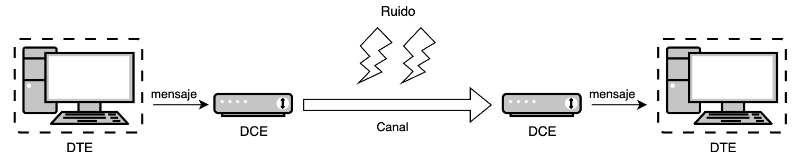
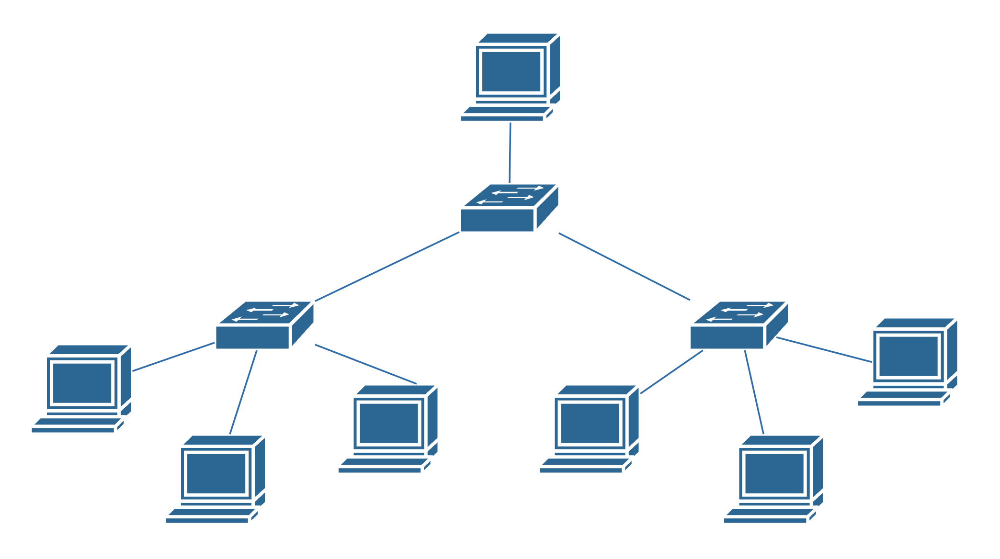
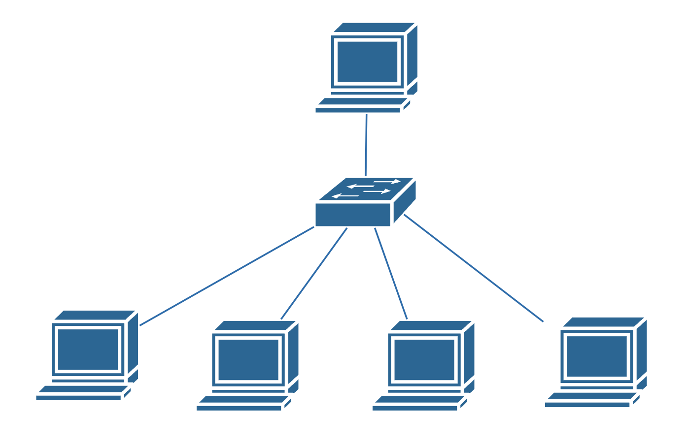
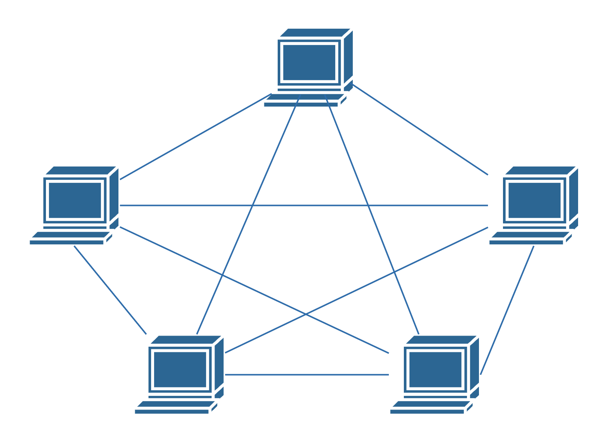
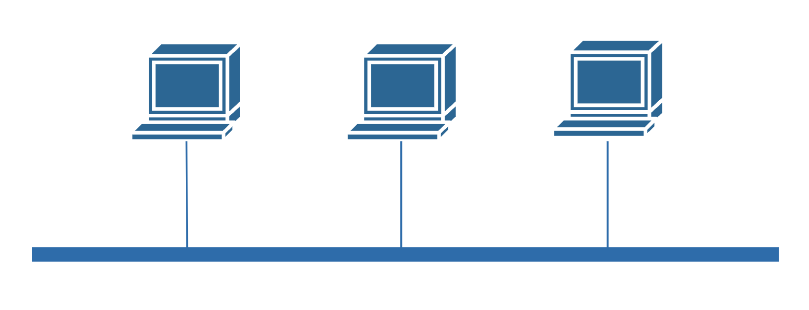
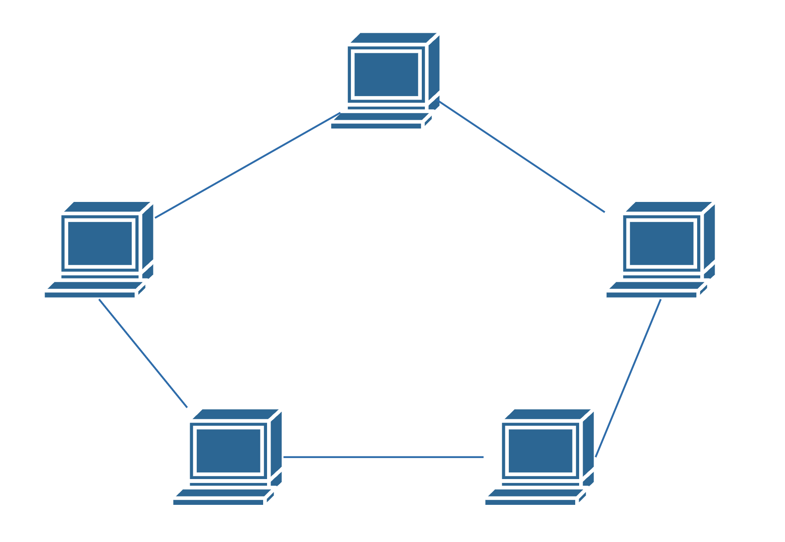
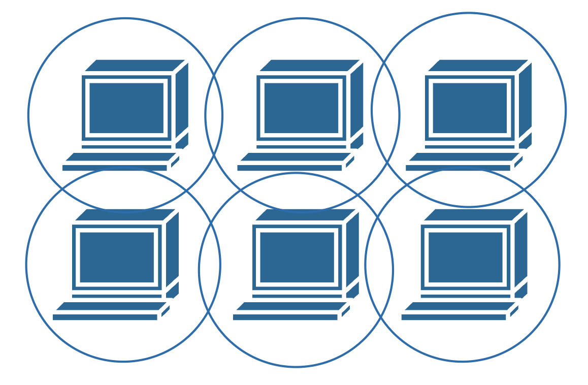

# Unidad 1 - Introducción a las redes de comunicaciones

## La comunicación

La comunicación es un proceso fundamental que permite el intercambio de información entre dos o más entidades. Es la base sobre la cual se construyen las relaciones humanas y se desarrollan las sociedades. A través de la comunicación, se transmiten ideas, conocimientos, emociones y valores. Para que se lleve a cabo se debe disponer de emisor, receptor y canal de comunicación. Además, es necesario que emisor y receptor codifiquen información de forma que sea entendible por ambos, así como crear un conjunto de reglas que regulen dicha comunicación.

### Elementos de la comunicación

{ width="800"}

* **Fuente**: Origen del cual procede la información. Se le denomina **Equipo temrinal de datos** o _DTE_.
* **Emisor**: Elemento que se encarga específicamente de adaptar la señal o mensaje para transmitirlo convenientemente por un canal de transmisión. Se le denomina  **Equipo terminal de línea de comunicaciones** o _DCE_.
* **Canal**: Es el medio físico por el cual se transmite la información. Por ejemplo, un cable o el aire.
* **Ruido**: Se trata de cualquier perturbación sobre el medio que afecte a la información.
* **Receptor**: Elemento que se encarga de extraer la información del canal y transformarla para que pueda ser interpretada. Al igual que al emisor también se le conoce como _DCE_.
* **Destino**: Lugar o entidad que consume la información. Al igual que a la fuente también se le conoce como _DTE_.

## Redes de comunicaciones

Una red de comunicaciones es una infraestructura formada por un conjunto de dispositivos y sistemas interconectados que permiten la transmisión y recepción de información entre múltiples usuarios o puntos. Su propósito principal es facilitar el intercambio eficiente y seguro de datos, ya sea en forma de texto, audio, video u otros tipos de información.

### Componentes clave de una red de comunicaciones

* **Nodos**: Dispositivos como computadoras, teléfonos móviles, servidores y otros equipos que se conectan a la red para enviar o recibir información.
* **Enlaces de Comunicación**: Medios físicos (como cables de cobre o fibra óptica) o inalámbricos (como señales de radio, microondas o infrarrojos) que conectan los nodos entre sí.
* **Protocolos**: Conjuntos de reglas y estándares que determinan cómo se transmiten y reciben los datos, asegurando que la comunicación sea coherente y comprensible entre diferentes dispositivos y sistemas.
* **Hardware y Software de Red**: Equipos como routers, switches y módems, y programas que gestionan el flujo de datos y facilitan las operaciones dentro de la red.

### Evolución de las redes de comunicaciones

* **Inicios de la Comunicación Electrónica (Siglo XIX)**
    * Telégrafo (1830s): Inventado por Samuel Morse, permitió la transmisión de mensajes en código Morse a través de largas distancias utilizando cables.
	* Teléfono (1876): Alexander Graham Bell desarrolló el teléfono, facilitando la comunicación de voz en tiempo real entre dos puntos.
* **Primeras Computadoras y Necesidad de Interconexión (Décadas de 1950-1960)**
	* Mainframes: Las grandes computadoras centrales comenzaron a utilizarse en empresas y gobiernos, creando la necesidad de compartir datos y recursos.
	* Conexiones Punto a Punto: Se establecieron enlaces directos entre computadoras para transferir información, aunque de manera limitada y poco eficiente.
* **Nacimiento de ARPANET y la Conmutación de Paquetes (1969)**
	* ARPANET: Creada por el Departamento de Defensa de EE.UU., fue la primera red en implementar la conmutación de paquetes, permitiendo que múltiples computadoras se comunicaran a través de una red descentralizada.
	* Protocolos Iniciales: Se desarrollaron protocolos básicos para regular la transmisión de datos entre nodos de la red.
* **Desarrollo de Protocolos Estándar (Años 1970)**
    * TCP/IP (1974): Vinton Cerf y Robert Kahn introdujeron el conjunto de protocolos TCP/IP, que se convirtió en el estándar para la comunicación en redes y sentó las bases de Internet.
	* Expansión de ARPANET: Se conectaron más instituciones académicas y gubernamentales, ampliando la red.
* **Emergencia de Redes Locales (LAN) y Ethernet (Años 1980)**
	* LANs: Las redes de área local permitieron conectar computadoras dentro de espacios reducidos, como oficinas y campus universitarios.
	* Ethernet: Desarrollado por Robert Metcalfe, Ethernet se convirtió en el estándar dominante para conexiones LAN debido a su eficiencia y facilidad de uso.
* **Nacimiento de Internet Comercial y World Wide Web (Años 1990)**
	* Apertura de Internet al Público: Internet dejó de ser exclusiva de entidades académicas y gubernamentales y se abrió al uso comercial y personal.
	* World Wide Web (1991): Tim Berners-Lee creó la Web, facilitando el acceso y la navegación de información a través de hipervínculos y navegadores web.
	* Crecimiento Exponencial: Aumento significativo de usuarios y contenido en línea.
* **Avances en Tecnologías Inalámbricas y Móviles (Finales de 1990 y 2000)**
	* Wi-Fi: La introducción de redes inalámbricas permitió conexiones sin cables en áreas locales.
	* Redes Móviles: Evolución de las redes celulares (2G, 3G) que posibilitaron la transmisión de datos en dispositivos móviles.
	* Expansión de Internet: Mayor accesibilidad y movilidad en el acceso a la red.
* **Banda Ancha y Servicios de Alta Velocidad (Años 2000)**
	* Fibra Óptica: Implementación de cables de fibra óptica que aumentaron la capacidad y velocidad de transmisión de datos.
	* Servicios en Línea: Surgimiento de plataformas de streaming, redes sociales y servicios en la nube.
* **Redes de Próxima Generación y Movilidad Avanzada (Años 2010 en Adelante)**
	* 4G y 5G: Mejoras significativas en la velocidad y latencia de las redes móviles, habilitando aplicaciones como IoT, realidad aumentada y vehículos autónomos.
	* Internet de las Cosas (IoT): Conexión de dispositivos cotidianos a Internet, creando redes interconectadas de objetos inteligentes.
	* Computación en la Nube: Almacenamiento y procesamiento de datos a través de servidores remotos, facilitando el acceso desde cualquier lugar.
* **Tendencias Actuales y Futuras**
	* Inteligencia Artificial y Big Data: Integración de AI para optimizar redes y analizar grandes volúmenes de datos.
	* Seguridad Cibernética: Mayor enfoque en proteger la información y la infraestructura de amenazas cibernéticas.
	* Redes Definidas por Software (SDN): Flexibilización y control programable de las redes para adaptarse rápidamente a las necesidades cambiantes.

### Tipos de redes

Podemos clasificar las redes atendiendo a diversos factores, tales como su extensión geográfica, titularidad, medio de transmisión, etc.

#### Según la extensión geográfica

* **Redes de área personal (PAN)**: Aquellas que conectan dispositivos a distancias cortas.
* **Redes de área local (LAN)**: Son redes de titularidad privada que conectan dispositivos de la misma sala, edificio o campus. Actualmente el tamaño de las LAN está limitado a unos pocos kilómetros.
* **Redes de área metropolitana (MAN)**: Su extensión abarca una ciudad o área metropolitana. Los medios que se usan pueden ser privados o públicos alquilados en exclusiva.
* **Redes de área extensa (WAN)**: Conecta dispositivos sobre grandes áreas geográficas, pudiendo conectar países o continentes. Internet es el ejemplo más grande de una WAN.

#### Según el modo de ofrecer servicios

* **Redes cliente-servidor**: Son aquellas en los que intervienen dos tipos de dispositivos: los servidores cumplen con la función de prestar uno o varios servicios al resto de dispositivos, los clientes.
* **Redes entre igual (peer-to-peer)**: Todos los dispositivos actúan como clientes y servidores respecto del resto de dispositivos.

#### Según de la titularidad de la red

* **Públicas**: Se trata de las redes a las que puede conectase cualquier persona. Es el caso de Internet.
* **Privadas**: Aquellas que solo están disponibles para ciertas personas, por ejemplo, la gran mayoría de las redes LAN.

#### Según el medio de transmisión

* **Cableadas**: En las que el medio de transmisión es un cable, como por ejemplo el coaxial, la fibra óptica o los pares trenzados de cobre.
* **Inalámbricas**: Utilizan como medio de transmisión el aire. Los datos se envían a través de ondas electromagnéticas, que pueden ser de distintas frecuencias: radio, microondas, infrarrojos, etc.
* **Mixtas o híbridas**: Combinan las redes cableadas y las inalámbricas. Por ejemplo las redes domésticas que permiten la conexión de los dispositivos a través de Ethernet y Wi-Fi.

### Topología de una red

La topología de una red nos indica la arquitectura que posee la red, es decir, la forma en la que se interconectan físicamente los diferentes nodos o dispositivos de ella. Podemos definir tres grandes grupos:

* Punto a punto: jerárquica, estrella y malla.
* Difusión: bus y anillo.
* Otras topologías: celular.

#### Topologías punto a punto

##### Jerárquica

En la topología jerárquica, también llamada en árbol, los nodos están organizados en niveles, donde los superiores controlan a los inferiores.

{width="600"}

* **Ventajas**:
    * Escalabilidad: Fácil de expandir añadiendo nuevos niveles.
    * Gestión Eficiente: Facilita el control y mantenimiento de la red.

* **Desventajas**:
    * Dependencia Jerárquica: Si un nodo superior falla, los nodos subordinados pueden quedar aislados.
	* Complejidad: La configuración y el mantenimiento pueden ser complicados.

* **Aplicaciones comunes**:
    * Redes empresariales grandes.
	* Sistemas de distribución de contenido y bases de datos.

##### Estrella

En la topología en estrella, todos los nodos están conectados a un dispositivo central, como un switch o hub. Este dispositivo central actúa como un repetidor, retransmitiendo datos entre los nodos. Cada nodo tiene una conexión directa al dispositivo central, el cual es el encargado de gestionar el tráfico de la red.

{width="600"}

* **Ventajas**:
    * Facilidad de Gestión: Es sencillo agregar o eliminar nodos sin afectar a otros.
	* Aislamiento de Fallos: Un fallo en un cable o nodo no afecta al resto de la red.
	* Rendimiento: Mayor ancho de banda, ya que cada nodo tiene una conexión dedicada.

* **Desventajas**: 
    * Punto Único de Fallo: Si el dispositivo central falla, toda la red se ve afectada.
	* Mayor Uso de Cableado: Requiere más cables que otras topologías como el bus.

* **Aplicaciones comunes**:
    * Redes locales modernas.
	* Redes domésticas y empresariales.

##### Malla

Cada nodo está conectado directamente a uno o más nodos de la red. Puede ser una malla completa (todos con todos) o parcial (algunos nodos conectados). Esta tipología permite múltiples caminos para llegar a un destino, lo cual permite una alta fiabilidad incluso aunque algunos enlaces fallen.

{width="600"}

* **Ventajas**:
    * Tolerancia a Fallos: Fallos en enlaces individuales no afectan al funcionamiento general.
	* Optimización de Rutas: Los datos pueden tomar el camino más eficiente.

* **Desventajas**: 
    * Costo y Complejidad: Requiere mucho cableado y puertos de red.
	* Gestión Compleja: Difícil de administrar en redes grandes.

* **Aplicaciones comunes**:
    * Redes de misión crítica (militares, aeroespaciales).
	* Redes inalámbricas de sensores y _ad hoc_.

#### Topologías de difusión

##### Bus

Todos los nodos están conectados a un único cable central llamado bus o backbone. Los datos enviados por un dispositivo se transmiten en ambas direcciones a lo largo del bus y son recibidos por todos los demás nodos de la red.

{width="600"}

* **Ventajas**:
    * Simplicidad y Economía: Fácil de instalar y requiere menos cableado.
	* Facilidad de Expansión: Se pueden agregar nuevos nodos sin interrumpir la red existente.

* **Desventajas**:
    * Falta de Fiabilidad: Si el bus principal falla, toda la red se detiene.
	* Dificultad en Diagnóstico: Problemas en el cable pueden ser difíciles de localizar.
	* Limitaciones de Longitud y Nodos: El rendimiento disminuye con el aumento de dispositivos y longitud del cable.

* **Aplicaciones comunes**:
    * Antiguas redes Ethernet (10Base2 y 10Base5).
	* Redes pequeñas y temporales.

##### Anillo

En la topología en anillo, cada nodo está conectado al siguiente, formando un círculo cerrado. Los datos viajan en una dirección (unidireccional) o en ambas (bidireccional), pasando por cada nodo hasta llegar al destino.

{width="600"}

* **Ventajas**:
    * Igualdad de Acceso: Todos los nodos tienen igual oportunidad de transmitir.
	* Menos Colisiones: El uso de un token reduce las posibilidades de colisiones.

* **Desventajas**:
    * Sensibilidad a Fallos: Un fallo en un nodo o enlace puede afectar a toda la red.
	* Dificultad en Diagnóstico y Mantenimiento: Identificar y solucionar problemas puede ser complejo.

* **Aplicaciones comunes**:
    * Redes Token Ring de IBM.
	* Redes FDDI (Fiber Distributed Data Interface).

#### Otras topologías

##### Topología celular

La topología celular es un modelo utilizado principalmente en redes de comunicación inalámbricas, especialmente en las redes de telefonía móvil. Esta topología divide el área geográfica en secciones llamadas células, cada una de las cuales es atendida por una estación base o torre celular que proporciona cobertura dentro de su área específica.

{width="600"}

* **Ventajas**:
    * Cobertura Amplia y Continua: Permite cubrir grandes áreas geográficas, proporcionando servicio tanto en zonas urbanas como rurales.
	* Movilidad Soportada: Los usuarios pueden desplazarse libremente sin perder la conexión, gracias al proceso de handoff.
	* Eficiencia Espectral: La reutilización de frecuencias maximiza el uso del espectro radioeléctrico disponible.
	* Escalabilidad: Es posible incrementar la capacidad de la red añadiendo más células o ajustando el tamaño de las existentes.
	* Flexibilidad: La topología puede adaptarse a diferentes densidades de usuarios y patrones de tráfico.

* **Desventajas**:
    * Infraestructura Costosa: Requiere una inversión significativa en estaciones base, equipos de transmisión y mantenimiento.
	* Complejidad en la Gestión: La coordinación entre múltiples células y el manejo de handoffs aumenta la complejidad operativa.
	* Interferencias: La reutilización de frecuencias puede generar interferencias si no se planifica adecuadamente.
	* Dependencia de la Ubicación Física: Obstáculos como edificios o accidentes geográficos pueden afectar la calidad de la señal.
	* Seguridad y Privacidad: Las comunicaciones inalámbricas son más susceptibles a interceptaciones si no se implementan medidas de seguridad robustas.

* **Aplicaciones comunes**:
    * Redes de Telefonía Móvil: Implementada en sistemas celulares como GSM, CDMA, LTE y 5G para ofrecer servicios de voz y datos.
	* Internet de las Cosas (IoT): Conectividad para dispositivos y sensores distribuidos en áreas amplias.
	* Comunicaciones de Emergencia: Redes dedicadas para servicios de seguridad pública y respuesta a emergencias.

<!--
## Sistemas de numeración

Un sistema de numeración es un conjunto de reglas, convenios y símbolos combinados con palabras que nos permiten expresar verbal y gráficamente los números.

Existen sistema de numeración posicionales y no posicionales. En los primeros se contempla el valor relativo de la cifra dentro del número, mientras que en los segundos no.

En los sistemas posicionales cualquier número puede expresarse como suma de los productos de cada símbolo por la base del sistema de numeración elevada a la posición que ocupa ese símbolo.

De manera forma, **X** es un número representado en un sustema de numeración con base **B**. Este número tiene **n** dígitos que cada uno ocupa la posición **i**: X0, X1, X2... Xn tenemos
-->