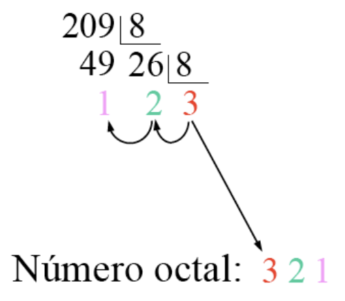
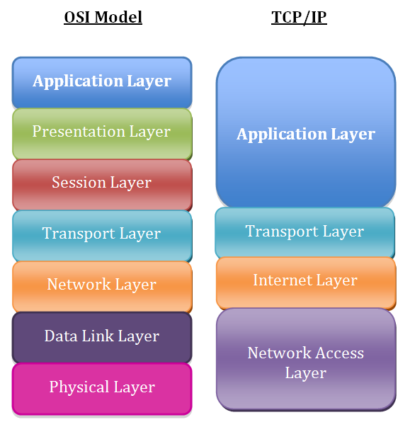

# Unidad 1 - Introducción a las redes de comunicaciones

## La comunicación

La comunicación es un proceso fundamental que permite el intercambio de información entre dos o más entidades. Es la base sobre la cual se construyen las relaciones humanas y se desarrollan las sociedades. A través de la comunicación, se transmiten ideas, conocimientos, emociones y valores. Para que se lleve a cabo se debe disponer de emisor, receptor y canal de comunicación. Además, es necesario que emisor y receptor codifiquen información de forma que sea entendible por ambos, así como crear un conjunto de reglas que regulen dicha comunicación.

### Elementos de la comunicación

{ width="800"}

* **Fuente**: Origen del cual procede la información. Se le denomina **Equipo terminal de datos** o _DTE_.
* **Emisor**: Elemento que se encarga específicamente de adaptar la señal o mensaje para transmitirlo convenientemente por un canal de transmisión. Se le denomina  **Equipo terminal de línea de comunicaciones** o _DCE_.
* **Canal**: Es el medio físico por el cual se transmite la información. Por ejemplo, un cable o el aire.
* **Ruido**: Se trata de cualquier perturbación sobre el medio que afecte a la información.
* **Receptor**: Elemento que se encarga de extraer la información del canal y transformarla para que pueda ser interpretada. Al igual que al emisor también se le conoce como _DCE_.
* **Destino**: Lugar o entidad que consume la información. Al igual que a la fuente también se le conoce como _DTE_.

## Redes de comunicaciones

Una red de comunicaciones es una infraestructura formada por un conjunto de dispositivos y sistemas interconectados que permiten la transmisión y recepción de información entre múltiples usuarios o puntos. Su propósito principal es facilitar el intercambio eficiente y seguro de datos, ya sea en forma de texto, audio, video u otros tipos de información.

### Componentes clave de una red de comunicaciones

* **Nodos**: Dispositivos como computadoras, teléfonos móviles, servidores y otros equipos que se conectan a la red para enviar o recibir información.
* **Enlaces de Comunicación**: Medios físicos (como cables de cobre o fibra óptica) o inalámbricos (como señales de radio, microondas o infrarrojos) que conectan los nodos entre sí.
* **Protocolos**: Conjuntos de reglas y estándares que determinan cómo se transmiten y reciben los datos, asegurando que la comunicación sea coherente y comprensible entre diferentes dispositivos y sistemas.
* **Hardware y Software de Red**: Equipos como routers, switches y módems, y programas que gestionan el flujo de datos y facilitan las operaciones dentro de la red.

### Evolución de las redes de comunicaciones

* **Inicios de la Comunicación Electrónica (Siglo XIX)**
    * Telégrafo (1830s): Inventado por Samuel Morse, permitió la transmisión de mensajes en código Morse a través de largas distancias utilizando cables.
	* Teléfono (1876): Alexander Graham Bell desarrolló el teléfono, facilitando la comunicación de voz en tiempo real entre dos puntos.
* **Primeras Computadoras y Necesidad de Interconexión (Décadas de 1950-1960)**
	* Mainframes: Las grandes computadoras centrales comenzaron a utilizarse en empresas y gobiernos, creando la necesidad de compartir datos y recursos.
	* Conexiones Punto a Punto: Se establecieron enlaces directos entre computadoras para transferir información, aunque de manera limitada y poco eficiente.
* **Nacimiento de ARPANET y la Conmutación de Paquetes (1969)**
	* ARPANET: Creada por el Departamento de Defensa de EE.UU., fue la primera red en implementar la conmutación de paquetes, permitiendo que múltiples computadoras se comunicaran a través de una red descentralizada.
	* Protocolos Iniciales: Se desarrollaron protocolos básicos para regular la transmisión de datos entre nodos de la red.
* **Desarrollo de Protocolos Estándar (Años 1970)**
    * TCP/IP (1974): Vinton Cerf y Robert Kahn introdujeron el conjunto de protocolos TCP/IP, que se convirtió en el estándar para la comunicación en redes y sentó las bases de Internet.
	* Expansión de ARPANET: Se conectaron más instituciones académicas y gubernamentales, ampliando la red.
* **Emergencia de Redes Locales (LAN) y Ethernet (Años 1980)**
	* LANs: Las redes de área local permitieron conectar computadoras dentro de espacios reducidos, como oficinas y campus universitarios.
	* Ethernet: Desarrollado por Robert Metcalfe, Ethernet se convirtió en el estándar dominante para conexiones LAN debido a su eficiencia y facilidad de uso.
* **Nacimiento de Internet Comercial y World Wide Web (Años 1990)**
	* Apertura de Internet al Público: Internet dejó de ser exclusiva de entidades académicas y gubernamentales y se abrió al uso comercial y personal.
	* World Wide Web (1991): Tim Berners-Lee creó la Web, facilitando el acceso y la navegación de información a través de hipervínculos y navegadores web.
	* Crecimiento Exponencial: Aumento significativo de usuarios y contenido en línea.
* **Avances en Tecnologías Inalámbricas y Móviles (Finales de 1990 y 2000)**
	* Wi-Fi: La introducción de redes inalámbricas permitió conexiones sin cables en áreas locales.
	* Redes Móviles: Evolución de las redes celulares (2G, 3G) que posibilitaron la transmisión de datos en dispositivos móviles.
	* Expansión de Internet: Mayor accesibilidad y movilidad en el acceso a la red.
* **Banda Ancha y Servicios de Alta Velocidad (Años 2000)**
	* Fibra Óptica: Implementación de cables de fibra óptica que aumentaron la capacidad y velocidad de transmisión de datos.
	* Servicios en Línea: Surgimiento de plataformas de streaming, redes sociales y servicios en la nube.
* **Redes de Próxima Generación y Movilidad Avanzada (Años 2010 en Adelante)**
	* 4G y 5G: Mejoras significativas en la velocidad y latencia de las redes móviles, habilitando aplicaciones como IoT, realidad aumentada y vehículos autónomos.
	* Internet de las Cosas (IoT): Conexión de dispositivos cotidianos a Internet, creando redes interconectadas de objetos inteligentes.
	* Computación en la Nube: Almacenamiento y procesamiento de datos a través de servidores remotos, facilitando el acceso desde cualquier lugar.
* **Tendencias Actuales y Futuras**
	* Inteligencia Artificial y Big Data: Integración de AI para optimizar redes y analizar grandes volúmenes de datos.
	* Seguridad Cibernética: Mayor enfoque en proteger la información y la infraestructura de amenazas cibernéticas.
	* Redes Definidas por Software (SDN): Flexibilización y control programable de las redes para adaptarse rápidamente a las necesidades cambiantes.

### Tipos de redes

Podemos clasificar las redes atendiendo a diversos factores, tales como su extensión geográfica, titularidad, medio de transmisión, etc.

#### Según la extensión geográfica

* **Redes de área personal (PAN)**: Aquellas que conectan dispositivos a distancias cortas.
* **Redes de área local (LAN)**: Son redes de titularidad privada que conectan dispositivos de la misma sala, edificio o campus. Actualmente el tamaño de las LAN está limitado a unos pocos kilómetros.
* **Redes de área metropolitana (MAN)**: Su extensión abarca una ciudad o área metropolitana. Los medios que se usan pueden ser privados o públicos alquilados en exclusiva.
* **Redes de área extensa (WAN)**: Conecta dispositivos sobre grandes áreas geográficas, pudiendo conectar países o continentes. Internet es el ejemplo más grande de una WAN.

#### Según el modo de ofrecer servicios

* **Redes cliente-servidor**: Son aquellas en los que intervienen dos tipos de dispositivos: los servidores cumplen con la función de prestar uno o varios servicios al resto de dispositivos, los clientes.
* **Redes entre igual (peer-to-peer)**: Todos los dispositivos actúan como clientes y servidores respecto del resto de dispositivos.

#### Según de la titularidad de la red

* **Públicas**: Se trata de las redes a las que puede conectase cualquier persona. Es el caso de Internet.
* **Privadas**: Aquellas que solo están disponibles para ciertas personas, por ejemplo, la gran mayoría de las redes LAN.

#### Según el medio de transmisión

* **Cableadas**: En las que el medio de transmisión es un cable, como por ejemplo el coaxial, la fibra óptica o los pares trenzados de cobre.
* **Inalámbricas**: Utilizan como medio de transmisión el aire. Los datos se envían a través de ondas electromagnéticas, que pueden ser de distintas frecuencias: radio, microondas, infrarrojos, etc.
* **Mixtas o híbridas**: Combinan las redes cableadas y las inalámbricas. Por ejemplo las redes domésticas que permiten la conexión de los dispositivos a través de Ethernet y Wi-Fi.

### Topología de una red

La topología de una red nos indica la arquitectura que posee la red, es decir, la forma en la que se interconectan físicamente los diferentes nodos o dispositivos de ella. Podemos definir tres grandes grupos:

* Punto a punto: jerárquica, estrella y malla.
* Difusión: bus y anillo.
* Otras topologías: celular.

#### Topologías punto a punto

##### Jerárquica

En la topología jerárquica, también llamada en árbol, los nodos están organizados en niveles, donde los superiores controlan a los inferiores.

{width="600"}

* **Ventajas**:
    * Escalabilidad: Fácil de expandir añadiendo nuevos niveles.
    * Gestión Eficiente: Facilita el control y mantenimiento de la red.

* **Desventajas**:
    * Dependencia Jerárquica: Si un nodo superior falla, los nodos subordinados pueden quedar aislados.
	* Complejidad: La configuración y el mantenimiento pueden ser complicados.

* **Aplicaciones comunes**:
    * Redes empresariales grandes.
	* Sistemas de distribución de contenido y bases de datos.

##### Estrella

En la topología en estrella, todos los nodos están conectados a un dispositivo central, como un switch o hub. Este dispositivo central actúa como un repetidor, retransmitiendo datos entre los nodos. Cada nodo tiene una conexión directa al dispositivo central, el cual es el encargado de gestionar el tráfico de la red.

{width="600"}

* **Ventajas**:
    * Facilidad de Gestión: Es sencillo agregar o eliminar nodos sin afectar a otros.
	* Aislamiento de Fallos: Un fallo en un cable o nodo no afecta al resto de la red.
	* Rendimiento: Mayor ancho de banda, ya que cada nodo tiene una conexión dedicada.

* **Desventajas**: 
    * Punto Único de Fallo: Si el dispositivo central falla, toda la red se ve afectada.
	* Mayor Uso de Cableado: Requiere más cables que otras topologías como el bus.

* **Aplicaciones comunes**:
    * Redes locales modernas.
	* Redes domésticas y empresariales.

##### Malla

Cada nodo está conectado directamente a uno o más nodos de la red. Puede ser una malla completa (todos con todos) o parcial (algunos nodos conectados). Esta tipología permite múltiples caminos para llegar a un destino, lo cual permite una alta fiabilidad incluso aunque algunos enlaces fallen.

{width="600"}

* **Ventajas**:
    * Tolerancia a Fallos: Fallos en enlaces individuales no afectan al funcionamiento general.
	* Optimización de Rutas: Los datos pueden tomar el camino más eficiente.

* **Desventajas**: 
    * Costo y Complejidad: Requiere mucho cableado y puertos de red.
	* Gestión Compleja: Difícil de administrar en redes grandes.

* **Aplicaciones comunes**:
    * Redes de misión crítica (militares, aeroespaciales).
	* Redes inalámbricas de sensores y _ad hoc_.

#### Topologías de difusión

##### Bus

Todos los nodos están conectados a un único cable central llamado bus o backbone. Los datos enviados por un dispositivo se transmiten en ambas direcciones a lo largo del bus y son recibidos por todos los demás nodos de la red.

{width="600"}

* **Ventajas**:
    * Simplicidad y Economía: Fácil de instalar y requiere menos cableado.
	* Facilidad de Expansión: Se pueden agregar nuevos nodos sin interrumpir la red existente.

* **Desventajas**:
    * Falta de Fiabilidad: Si el bus principal falla, toda la red se detiene.
	* Dificultad en Diagnóstico: Problemas en el cable pueden ser difíciles de localizar.
	* Limitaciones de Longitud y Nodos: El rendimiento disminuye con el aumento de dispositivos y longitud del cable.

* **Aplicaciones comunes**:
    * Antiguas redes Ethernet (10Base2 y 10Base5).
	* Redes pequeñas y temporales.

##### Anillo

En la topología en anillo, cada nodo está conectado al siguiente, formando un círculo cerrado. Los datos viajan en una dirección (unidireccional) o en ambas (bidireccional), pasando por cada nodo hasta llegar al destino.

{width="600"}

* **Ventajas**:
    * Igualdad de Acceso: Todos los nodos tienen igual oportunidad de transmitir.
	* Menos Colisiones: El uso de un token reduce las posibilidades de colisiones.

* **Desventajas**:
    * Sensibilidad a Fallos: Un fallo en un nodo o enlace puede afectar a toda la red.
	* Dificultad en Diagnóstico y Mantenimiento: Identificar y solucionar problemas puede ser complejo.

* **Aplicaciones comunes**:
    * Redes Token Ring de IBM.
	* Redes FDDI (Fiber Distributed Data Interface).

#### Otras topologías

##### Topología celular

La topología celular es un modelo utilizado principalmente en redes de comunicación inalámbricas, especialmente en las redes de telefonía móvil. Esta topología divide el área geográfica en secciones llamadas células, cada una de las cuales es atendida por una estación base o torre celular que proporciona cobertura dentro de su área específica.

{width="600"}

* **Ventajas**:
    * Cobertura Amplia y Continua: Permite cubrir grandes áreas geográficas, proporcionando servicio tanto en zonas urbanas como rurales.
	* Movilidad Soportada: Los usuarios pueden desplazarse libremente sin perder la conexión, gracias al proceso de handoff.
	* Eficiencia Espectral: La reutilización de frecuencias maximiza el uso del espectro radioeléctrico disponible.
	* Escalabilidad: Es posible incrementar la capacidad de la red añadiendo más células o ajustando el tamaño de las existentes.
	* Flexibilidad: La topología puede adaptarse a diferentes densidades de usuarios y patrones de tráfico.

* **Desventajas**:
    * Infraestructura Costosa: Requiere una inversión significativa en estaciones base, equipos de transmisión y mantenimiento.
	* Complejidad en la Gestión: La coordinación entre múltiples células y el manejo de handoffs aumenta la complejidad operativa.
	* Interferencias: La reutilización de frecuencias puede generar interferencias si no se planifica adecuadamente.
	* Dependencia de la Ubicación Física: Obstáculos como edificios o accidentes geográficos pueden afectar la calidad de la señal.
	* Seguridad y Privacidad: Las comunicaciones inalámbricas son más susceptibles a interceptaciones si no se implementan medidas de seguridad robustas.

* **Aplicaciones comunes**:
    * Redes de Telefonía Móvil: Implementada en sistemas celulares como GSM, CDMA, LTE y 5G para ofrecer servicios de voz y datos.
	* Internet de las Cosas (IoT): Conectividad para dispositivos y sensores distribuidos en áreas amplias.
	* Comunicaciones de Emergencia: Redes dedicadas para servicios de seguridad pública y respuesta a emergencias.

## Sistemas de numeración

Un sistema de numeración es un conjunto de reglas, convenios y símbolos combinados con palabras que nos permiten expresar verbal y gráficamente los números.

Existen sistema de numeración posicionales y no posicionales. En los primeros se contempla el valor relativo de la cifra dentro del número, mientras que en los segundos no.

En los sistemas posicionales cualquier número puede expresarse como suma de los productos de cada símbolo por la base del sistema de numeración elevada a la posición que ocupa ese símbolo.

### Sistema de numeración decimal

El sistema decimal, o base 10, emplea para su representación los dígitos 0, 1, 2, 3, 4, 5, 6, 7, 8 y 9. Siendo sus valores posicionales potencia de 10. Por ejemplo:

{ width="400" }

### Sistema de numeración binario

El sistema binario o base 2, emplea para su representación los dígitos 0 ó 1, siendo sus valores posicionales potencias de 2. Es el sistema más utilizado en los sistemas digitales. Un ejemplo de su valor en función de la posición sería:

{ width="400" }

A la hora de representarlo en un ordenador, a cada dígito del sistema binario se le denomina _bit_. Al bit más a la derecha en el número se le conoce como el _bit menos significativo_ (LSB). Por el contrario, el bit más a la izquierda del número recibe el nombre de _bit más significativo_ (MSB).

Así, por ejemplo, en el sistema binario encontramos las siguientes agrupaciones básicas de bits:

* Nibble: 4 bits.
* Byte: 8 bits.
* Word: 16 bits.
* Double word: 32 bits.
* Quadruple word: 64 bits.

### Sistema de numeración hexadecimal

El sistema hexadecimal o base 16, utiliza 16 dígitos para su representación. Los 10 primeros símbolos son los dígitos del 0 al 9, y los restantes se completan con las letras de la A a la F. 

Sus valores posicionales se ven en la siguiente imagen:

{ width="400" }

### Sistema de numeración octal

El sistema octal, o base 8, utiliza 8 dígitos para su representación (del 0 al 7), siendo sus valores posicionales como los de la siguiente imagen:

{ width="400" }

### Conversión de decimal a otro sistema

Un procedimiento muy empleado para la conversión es el de las divisiones sucesivas, es decir, se divide el número entre el valor de la base sin ibtener decimales. Los cocientes resultantes se dividen nuevamente hasta que sea menor que la base. Por último, se obtiene el número en el nuevo sistema colocando el último cociente como dígito más significativo y los restos de forma ascendente de izquierda a derecha. Por ejemplo, para convertir el número 43 de sistema decimal a binario se realizaría como se muestra en la siguiente imagen:

{ width="400" }

Para convertir el número 543 de sistema decimal a hexadecimal sería de la siguiente forma:

{ width="400" }

Para convertir el número 209 de sistema decimal a sistema octal lo realizaríamos de la siguiente manera:

{ width="300" }

### Conversión de cualquier sistema a decimal

Por otro lado, podemos usar un método que nos permite convertir un número en cualquier sistema al sistema decimal, simplemente multiplicando cada dígito por su valor posicional según la base del sistema, y finalmente sumando todos los multiplicando obtenidos.

Por ejemplo, para convertir el número 101101 del sistema binario al sistema decimal:

{ width="400" }

Para convertir el número hexadecimal 3C05 a decimal lo haríamos de la siguiente forma:

{ width="400" }

Finalmente, para convertir el número 742 en octal a decimal, sería:

{ width="350" }

### Juego para practicar conversiones a binario

En el [siguiente enlace](https://learningcontent.cisco.com/games/binary/index.html) puedes encontrar un pequeño juego web para practicar conversiones de decimal a binario y viceversa.

## Arquitecturas de redes en capas

La arquitectura de red por capas es un enfoque estructurado para el diseño de redes de comunicaciones que organiza la funciones de red en varias capas, donde cada capa tiene una tarea específica y se comunica con las capas adyacentes. Este modelo permite simplificar el diseño, desarrollo y mantenimimento de las redes, además de facilitar la interoperabilidad entre diferentes tecnologías y proveedores.

El desarrollo de las redes de comunicaciones trajo consigo el desafío de conectar dispositivos de diferentes fabricantes y tecnologías. Para que todos estos estándares puedan comunicarse eficazmente, fue necesario crear estándares comunes que definieran cómo deben intercambiarse los datos.

El uso de estos estándares favorece los siguientes conceptos:

* Interoperabilidad: permite que los dispositivos y sistemas de distintos fabricantes se comuniquen sin problemas.
* Modularidad: cada capa se encarga de una función específica, permitiendo actualizar o modificar partes de la red sin afectar a todo el sistema.
* Facilidad de diagnóstico: la estructura por capas facilita la localización y resolución de problemas, ya que es posible identificar en qué capa ocurre el fallo.
* Escalabilidad: permite diseñar redes que crecen y se adaptan a nuevas necesidades sin necesidad de rediseñar todo el sistema.

La arquitectura de una red es el conjunto organizado de capas y protocolos en cada capa. Esta organización de la red debe estar suficientemente clara como para que los fabricantes de software o hardware puedan diseñar sus productos con la garantía de que funcionarán en comunicación con otros equipos que sigan las mismas reglas.

Un protocolo en una red de comunicación es un conjunto de reglas y normas que definen cómo se debe realizar la comunicación entre dispositivos en una red. Estas reglas especifican el formato, la sincronización, la secuencia y el control de errores en la transmisión de datos, asegurando que los dispositivos puedan entenderse y colaborar de manera eficiente y coherente.

Dentro de cada nivel de una arquitectura por capas coexisten distintos servicios. En una jerarquiía de capas se siguen las siguientes reglas:

* Cada nivel dispone de un conjunto de servicios, los cuales se definen mediente protocolos estándar.
* Cada nivel se comunica solamente con el nivel inmediato superior y con el inmediato inferior.
* Cada nivel proporciona servicios al nivel immediato superior.

Cuando se comunican dos dispositos que utilizan la misma arquitectura de red, los protocolos que se encuentra en el mismo nivel deben coordinar el proceso de comunicación, es decir, deben ponerse de acuerdo y utilizar las mismas reglas de transmisión, o dicho de otro modo, deben usar el mismo protocolo.

### Encapsulación

En el modelo de arquitectura por niveles, al transmitir información es necesario añadir datos adicionales para que los procesos equivalentes puedan comunicarse en un nivel específico. Estos datos adicionales varían según el protocolo epleado y su significado solo es relevante en ese nivel, los niveles inferiores los tratan simplemente como datos a transmitir.

Este añadido se denomina habitualmente cabecera o información de control, y suele situarse al principio y/o final del mensaje. El proceso de agregar esta cabecera se conoce comúnmente como encapsulación.

La estructura que toma un conjunto de datos en cualquier capa se denomina unidad de datos de protocolo (PDU - Protocol Data Unit). Durante la comunicación, cada capa encapsula las PDU que recibe de la capa superior de acuerdo con el protocolo correspondiente.

En cada fase del proceso, una PDU recibe un nombre diferente para reflejar su estructura. Aunque no existe una conveción de nombres universal para las PDU, en el modelo de arquitectura de red de Internet se les denomina de la siguiente manera:

* **Datos**: Término general para las PDU que se manejan en la capa de aplicación.
* **Segmento**: PDU de la capa de transporte.
* **Paquete**: PDU de la capa de red.
* **Trama**: PDU de la capa de enlace.
* **Bits**: PDU que se utiliza para transmitir físicamente los datos a través de un medio.

{ width="750" }

En todas las capas de una arquitectura de red se añaden cabeceras de control para facilitar la comunicación, y estas cabeceras varían según el protocolo utilizado en cada nivel. Por ejemplo, en una arquitectura de siete capas se añaden seis cabceras de control al mensaje original durante la transmisión. La última capa generalmente no añade información adocional, ya que su función es transmitir los bits por el medio físico.

El proceso de encapsulamiento consiste, por tanto, en añadir una cabecera a los datos con la información que necesita cada protocolo, a medida que los datos descienden por las capas de la arquitectura de red. En algunos casos, además de la cabecera, se puede añadir un pie  a los datos.

Existen distintos niveles de protocolos, dependiendo del contexto en que se apliquen:

* **Protocolos de alto nivel**: definen cómo se comunican las aplicaciones (programas de ordenador).
* **Protocolos de bajo nivel**: especifican cómo se transmiten las señales a través del medio físico.

Entre los protocolos de alto y bajo nivel hay protocolos intermedios que realizan funciones adicionales, como establecer y mantener sesiones de comunicación, así como controlar las transmisiones para detectar errores.

Aunque a simple vista parezca que la transmisión de un mensaje requiere una gran cantidad de información de control (a veces se transmite más información de control que datos), este _sobrecoste_ no es significativamente mayor que en una arquitectura sin niveles. Esto se debe a que, como se mencionó, cada capa tiene una función específica y necesita su propia cabecera para cumplirla adecuadamente.

### Estándares

Los estándares desempeñan un papel crucial en el mantenimiento de un mercado abierto y competitivo entre los fabricantes de equipos, así como en la garantía de la interoperabilidad de datos y tecnologías a nivel nacional e internacional. Ayudan a guiar a fabricantes, proveedores, organismos gubernamentales y otros actores en la provisión de servicios, asegurando la conectividad necesaria para el comercio global y las comunicaciones.

Existen dos tipos de estándares:

* **De facto**: Son aquellos que, aunque no han sido formalmente aprobados por una entidad oficial, se han convertido en estándar debido a su uso generalizado entre los usuarios. Un ejemplo de estándar de facto sería el modelo TCP/IP.
* **De iure**: Son los estándares que han sido formalmente establecidos y aprobados por una organización oficial de estandarización. Un ejemplo de este tipo de estándar es el modelo OSI.

### Modelo OSI

El Modelo de Interconexión de Sistemas Abiertos (OSI), desarrollado por la Organización Internacional de Normalización (ISO), es un estándar que aborda de manera integral los aspectos relacionados con las redes de comunicación. Este modelo permite que dos sistemas diferentes puedan comunicarse sin importar la arquitectura de red subyacente, definiendo un marco que facilita la interoperabilidad sin necesidad de modificar el hardware o el software existente.

A diferencia de una arquitectura específica, el modelo OSI es un marco de referencia que describe las funciones generales de cada capa, sin detallar los servicios y protocolos exactos a utilizar. Se compone de siete capas, cada una con responsabilidades distintas:

1. **Capa Física**: Se encarga de la transmisión de bits individuales a través del medio físico que conecta los dispositivos. Su objetivo es asegurar que los bits enviados por el emisor sean recibidos correctamente por el receptor. Esto implica definir aspectos como niveles de voltaje para representar los valores binarios, tiempos de sincronización, características de los conectores y otros detalles eléctricos y mecánicos relacionados con la transmisión de señales.
2. **Capa de Enlace de Datos**: Su función principal es garantizar una comunicación libre de errores entre dispositivos en una misma red. Detecta y corrige errores que puedan surgir durante la transmisión y gestiona el flujo de datos para evitar que un emisor rápido sature a un receptor más lento. Además, en redes donde múltiples dispositivos comparten el mismo medio, esta capa coordina el acceso al medio para prevenir colisiones. La unidad de datos en este nivel se denomina trama.
3. **Capa de Red**: Responsable de dirigir los datos desde el origen hasta el destino, incluso a través de múltiples redes interconectadas. Determina las rutas más eficientes para la transmisión, considerando factores como la topología de la red y la congestión. Maneja el direccionamiento lógico, asignando direcciones que identifican de manera única a cada dispositivo en una red global, y se encarga del enrutamiento de paquetes mediante dispositivos como routers. Por ejemplo, al acceder a un servidor en otra parte del mundo, esta capa decide el camino que los datos seguirán a través de Internet. La unidad de datos aquí es el paquete.
4. **Capa de Transporte**: Garantiza que los datos se entreguen de manera confiable y ordenada desde el origen hasta el destino final. A diferencia de la capa de red, que se enfoca en el envío de paquetes individuales, esta capa asegura la integridad y secuencia de todo el mensaje. Gestiona el control de errores y el flujo de datos a nivel extremo a extremo, independiente de las redes intermedias. Si se transmite un archivo grande, divide el mensaje en segmentos manejables y se encarga de reensamblarlos en el destino.	
5. **Capa de Sesión**: Administra la comunicación entre aplicaciones en sistemas diferentes. Establece, mantiene y finaliza sesiones de comunicación, proporcionando mecanismos para sincronizar el intercambio de datos y recuperarse de interrupciones. Por ejemplo, si una conexión se interrumpe temporalmente, esta capa permite reanudar la comunicación sin pérdida de información, manteniendo la sesión activa.
6. **Capa de Presentación**: Actúa como traductor entre el formato de datos utilizado por la aplicación y el formato estándar de la red. Resuelve las diferencias en la representación de datos entre sistemas, asegurando que la información sea comprensible en ambos extremos. También maneja funciones como compresión para optimizar el uso del ancho de banda y cifrado para proteger la información durante la transmisión.
Ejemplo: Si dos dispositivos utilizan diferentes esquemas de codificación de caracteres, esta capa convierte los datos al formato adecuado para que ambos puedan interpretarlos correctamente.
7. **Capa de Aplicación**: Es la más cercana al usuario final y proporciona servicios directos a las aplicaciones de software. Incluye protocolos que permiten funciones como el correo electrónico, la transferencia de archivos y la navegación web. Esta capa facilita la interacción entre el software de aplicación y los demás niveles del modelo OSI. Ejemplo: El protocolo HTTP, utilizado para la navegación web, opera en esta capa, permitiendo que los navegadores soliciten páginas web a los servidores y que estos las entreguen al usuario.

Aunque el modelo OSI es exhaustivo y proporciona una guía completa para la comunicación en redes, presenta algunas limitaciones en la práctica. Ciertas capas, como la de sesión y la de presentación, no son ampliamente utilizadas en implementaciones reales, ya que muchas de sus funciones se integran en otras capas o se manejan a nivel de aplicación. Por otro lado, las capas inferiores, especialmente la de enlace de datos y la física, pueden estar sobrecargadas y han sido subdivididas en subcapas en algunos modelos modernos para manejar mejor su complejidad.

Estas adaptaciones reflejan la evolución de las tecnologías de red y las necesidades cambiantes en las comunicaciones, demostrando que, si bien el modelo OSI es una herramienta valiosa para comprender y diseñar sistemas de comunicación, las implementaciones prácticas a menudo requieren ajustes y personalizaciones para adaptarse a contextos específicos.

{ width="750" }

### Modelo TCP/IP

Muchas veces se confunde TCP/IP con un solo protocolo de comunicación, pero en realidad es una arquitectura de red compleja que integra múltiples protocolos organizados en capas. Sin lugar a dudas, es la arquitectura más utilizada a nivel mundial, ya que constituye la base de Internet y es ampliamente empleada en diversas versiones de sistemas operativos.

La arquitectura TCP/IP se desarrolló diseñando inicialmente los protocolos y luego estructurándolos en capas dentro de la arquitectura. Por esta razón, TCP/IP es frecuentemente referida como una pila de protocolos.

La arquitectura TCP/IP es la más utilizada hoy en día. Se utiliza tanto en redes de área extensa como en redes de área local. Fue creada a principios de los años 70 por el Departamento de Defensa de los Estados Unidos. El objetivo era crear una arquitectura de red con las siguientes características:

* Permitir interconectar redes distintas aunque utilicen distinta tecnología.
* Ser tolerante a fallos. Mantener las comunicaciones a pesar de que se destruya parte de la red.
* Suministrar los servicios de comunicación más utilizados en redes de ordenadores. Finalmente, este proyecto derivó en lo que hoy conocemos como Internet.

Los niveles o capas de este modelo son los siguientes:

1. **Capa de acceso a la red**: El modelo TCP/IP no proporciona detalles específicos sobre esta capa; simplemente establece que debe existir un protocolo que conecte el dispositivo a la red. Esto se debe a que TCP/IP fue diseñado para funcionar sobre diversas redes, por lo que esta capa depende de la tecnología utilizada y no está predefinida. Es importante considerar que una red puede estar interconectada mediante diferentes tipos de cables o de forma inalámbrica. En este nivel se definen los protocolos asociados a los dispositivos de bajo nivel para cada una de estas tecnologías.

2. **Capa de Internet o red**: Esta es la capa más esencial de la arquitectura. Su función es permitir que los dispositivos envíen paquetes de información a la red y que estos viajen de forma independiente hasta su destino. Durante el recorrido, los paquetes pueden atravesar diferentes redes y pueden llegar desordenados. Esta capa no se encarga de reordenar los mensajes en el destino. El protocolo más importante en este nivel es el IP (Internet Protocol), aunque también existen otros protocolos.

3. **Capa de transporte**: Su misión es establecer una comunicación confiable entre el origen y el destino, similar a la capa de transporte en el modelo OSI. Dado que las capas inferiores no gestionan el control de errores ni el ordenamiento de los mensajes, esta capa asume esas responsabilidades. En este nivel se han definido varios protocolos, destacando TCP (Transmission Control Protocol) y UDP (User Datagram Protocol).

4. **Capa de aplicación**: Al igual que en el modelo OSI, esta capa incluye todos los protocolos de alto nivel que utilizan las aplicaciones para comunicarse. Aquí se encuentran protocolos como FTP para la transferencia de archivos, HTTP que utilizan los navegadores para acceder a páginas web, y los protocolos para la gestión del correo electrónico, entre otros.

{ width="600" }

### Comparación entre OSI Y TCP/IP

Los modelos OSI y TCP/IP son fundamentales para comprender el funcionamiento de las redes de comunicación. Aunque ambos sirven para estructurar y entender cómo se transmiten los datos a través de una red, presentan diferencias en su enfoque y aplicación.

{ width="500" }

#### Ventajas del modelo OSI:

- Estructura detallada: Al tener siete capas, proporciona una separación clara de responsabilidades, lo que facilita el diseño y la comprensión de cada función en la red.
- Independencia de protocolos: No está vinculado a protocolos específicos, lo que permite una aplicación teórica amplia y adaptable.
- Facilidad para el diagnóstico: La división en múltiples capas ayuda a aislar y solucionar problemas al identificar en qué capa ocurre una falla.
- Base educativa sólida: Es ampliamente utilizado en la enseñanza para explicar conceptos fundamentales de redes.

#### Ventajas de TCP/IP:

* Estandarización práctica: Es el conjunto de protocolos en el que se basa Internet, lo que garantiza su relevancia y aplicabilidad real.
* Simplicidad y eficiencia: Con menos capas, es más sencillo y directo para implementar en sistemas y dispositivos actuales.
* Flexibilidad: Diseñado para ser independiente del hardware y capaz de operar sobre diversas tecnologías de red.
* Escalabilidad y robustez: Soporta redes de diferentes tamaños y es resistente a fallos, lo que es esencial para el funcionamiento de Internet.

#### ¿Por qué sigue siendo relevante el modelo OSI?

Aunque TCP/IP es el estándar de facto en Internet, el modelo OSI continúa siendo relevante y se enseña por varias razones:

* Comprensión profunda: El modelo OSI, con sus siete capas, ofrece una visión más detallada de las funciones de red, lo que ayuda a estudiantes y profesionales a entender los principios subyacentes de las comunicaciones.
* Marco teórico universal: Sirve como referencia para el desarrollo y comparación de protocolos, incluso aquellos fuera del ámbito de TCP/IP.
* Claridad conceptual: Facilita la enseñanza y el aprendizaje al proporcionar una estructura clara y organizada de cómo se procesa y transmite la información.
* Interoperabilidad y estandarización: Promueve prácticas que aseguran que diferentes sistemas y tecnologías puedan trabajar juntos eficientemente.

En resumen, mientras que TCP/IP es esencial para comprender y trabajar con las redes actuales, especialmente Internet, el modelo OSI proporciona una base teórica sólida que es invaluable para la educación y el entendimiento profundo de las redes de comunicación. Ambos modelos son complementarios: OSI para el marco conceptual y TCP/IP para la implementación práctica.

## Dispositivos de interconexión de redes

Para conformar una red, se emplea una variedad de dispositivos capaces de operar en distintos niveles de los modelos en capas que estructuran la arquitectura de red. En esta sección, clasificaremos estos dispositivos de conexión en cuatro categorías distintas, según el nivel en el que desempeñan sus funciones dentro de la red. Estas categorías son:

* **Dispositivos que funcionan en el nivel físico**: como los repetidores y los concentradores activos.
* **Dispositivos que operan en los niveles físico y de enlace de datos**: por ejemplo, los puentes o los conmutadores de dos niveles.
* **Dispositivos que actúan en los niveles físico, de enlace de datos y de red**: como los enrutadores.
* **Dispositivos que abarcan los cinco niveles del modelo de referencia de Internet**: como las pasarelas.

### Repetidor

El repetidor es un sistema de interconexión que opera en la capa física. Las señales que transportan información en una red pueden viajar una distancia fija antes de que la atenuación ponga en peligro la integridad de los datos. Un repetidor recibe la señal y la regenera, enviándola refrescada. Este dispositivo puede extender la lóngitud física de una LAN. La ausencia de procesamiento de la señal provoca una gran velocidad repitiéndola.

{ width="400"}

Es importante destacar que el repetidor no conecta dos LAN distintas, sino varios segmentos de la misma LAN. En la actualidad los repetidores se han vuelto muy populares a nivel de redes inalámbricas, ya que regeneran la señal para aumentar la coberta de una WLAN.

### Hub o concentrador

Un hub, o concentrador, es un dispositivo de red que se utiliza para conectar múltiples equipos o dispositivos dentro de una red de área local (LAN). Operando en la capa física del modelo OSI, su función principal es facilitar la comunicación entre los dispositivos conectados al reenviar los datos recibidos a todos los puertos del hub.

{ width="400"}

Cuando un dispositivo envía datos al hub, este toma esa señal y la retransmite a todos los demás puertos, sin distinguir cuál es el destinatario real. Esto significa que todos los dispositivos conectados reciben los datos, aunque solo uno sea el destinatario previsto. Este método de transmisión puede generar tráfico innecesario en la red y potenciales colisiones de datos, especialmente en redes con mucho tráfico.

Los hubs son dispositivos no inteligentes y no gestionables, ya que no pueden filtrar tráfico ni segmentar la red.

### Switch o conmutador

Un switch, o conmutador, es un dispositivo de red utilizado para conectar múltiples equipos o dispositivos dentro de una red de área local (LAN). A diferencia de un hub, que opera en la capa física del modelo OSI y transmite los datos a todos los puertos, un switch funciona en la capa de enlace de datos. Esto le permite gestionar el tráfico de datos de manera más eficiente y dirigida.

{ width="400"}

Cuando un dispositivo conectado al switch envía datos, el switch analiza la dirección MAC (Media Access Control) de destino contenida en los paquetes. Utilizando una tabla de direcciones MAC que mantiene internamente, el switch identifica el puerto específico al que está conectado el dispositivo de destino y envía los datos únicamente a ese puerto. Este proceso reduce significativamente el tráfico innecesario en la red y minimiza las colisiones, mejorando el rendimiento y la eficiencia general de la red.

Además, los switches pueden segmentar la red en múltiples dominios de colisión, lo que significa que cada puerto en el switch puede operar de manera independiente en términos de tráfico de red. 

### Punto de acceso inalámbrico

Un punto de acceso inalámbrico, también conocido como Wireless Access Point o WAP, es un dispositivo de red que permite conectar dispositivos inalámbricos a una red de área local (LAN) cableada utilizando tecnologías inalámbricas como Wi-Fi. Actúa como un puente entre la red cableada y los dispositivos inalámbricos, facilitando que ordenadores portátiles, smartphones, tablets y otros equipos con capacidad inalámbrica accedan a la red y, a través de ella, a Internet.

{ width="400"}

Operando principalmente en la capa física y de enlace de datos del modelo OSI, el punto de acceso inalámbrico recibe señales inalámbricas de los dispositivos y las convierte en señales eléctricas para transmitirlas a través de la red cableada, y viceversa.

### Router o enrutador

Un router, también conocido como enrutador, es un dispositivo de red que se utiliza para conectar múltiples redes y dirigir el tráfico de datos entre ellas. Operando en la capa de red del modelo OSI, su función principal es determinar la mejor ruta para enviar paquetes de datos desde su origen hasta su destino a través de diferentes redes interconectadas.

{ width="400"}

Características clave de un router:

* **Enrutamiento de paquetes**: El router utiliza tablas de enrutamiento y protocolos de enrutamiento para decidir el camino más eficiente para cada paquete de datos. Evalúa las direcciones IP de origen y destino para dirigir los paquetes hacia su siguiente salto en la red.
* **Direccionamiento IP**: Trabaja con direcciones IP para identificar dispositivos y redes. Esto le permite reenviar los paquetes al destino correcto, incluso si implica atravesar varias redes intermedias.
* **Interconexión de redes diferentes**: Puede conectar redes con diferentes arquitecturas, topologías o medios físicos. Por ejemplo, un router puede conectar una red de área local (LAN) a una red de área amplia (WAN) o a Internet.
* **Seguridad de red**: Muchos routers incorporan funciones de seguridad como firewalls integrados, filtrado de paquetes y NAT (Traducción de Direcciones de Red). Estas características ayudan a proteger la red interna de accesos no autorizados y ataques externos.
* **Protocolos de enrutamiento**:** Soporta protocolos como RIP (Routing Information Protocol), OSPF (Open Shortest Path First) y BGP (Border Gateway Protocol). Estos protocolos permiten a los routers comunicarse entre sí para compartir información sobre las rutas disponibles y actualizar sus tablas de enrutamiento dinámicamente.