# Unidad 2 - Integración de elementos de una red

## Introducción

Los elementos fundamentales que permiten la conectividad en una red incluyen tanto los medios de transmisión cableados, como los cables, y las opciones inalámbricas; los adaptadores o tarjetas de red; y las diversas máquinas que interconectan redes, conocidas como dispositivos de red.

En este capítulo, además de analizar cada uno de estos componentes de conectividad, exploraremos cómo se transmiten las señales y cuáles son sus características básicas.

Por otro lado, en la segunda parte de la unidad, examinaremos cómo se estructuran las diferentes capas de comunicación entre dos dispositivos, a través de los medios y elementos que conforman una red.

## Señales

Enviar señales a través de un medio de comunicación es el método habitual para hacer llegar un mensaje o información a su destino. Según la forma de la señal transmitida y, por lo tanto, los medios de transmisión necesarios, hablamos de transmisión analógica o digital. Los medios de comunicación no son todos iguales, difieren en sus parámetros físicos y lógicos. No todas las líneas pueden transportar el mismo tipo de señales. A veces es necesario adaptar la señal al tipo de canal por el que se transmitirá. Por ejemplo, una línea telefónica analógica es adecuada para la transmisión de voz, pero para transmitir datos se requiere una línea digital.

### Tipos de señales

#### Señales analógicas

Las señales analógicas son aquellas que representan magnitudes del mundo físico real, es decir, aquellas susceptibles de tomar todos los posibles valores dentro de un rango de magnitud representada, por lo que su representación gráfica dentro de dicho rango es una función continua. Una señal analógica puede verse como una forma de onda que toma un conjunto continuo de valores en un intervalo de tiempo.

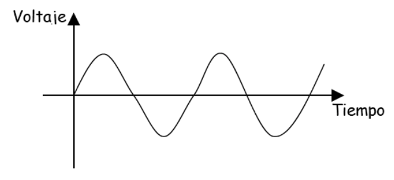{ width="600" }

La magnitud representada puede ser cualquier magnitud física: caída de tensión, presión, temperatura, etc. En el caso de las redes la señal normalmente es un voltaje en función del tiempo.

#### Señales digitales

Las señales digitales son aquellas que representan sus valores con variables discretas en vez de continuas. Por ejemplo, los ordenadores utilizan dos niveles de tensión eléctrica distintos, representados por el cero y el uno (sistema de numeración binario). Tienen las siguientes características:

- Representan únicamente la presencia o ausencia de señal.
- La transición de un nivel a otro no es continua en el tiempo y solo se produce en momento determinados.

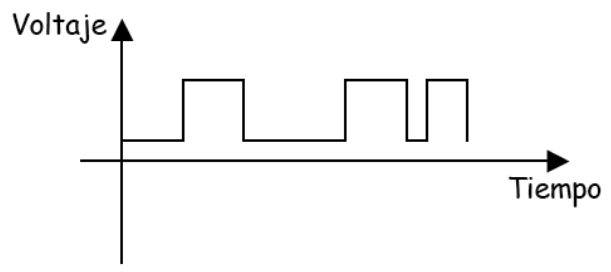{ width="600" }

La representación gráfica de una señal digital corresponde con una función escalonada.

### Contaminación de la señal

Existen diferentes fenómenos que pueden afectar a una señal, modificándola en el canal mientras viaja del emisor al receptor:

- **Atenuación**: Es un efecto producido por el debilitamiento de la señal, debido a la resistencia eléctrica que presentan tanto el canal como los demás elementos que intervienen en la transmisión.
- **Distorsión**: Consiste en la deformación producida normalmente porque el canal se comporta de modo distinto en cada frecuencia.
- **Interferencia**: Es la adicción de una señal conocida y no deseada a la señal que se transmite.
- **Ruido**: Se produce con la suma de múltiples interferencias de origen desconocido y de naturaleza aleatoria.

### La información y la señal

Para que la información pueda transmitirse en al señal dcha información debe codificarse, es decir, se debe estructurar según las reglas de un código. Este código será el conjunto de normas para interpretar la información contenida en la señal en el que se habrán puesto de acuerdo el emisor y el receptor.

De manera formal, codificar es expresar una información de acuerdo a una norma o código. Algunos códigos están diseñados para facilitar la recuperación de los mismos, mientras que otros permiten la compresión de los datos u otras funciones.

Existen diferentes tipos de código. Algunos ejemplos son:

- Código ASCII
- Código EBCDIC
- Código BAUDOT

## Transmisión de datos

Se entiende por transmisión de los datos al proceso de transporte de la información codificada de un punto a otro.

En toda transmisión de datos se ha de aceptar la información, convertirla a un formato que se pueda enviar rápidamente y de forma fiable, transmitir los datos a un determinado lugar y, una vez recibidos de forma correcta, volverlos a convertir al formato que el receptor pueda reconocer y comprender.

Todas esas acciones forman el proceso de transmisión. Dicho proceso podemos dividirlo en tres funciones: edición, conversión y control.

- Las funciones de edición dan el formato adecuado a los datos y se encargan de controlar errores.
- Las funciones de conversión se encargan de convertir los datos al formato adecuado.
- Las funciones de control se ocupan del control de la red y del envío y recepción de mensajes.

Todas estas funciones son implementadas a través de protocolos.

### Tipos de transmisión

Debido a que la transmisión se refiere a los parámetros físicos del transporte de señales, pueden hacerse múltiples clasificaciones

#### Tipos de transmisión atendiendo a la transmisión propiamente dicha.

Cuando un DTE (equipo terminal de datos) de un emisor quiere enviar información a través de un canal de comunicación físico, debe emplear un código concreto que codifique los datos. Comúnmente, en las transmisiones suelen realizarse en UNICODE, que incluye a ASCII.

No todos los equipos suministran la información de la misma manera a la línea de datos, por lo que tiene sentido estudiar los diferentes modos en que se puede producir esta entrega.

##### Transmisión asíncrona

Se entiende por sincronismo el procedimiento por el cual un emisor y un receptor se ponen de acuerdo sobre el instante preciso en el que empieza o acaba una información que se ha puesto en el medio de transmisión.

La sincronización, por tanto, requiere la definición común de una **base de tiempos** sobre la que medir los distintos eventos que ocurran durante la transmisión. Un error de sincronismo implicará la imposibilidad de interpretar correctamente la información a partir de las señales que viajan por el medio.

Una transmisión asíncrona se produce cuando el proceso de sincronización entre emisor y receptor se realiza en cada palabra de código transmitida.  Esto implica que por cada carácter emitido sea necesario transmitir un bit de arranque (bit 0), seguido de la información y terminar con un bit de parada (bit 1).

{ width="600" }

Puesto que la sincronía de la transmisión se restaura en cada carácter, este sistema de transmisión es poco sensible a los problemas que producen las faltas de sincronismo una vez se ha fijado la velocidad de transmisión de los bits. El inconveniente principal de este método es que se aumenta mucho la cantidad de bits que se envían en cada comunicación.

Por ejemplo, si se considera un sistema de transmisión asíncrona, con un bit de arranque, 8 bits informativos por cada carácter de código y un bit de parada, se producirán ráfagas de transferencia de 10 bits por cada carácter transmitido. Una falta de sincronía afectará como mucho a los 10 bits emitidos, pero la llegada del siguiente carácter, con su nuevo bit de arranque, producirá una resincronización del proceso de transmisión.

##### Transmisión síncrona

La transmisión es síncrona cuando se efectúa sin atender a la unidades de comunicación básicas, normalmente caracteres, es decir, cuando se lleva a cabo la sincronización utilizando los mismos cambios de estado en las señales emitidas.

Emisor y receptor se encargan de la sincronización de modo que sean capaces de reconstruir la información original. Esto exige que los dos extremos de la comunicación sincronicen correctamente sus relojes, con objeto de asegurar una duración del bit constante e igual en ambos extremos.

En las transmisiones síncronas se suelen utilizar caracteres especiales para evitar los problemas de pérdida de sincronía en los caracteres informativos transmitidos. Al empezar la transmisión se envían una serie de caracteres de sincronismo (SYN) que están formados por una combinación de 0 y 1, tales que si se produce un desplazamiento de sus bits, el receptor es capaz de conocer sin lugar a dudas que hubo un desplazamiento.

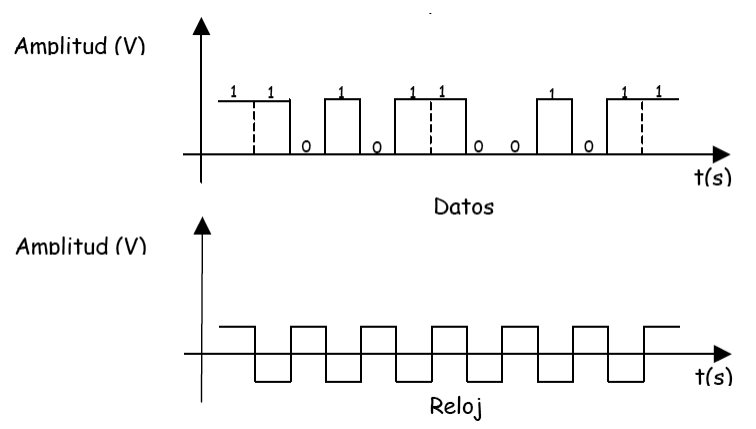{ width="600" }

El modo de transmisión síncrona permite velocidades de transmisión mayores que la transmisión velocidades de transmisión mayores que la transmisión asíncrona, al utilizar menos bits en cada comunicación (ya que en la transmisión síncrona no son necesarios los bits de arranque y parada que acompañan a cada carácter en la transmisión asíncrona), obteniendo un mejor rendimiento de la línea de datos. Además, es menos sensible al ruido eléctrico que la transmisión asíncrona.

En la transmisión asíncrona, la emisión de un carácter conlleva la emisión de 8 bits de información, además de 1 bit de arranque y otro de parada, por lo que el rendimiento es del 80%, siendo este el porcentaje de información respecto del total de los bits enviados.

Sin embargo, si se considera una transmisión de información de 1 kb síncronamente en una línea, el protocolo de comunicaciones prevé el envío de tres caracteres SYN (arranque y parada) cada 256 bytes. En nuestro caso deberían añadirse 8 caracteres SYN, por lo que el rendimiento sería del 99,03%.

###### Tipos de sincronismo

- **Sincronismo de bit**: Se encarga de determinar el momento preciso en que comienza o acaba la transmisión de un bit.
- **Sincronismo de carácter**: Se ocupa de determinar cuáles son los bits que componen cada palabra transmitida en el código elegido para efectuar la transmisión.
- **Sincronismo de bloque**: Fragmenta el mensaje en bloques que deben llevar una secuencia determinada.
- **Sincronismo de trama**: Cuando la información no se transmite toda de una vez, si no en tramas, es necesario establecer un procedimiento que permita identificar qué carácter de los recibidos es el primero de la trama.

#### Tipos de transmisión atendiendo al medio de transmisión

Independientemente del código elegido para efectuar la transmisión, los datos deben viajar por las líneas de comunicación. No todas las líneas de comunicación efectúan la transmisión del mismo modo e incluso un canal de comunicación puede estar compuesto por una o más líneas. Estas líneas pueden tener diferentes funciones: control, datos, etc. Esta clasificación se refiere a aquellas líneas de un canal de transmisión que tienen como misión el flujo de datos.

##### Transmisión en serie

Se dice que una transmisión es en serie cuando todas las señales se transmiten por una única linea de datos secuencialmente. Esta forma de datos es más adecuada para transmisiones a largas distancias. Los bits se transmiten en cadena por la línea de datos a una velocidad constante negociada por el transmisor y el receptor.

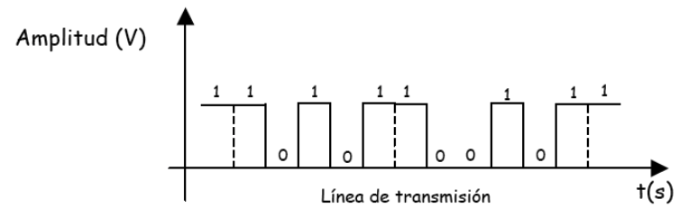{ width="600" }

##### Transmisión en paralelo

Se dice que una transmisión es en paralelo cuando se transmiten simultáneamente un grupo de bits, uno por cada línea del mismo canal. Los agrupamientos de bits pueden ser caracteres u otras asociaciones, dependiendo del tipo de canal.

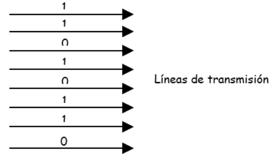{ width="400" }

Para una misma tecnología de transmisión en los medios conductores, una transmisión en paralelo será n veces más rápida que su equivalente en serie, donde n es el número de líneas.

Sin embargo, la complejidad de un canal paralelo y los condicionamientos eléctricos hacen que exista una mayor dificultad en emplear este tipo de canales a grandes distancias, por lo que se ha solido utilizar en ámbitos locales, como la comunicación entre un ordenador y una impresora.

#### Tipos de transmisión atendiendo a la señal emitida

Como se ha comentado anteriormente, según la señal emitida, las señales pueden clasificarse en analógicas y digitales.

Si la señal es analógica es capaz de tomar todos los valores posibles en un rango, diciéndose que la transmisión es analógica. Por su parte, cuando la transmisión es digital la señal emitida solo puede tomar un conjunto de valores discretos dentro del rango de definición.

#### Tipos de transmisión atendiendo al tipo de modulación

En ocasiones la transmisión exige una modulación, es decir, una conversión para transmitir señales digitales sobre líneas de transmisión analógicas, para que se produzca esa adecuación necesaria entre las líneas y los equipos.

Si la transmisión se realiza sin ningún proceso de modulación se dice que opera en **banda base**. Por el contrario, si se exige un proceso de modulación previo, se dice que la transmisión se produce en **banda ancha**.

##### Modulación de amplitud (ASK)

En esta modulación, a cada valor de la señal digital se le hace corresponder una amplitud distinta de la señal analógica (para un valor binario 0 se envía una amplitud 0, pero par aun valor binario 1 se envía una amplitud distinta de 0).

Se emplea muy poco en transferencia de datos y siempre a muy bajas velocidades de transmisión, ya que es muy susceptible a las interferencias de línea.

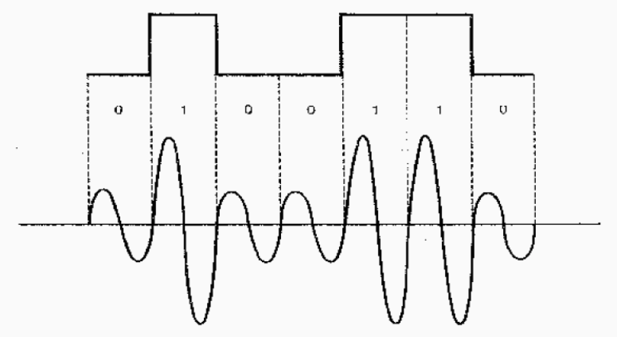{ width="600" }

##### Modulación de frecuencia (FSK)

En ella, cada valor de la señal digital se hace corresponder una frecuencia de la señal analógica (para un valor binario 0 se envía una frecuencia determinada, y para un valor binario 1 se envía otra frecuencia distinta).

Se emplea para velocidades de transmisión iguales o inferiores a 1200 bps.

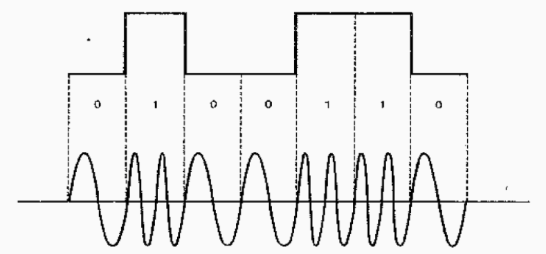{ width="600" }

##### Modulación de fase (PSK)

En la que a cada valor de la señal digital se le hace corresponder con un desfase de la señal analógica (para un valor binario 0 se modifica la fase y par aun valor binario 1 no se modifica).

Se emplea para velocidades de transmisión superiores a 1200 bps. Para velocidades superiores se emplea la modulación de fase combinada con la modulación de amplitud.

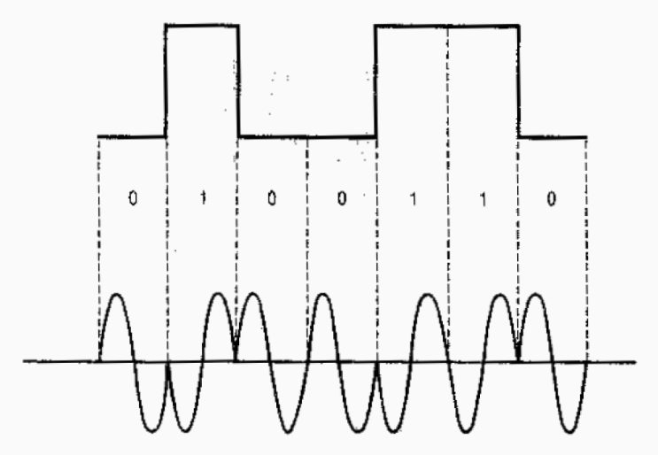{ width="600" }

### Medios de transmisión

El  medio de transmisión es el soporte físico que facilita el transporte de la información. Es parte fundamental en la comunicación de datos, dependiendo de sus características la calidad de la transmisión.

El transporte, que puede ser mecánico, óptico, electromagnético, etc., debe ser adecuado a la transmisión de la señal física con objeto de producir la conexión y la comunicación entre dos dispositivos. Cada medio de transmisión tiene ventajas e inconvenientes, por lo que hay una serie de factores que deben tenerse en cuenta a la hora de elegir un medio de transmisión:

* Tipo de instalación en la que es más adecuado.
* Topología que soporta.
* Fiabilidad y vulnerabilidad.
* Influencia de las interferencias.
* Economía y facilidad de instalación.
* Seguridad para intervenir en el medio.

En principio, podemos distinguir entre dos medios:

* Guiados: Conducen las ondas electromagnéticas a través de un campo físico: los cables.
* No guiados: Proporcionan un soporte para que las ondas se transmitan, pero no las dirigen, como el aire en las redes inalámbricas.

#### Medios guiados o cableados

En general, distinguimos de tres tipos: par trenzado, coaxial y fibra óptica.

##### Par trenzado

Es el cable más común en las redes. Está formado por cables de cobre aislados, normalmente de 1 mm de espesor, trenzados de dos en dos. La forma trenzada del cable se utiliza para reducir las interferencias eléctricas. Los conectores habituales de este tipo de cableado en redes de datos son los RJ-45.

| **Categoría** | **Uso**                                                                                                   | **Ancho de banda**                            |
| :---------------: |-----------------------------------------------------------------------------------------------------------|-----------------------------------------------|
| **Cat1**      | Comunicaciones de voz analógicas (líneas telefónicas). No apto para transmisión de datos.                 | Hasta 1 Mbps                                  |
| **Cat2**      | Redes Token Ring y otras aplicaciones de baja velocidad de datos.                                         | Hasta 4 Mbps                                  |
| **Cat3**      | Telefonía y redes Ethernet 10 Mbps (10BASE-T).                                                            | Hasta 10 Mbps                                 |
| **Cat5**      | Redes Fast Ethernet (100BASE-TX).                                                                         | Hasta 100 Mbps                                |
| **Cat5e**     | Redes Gigabit Ethernet (1000BASE-T).                                                                      | Hasta 1 Gbps                                  |
| **Cat6**      | Redes Gigabit Ethernet y 10 Gigabit Ethernet en distancias cortas.                                        | Hasta 1 Gbps (100 m), hasta 10 Gbps (55 m)    |
| **Cat6a**     | Redes 10 Gigabit Ethernet.                                                                                | Hasta 10 Gbps                                 |
| **Cat7**      | Redes 10 Gigabit Ethernet con mayor protección contra interferencias (cableado apantallado).              | Hasta 10 Gbps                                 |
| **Cat8**      | Centros de datos y conexiones de alta velocidad.                                                          | Hasta 25/40 Gbps                              |

Podemos distinguir tres tipo dentro de este cableado:

###### UTP

El cable UTP (Par trenzado no apantallado o sin blindaje) es el cable de red más utilizado. Consiste en pares de cobre trenzados rodeados por una funda de plástico. Existen distintas categorías de cables UTP, cada una de las cuales especifica unas características eléctricas para el cable. Lo más utilizados actualmente en redes locales son la categoría 5 (cat5) y la 5 mejorada (cat5e).

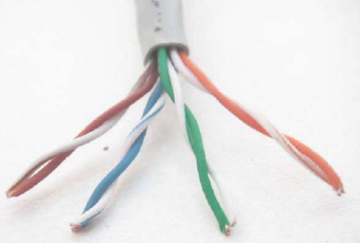{ width="300" }

###### STP

El cable SPT (Par trenzado apantallado o blindado) se caracteriza porque cada par va recubierto por una malla conductora, la cual es mucho más protectora y de mucha más calidad que la utilizada en el UTP. La protección de este cable ante perturbaciones es mucho mayor a la del UTP. Sus desventajas son que es un cable caro y recio/fuerte. Se suele utilizar en las instalaciones de procesamiento de datos.

{ width="300" }

###### FTP

El cable FTP (Par trenzado con pantalla global) posee una amplia pantalla global, aunque sus pares no se encuentran apantallados individualmente. Esta pantalla provoca una mejora en la protección ante interferencias externas.

Se suele utilizar para aplicaciones que se van a someter a una elevada interferencia electromagnética externa, ya que este cable tiene un gran aislamiento de la señal.

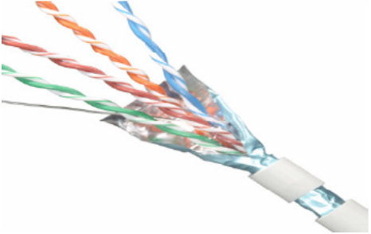{ width="300" }

Una de las ventajas del cable FTP es su capacidad para configurarse en distintas topologías, como estrella y bus; además, su instalación es sencilla.

Sin embargo, también presenta desventajas, como una alta sensibilidad al ruido y la incapacidad para soportar altas velocidades de transmisión.

##### Cable coaxial

El cable coaxial está compuesto por un conductor central rodeado de material aislante, el cual a su vez está envuelto en una malla metálica y una cubierta exterior. Esta estructura está diseñada para proteger las transmisiones contra interferencias electromagnéticas.

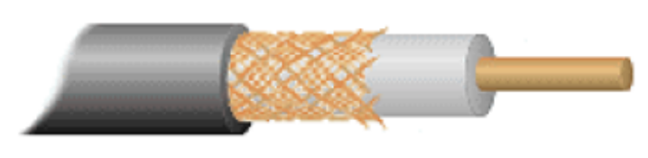{ width="300" }

Existen esencialmente dos tipos de cable coaxial: banda base (también conocido como cable fino) y banda ancha (o cable grueso). La principal diferencia entre ambos radica en su impedancia, siendo de 50 ohmios para el cable de banda base y de 75 ohmios para el de banda ancha. El primero se utiliza principalmente para transmisiones digitales, mientras que el segundo se emplea en transmisiones analógicas.

###### Cable coaxial de banda base

El cable coaxial de banda base ofrece mejores características de protección que el par trenzado, lo que le permite transportar señales a mayores distancias y con anchos de banda superiores. Su construcción proporciona un alto grado de inmunidad al ruido eléctrico. Sin embargo, en aplicaciones de redes de área local (LAN), su uso ha disminuido considerablemente. Esto se debe a su fragilidad, mayor costo y, especialmente, a los avances en el rendimiento de los cables de par trenzado y fibra óptica, que han ofrecido soluciones más eficientes y económicas para las redes modernas.

###### Cable coaxial de banda ancha

El cable coaxial de banda ancha se utiliza para la transmisión de señales analógicas y es ampliamente empleado en la industria de la televisión por cable. Debido a que las señales analógicas son menos susceptibles a problemas de transmisión que las digitales, esta tecnología puede implementarse con éxito en redes que abarcan cientos de kilómetros.

Los sistemas de banda ancha pueden alcanzar anchos de banda de hasta 1 GHz o más con las tecnologías actuales. Dividen la transmisión en múltiples canales, habitualmente de 6 a 8 MHz cada uno. Cada canal puede utilizarse para transmitir televisión analógica o digital, audio de alta calidad o datos. Con el avance de las tecnologías digitales y estándares como DOCSIS, los operadores de cable pueden ofrecer servicios de internet de alta velocidad, televisión digital y telefonía sobre el mismo cable coaxial.

Actualizaciones y consideraciones actuales:

* Transmisión de datos mejorada: Las velocidades de transmisión en cables coaxiales han aumentado significativamente gracias a la modulación digital y a tecnologías avanzadas, permitiendo velocidades de descarga de varios Gbps en conexiones residenciales e industriales.
* Uso en redes modernas: Aunque el cable coaxial ha sido en gran medida reemplazado por par trenzado y fibra óptica en redes LAN, sigue siendo relevante en aplicaciones específicas como conexiones de televisión por cable, antenas satelitales y sistemas de seguridad.
* Conectores: En el cable coaxial fino se utiliza el conector BNC, común en aplicaciones de video profesional, equipos de prueba y algunas redes heredadas. En aplicaciones de televisión por cable y satélite, es más frecuente el uso de conectores F y otros tipos especializados.

##### Fibra óptica

El cable de fibra óptica transmite información mediante pulsos de luz en lugar de señales eléctricas, lo que lo hace inmune a las interferencias electromagnéticas y especialmente adecuado para transmisiones a larga distancia. Mientras que los cables de cobre suelen limitar la transmisión de datos a unos pocos cientos de metros, la fibra óptica puede operar eficientemente en distancias de hasta 100 km o más sin necesidad de repetidores. Los conectores más comunes utilizados en instalaciones de fibra óptica para redes de área local son los tipos SC, ST y LC, siendo este último cada vez más popular por su tamaño compacto y facilidad de uso.

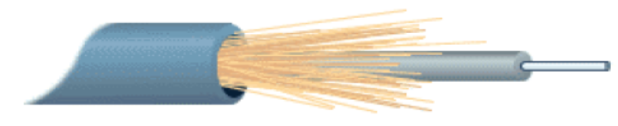{ width="400" }

El espectro de la luz natural abarca un rango continuo de frecuencias distintas (ultravioleta, visible, infrarrojo, etc.), lo que no la convierte en una fuente ideal para la transmisión de datos debido a su incoherencia y dispersión. Por ello, se emplean fuentes de luz especializadas para garantizar una comunicación eficiente:

* Láseres: Son fuentes de luz altamente coherentes que emiten un haz en una única longitud de onda con ondas en fase. Son ideales para aplicaciones que requieren altas velocidades y largas distancias, y se utilizan principalmente en fibras monomodo.
* Diodos LED: Son dispositivos semiconductores que emiten luz cuando se les aplica una corriente eléctrica. Producen luz menos coherente que los láseres y se utilizan comúnmente en fibras multimodo para aplicaciones de corta a media distancia.

En la actualidad, se emplean principalmente dos tipos de fibra óptica para la transmisión de datos:

* Fibra monomodo: Permite la transmisión de señales con anchos de banda extremadamente altos y es ideal para largas distancias. La luz se propaga a través de un único modo o trayectoria, minimizando la dispersión modal y permitiendo velocidades de transmisión superiores a 10 Gbps. El diámetro típico del núcleo es de aproximadamente 8 a 10 micrómetros.
* Fibra multimodo: Permite que la luz se propague a través de múltiples modos o trayectorias y es adecuada para distancias más cortas. Se divide en:
* Fibra multimodo de índice gradual: El índice de refracción del núcleo disminuye gradualmente desde el centro hacia el borde, lo que reduce la dispersión modal y mejora el rendimiento en comparación con la fibra de índice escalonado. Puede soportar anchos de banda de varios gigahercios y es adecuada para aplicaciones de hasta 2 km. Las categorías OM1, OM2, OM3, OM4 y OM5 son ejemplos de este tipo, con capacidades que van desde 1 Gbps hasta 100 Gbps a diversas distancias.
* Fibra multimodo de índice escalonado: Tiene un núcleo con índice de refracción uniforme y un cambio abrupto al revestimiento. Debido a la mayor dispersión modal, su ancho de banda y alcance son más limitados, generalmente utilizados en aplicaciones muy cortas y a velocidades más bajas.

| Tipo de cable | Tasa de datos máxima | Ancho de banda | Distancia entre repetidores |
| :------------: | -------------------| --------------- | ---------------|
| Par trenzado |  - Cat5e: hasta 1 Gbps- Cat6: hasta 10 Gbps (hasta 55 m)- Cat6a: hasta 10 Gbps- Cat7: hasta 10 Gbps- Cat8: hasta 40 Gbps (hasta 30 m) | - Cat5e: 100 MHz- Cat6: 250 MHz- Cat6a: 500 MHz- Cat7: 600 MHz- Cat8: 2000 MHz | Hasta 100 metros (estándar Ethernet) |
| Cable coaxial | - DOCSIS 3.0: hasta 1 Gbps (descarga)- DOCSIS 3.1: hasta 10 Gbps (descarga), 1-2 Gbps (subida)- Aplicaciones profesionales: varía según el sistema | Hasta 3 GHz o más (dependiendo del tipo de cable y aplicación) | Varios kilómetros (con amplificadores o repetidores cada 1-2 km) |
| Fibra óptica | - Monomodo: hasta 100 Gbps y superiores- Multimodo: hasta 100 Gbps (distancias más cortas)- Con DWDM: varios Tbps | - Monomodo: ancho de banda extremadamente alto (decenas de THz)- Multimodo: alto ancho de banda para distancias cortas | - Fibra Monomodo: hasta 80-100 km (sin repetidores)- Fibra Multimodo: hasta 2 km |

#### Medios no guiados o inalámbricos

La comunicación inalámbrica es esencial para los usuarios móviles que requieren conexión constante. Además, es extremadamente útil en áreas geográficas de difícil acceso donde la instalación de cables es costosa o impracticable. Según el tipo de señal utilizada, existen diferentes métodos de enlaces inalámbricos:

* **Ondas de radio**: Son sencillas de generar y pueden cubrir largas distancias. Sin embargo, es necesario un control gubernamental estricto para evitar interferencias entre diferentes transmisiones, mediante la regulación del espectro radioeléctrico.
* **Microondas**: Se utilizan para transmisiones tanto terrestres como satelitales, permitiendo comunicaciones de alta capacidad y larga distancia. Las microondas requieren una línea de visión directa entre los transmisores y receptores, y son comunes en enlaces punto a punto y en redes de telecomunicaciones.
* **Ondas infrarrojas y ondas milimétricas**: Las ondas infrarrojas se emplean en comunicaciones de corto alcance, como en controles remotos de televisores y otros dispositivos electrónicos. Aunque antes eran comunes en puertos de comunicación de ordenadores portátiles, han sido reemplazadas por tecnologías como Bluetooth y Wi-Fi. Las ondas infrarrojas no atraviesan objetos sólidos, lo que limita su uso. Por otro lado, las ondas milimétricas, que operan en frecuencias muy altas, son fundamentales en las redes 5G actuales, ofreciendo altas velocidades de transmisión. Sin embargo, tienen un alcance limitado y pueden ser bloqueadas fácilmente por obstáculos físicos y afectadas por condiciones atmosféricas.
* **Ondas de luz**: Permiten la comunicación entre dos puntos mediante haces de luz, como láseres montados en las azoteas de edificios. Este método ofrece altas velocidades de transmisión y es relativamente económico y fácil de instalar. No obstante, requiere una alineación precisa entre los emisores y receptores, y su eficacia puede verse afectada por condiciones atmosféricas adversas como niebla, lluvia o polvo en suspensión, que pueden interrumpir o degradar la señal.

### Técnicas de transmisión

Para transmitir información entre un emisor y un receptor, se emplean diversas técnicas de transmisión. Las más comunes son banda base y banda ancha.

#### Banda Base

La transmisión en banda base es el método más común en las redes locales (LAN). Consiste en enviar señales digitales directamente sobre el medio de transmisión sin utilizar técnicas de modulación. En este método, se utiliza todo el ancho de banda disponible para una única señal, por lo que solo es posible transmitir una señal a la vez.

Este enfoque es especialmente adecuado para distancias cortas, ya que en trayectos más largos pueden surgir problemas de atenuación, ruido e interferencias. Para extender el alcance, se pueden emplear repetidores que regeneran la señal y mantienen su integridad. Los medios de transmisión comúnmente utilizados en banda base incluyen el cable de par trenzado y el cable coaxial.

#### Banda Ancha

La transmisión en banda ancha implica modular las señales digitales sobre ondas portadoras analógicas, permitiendo que múltiples señales compartan el ancho de banda del medio. Esto se logra mediante técnicas como la multiplexación por división de frecuencia (FDM), donde el espectro disponible se divide en varios canales, cada uno transmitiendo una señal diferente. Es como si, en lugar de un único medio, se utilizaran múltiples líneas dentro del mismo cable físico.

Este método requiere el uso de módems para modular y demodular las señales, convirtiendo las señales digitales en analógicas y viceversa. La transmisión en banda ancha es adecuada para distancias mayores, pudiendo alcanzar hasta 50 km o más, dependiendo de la tecnología y el medio utilizado.

Además, permite que el mismo medio de transmisión transporte diferentes tipos de señales simultáneamente, como datos, televisión y voz. Los medios de conexión empleados en banda ancha incluyen el cable coaxial y la fibra óptica.

#### Actualizaciones y consideraciones actuales

* Evolución de la Terminología: En la actualidad, el término banda ancha se asocia comúnmente con conexiones de alta velocidad a Internet, independientemente del medio físico o la técnica de transmisión. Esto incluye tecnologías como DSL, cable módem, fibra óptica y conexiones inalámbricas de alta velocidad.
* Tecnologías Modernas: Las redes actuales utilizan medios avanzados como el par trenzado de categorías superiores (Cat6, Cat6a, Cat7, Cat8) y la fibra óptica, que permiten velocidades de transmisión mucho más altas que las mencionadas anteriormente. Por ejemplo, la fibra óptica puede transmitir datos a velocidades de 100 Gbps o superiores y a distancias de 80 km sin necesidad de repetidores.
* Modulación y Multiplexación Avanzadas: Se han desarrollado técnicas de modulación más sofisticadas, como QAM (Modulación por Amplitud en Cuadratura) y OFDM (Multiplexación por División de Frecuencia Ortogonal), que aumentan la eficiencia espectral y permiten mayores velocidades de datos.
* Redes de Larga Distancia: Para transmisiones a muy largas distancias, como en redes troncales de Internet, se utilizan tecnologías como la multiplexación por división de longitud de onda densa (DWDM) en fibra óptica, que permite transmitir múltiples señales ópticas a diferentes longitudes de onda por el mismo cable, aumentando enormemente la capacidad de transmisión.
* Convergencia de Servicios: Las redes modernas suelen ser de tipo multiservicio, capaces de transportar datos, voz y video sobre el mismo medio físico, gracias a las técnicas de multiplexación y protocolos como IP (Protocolo de Internet).

### Códigos de transmisión

El sistema binario constituye la base esencial que permite a un ordenador recibir, procesar y almacenar información. En este sistema, letras, números y caracteres especiales se transforman a binario mediante la asignación de secuencias de 0 y 1 a cada carácter ingresado. Para realizar esta conversión, los ordenadores utilizan códigos específicos como BCD, EBCDIC, ASCII, FIELDATA, entre otros, asegurando que cada carácter tenga una representación única dentro de estos estándares. Estos códigos abarcan una variedad de caracteres, incluyendo alfabéticos (tanto en mayúsculas como en minúsculas), numéricos (del 0 al 9), caracteres especiales (. , ; : etc.) y caracteres de control (como el salto de línea o ACK).

Principales códigos de codificación:

* FIELDATA: Utiliza 6 bits para representar cada carácter, permitiendo así 2⁶ = 64 caracteres distintos.
* ASCII (American Standard Code for Information Interchange): Emplea 7 bits por carácter, ofreciendo 2⁷ = 128 caracteres diferentes.
* ASCII extendido: Amplía ASCII a 8 bits por carácter, alcanzando 2⁸ = 256 caracteres.
* EBCDIC (Extended Binary Coded Decimal Interchange Code): También utiliza 8 bits por carácter, permitiendo 256 caracteres distintos.

Estos códigos de entrada/salida (E/S) asignan a cada carácter una secuencia específica de bits, estableciendo correspondencias entre conjuntos según el dispositivo utilizado. Por ejemplo, con un número fijo n de bits para codificar m símbolos:

* Si n = 2, se pueden codificar m = 2² = 4 símbolos.
* Si n = 3, se pueden codificar m = 2³ = 8 símbolos.
* En general, si n = k, se pueden codificar m = 2ᵏ símbolos.

Por lo tanto, para codificar m símbolos, se requiere un código con n bits tal que m ≤ 2ⁿ, donde n es el menor número entero que cumple n ≥ log₂ m.

Inicialmente, los códigos de E/S utilizaban 6 bits (n = 6), permitiendo representar 64 caracteres distintos (26 letras del alfabeto, 10 dígitos y 28 caracteres especiales). Posteriormente, se adoptaron códigos de 7 bits para incluir letras minúsculas y caracteres de control adicionales. Hoy en día, los códigos de 8 bits son los más comunes, facilitando una mayor variedad de representaciones.

Evolución hacia estándares modernos:

Con la globalización y la diversidad de idiomas y símbolos utilizados en la actualidad, surgió la necesidad de un sistema de codificación más amplio y flexible. Esto llevó al desarrollo y adopción del estándar Unicode, que permite representar más de un millón de caracteres, abarcando prácticamente todos los sistemas de escritura del mundo, así como emojis y símbolos técnicos.

Formatos de codificación Unicode:

* UTF-8: Es un formato de longitud variable que utiliza entre 1 y 4 bytes (8 a 32 bits) por carácter. Es compatible con ASCII y ampliamente utilizado en internet por su eficiencia y compatibilidad con sistemas existentes.
* UTF-16: Utiliza 16 bits (2 bytes) por carácter, aunque algunos caracteres especiales requieren 4 bytes. Es común en sistemas operativos y entornos de programación modernos.
* UTF-32: Emplea 32 bits (4 bytes) por carácter, permitiendo una representación directa de todos los caracteres Unicode, aunque consume más espacio.

Estos avances en codificación han permitido a los sistemas informáticos manejar una diversidad mucho mayor de información textual, facilitando la comunicación global y el intercambio de datos en múltiples idiomas y contextos culturales.

Ejemplo práctico actualizado:

Consideremos la codificación del carácter ‘A’ en diferentes sistemas:

* En ASCII, ‘A’ se representa como 65 en decimal o 01000001 en binario.
* En Unicode UTF-8, ‘A’ también se representa como 01000001 en binario, manteniendo la compatibilidad con ASCII.
* Sin embargo, un carácter como ‘á’ (a con acento) no existe en ASCII estándar, pero en UTF-8 se codifica con dos bytes (por ejemplo, 11000011 10100001), permitiendo su representación.
* Además, emojis como 😊 se representan en UTF-8 con secuencias de 4 bytes, lo que demuestra la capacidad de Unicode para manejar símbolos modernos y gráficos.

Estos sistemas de codificación avanzados son esenciales para el funcionamiento de aplicaciones web, sistemas operativos y software que requieren compatibilidad internacional y soporte para una amplia gama de caracteres y símbolos, adaptándose a las necesidades tecnológicas contemporáneas.

### Métodos de control de errores

Los sistemas de comunicación no son infalibles, lo que puede provocar que la información que circula a través de ellos se distorsione o altere. Estas distorsiones pueden originarse por el ruido presente en las líneas de transmisión, la degradación de la señal debido a las grandes distancias que debe recorrer, o por interferencias provenientes de otras señales que operan en los mismos circuitos o generadas por dispositivos cercanos, como motores eléctricos, microondas y otros equipos electrónicos.

El desafío principal no radica tanto en la inevitabilidad de los errores de transmisión, que en mayor o menor medida siempre ocurrirán, sino en la capacidad para detectarlos eficazmente. Abordar este problema requiere dos enfoques fundamentales:

1. Reconocer que las comunicaciones son intrínsecamente susceptibles a errores y, por lo tanto, implementar mecanismos que permitan su detección.
2. Una vez detectado un error, corregirlo utilizando técnicas avanzadas de procesamiento de datos o mediante la retransmisión de la información afectada.

Un concepto esencial en este contexto es la pérdida de información. Este término no se refiere simplemente a que la información enviada por el emisor no llegue al receptor, sino a que se produzcan modificaciones inesperadas y no deseadas en los datos transmitidos. En el caso de la información digital y binaria, esto implica cambios en los valores de los bits, es decir, que un bit que originalmente era 0 se convierta en 1 y viceversa.

Con el avance de las tecnologías de comunicación, se han desarrollado métodos más sofisticados para mitigar estos problemas. Por ejemplo, la implementación de códigos de corrección de errores como CRC (Cyclic Redundancy Check), códigos Reed-Solomon y códigos de corrección de errores de canal en tecnologías modernas como 5G y redes de fibra óptica han mejorado significativamente la integridad de la transmisión de datos. Además, las redes inalámbricas contemporáneas enfrentan desafíos adicionales debido a la mayor densidad de señales y la interferencia electromagnética, lo que ha impulsado el desarrollo de algoritmos más robustos para la detección y corrección de errores.

Asimismo, con la creciente importancia de la ciberseguridad, asegurar la integridad de la información transmitida se ha vuelto crucial, no solo para corregir errores inadvertidos sino también para proteger contra manipulaciones maliciosas. En este sentido, se integran técnicas de verificación y encriptación que garantizan que los datos no solo lleguen intactos, sino también seguros.

Además, la Internet de las Cosas (IoT) y las redes de comunicación masivas han incrementado la complejidad y la cantidad de datos transmitidos, lo que requiere sistemas aún más eficientes y confiables para gestionar la detección y corrección de errores. Tecnologías emergentes como la inteligencia artificial y el aprendizaje automático están siendo aplicadas para predecir y mitigar errores de transmisión de manera proactiva, optimizando así la fiabilidad de las comunicaciones en tiempo real.

En resumen, aunque los medios de comunicación modernos han avanzado enormemente en la reducción de errores y en la mejora de la calidad de transmisión, la detección y corrección de errores siguen siendo aspectos fundamentales para asegurar la fiabilidad y la integridad de la información en un entorno de comunicación cada vez más complejo y globalizado.

#### Sistemas de detección de errores

Los métodos más habituales para la detección de errores son los siguientes.

##### El control de paridad

Uno de los métodos más empleados para la detección de errores en las transmisiones de datos es el control de paridad, el cual consiste en añadir a la información original del usuario una serie de bits adicionales que reflejan ciertas propiedades de esos datos. Este mecanismo permite identificar alteraciones en la información al comparar los bits de paridad recibidos con los valores esperados al momento de la emisión.

###### Paridad Simple

El método de paridad simple implica agregar un bit extra a cada byte (grupo de 8 bits) que indica si el número de bits con valor 1 en el byte es par o impar. Este bit adicional se calcula realizando una operación de OR exclusivo (XOR) sobre todos los bits del mensaje original.

Existen dos variantes de paridad simple:

- Paridad par: El bit de paridad se establece en 0 si el número de unos (1) en el byte es par, y en 1 si es impar.
- Paridad impar: El bit de paridad se configura en 0 cuando el número de unos es impar, y en 1 cuando es par.

Ejemplos:

- Paridad Par:
    - Byte original: 1 0 0 1 0 0 0 0
    - Bit de paridad añadido: (0)
    - Transmisión completa: 1 0 0 1 0 0 0 0 (0)
- Paridad Impar:
	- Byte original: 1 0 0 1 0 0 0 0
	- Bit de paridad añadido: (1)
	- Transmisión completa: 1 0 0 1 0 0 0 0 (1)

En ambos casos, si durante la transmisión un bit se altera (por ejemplo, un 0 cambia a 1 o viceversa), el receptor recalcula la paridad del byte recibido y compara el resultado con el bit de paridad recibido. Si hay una discrepancia, se detecta que ha ocurrido un error.

El sistema de paridad simple solo puede detectar errores que afecten a un número impar de bits en la cadena transmitida. Si el número de bits erróneos es par, el error pasa desapercibido, lo que limita su efectividad para transmisiones de datos críticas. Por esta razón, este método es insuficiente para la transmisión de información sensible o en entornos donde la integridad de los datos es primordial.

###### Paridad de Bloque

La paridad de bloque es una extensión de la paridad simple. En lugar de añadir un bit de paridad a cada byte individualmente, este método organiza la información en bloques (por ejemplo, matrices de n filas por m columnas de bits) y añade bits de paridad tanto a las filas como a las columnas. Esto permite detectar y, en algunos casos, corregir errores más complejos que afectan múltiples bits dentro del bloque.

Por ejemplo, si se desea transmitir la siguiente información:

0 0 1 1 0 , 0 1 0 1 0 , 1 1 0 0 1 , 1 1 1 1 1

se expresa por filas en una tabla de 5x4 bits:

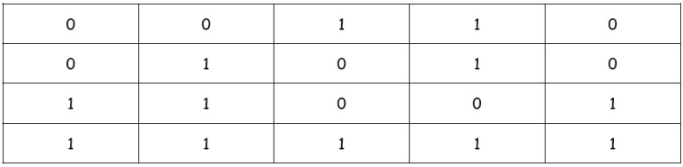{ width="700" }

Y se calcula la paridad por filas y por columnas:

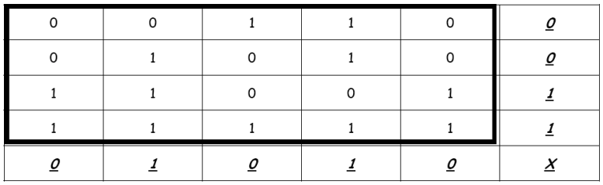{ width="700" }

Los bits en cursiva y subrayados son los bits de paridad. El bit marcado con X (bit de paridad cruzada) no es significativo para este estudio. Estos bits constituyen la paridad de bloque o checksum. La secuencia transmitida será entonces la siguiente:

0 0 1 1 0 **0** 0 1 0 1 0 **0** 1 1 0 0 1 **1** 1 1 1 1 1 **1 0 1 0 1 0 X**

Cuando el mensaje llega al receptor este reconstruye la tabla y comprueba que los códigos de paridad son correctos. La detección del error se realiza de la siguiente manera: Si, por ejemplo, el bit de la segunda fila y tercera columna altera su valor durante la transmisión, la secuencia recibida será:

0 0 1 1 0 **0** 0 1 1 1 0 **0** 1 1 0 0 1 **1** 1 1 1 1 1 **1 0 1 0 1 0 X**

Por lo que la tabla anterior quedaría de la siguiente forma:

{ width="700" }

Al recalcular los códigos de paridad, el receptor detectará que no coinciden los bits de paridad de la segunda fila y la tercera columna, que serán respectivamente 1 y 1, mientras que a él le han llegado 0 y 0.

Ya se ha detectado el error y además se sabe donde se ha producido: en la intersección entre la fila y la columna en que falló la paridad; sabiendo que en ese punto de la tabla está el error, se puede corregir.

En el caso de que se pierdan, no uno sino varios bits de la secuencia de datos, el sistema es capaz de detectar que se ha producido un error, aunque en general no puede corregirlo. El método es, por tanto mas sensible que el de la paridad simple.

##### Redundancia cíclica

Los códigos de detección de error por redundancia cíclica (**CRC**) están basados en las propiedades matemáticas de la división de polinomios. Cada cadena de bits de información a transmitir se representa por un polinomio cuyos coeficientes pueden ser cero 0 ó 1. El grado del polinomio depende del número de bits a transmitir, de forma que cada bit está representado por un monomio.

De esta forma, un mensaje de k bits será un polinomio de grado k-1 como el siguiente:

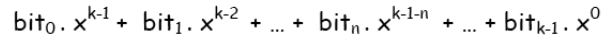{ width="600" }

El mecanismo de utilización del sistema de detección de errores por Códigos de Redundancia
Cíclica (CRC) es muy simple:

1. El emisor y el receptor se ponen de acuerdo en el polinomio que actuará como clave en la detección del error.
2. El emisor divide el polinomio - información entre el polinomio-clave, obteniendo un cociente que carece por completo de interés, pero obteniendo un polinomio-resto que se convertirá en la información redundante necesaria para la detección, equivalente de la paridad.
3. Se envían los bit correspondientes al polinomio-información, seguido de los bits que forman los coeficientes del polinomio-resto.
4. Cuando el receptor lee el mensaje vuelve a repetir la operación y comprueba que el resto es igual que el que le han transmitido. Si no fuera igual se tendría la prueba de que la transmisión ha fallado.

Seleccionando de modo adecuado los polinomios-clave se llegan a detectar gran cantidad de errores posibles e incluso se pueden arbitrar mecanismos de autocorrección. 

Para los polinomios-clave los estándares internacionales son:

- CRC-12
- CRC-16
- CRC-CCITT

Los dos últimos detectan todos los errores de uno y dos bits, los errores con un número impar de bits invertidos, los grupos de errores con longitudes menores o iguales a 16; el 99’997 % con longitudes de 17 y el 99’998 % con longitudes mayores o iguales a 18.

El CCITT ha adoptado los códigos CRC como parte de alguna de sus normas, tal como la V.41, empleando como polinomio-clave el CRC-CCITT.

#### Sistemas de corrección de errores

Una vez que se ha identificado la presencia de un error en una transmisión de datos, es fundamental considerar la posibilidad de corregir dicho error y determinar el grado en el que esta corrección es factible. Existen dos enfoques principales para la corrección de errores:

* **Corrección hacia adelante (Forward Error Correction - FEC)**:
Este método implica que el emisor añade información redundante al mensaje original antes de la transmisión. Utilizando estos datos adicionales, el receptor puede detectar y corregir automáticamente los bits erróneos sin necesidad de solicitar una retransmisión. Este enfoque mejora la eficiencia en entornos donde las retransmisiones son costosas o poco prácticas, como en comunicaciones satelitales o en redes móviles de alta velocidad. Sin embargo, una desventaja es que la cantidad de información redundante requerida puede ser considerable, lo que aumenta el ancho de banda necesario y puede reducir la eficiencia global del sistema.
* **Corrección hacia atrás (Automatic Repeat reQuest - ARQ)**:
En este enfoque, el receptor detecta los errores en la transmisión y solicita al emisor que retransmita los datos erróneos. Este método es ampliamente utilizado en protocolos de comunicación como TCP/IP, donde la fiabilidad es crucial. La ventaja principal de ARQ es que no se necesita agregar información redundante al mensaje original, lo que ahorra ancho de banda. Sin embargo, el proceso de retransmisión puede aumentar la latencia y ocupar más tiempo de la línea de transmisión, especialmente en entornos con alta tasa de errores o en comunicaciones de tiempo real.

##### Corrección de errores por retransmisión

Es común que al receptor se le proporcione únicamente la capacidad para detectar errores en la transmisión de datos. Cuando identifica un error, debe solicitar al emisor que retransmita parte o la totalidad del mensaje afectado. Este proceso implica la necesidad de establecer una comunicación bidireccional entre el emisor y el receptor, algo que no era requerido en los métodos de corrección de errores descritos anteriormente.

El término trama o bloque se refiere a un conjunto de bits que se envía como una unidad de información. Cada trama incluye tanto los datos originales como los bits de comprobación, que pueden generarse mediante métodos como el control de paridad, la redundancia cíclica (CRC) u otras técnicas de detección y corrección de errores.

Dependiendo de cómo se organice el envío y la verificación de las tramas, se pueden identificar dos estrategias principales:

* **Envío y Espera**: En este enfoque, el emisor envía una única trama de información y luego espera a que el receptor confirme si la recepción fue exitosa o si hubo errores. Durante este período de espera, el emisor mantiene la trama en un buffer temporal. El receptor responde con un mensaje de confirmación (ACK: Acknowledge) si la trama fue recibida correctamente, o con un mensaje de no confirmación (NACK: Negative Acknowledge) si se detectaron errores. Basándose en esta respuesta, el emisor procederá a enviar una nueva trama o a retransmitir la trama problemática. Además, tanto el emisor como el receptor llevan un registro del número de tramas erróneas; si se excede un umbral predefinido de errores, la comunicación se aborta para evitar una sobrecarga de retransmisiones.

* **Envío Continuo**: En esta estrategia, el emisor envía múltiples tramas de manera continua sin esperar la confirmación inmediata del receptor para cada una de ellas. Las tramas se almacenan en un buffer temporal hasta que el receptor confirme la correcta recepción de un grupo de tramas o en puntos específicos definidos por el protocolo de comunicación. Si el receptor detecta que una trama dentro del grupo presenta errores, puede optar por dos acciones:
	* Reenvío Selectivo: El emisor retransmite únicamente la trama que fue identificada como errónea. Este método es conocido como rechazo selectivo y es eficiente en términos de ancho de banda, ya que solo se retransmite la información que realmente falló.
	* Reenvío No Selectivo: El emisor retransmite la trama con errores y todas las tramas que aún están pendientes de confirmación. Este método, denominado rechazo no selectivo, puede ahorrar tiempo en situaciones donde múltiples tramas podrían estar afectadas por errores, pero consume más ancho de banda debido a la retransmisión adicional.

<!-- ## Direccionamiento IP
### Introducción al direccionamiento IP
## Direcciones IP
## Máscara de red
## Puerta de enlace predeterminada
## Asignación de direcciones IP a una red
## Direcciones privadas
## IPv6
-->