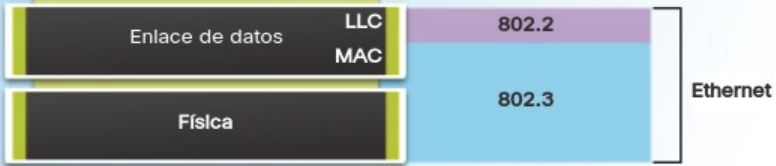
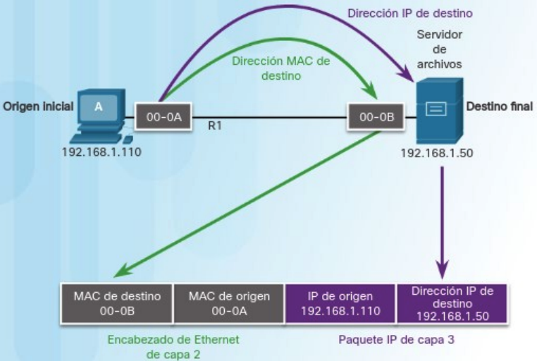
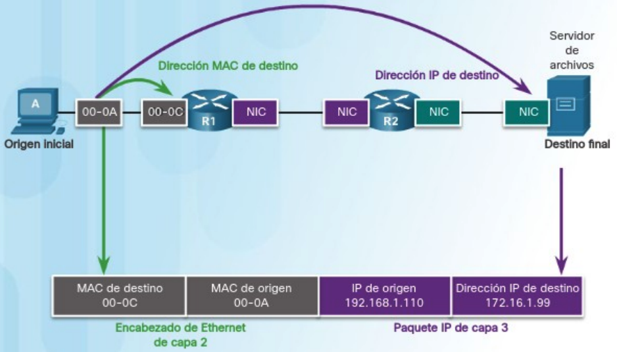
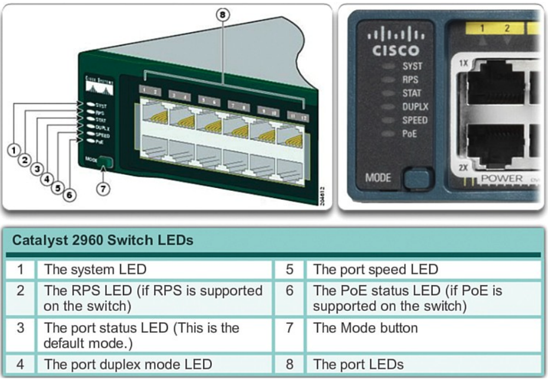
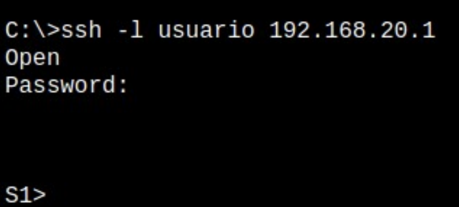
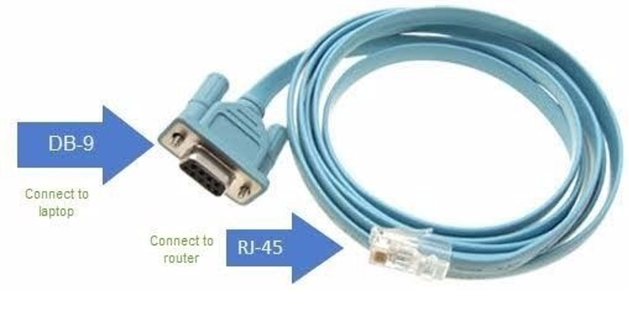
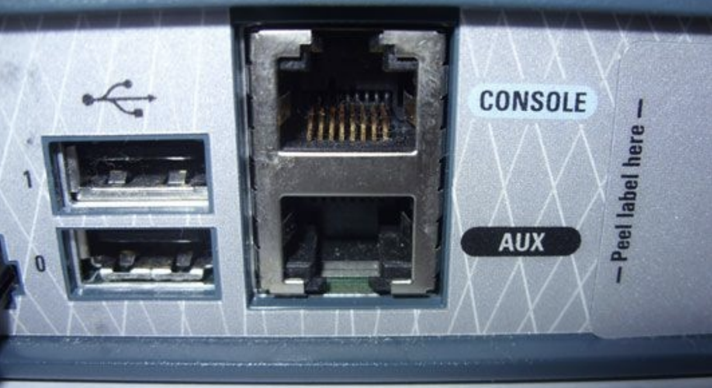

# Unidad 3 - Configuración y administración de conmutadores

## Introducción

En el modelo OSI hay dos capas tan estrechamente relacionadas que, en el modelo TCP/IP, se consideran esencialmente una sola capa. Estas son la capa de enlace de datos y la capa física en el modelo OSI; en el modelo de Internet, se conocen conjuntamente como la capa de acceso a la red.

La capa de enlace de datos del modelo OSI (Capa 2) tiene las siguientes responsabilidades:

- **Detección y corrección de errores**: Su función principal es identificar y corregir todos los errores que puedan ocurrir en la línea de comunicación dentro de la misma red.
- **Control de flujo**: Se asegura de que un emisor rápido no sature a un receptor más lento, evitando así la pérdida innecesaria de datos.
- **Gestión del medio compartido**: En redes donde existe un único medio compartido para la transmisión de información, esta capa se encarga de distribuir su uso entre los diferentes nodos.

En la notación de la capa 2, los dispositivos de red conectados al medio de transmisión se denominan nodos. Estos nodos son responsables de crear y reenviar tramas. La capa de enlace de datos OSI es la encargada de gestionar el intercambio de tramas Ethernet entre los nodos de origen y destino a través de un medio de red físico.

## Ethernet

Ethernet es la tecnología LAN más utilizada a nivel mundial. Opera en las capas de enlace de datos y física del modelo OSI, y corresponde a la capa de acceso al medio en el modelo TCP/IP. Es una familia de tecnologías de red definidas en los estándares IEEE 802.2 y 802.3.

Los estándares de Ethernet abarcan tanto los protocolos de la capa 2 como las tecnologías de la capa 1. Ethernet divide sus funciones en dos subcapas:

- **Subcapa LLC (Logical Link Control)**: Esta subcapa toma los datos del protocolo de red, generalmente un paquete IPv4, y añade información de control para facilitar su entrega al nodo de destino. En un ordenador, el LLC puede considerarse como el software del controlador de la tarjeta de red (NIC, Network Interface Card).
- **Subcapa MAC (Media Access Control)**: Es la subcapa inferior de la capa de enlace de datos y se implementa en hardware, usualmente en la tarjeta de red del ordenador.

<center>{ width="700" }</center>

La subcapa MAC de Ethernet tiene dos funciones principales:

- **Encapsulación de datos**: Este proceso incluye la creación de tramas antes de la transmisión y su desensamblaje al recibirlas. Para formar la trama, la capa MAC añade un encabezado y una cola al paquete de la capa de red, que ya contiene la información de control añadida por la subcapa LLC.
- **Control de acceso al medio**: Es responsable de colocar las tramas en el medio de transmisión (en el origen) y de extraerlas (en el destino). Esta subcapa se comunica directamente con la capa física. A medida que los paquetes se transfieren desde el host de origen al de destino, suelen atravesar diferentes redes físicas que pueden incluir diversos tipos de medios de transmisión, como cables de cobre, fibra óptica y tecnologías inalámbricas. El control de acceso al medio es el conjunto de técnicas que gestionan cómo se colocan y extraen las tramas del medio físico de transmisión.

### Métodos de control de acceso al medio

Algunas topologías de red comparten un medio de transmisión común entre varios nodos, conocidas como redes de acceso múltiple. Las LAN Ethernet con topología en bus o en estrella que utilizan concentradores (hubs) y las WLAN son ejemplos de este tipo de red. En estas redes, varios dispositivos pueden intentar enviar y recibir datos simultáneamente utilizando los mismos medios de red.

Para gestionar el acceso al medio compartido, se requieren reglas que definan cómo los nodos comparten el medio de transmisión físico. Existen dos métodos básicos de control de acceso al medio para medios compartidos:

- **Acceso por contención**: Todos los nodos en modo half-duplex compiten por el uso del medio, pero solo un dispositivo puede transmitir a la vez. Si dos dispositivos transmiten simultáneamente, se produce una colisión, y existe un proceso para manejar esta situación. Las LAN Ethernet que utilizan hubs y las WLAN son ejemplos de este método.
- **Acceso controlado**: Cada nodo tiene su turno asignado para utilizar el medio. Aunque este tipo de redes determinísticas garantizan el acceso ordenado, no son eficientes, ya que un dispositivo debe esperar su turno para transmitir. Las antiguas LAN de Token Ring con topología en anillo son ejemplos de este método.

Por defecto, los switches Ethernet operan en modo dúplex completo. Esto permite que el switch y el dispositivo conectado envíen y reciban datos simultáneamente, eliminando la necesidad de implementar métodos de control de acceso al medio.

### La trama Ethernet

Anteriormente, mencionamos que la unidad de datos del protocolo en la capa de enlace se conoce como trama. La capa de enlace de datos prepara los paquetes para su transmisión a través de los medios físicos encapsulándolos con un encabezado y un tráiler, formando así una trama completa. Esta trama se compone de tres partes fundamentales:

- Encabezado: Contiene información de direccionamiento y control necesaria para el envío y la recepción.
- Datos: Corresponde a la Unidad de Datos de Protocolo (PDU) de nivel 3, generalmente un paquete IP.
- Tráiler: Incluye información para la detección y posible corrección de errores.

<center>{ width="700" }</center>

El tamaño de una trama Ethernet varía entre un mínimo de 64 bytes y un máximo de 1518 bytes. Los campos específicos de una trama Ethernet son los siguientes:

**Encabezado**

- Preámbulo y Delimitador de Inicio de Trama (SFD): Ocupan 7 y 1 byte respectivamente y se utilizan para sincronizar al receptor y señalar el comienzo de una nueva trama.
- Dirección MAC de Destino: 6 bytes que identifican al receptor de la trama.
- Dirección MAC de Origen: 6 bytes que identifican al emisor de la trama.
- Tipo Ether (Ethertype): 2 bytes que indican el protocolo de nivel superior encapsulado dentro de la trama, como IPv4 o IPv6.

**Datos**

- Carga Útil: Varía entre 46 y 1500 bytes y contiene la información que se desea transmitir. Es la PDU de nivel superior, comúnmente un paquete IPv4.

**Tráiler**

- Secuencia de Verificación de Trama (FCS): 4 bytes dedicados a la detección de errores en la trama. Utiliza un Código de Redundancia Cíclica (CRC) que aplica una fórmula matemática al contenido de la trama para verificar su integridad.

### Dirección MAC

Una dirección MAC en Ethernet es un número binario de 48 bits, habitualmente representado mediante 12 dígitos hexadecimales (cada dígito hexadecimal equivale a 4 bits). Esta dirección se divide en dos partes:

- **Identificador Único de Organización (OUI)**: Los primeros 3 bytes (6 dígitos hexadecimales) que identifican al fabricante de la tarjeta de red. Cada fabricante posee un OUI único asignado.
- **Identificador de Dispositivo**: Los últimos 3 bytes, asignados por el fabricante, que aseguran que cada dirección MAC sea única para un dispositivo en particular.

No existen dos direcciones MAC idénticas; cada una es exclusiva para un dispositivo específico. Los fabricantes se encargan de que los tres últimos bytes sean diferentes para cada dispositivo, y cada uno tiene un OUI distinto.

Las direcciones MAC se expresan como seis pares de valores hexadecimales, donde cada par representa un byte. Por ejemplo, una dirección MAC puede ser 00-18-DE-DD-A7-B2. Generalmente, se utilizan guiones o dos puntos para separar cada byte. Existen tres tipos principales de direcciones MAC:

- **Unidifusión**: Es una dirección MAC única utilizada cuando se envía una trama desde un solo dispositivo emisor hacia un solo dispositivo receptor.
- **Difusión**: Una trama dirigida a una dirección de difusión será recibida y procesada por todos los hosts de esa red local (dominio de difusión). La dirección MAC de difusión es FF-FF-FF-FF-FF-FF en hexadecimal, lo que equivale a 48 unos en binario.
- **Multidifusión**: Permiten que un dispositivo de origen envíe una trama a un grupo específico de dispositivos. Una dirección MAC de multidifusión asociada a una dirección de multidifusión IPv4 comienza con 01-00-5E en hexadecimal. El resto de la dirección se forma convirtiendo los 23 bits inferiores de la dirección IP del grupo de multidifusión en seis dígitos hexadecimales.

Las direcciones MAC no se asignan mediante software; a menudo se les llama direcciones físicas porque están grabadas físicamente en la memoria ROM de la tarjeta de red. Es decir, la dirección está codificada de forma permanente en el chip ROM. Cualquier dispositivo que pueda ser el origen o destino de una trama Ethernet debe tener una dirección MAC asignada. Esto incluye computadoras, servidores, impresoras, dispositivos móviles y routers.

Estas direcciones físicas no indican a qué red está conectado el dispositivo. Si el dispositivo se mueve a otra red o subred, continúa operando con la misma dirección física sin necesidad de cambios.

### Switches

Un switch, también conocido como conmutador, es un dispositivo de interconexión utilizado para conectar equipos en red, formando una red de área local (LAN). Sus especificaciones técnicas cumplen con el estándar Ethernet. En la actualidad, las redes locales cableadas se basan en Ethernet, empleando una topología en estrella donde el switch actúa como el elemento central de esta configuración.

El switch opera en la capa 2 del modelo OSI y en la capa de acceso a red del modelo de Internet. Al ser un dispositivo diseñado para redes Ethernet, trabaja exclusivamente con tramas y no tiene conocimiento del protocolo que se transmite en la sección de datos de la trama, como podría ser un paquete IPv4. Las decisiones de reenvío que toma el switch se basan únicamente en las direcciones MAC Ethernet de la capa de enlace.

La cantidad de dispositivos que se pueden conectar a un switch depende del número de puertos que este posea. Existen switches con 4, 8, 16, 32 y hasta 48 puertos. Cada puerto puede conectar un dispositivo como un ordenador, impresora, servidor, entre otros. Si se requiere expandir la red para incluir más nodos, es posible conectar un switch a un puerto de otro switch, aumentando así el número de puertos disponibles. Todos los dispositivos conectados a estos switches formarían parte de la misma red local.

#### Tabla de direcciones MAC

Un switch crea y mantiene una tabla de direcciones MAC que utiliza para decidir cómo reenviar una trama. Cada vez que recibe una trama, consulta esta tabla para determinar por cuál puerto debe enviarla. Esta tabla puede tener tantas entradas como puertos tiene el switch y asocia un número de puerto con la dirección MAC del dispositivo conectado a ese puerto. Básicamente, un switch realiza dos operaciones principales:

- **Aprendizaje (Examinar la dirección MAC de origen)**: Cada vez que llega una trama al switch, este examina la dirección MAC de origen de la trama y el número de puerto por el que llegó. Si la dirección MAC de origen no está en la tabla, se agrega junto con el número de puerto de entrada. Si ya existe, el switch actualiza el temporizador de esa entrada. Por defecto, la mayoría de los switches Ethernet mantienen una entrada en la tabla durante cinco minutos. Si la dirección MAC de origen está en la tabla pero asociada a un puerto diferente, el switch la trata como una nueva entrada y reemplaza la anterior con el número de puerto más reciente.
- **Reenvío (Examinar la dirección MAC de destino)**: A continuación, si la dirección MAC de destino es una dirección de unidifusión, el switch busca en la tabla una coincidencia con la dirección MAC de destino de la trama. Si la encuentra, reenvía la trama por el puerto especificado. Si no está en la tabla, el switch reenvía la trama por todos los puertos excepto el de entrada, lo que se conoce como unidifusión desconocida. Si la dirección MAC de destino es de difusión o multidifusión, la trama también se envía por todos los puertos excepto el de entrada.

Cuando un dispositivo tiene una dirección IP en una red remota, la trama Ethernet no puede enviarse directamente al dispositivo de destino. En su lugar, la trama Ethernet se envía a la dirección MAC del gateway predeterminado, es decir, el router.

#### Métodos de reenvío de tramas

Un switch puede reenviar una trama utilizando dos métodos:

- **Almacenamiento y envío (Store-and-Forward)**: El switch recibe la trama completa y calcula el CRC (Código de Redundancia Cíclica). Si este es válido, busca la dirección de destino para determinar la interfaz de salida y luego envía la trama por el puerto adecuado. Si se detecta un error en la trama, el switch la descarta. Este proceso de eliminar tramas con errores reduce el ancho de banda consumido por datos dañados.
- **Método de corte (Cut-Through)**: El switch comienza a enviar la trama antes de recibirla por completo. Como mínimo, debe leer la dirección de destino antes de poder reenviarla. La dirección MAC de destino se encuentra en los primeros 6 bytes de la trama después del preámbulo. El switch busca esta dirección en su tabla, determina el puerto de salida y reenvía la trama a su destino a través del puerto designado. En este método, el switch no realiza ninguna verificación de errores en la trama.

#### Métodos de transmisión y velocidad

Dos de los parámetros más básicos de un switch son el ancho de banda y los parámetros de dúplex para cada puerto individual. Es crucial que los parámetros de dúplex y ancho de banda coincidan entre el puerto del switch y los dispositivos conectados, como un PC u otro switch.

Existen dos tipos de modos de dúplex utilizados en comunicaciones Ethernet:

- **Dúplex completo (Full-Duplex)**: Ambos extremos de la conexión pueden enviar y recibir datos simultáneamente.
- **Dúplex medio (Half-Duplex)**: Solo uno de los extremos de la conexión puede enviar datos a la vez.

El ancho de banda dependerá del tipo de switch y de la tarjeta de red (NIC) del dispositivo conectado. Hay switches que operan a 10, 100 y 1000 Mbps.

La autonegociación es una función opcional presente en la mayoría de los switches Ethernet y NIC, que permite que dos dispositivos intercambien automáticamente información sobre velocidad y capacidades de dúplex. El switch y el dispositivo conectado seleccionan el modo de mayor rendimiento disponible. Si ambos dispositivos soportan la funcionalidad, se elige dúplex completo junto con el ancho de banda más alto común.

#### MDIX automático

Es importante utilizar el tipo de cable correcto para cada puerto del switch. En el pasado, las conexiones entre dispositivos específicos, como switch a switch, switch a router, switch a host y router a host, requerían el uso de tipos de cable específicos (cruzado o directo). Actualmente, la mayoría de los switches cuentan con la función MDIX automático, que permite al switch detectar el tipo de cable conectado al puerto y configurar las interfaces de manera adecuada. Por lo tanto, se puede utilizar un cable directo o cruzado para conectar a un puerto 10/100/1000 de cobre en el switch, independientemente del tipo de dispositivo en el otro extremo de la conexión.

### Protocolo ARP

En una red LAN Ethernet, cada dispositivo cuenta con dos direcciones asignadas:

- **Dirección física (dirección MAC)**: Utilizada para las comunicaciones entre tarjetas de red Ethernet (NIC) dentro de la misma red.
- **Dirección lógica (dirección IP)**: Empleada para enviar paquetes desde el origen inicial hasta el destino final.

Las direcciones IP se utilizan para identificar el origen y el destino de los paquetes. La dirección IP de destino puede pertenecer a la misma red IP que el origen o encontrarse en una red remota.

Por otro lado, las direcciones MAC de Ethernet tienen un propósito distinto: se usan para entregar la trama, que contiene el paquete IP encapsulado, de un dispositivo a otro dentro de la misma red. Si la dirección IP de destino está en la misma red, la dirección MAC de destino en la trama será la del dispositivo final.

<center>{ width="700" }</center>

En la figura anterior, observamos que la trama Ethernet de capa 2 incluye lo siguiente:

- **Dirección MAC de destino**: Es la dirección MAC de la NIC Ethernet del servidor de archivos.
- **Dirección MAC de origen**: Corresponde a la dirección MAC de la NIC Ethernet del PC-A.

El paquete IP de capa 3 contiene:

- **Dirección IP de origen**: Es la dirección IP del PC-A, el origen inicial.
- **Dirección IP de destino**: Es la dirección IP del servidor de archivos, el destino final.

Sin embargo, cuando la dirección IP de destino está en una red remota, la dirección MAC de destino en la trama es la del gateway (puerta de enlace) predeterminado del host.

Cuando el gateway recibe una trama Ethernet, desencapsula la información de capa 2. A través de la dirección IP de destino, determina el siguiente dispositivo en la ruta y encapsula el paquete IP en una nueva trama de enlace de datos para la interfaz de salida. En cada enlace a lo largo del camino, el paquete IP se encapsula en una trama específica para la tecnología de enlace de datos correspondiente a ese enlace. Si el siguiente salto es el destino final, la dirección MAC de destino será la de la NIC Ethernet de ese dispositivo.

<center>{ width="700" }</center>

Entonces, ¿cómo se asocian las direcciones IPv4 de los paquetes con las direcciones MAC en cada enlace durante el trayecto hacia el destino? Esto se logra mediante un proceso conocido como Protocolo de Resolución de Direcciones (ARP).

Para determinar la dirección MAC de destino, el dispositivo utiliza el protocolo ARP, que proporciona dos funciones esenciales:

- Resolución de direcciones IPv4 a direcciones MAC.
- Mantenimiento de una tabla de asignaciones.

#### Resolución de direcciones IPv4

Cuando un paquete es enviado a la capa de enlace de datos para ser encapsulado en una trama Ethernet, el dispositivo consulta una tabla en su memoria para encontrar la dirección MAC asociada a la dirección IPv4 correspondiente. Esta tabla se conoce como tabla ARP o caché ARP.

El dispositivo emisor busca en su tabla ARP la dirección IPv4 de destino para obtener la dirección MAC correspondiente:

- Si la dirección IPv4 de destino está en la misma red que la dirección IPv4 de origen, el dispositivo busca en la tabla ARP la dirección IPv4 de destino.
- Si la dirección IPv4 de destino está en una red diferente a la de origen, el dispositivo busca en la tabla ARP la dirección IPv4 del gateway (puerta de enlace) predeterminado.

En ambos casos, se realiza una búsqueda para encontrar la dirección MAC asociada a la dirección IPv4. Cada entrada en la tabla ARP vincula una dirección IPv4 con una dirección MAC; esta relación se denomina asignación. La tabla ARP almacena temporalmente estas asignaciones en caché para los dispositivos de la misma LAN.

Si el dispositivo encuentra la dirección IPv4 en la tabla, utiliza la dirección MAC correspondiente como la dirección MAC de destino en la trama. Si no hay una entrada, el dispositivo envía una solicitud ARP.

#### Funcionamiento del protocolo ARP

Se envía una solicitud ARP cuando un dispositivo necesita conocer la dirección MAC asociada a una dirección IPv4 y no tiene una entrada para esa dirección en su tabla ARP.

El protocolo ARP opera en la capa de enlace de datos, por lo que los mensajes ARP se encapsulan directamente dentro de una trama Ethernet. El mensaje de solicitud ARP incluye:

- **Dirección IPv4 objetivo**: La dirección IPv4 del dispositivo cuya dirección MAC se desea conocer.
- **Dirección MAC objetivo**: Esta es la dirección MAC desconocida; en la solicitud ARP, este campo está vacío.

La solicitud ARP se encapsula en una trama Ethernet con el siguiente encabezado:

- **Dirección MAC de destino**: Es la dirección MAC de difusión (FF:FF:FF:FF:FF:FF), lo que obliga a que todos los nodos de la LAN acepten y procesen la solicitud ARP.
- **Dirección MAC de origen**: La dirección MAC del dispositivo que envía la solicitud ARP.
- **Tipo**: Un campo con el valor 0x806, que indica al receptor que los datos de la trama deben ser procesados por ARP.

Dado que las solicitudes ARP son de difusión, el switch las envía por todos los puertos excepto por el que las recibió. Cada dispositivo en la red recibe y procesa la solicitud ARP para verificar si la dirección IPv4 objetivo coincide con la suya. Si coincide, ese dispositivo será el único que envíe una respuesta ARP. Los demás dispositivos no responden.

El mensaje de respuesta ARP incluye:

- **Dirección IPv4 del remitente**: La dirección IPv4 del dispositivo cuya dirección MAC se solicitó.
- **Dirección MAC del remitente**: La dirección MAC buscada por el dispositivo que hizo la solicitud ARP; es decir, el objetivo del proceso.

La respuesta ARP se encapsula en una trama Ethernet con el siguiente encabezado:

- **Dirección MAC de destino**: La dirección MAC del dispositivo que envió la solicitud ARP.
- **Dirección MAC de origen**: La dirección MAC del dispositivo que responde.
- **Tipo**: Un campo con el valor 0x806, indicando que los datos de la trama deben ser procesados por ARP.

Solo el dispositivo que envió la solicitud ARP inicial recibe la respuesta ARP en unidifusión. Una vez que recibe la respuesta, agrega la dirección IPv4 y su correspondiente dirección MAC a su tabla ARP. A partir de ese momento, los paquetes destinados a esa dirección IPv4 pueden ser encapsulados en tramas con la dirección MAC correcta.

Cuando la dirección IPv4 de destino no está en la misma red que la dirección IPv4 de origen—es decir, el paquete está dirigido a otra red—el dispositivo de origen debe enviar la trama al gateway predeterminado, que es la interfaz del router local.

La dirección IPv4 del gateway se almacena en la configuración de red de los hosts. Cuando un host crea un paquete, compara su propia dirección IPv4 con la dirección IPv4 de destino para determinar si están en la misma red. Si no lo están, el dispositivo busca en su tabla ARP una entrada que contenga la dirección IPv4 del gateway. Si no existe dicha entrada, utiliza el proceso ARP para determinar la dirección MAC del gateway, tal como se describió anteriormente.

Cada dispositivo tiene un temporizador en su caché ARP que elimina las entradas que no se han utilizado durante un período específico. Este tiempo varía según el sistema operativo del dispositivo; por ejemplo, algunos sistemas Windows mantienen las entradas ARP en caché durante dos minutos.

Además, es posible utilizar comandos para eliminar manualmente todas o algunas de las entradas de la tabla ARP. Después de eliminar una entrada, el proceso de enviar una solicitud ARP y recibir una respuesta ARP debe repetirse para recrear la entrada en la tabla ARP.

### Versiones de Ethernet

Hace mucho tiempo que Ethernet se convirtió en el protocolo estándar en nivel de enlace de las LAN. Durante todo este tiempo la tecnología de red ha evolucionado y Ethernet con ella, permitiendo la instalación de una red Ethernet con diferentes topologías, tipos de cableado y velocidades de transmisión. Los principales se resumen en la siguiente tabla.

| Tecnología | Velocidad de transmisión | Tipo de cable | Distancia máxima | Topología |
| ------- | ------ | ------ | ------ | ------ |
| 10Base2 | 10 Mbit/s | Coaxial | 185 m | Bus (Conector T) |
| 10BaseT | 10 Mbit/s | Par trenzado | 100 m | Estrella (Hub o Switch) |
| 10BaseF | 10 Mbit/s | Fibra óptica | 2000 m | Estrella (Hub o Switch) |
| 100BaseT4 | 100 Mbit/s | Par Trenzado (categoría 3UTP) | 100 m | Estrella, half-duplex y full-duplex |
| 100BaseTX | 100 Mbit/s | Par Trenzado (categoría 5UTP) | 100 m | Estrella, half-duplex y full-duplex |
| 100BaseFX | 100 Mbit/s | Fibra óptica | 2000 m | Estrella y full-duplex |
| 1000BaseT | 1000 Mbit/s | Par Trenzado (categoría 5e o 6UTP) | 100 m | Estrella y full-duplex |
| 1000BaseSX | 1000 Mbit/s | Fibra óptica (multimodo) | 550 m | Estrella y full-duplex |
| 1000BaseLX | 1000 Mbit/s | Fibra óptica (monomodo) | 5000 m | Estrella y full-duplex |

## Configuración de switches

La mayor parte de los switches son autoconfigurables. Al conectar dispositivos de red a sus puertos, comienzan a operar de manera independiente, gestionando el flujo de datos en la capa de enlace y dirigiéndolo hacia los recursos conectados en la red. No obstante, existen switches más avanzados que incorporan un sistema operativo y/o una aplicación web para su configuración. Entre estos, los más reconocidos son los de la marca Cisco, una multinacional tecnológica responsable de más del 60% de los routers en Internet.

Los switches de Cisco ejecutan el sistema operativo Cisco IOS y permiten una configuración manual para adaptarse mejor a las necesidades específicas de la red. Esto incluye ajustar parámetros como la velocidad, el ancho de banda y la seguridad de los puertos. Además, los switches Cisco pueden ser administrados tanto localmente como de forma remota. Para gestionar un switch de manera remota, es necesario configurarlo con una dirección IP y una puerta de enlace predeterminada.

### Secuencia de arranque de un switch

Al encenderse un switch Cisco, este sigue la siguiente secuencia de arranque:

1. **Ejecución del POST (Power-On Self-Test)**: El switch inicia un programa de autodiagnóstico almacenado en la memoria ROM. Este POST verifica el correcto funcionamiento de la CPU, la memoria RAM y la sección del dispositivo flash que contiene el sistema de archivos flash.
2. **Carga del cargador de arranque**: Tras completar el POST exitosamente, el switch carga el software del cargador de arranque. Este pequeño programa, también almacenado en la ROM, se ejecuta inmediatamente después del POST.
3. **Inicialización de la CPU a bajo nivel**: El cargador de arranque realiza la inicialización básica de la CPU, configurando los registros que controlan la asignación de la memoria física, la cantidad de memoria disponible y su velocidad.
4. **Montaje del sistema de archivos flash**: El cargador de arranque inicia el sistema de archivos flash presente en la placa del sistema.
5. **Carga del sistema operativo IOS**: Finalmente, el cargador de arranque localiza y carga en la memoria una imagen del software del sistema operativo IOS, transfiriendo el control del switch a este. La imagen de Cisco IOS es un archivo con extensión .bin.
6. **Inicio de las interfaces por IOS**: El sistema operativo IOS activa las interfaces utilizando los comandos especificados en el archivo de configuración de arranque, el cual está almacenado en la NVRAM.

### Indicadores led del switch

Un switch Cisco tiene un conjunto de indicadores led que muestran información sobre el estado y el rendimiento del switch. Dependiendo del modelo habrá diferentes indicadores LEDs con un diverso rango de significados.

<center>{ width="700" }</center>

En la imagen anterior aparecen los indicadores de la serie Catalyst 2960. Veamos en detalle cuáles son:

- Sistema (System): Indica que el switch está encendido y funcionando de manera correcta.
    - Si el LED es verde, significa que el switch opera normalmente.
	- Un LED de color ámbar indica que está recibiendo energía pero no funciona adecuadamente.
	- Si el LED está apagado, quiere decir que el switch no recibe energía eléctrica porque está desconectado o el dispositivo está dañado.

- Sistema de Alimentación Redundante (RPS): Este LED muestra el estado del sistema RPS, una característica de Cisco que protege al switch de fallos de corriente que podrían reiniciarlo o dañarlo.
	- Si está apagado, el switch no está conectado a un sistema RPS.
	- Un LED verde indica que el switch está conectado a un sistema RPS y que este está listo para suministrar energía en caso de fallo de alimentación.
	- Si el LED verde parpadea, significa que el RPS está conectado pero está suministrando energía a otro dispositivo.
	- Un LED ámbar indica que el switch está en modo de espera o presenta una condición de fallo.
	- Si la luz ámbar parpadea, entonces la alimentación del switch ha fallado y el RPS está proporcionando energía.

Los siguientes indicadores LED se utilizan para seleccionar la información que muestran los LEDs de cada puerto del switch. Al presionar el botón Mode repetidamente, se selecciona uno de ellos, y luego, los LEDs de cada puerto mostrarán información relacionada con el modo elegido.

- Estado del Puerto (Port Status): Un LED verde indica que se ha seleccionado el modo de estado del puerto, que es el modo predeterminado. En este caso, cada LED en los puertos del switch muestra:
	- Si está apagado, no hay enlace; es decir, no hay ningún dispositivo conectado o hay un fallo en el cable.
	- Una luz verde indica que el puerto está transmitiendo y recibiendo datos.
	- Si alterna entre verde y ámbar, hay un fallo en el enlace.
	- Una luz ámbar señala que el puerto ha sido bloqueado.

- Dúplex del Puerto (Port Duplex): Este indicador muestra si el modo dúplex del puerto está activado. En este modo, los LEDs de los puertos indican:
	- LEDs apagados: el puerto está en modo half-duplex.
	- LEDs verdes: el puerto está en modo full-duplex.

- Velocidad del Puerto (Port Speed): Indica la velocidad a la que operan los puertos del switch. En este modo, los LEDs de los puertos muestran:
	- Sin luz: el puerto opera a 10 Mb/s.
	- Luz verde: opera a 100 Mb/s.
	- Luz verde parpadeante: el puerto opera a 1 Gb/s.

- Power over Ethernet (PoE): Este indicador muestra información sobre el estado de PoE. Los LEDs de los puertos pueden indicar:
	- Apagado: el dispositivo conectado al puerto recibe energía de su propia alimentación de CA.
	- Verde: el puerto está suministrando energía al dispositivo conectado.
	- Ámbar: el puerto tiene PoE deshabilitado; por defecto, está habilitado.
	- Alternando entre verde y ámbar: PoE está siendo denegado, generalmente porque el dispositivo requiere más energía de la que el switch puede proporcionar.
	- Ámbar parpadeante: PoE no está disponible debido a un fallo.

### Archivos de configuración

Existen dos archivos principales que se utilizan para almacenar la configuración de los dispositivos:

- **startup-config**: Este archivo se guarda en la memoria de acceso aleatorio no volátil (NVRAM) y contiene todos los comandos que el IOS ejecutará durante el arranque o reinicio. La NVRAM es una memoria que mantiene su contenido incluso cuando el dispositivo está apagado.

- **running-config**: Este archivo reside en la memoria de acceso aleatorio (RAM) y refleja la configuración actual del dispositivo. Cualquier modificación realizada en la configuración en ejecución afecta de inmediato al funcionamiento del dispositivo Cisco. La RAM es una memoria volátil, por lo que pierde todo su contenido cuando el dispositivo se apaga o reinicia.

Para visualizar el archivo de configuración en ejecución, se puede utilizar el comando show running-config en el modo EXEC privilegiado. Si se desea ver el archivo de configuración de inicio, se ejecuta el comando show startup-config en el mismo modo.

Si el dispositivo pierde energía o se reinicia, todos los cambios de configuración se perderán a menos que hayan sido guardados. Para conservar los cambios realizados en la configuración en ejecución en el archivo de configuración de inicio, se utiliza el comando copy running-config startup-config en el modo EXEC privilegiado.

En caso de que los cambios efectuados en la configuración en ejecución no produzcan el efecto deseado y el archivo running-config aún no haya sido guardado, es posible restablecer el dispositivo a su configuración anterior eliminando los comandos modificados o recargando el dispositivo con el comando reload en el modo EXEC privilegiado para restaurar la configuración de inicio.

La desventaja de usar el comando reload para eliminar una configuración en ejecución no guardada es que el dispositivo estará fuera de servicio durante un breve período, lo que ocasiona un tiempo de inactividad en la red.

Al iniciar una recarga, el IOS detecta que la configuración en ejecución tiene cambios no guardados en comparación con la configuración de inicio. Aparecerá un mensaje preguntando si se desean guardar los cambios. Para descartarlos, se debe introducir n o no.

Si, por el contrario, se han guardado cambios no deseados en la configuración de inicio, puede ser necesario eliminar todas las configuraciones. Esto implica borrar la configuración de inicio y reiniciar el dispositivo. La configuración de inicio se elimina utilizando el comando erase startup-config en el modo EXEC privilegiado.

Después de borrar la configuración de inicio de la NVRAM, se debe recargar el dispositivo para eliminar el archivo de configuración en ejecución actual de la RAM. Al reiniciarse, el switch cargará la configuración de inicio predeterminada que venía originalmente con el dispositivo.

### Verificación de la configuración del switch

Disponemos de algunas de las opciones del comando show que son útiles para verificar las características configurables comunes de un switch. Se exponen en la siguiente tabla:

| Comando | Descripción |
| ------ | ------ |
| show startup-config | Muestra la configuración de inicio |
| show running-config | Muestra la configuración de funcionamiento actual |
| show flash | Muestra información sobre el sistema de archivos flash |
| show version | Muestra el estado del hardware y software del sistema |
| show history | Muestra el historial de comandos introducidos |

## Métodos de acceso al switch

Para acceder al switch para su configuración, contamos con varios métodos que nos permiten conectarnos y abrir una sesión de trabajo. Aunque los switches son dispositivos de nivel de enlace, es necesario que tengan asignados un nombre de host y una dirección IP para poder configurarlos a través de diferentes métodos de acceso.

A continuación, veremos cómo asignar un nombre de host y una dirección IP a un switch, y luego exploraremos las distintas formas disponibles para acceder al switch.

### Nombres de dispositivo

Al configurar un dispositivo de red, uno de los primeros pasos es asignarle un nombre de dispositivo único o nombre de host. Los nombres de host aparecen en el indicador del CLI, pueden utilizarse en varios procesos de autenticación entre dispositivos y deben incluirse en los mapas de red.

Si no se configura explícitamente un nombre para el dispositivo, Cisco IOS asigna un nombre predeterminado de fábrica. En el caso de los switches Cisco IOS, el nombre predeterminado es Switch. Si todos los dispositivos de red mantuvieran el nombre predeterminado, sería difícil identificar cada uno de manera individual. Por ejemplo, al acceder a un dispositivo remoto mediante SSH, es crucial confirmar que se está conectado al dispositivo correcto.

Elegir nombres adecuados facilita recordar, analizar e identificar los dispositivos en la red. Los requisitos para los nombres son:

- Comenzar con una letra.
- No contener espacios.
- Terminar con una letra o un dígito.
- Contener letras, dígitos o guiones medios.
- Tener una longitud máxima de 64 caracteres.

Los nombres de host utilizados en el IOS del dispositivo distinguen entre mayúsculas y minúsculas. Para configurar un nombre de host en el dispositivo, siga estos pasos:
	
1. Inicie sesión en el dispositivo utilizando uno de los métodos mencionados anteriormente.
2. Acceda al modo privilegiado con el comando enable.
3. Ingrese al modo de configuración global con el comando configure terminal.
4. Ejecute el comando hostname seguido del nombre deseado para el switch y presione la tecla Intro.

### Interfaz virtual del switch (SVI)

Los switches son dispositivos de capa 2 (nivel de enlace) que disponen de puertos físicos para conectar diferentes equipos. Estos puertos no son compatibles con las direcciones IP de capa 3 (nivel de red). Para asignar una dirección IP a un switch, se utilizan una o más interfaces virtuales de switch (SVI). Estas SVI son interfaces virtuales porque no tienen hardware físico asociado en el dispositivo; se crean mediante software.

La SVI permite administrar un switch de forma remota a través de la red utilizando una conexión IPv4. Cada switch viene configurado por defecto con una SVI, que es la interfaz VLAN1. Por lo tanto, la dirección IP asignada a la SVI se utiliza para acceder al switch de manera remota. No es necesario tener una dirección IP para que el switch realice sus funciones básicas.

Para acceder al switch de forma remota, es necesario configurar una dirección IP y una máscara de subred en la SVI. Para configurar una SVI en un switch, ejecutaremos los siguientes comandos:

```
Switch>enable 
Switch#configure terminal
Enter configuration commands, one per line. End with CNTL/Z.
Switch(config)#interface vlan 1
Switch(config-if)#ip address 192.168.20.1 255.255.255.0
Switch(config-if)#no shutdown

Switch(config-if)#
%LINK-5-CHANGED: Interface Vlan1, changed state to up

Switch(config-if)#
```

### Acceso mediante Telnet

Para abrir una sesión del IOS en un switch mediante Telnet tenemos previamente que configurar este método de acceso. Esta configuración implica dos pasos:

1. Establecer una dirección IP en el dispositivo, que para el caso de los switches ya la hemos visto en el apartado anterior asignando una dirección IP a la SVI.
2. Configurar una línea virtual VTY que veremos a continuación.

Las líneas de terminal virtual (VTY) habilitan el acceso remoto al dispositivo. La línea VTY, que se utilizan para acceder por Telnet o SSH, debe estar protegida mediante contraseña. Para ello ejecutamos los siguientes comandos:

```
Switch>enable Switch#configure terminal
Enter configuration commands, one per line. End with CNTL/Z.
Switch(config)#line vty 0 15
Switch(config-line)#password cisco
Switch(config-line)#login 
Switch(config-line)#exit 
Switch(config)#
```

Entramos al modo de línea VTY con el comando de configuración global line vty 0 15. Muchos switches de Cisco admiten hasta 16 líneas VTY que se numeran del 0 al 15. Luego, especificamos la contraseña de VTY con el comando password password. Por último, habilitamos el acceso a VTY con el comando login. Una vez configurada una dirección IP y la línea virtual VTY podemos abrir una sesión con IOS mediante Telnet.

### Acceso remoto seguro por SSH

Telnet no es seguro, ya que los datos en sus paquetes se transmiten sin cifrar. Por este motivo, es especialmente recomendable habilitar SSH en los dispositivos para disponer de un método de acceso remoto seguro. Es posible configurar un dispositivo Cisco para que admita conexiones SSH. Para ello, debemos realizar tres acciones:
	
1. Configurar una dirección IP en una interfaz virtual (SVI).
2. Configurar SSH en el dispositivo Cisco.
3. Configurar el acceso a las interfaces virtuales.

Primero, el dispositivo debe tener asignada una dirección IP. Para lograr esto, es necesario configurar la interfaz virtual del switch.

```
Switch>enable
Switch#configure terminal
Enter configuration commands, one per line. End with CNTL/Z. Switch(config)#interface vlan 1

Switch(config-if)#ip address 192.168.20.1 255.255.255.0
Switch(config-if)#no shutdown

Switch(config-if)#
%LINK-5-CHANGED: Interface Vlan1, changed state to up

Switch(config-if)#
```

A continuación, se muestra la sucesión de comandos para habilitar SSH en el switch:

```
Switch>enable
Switch#configure terminal
Enter configuration commands, one per line. End with CNTL/Z.
Switch(config)#hostname S1
S1(config)#ip domain-name cisco.com
S1(config)#crypto key generate rsa
The name for the keys will be: S1.cisco.com
Choose the size of the key modulus in the range of 360 to 2048
for your
 General Purpose Keys. Choosing a key modulus greater than 512
may take
 a few minutes.
How many bits in the modulus [512]: 1024
% Generating 1024 bit RSA keys, keys will be non-exportable...
[OK]
S1(config)# username usuario secret cisco
*mar 1 1:13:48.23: %SSH-5-ENABLED: SSH 1.99 has been enabled
S1(config)# ip ssh version 2
S1(config)# 
```

1. Asigne un nombre de host único y configure el nombre de dominio de la red utilizando el comando ip domain-name en el modo de configuración global.
2. Es necesario generar claves secretas asimétricas para que el dispositivo pueda cifrar el tráfico SSH. Para crear la clave SSH, use el comando crypto key generate rsa en el modo de configuración global. Se le pedirá que especifique la longitud del módulo en bits. Tenga en cuenta que el tamaño del módulo determina la longitud de la clave y puede configurarse entre 360 y 2048 bits. Cuanto mayor sea el módulo, más segura será la clave, pero también aumentará el tiempo de cifrado y descifrado. La longitud mínima recomendada para el módulo es de 1024 bits.
3. Cree una entrada de nombre de usuario en la base de datos local utilizando el comando username en el modo de configuración global.
4. SSH admite las versiones 1 y 2. Al habilitar SSH, se muestra por defecto la versión 1.99. Podemos verificar esto con el comando show ip ssh en el modo EXEC privilegiado. Debido a que la versión 1 tiene vulnerabilidades conocidas, se recomienda habilitar únicamente la versión 2. Activamos la versión 2 de SSH utilizando el comando ip ssh version 2 en el modo de configuración global.

Por último hay que configurar las líneas de terminal virtual (VTY) que habilitan el acceso remoto al dispositivo por SSH. Para ello realizamos lo siguiente:

```
S1(config)# line vty 0 4
S1(config-line)# login local
S1(config-line)# transport input ssh
S1(config-line)# exit
S1(config)#
```

Los comandos anteriores hemos utilizado las cinco primeras líneas VTY (0 a 4) para acceso por SSH. Ahora se puede acceder remotamente al router solo con SSH. En la siguiente imagen se observa una conexión desde un PC conectado a un puerto del switch.

<center>{ width="350" }</center>

Para mostrar los datos de la versión y de configuración de SSH en el dispositivo que se configuró como servidor SSH, usamos el comando show ip ssh. En el ejemplo, se habilitó la versión 2 de SSH. Para revisar las conexiones SSH al dispositivo usamos el comando show ssh.

### Acceso por consola

Se trata de un puerto de administración que permite acceder al switch cuando no está conectado a la red. Este puerto ofrece un canal de gestión dedicado que se utiliza exclusivamente con fines de mantenimiento del dispositivo.

La ventaja de emplear un puerto de consola es que es posible acceder al dispositivo sin necesidad de realizar una configuración previa, a diferencia de lo que ocurre al acceder mediante Telnet o SSH. Sin embargo, presenta el inconveniente de que se requiere acceso físico al dispositivo para conectar un ordenador, equipado con un puerto serie RS232, al puerto de consola del switch utilizando un cable especial. Luego, se inicia una sesión con el IOS mediante un software de emulación de terminal como PuTTY desde el PC.

<center>{ width="700" }</center>

El cable de consola posee en un extremo un conector serial DB-9 que se conecta al puerto serie RS232 del PC, y en el otro extremo un conector RJ-45 que se enchufa al puerto de consola del dispositivo. En los equipos Cisco, contamos con un puerto de consola dedicado exclusivamente a fines administrativos.

<center>{ width="700" }</center>

Podemos probar una conexión mediante el software de simulación de red PacketTracer. Si creamos el siguiente escenario en el que conectamos un portátil al switch 2960 con un cable de consola.