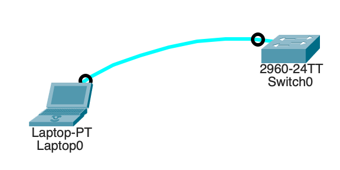
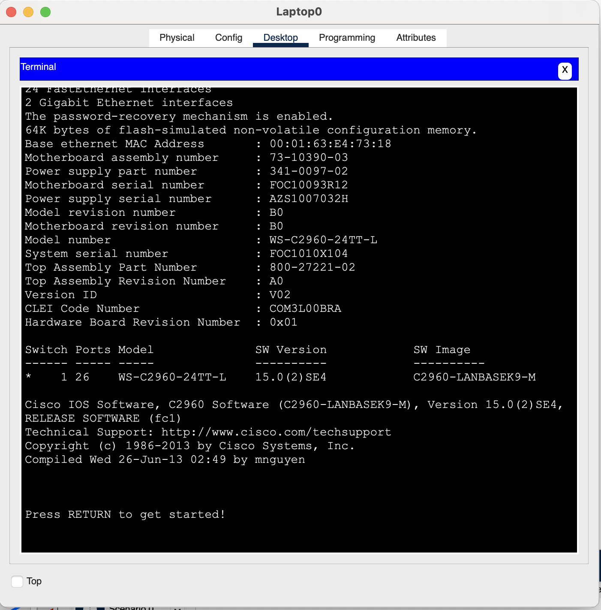
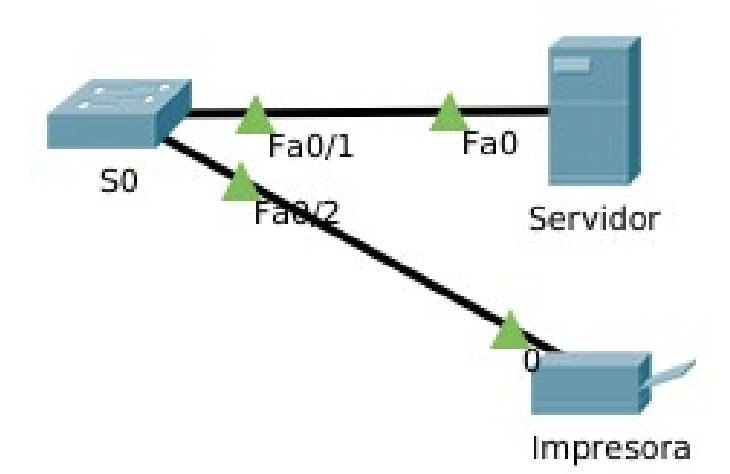
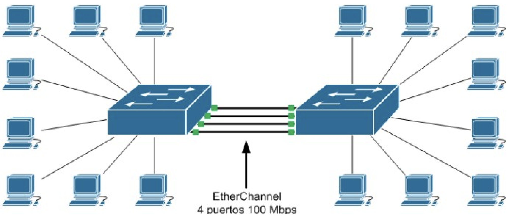
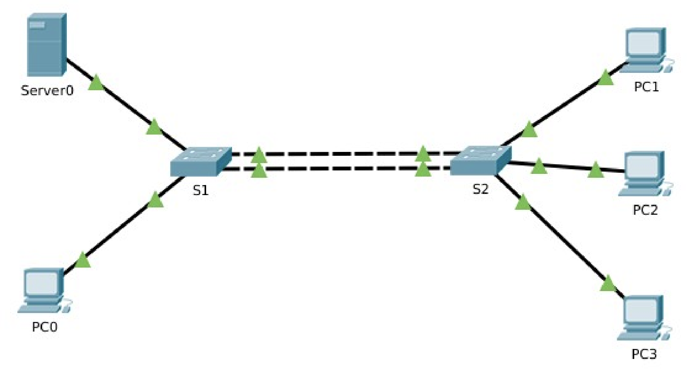
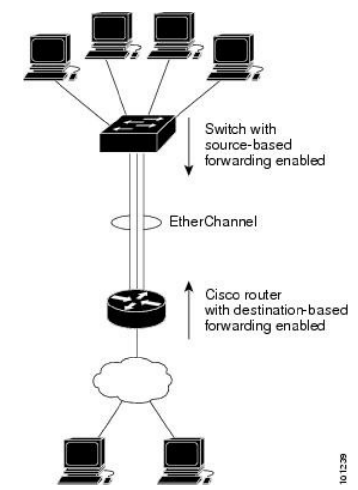
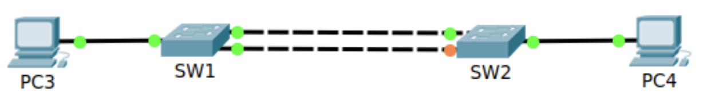
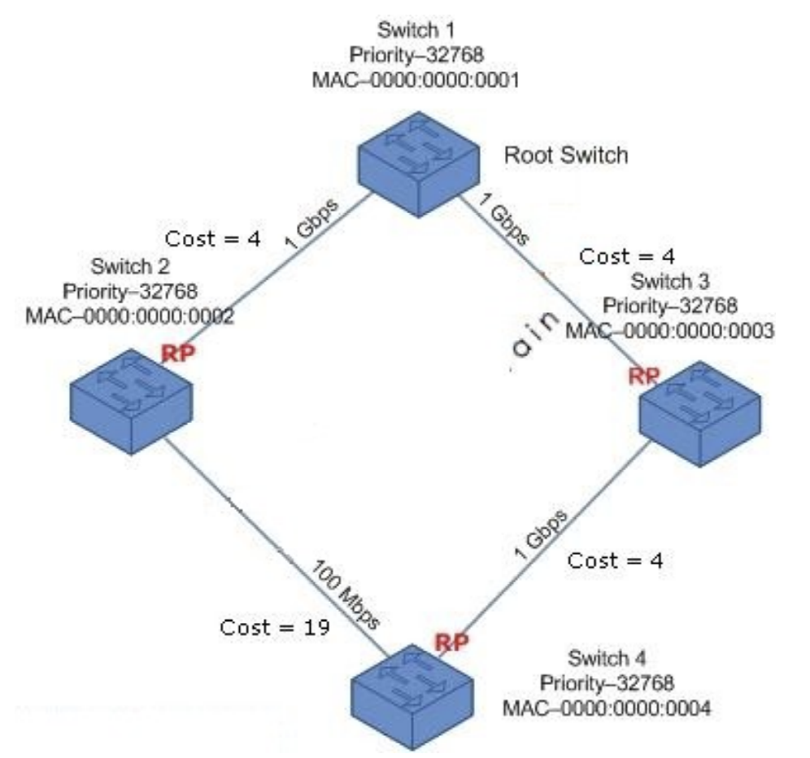
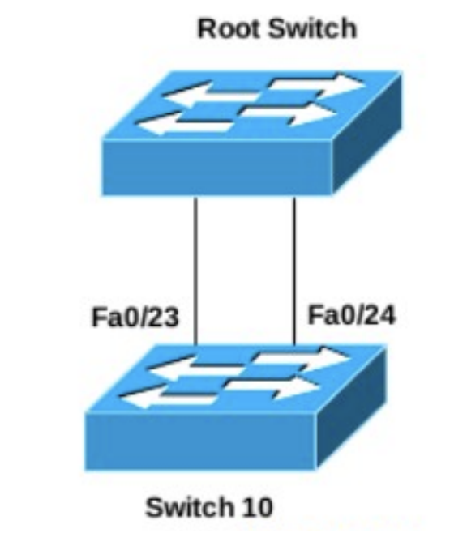
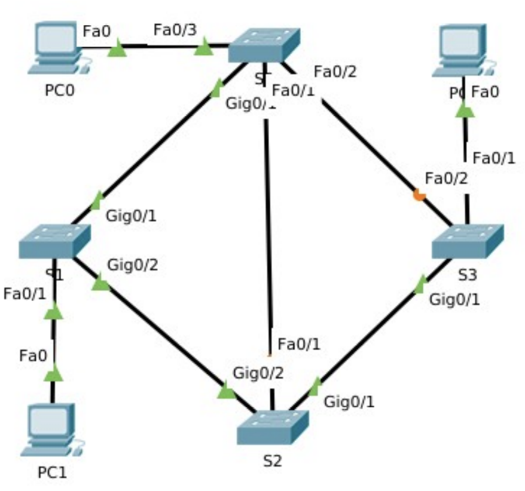

# Unidad 3 - Configuración y administración de conmutadores

## Introducción

En el modelo OSI hay dos capas tan estrechamente relacionadas que, en el modelo TCP/IP, se consideran esencialmente una sola capa. Estas son la capa de enlace de datos y la capa física en el modelo OSI; en el modelo de Internet, se conocen conjuntamente como la capa de acceso a la red.

La capa de enlace de datos del modelo OSI (Capa 2) tiene las siguientes responsabilidades:

- **Detección y corrección de errores**: Su función principal es identificar y corregir todos los errores que puedan ocurrir en la línea de comunicación dentro de la misma red.
- **Control de flujo**: Se asegura de que un emisor rápido no sature a un receptor más lento, evitando así la pérdida innecesaria de datos.
- **Gestión del medio compartido**: En redes donde existe un único medio compartido para la transmisión de información, esta capa se encarga de distribuir su uso entre los diferentes nodos.

En la notación de la capa 2, los dispositivos de red conectados al medio de transmisión se denominan nodos. Estos nodos son responsables de crear y reenviar tramas. La capa de enlace de datos OSI es la encargada de gestionar el intercambio de tramas Ethernet entre los nodos de origen y destino a través de un medio de red físico.

## Ethernet

Ethernet es la tecnología LAN más utilizada a nivel mundial. Opera en las capas de enlace de datos y física del modelo OSI, y corresponde a la capa de acceso al medio en el modelo TCP/IP. Es una familia de tecnologías de red definidas en los estándares IEEE 802.2 y 802.3.

Los estándares de Ethernet abarcan tanto los protocolos de la capa 2 como las tecnologías de la capa 1. Ethernet divide sus funciones en dos subcapas:

- **Subcapa LLC (Logical Link Control)**: Esta subcapa toma los datos del protocolo de red, generalmente un paquete IPv4, y añade información de control para facilitar su entrega al nodo de destino. En un ordenador, el LLC puede considerarse como el software del controlador de la tarjeta de red (NIC, Network Interface Card).
- **Subcapa MAC (Media Access Control)**: Es la subcapa inferior de la capa de enlace de datos y se implementa en hardware, usualmente en la tarjeta de red del ordenador.

<center>{ width="700" }</center>

La subcapa MAC de Ethernet tiene dos funciones principales:

- **Encapsulación de datos**: Este proceso incluye la creación de tramas antes de la transmisión y su desensamblaje al recibirlas. Para formar la trama, la capa MAC añade un encabezado y una cola al paquete de la capa de red, que ya contiene la información de control añadida por la subcapa LLC.
- **Control de acceso al medio**: Es responsable de colocar las tramas en el medio de transmisión (en el origen) y de extraerlas (en el destino). Esta subcapa se comunica directamente con la capa física. A medida que los paquetes se transfieren desde el host de origen al de destino, suelen atravesar diferentes redes físicas que pueden incluir diversos tipos de medios de transmisión, como cables de cobre, fibra óptica y tecnologías inalámbricas. El control de acceso al medio es el conjunto de técnicas que gestionan cómo se colocan y extraen las tramas del medio físico de transmisión.

### Métodos de control de acceso al medio

Algunas topologías de red comparten un medio de transmisión común entre varios nodos, conocidas como redes de acceso múltiple. Las LAN Ethernet con topología en bus o en estrella que utilizan concentradores (hubs) y las WLAN son ejemplos de este tipo de red. En estas redes, varios dispositivos pueden intentar enviar y recibir datos simultáneamente utilizando los mismos medios de red.

Para gestionar el acceso al medio compartido, se requieren reglas que definan cómo los nodos comparten el medio de transmisión físico. Existen dos métodos básicos de control de acceso al medio para medios compartidos:

- **Acceso por contención**: Todos los nodos en modo half-duplex compiten por el uso del medio, pero solo un dispositivo puede transmitir a la vez. Si dos dispositivos transmiten simultáneamente, se produce una colisión, y existe un proceso para manejar esta situación. Las LAN Ethernet que utilizan hubs y las WLAN son ejemplos de este método.
- **Acceso controlado**: Cada nodo tiene su turno asignado para utilizar el medio. Aunque este tipo de redes determinísticas garantizan el acceso ordenado, no son eficientes, ya que un dispositivo debe esperar su turno para transmitir. Las antiguas LAN de Token Ring con topología en anillo son ejemplos de este método.

Por defecto, los switches Ethernet operan en modo dúplex completo. Esto permite que el switch y el dispositivo conectado envíen y reciban datos simultáneamente, eliminando la necesidad de implementar métodos de control de acceso al medio.

### La trama Ethernet

Anteriormente, mencionamos que la unidad de datos del protocolo en la capa de enlace se conoce como trama. La capa de enlace de datos prepara los paquetes para su transmisión a través de los medios físicos encapsulándolos con un encabezado y un tráiler, formando así una trama completa. Esta trama se compone de tres partes fundamentales:

- Encabezado: Contiene información de direccionamiento y control necesaria para el envío y la recepción.
- Datos: Corresponde a la Unidad de Datos de Protocolo (PDU) de nivel 3, generalmente un paquete IP.
- Tráiler: Incluye información para la detección y posible corrección de errores.

<center>{ width="700" }</center>

El tamaño de una trama Ethernet varía entre un mínimo de 64 bytes y un máximo de 1518 bytes. Los campos específicos de una trama Ethernet son los siguientes:

**Encabezado**

- Preámbulo y Delimitador de Inicio de Trama (SFD): Ocupan 7 y 1 byte respectivamente y se utilizan para sincronizar al receptor y señalar el comienzo de una nueva trama.
- Dirección MAC de Destino: 6 bytes que identifican al receptor de la trama.
- Dirección MAC de Origen: 6 bytes que identifican al emisor de la trama.
- Tipo Ether (Ethertype): 2 bytes que indican el protocolo de nivel superior encapsulado dentro de la trama, como IPv4 o IPv6.

**Datos**

- Carga Útil: Varía entre 46 y 1500 bytes y contiene la información que se desea transmitir. Es la PDU de nivel superior, comúnmente un paquete IPv4.

**Tráiler**

- Secuencia de Verificación de Trama (FCS): 4 bytes dedicados a la detección de errores en la trama. Utiliza un Código de Redundancia Cíclica (CRC) que aplica una fórmula matemática al contenido de la trama para verificar su integridad.

### Dirección MAC

Una dirección MAC en Ethernet es un número binario de 48 bits, habitualmente representado mediante 12 dígitos hexadecimales (cada dígito hexadecimal equivale a 4 bits). Esta dirección se divide en dos partes:

- **Identificador Único de Organización (OUI)**: Los primeros 3 bytes (6 dígitos hexadecimales) que identifican al fabricante de la tarjeta de red. Cada fabricante posee un OUI único asignado.
- **Identificador de Dispositivo**: Los últimos 3 bytes, asignados por el fabricante, que aseguran que cada dirección MAC sea única para un dispositivo en particular.

No existen dos direcciones MAC idénticas; cada una es exclusiva para un dispositivo específico. Los fabricantes se encargan de que los tres últimos bytes sean diferentes para cada dispositivo, y cada uno tiene un OUI distinto.

Las direcciones MAC se expresan como seis pares de valores hexadecimales, donde cada par representa un byte. Por ejemplo, una dirección MAC puede ser 00-18-DE-DD-A7-B2. Generalmente, se utilizan guiones o dos puntos para separar cada byte. Existen tres tipos principales de direcciones MAC:

- **Unidifusión**: Es una dirección MAC única utilizada cuando se envía una trama desde un solo dispositivo emisor hacia un solo dispositivo receptor.
- **Difusión**: Una trama dirigida a una dirección de difusión será recibida y procesada por todos los hosts de esa red local (dominio de difusión). La dirección MAC de difusión es FF-FF-FF-FF-FF-FF en hexadecimal, lo que equivale a 48 unos en binario.
- **Multidifusión**: Permiten que un dispositivo de origen envíe una trama a un grupo específico de dispositivos. Una dirección MAC de multidifusión asociada a una dirección de multidifusión IPv4 comienza con 01-00-5E en hexadecimal. El resto de la dirección se forma convirtiendo los 23 bits inferiores de la dirección IP del grupo de multidifusión en seis dígitos hexadecimales.

Las direcciones MAC no se asignan mediante software; a menudo se les llama direcciones físicas porque están grabadas físicamente en la memoria ROM de la tarjeta de red. Es decir, la dirección está codificada de forma permanente en el chip ROM. Cualquier dispositivo que pueda ser el origen o destino de una trama Ethernet debe tener una dirección MAC asignada. Esto incluye computadoras, servidores, impresoras, dispositivos móviles y routers.

Estas direcciones físicas no indican a qué red está conectado el dispositivo. Si el dispositivo se mueve a otra red o subred, continúa operando con la misma dirección física sin necesidad de cambios.

### Switches

Un switch, también conocido como conmutador, es un dispositivo de interconexión utilizado para conectar equipos en red, formando una red de área local (LAN). Sus especificaciones técnicas cumplen con el estándar Ethernet. En la actualidad, las redes locales cableadas se basan en Ethernet, empleando una topología en estrella donde el switch actúa como el elemento central de esta configuración.

El switch opera en la capa 2 del modelo OSI y en la capa de acceso a red del modelo de Internet. Al ser un dispositivo diseñado para redes Ethernet, trabaja exclusivamente con tramas y no tiene conocimiento del protocolo que se transmite en la sección de datos de la trama, como podría ser un paquete IPv4. Las decisiones de reenvío que toma el switch se basan únicamente en las direcciones MAC Ethernet de la capa de enlace.

La cantidad de dispositivos que se pueden conectar a un switch depende del número de puertos que este posea. Existen switches con 4, 8, 16, 32 y hasta 48 puertos. Cada puerto puede conectar un dispositivo como un ordenador, impresora, servidor, entre otros. Si se requiere expandir la red para incluir más nodos, es posible conectar un switch a un puerto de otro switch, aumentando así el número de puertos disponibles. Todos los dispositivos conectados a estos switches formarían parte de la misma red local.

#### Tabla de direcciones MAC

Un switch crea y mantiene una tabla de direcciones MAC que utiliza para decidir cómo reenviar una trama. Cada vez que recibe una trama, consulta esta tabla para determinar por cuál puerto debe enviarla. Esta tabla puede tener tantas entradas como puertos tiene el switch y asocia un número de puerto con la dirección MAC del dispositivo conectado a ese puerto. Básicamente, un switch realiza dos operaciones principales:

- **Aprendizaje (Examinar la dirección MAC de origen)**: Cada vez que llega una trama al switch, este examina la dirección MAC de origen de la trama y el número de puerto por el que llegó. Si la dirección MAC de origen no está en la tabla, se agrega junto con el número de puerto de entrada. Si ya existe, el switch actualiza el temporizador de esa entrada. Por defecto, la mayoría de los switches Ethernet mantienen una entrada en la tabla durante cinco minutos. Si la dirección MAC de origen está en la tabla pero asociada a un puerto diferente, el switch la trata como una nueva entrada y reemplaza la anterior con el número de puerto más reciente.
- **Reenvío (Examinar la dirección MAC de destino)**: A continuación, si la dirección MAC de destino es una dirección de unidifusión, el switch busca en la tabla una coincidencia con la dirección MAC de destino de la trama. Si la encuentra, reenvía la trama por el puerto especificado. Si no está en la tabla, el switch reenvía la trama por todos los puertos excepto el de entrada, lo que se conoce como unidifusión desconocida. Si la dirección MAC de destino es de difusión o multidifusión, la trama también se envía por todos los puertos excepto el de entrada.

Cuando un dispositivo tiene una dirección IP en una red remota, la trama Ethernet no puede enviarse directamente al dispositivo de destino. En su lugar, la trama Ethernet se envía a la dirección MAC del gateway predeterminado, es decir, el router.

#### Métodos de reenvío de tramas

Un switch puede reenviar una trama utilizando dos métodos:

- **Almacenamiento y envío (Store-and-Forward)**: El switch recibe la trama completa y calcula el CRC (Código de Redundancia Cíclica). Si este es válido, busca la dirección de destino para determinar la interfaz de salida y luego envía la trama por el puerto adecuado. Si se detecta un error en la trama, el switch la descarta. Este proceso de eliminar tramas con errores reduce el ancho de banda consumido por datos dañados.
- **Método de corte (Cut-Through)**: El switch comienza a enviar la trama antes de recibirla por completo. Como mínimo, debe leer la dirección de destino antes de poder reenviarla. La dirección MAC de destino se encuentra en los primeros 6 bytes de la trama después del preámbulo. El switch busca esta dirección en su tabla, determina el puerto de salida y reenvía la trama a su destino a través del puerto designado. En este método, el switch no realiza ninguna verificación de errores en la trama.

#### Métodos de transmisión y velocidad

Dos de los parámetros más básicos de un switch son el ancho de banda y los parámetros de dúplex para cada puerto individual. Es crucial que los parámetros de dúplex y ancho de banda coincidan entre el puerto del switch y los dispositivos conectados, como un PC u otro switch.

Existen dos tipos de modos de dúplex utilizados en comunicaciones Ethernet:

- **Dúplex completo (Full-Duplex)**: Ambos extremos de la conexión pueden enviar y recibir datos simultáneamente.
- **Dúplex medio (Half-Duplex)**: Solo uno de los extremos de la conexión puede enviar datos a la vez.

El ancho de banda dependerá del tipo de switch y de la tarjeta de red (NIC) del dispositivo conectado. Hay switches que operan a 10, 100 y 1000 Mbps.

La autonegociación es una función opcional presente en la mayoría de los switches Ethernet y NIC, que permite que dos dispositivos intercambien automáticamente información sobre velocidad y capacidades de dúplex. El switch y el dispositivo conectado seleccionan el modo de mayor rendimiento disponible. Si ambos dispositivos soportan la funcionalidad, se elige dúplex completo junto con el ancho de banda más alto común.

#### MDIX automático

Es importante utilizar el tipo de cable correcto para cada puerto del switch. En el pasado, las conexiones entre dispositivos específicos, como switch a switch, switch a router, switch a host y router a host, requerían el uso de tipos de cable específicos (cruzado o directo). Actualmente, la mayoría de los switches cuentan con la función MDIX automático, que permite al switch detectar el tipo de cable conectado al puerto y configurar las interfaces de manera adecuada. Por lo tanto, se puede utilizar un cable directo o cruzado para conectar a un puerto 10/100/1000 de cobre en el switch, independientemente del tipo de dispositivo en el otro extremo de la conexión.

### Protocolo ARP

En una red LAN Ethernet, cada dispositivo cuenta con dos direcciones asignadas:

- **Dirección física (dirección MAC)**: Utilizada para las comunicaciones entre tarjetas de red Ethernet (NIC) dentro de la misma red.
- **Dirección lógica (dirección IP)**: Empleada para enviar paquetes desde el origen inicial hasta el destino final.

Las direcciones IP se utilizan para identificar el origen y el destino de los paquetes. La dirección IP de destino puede pertenecer a la misma red IP que el origen o encontrarse en una red remota.

Por otro lado, las direcciones MAC de Ethernet tienen un propósito distinto: se usan para entregar la trama, que contiene el paquete IP encapsulado, de un dispositivo a otro dentro de la misma red. Si la dirección IP de destino está en la misma red, la dirección MAC de destino en la trama será la del dispositivo final.

<center>{ width="700" }</center>

En la figura anterior, observamos que la trama Ethernet de capa 2 incluye lo siguiente:

- **Dirección MAC de destino**: Es la dirección MAC de la NIC Ethernet del servidor de archivos.
- **Dirección MAC de origen**: Corresponde a la dirección MAC de la NIC Ethernet del PC-A.

El paquete IP de capa 3 contiene:

- **Dirección IP de origen**: Es la dirección IP del PC-A, el origen inicial.
- **Dirección IP de destino**: Es la dirección IP del servidor de archivos, el destino final.

Sin embargo, cuando la dirección IP de destino está en una red remota, la dirección MAC de destino en la trama es la del gateway (puerta de enlace) predeterminado del host.

Cuando el gateway recibe una trama Ethernet, desencapsula la información de capa 2. A través de la dirección IP de destino, determina el siguiente dispositivo en la ruta y encapsula el paquete IP en una nueva trama de enlace de datos para la interfaz de salida. En cada enlace a lo largo del camino, el paquete IP se encapsula en una trama específica para la tecnología de enlace de datos correspondiente a ese enlace. Si el siguiente salto es el destino final, la dirección MAC de destino será la de la NIC Ethernet de ese dispositivo.

<center>{ width="700" }</center>

Entonces, ¿cómo se asocian las direcciones IPv4 de los paquetes con las direcciones MAC en cada enlace durante el trayecto hacia el destino? Esto se logra mediante un proceso conocido como Protocolo de Resolución de Direcciones (ARP).

Para determinar la dirección MAC de destino, el dispositivo utiliza el protocolo ARP, que proporciona dos funciones esenciales:

- Resolución de direcciones IPv4 a direcciones MAC.
- Mantenimiento de una tabla de asignaciones.

#### Resolución de direcciones IPv4

Cuando un paquete es enviado a la capa de enlace de datos para ser encapsulado en una trama Ethernet, el dispositivo consulta una tabla en su memoria para encontrar la dirección MAC asociada a la dirección IPv4 correspondiente. Esta tabla se conoce como tabla ARP o caché ARP.

El dispositivo emisor busca en su tabla ARP la dirección IPv4 de destino para obtener la dirección MAC correspondiente:

- Si la dirección IPv4 de destino está en la misma red que la dirección IPv4 de origen, el dispositivo busca en la tabla ARP la dirección IPv4 de destino.
- Si la dirección IPv4 de destino está en una red diferente a la de origen, el dispositivo busca en la tabla ARP la dirección IPv4 del gateway (puerta de enlace) predeterminado.

En ambos casos, se realiza una búsqueda para encontrar la dirección MAC asociada a la dirección IPv4. Cada entrada en la tabla ARP vincula una dirección IPv4 con una dirección MAC; esta relación se denomina asignación. La tabla ARP almacena temporalmente estas asignaciones en caché para los dispositivos de la misma LAN.

Si el dispositivo encuentra la dirección IPv4 en la tabla, utiliza la dirección MAC correspondiente como la dirección MAC de destino en la trama. Si no hay una entrada, el dispositivo envía una solicitud ARP.

#### Funcionamiento del protocolo ARP

Se envía una solicitud ARP cuando un dispositivo necesita conocer la dirección MAC asociada a una dirección IPv4 y no tiene una entrada para esa dirección en su tabla ARP.

El protocolo ARP opera en la capa de enlace de datos, por lo que los mensajes ARP se encapsulan directamente dentro de una trama Ethernet. El mensaje de solicitud ARP incluye:

- **Dirección IPv4 objetivo**: La dirección IPv4 del dispositivo cuya dirección MAC se desea conocer.
- **Dirección MAC objetivo**: Esta es la dirección MAC desconocida; en la solicitud ARP, este campo está vacío.

La solicitud ARP se encapsula en una trama Ethernet con el siguiente encabezado:

- **Dirección MAC de destino**: Es la dirección MAC de difusión (FF:FF:FF:FF:FF:FF), lo que obliga a que todos los nodos de la LAN acepten y procesen la solicitud ARP.
- **Dirección MAC de origen**: La dirección MAC del dispositivo que envía la solicitud ARP.
- **Tipo**: Un campo con el valor 0x806, que indica al receptor que los datos de la trama deben ser procesados por ARP.

Dado que las solicitudes ARP son de difusión, el switch las envía por todos los puertos excepto por el que las recibió. Cada dispositivo en la red recibe y procesa la solicitud ARP para verificar si la dirección IPv4 objetivo coincide con la suya. Si coincide, ese dispositivo será el único que envíe una respuesta ARP. Los demás dispositivos no responden.

El mensaje de respuesta ARP incluye:

- **Dirección IPv4 del remitente**: La dirección IPv4 del dispositivo cuya dirección MAC se solicitó.
- **Dirección MAC del remitente**: La dirección MAC buscada por el dispositivo que hizo la solicitud ARP; es decir, el objetivo del proceso.

La respuesta ARP se encapsula en una trama Ethernet con el siguiente encabezado:

- **Dirección MAC de destino**: La dirección MAC del dispositivo que envió la solicitud ARP.
- **Dirección MAC de origen**: La dirección MAC del dispositivo que responde.
- **Tipo**: Un campo con el valor 0x806, indicando que los datos de la trama deben ser procesados por ARP.

Solo el dispositivo que envió la solicitud ARP inicial recibe la respuesta ARP en unidifusión. Una vez que recibe la respuesta, agrega la dirección IPv4 y su correspondiente dirección MAC a su tabla ARP. A partir de ese momento, los paquetes destinados a esa dirección IPv4 pueden ser encapsulados en tramas con la dirección MAC correcta.

Cuando la dirección IPv4 de destino no está en la misma red que la dirección IPv4 de origen—es decir, el paquete está dirigido a otra red—el dispositivo de origen debe enviar la trama al gateway predeterminado, que es la interfaz del router local.

La dirección IPv4 del gateway se almacena en la configuración de red de los hosts. Cuando un host crea un paquete, compara su propia dirección IPv4 con la dirección IPv4 de destino para determinar si están en la misma red. Si no lo están, el dispositivo busca en su tabla ARP una entrada que contenga la dirección IPv4 del gateway. Si no existe dicha entrada, utiliza el proceso ARP para determinar la dirección MAC del gateway, tal como se describió anteriormente.

Cada dispositivo tiene un temporizador en su caché ARP que elimina las entradas que no se han utilizado durante un período específico. Este tiempo varía según el sistema operativo del dispositivo; por ejemplo, algunos sistemas Windows mantienen las entradas ARP en caché durante dos minutos.

Además, es posible utilizar comandos para eliminar manualmente todas o algunas de las entradas de la tabla ARP. Después de eliminar una entrada, el proceso de enviar una solicitud ARP y recibir una respuesta ARP debe repetirse para recrear la entrada en la tabla ARP.

### Versiones de Ethernet

Hace mucho tiempo que Ethernet se convirtió en el protocolo estándar en nivel de enlace de las LAN. Durante todo este tiempo la tecnología de red ha evolucionado y Ethernet con ella, permitiendo la instalación de una red Ethernet con diferentes topologías, tipos de cableado y velocidades de transmisión. Los principales se resumen en la siguiente tabla.

| Tecnología | Velocidad de transmisión | Tipo de cable | Distancia máxima | Topología |
| ------- | ------ | ------ | ------ | ------ |
| 10Base2 | 10 Mbit/s | Coaxial | 185 m | Bus (Conector T) |
| 10BaseT | 10 Mbit/s | Par trenzado | 100 m | Estrella (Hub o Switch) |
| 10BaseF | 10 Mbit/s | Fibra óptica | 2000 m | Estrella (Hub o Switch) |
| 100BaseT4 | 100 Mbit/s | Par Trenzado (categoría 3UTP) | 100 m | Estrella, half-duplex y full-duplex |
| 100BaseTX | 100 Mbit/s | Par Trenzado (categoría 5UTP) | 100 m | Estrella, half-duplex y full-duplex |
| 100BaseFX | 100 Mbit/s | Fibra óptica | 2000 m | Estrella y full-duplex |
| 1000BaseT | 1000 Mbit/s | Par Trenzado (categoría 5e o 6UTP) | 100 m | Estrella y full-duplex |
| 1000BaseSX | 1000 Mbit/s | Fibra óptica (multimodo) | 550 m | Estrella y full-duplex |
| 1000BaseLX | 1000 Mbit/s | Fibra óptica (monomodo) | 5000 m | Estrella y full-duplex |

## Configuración de switches

La mayor parte de los switches son autoconfigurables. Al conectar dispositivos de red a sus puertos, comienzan a operar de manera independiente, gestionando el flujo de datos en la capa de enlace y dirigiéndolo hacia los recursos conectados en la red. No obstante, existen switches más avanzados que incorporan un sistema operativo y/o una aplicación web para su configuración. Entre estos, los más reconocidos son los de la marca Cisco, una multinacional tecnológica responsable de más del 60% de los routers en Internet.

Los switches de Cisco ejecutan el sistema operativo Cisco IOS y permiten una configuración manual para adaptarse mejor a las necesidades específicas de la red. Esto incluye ajustar parámetros como la velocidad, el ancho de banda y la seguridad de los puertos. Además, los switches Cisco pueden ser administrados tanto localmente como de forma remota. Para gestionar un switch de manera remota, es necesario configurarlo con una dirección IP y una puerta de enlace predeterminada.

### Secuencia de arranque de un switch

Al encenderse un switch Cisco, este sigue la siguiente secuencia de arranque:

1. **Ejecución del POST (Power-On Self-Test)**: El switch inicia un programa de autodiagnóstico almacenado en la memoria ROM. Este POST verifica el correcto funcionamiento de la CPU, la memoria RAM y la sección del dispositivo flash que contiene el sistema de archivos flash.
2. **Carga del cargador de arranque**: Tras completar el POST exitosamente, el switch carga el software del cargador de arranque. Este pequeño programa, también almacenado en la ROM, se ejecuta inmediatamente después del POST.
3. **Inicialización de la CPU a bajo nivel**: El cargador de arranque realiza la inicialización básica de la CPU, configurando los registros que controlan la asignación de la memoria física, la cantidad de memoria disponible y su velocidad.
4. **Montaje del sistema de archivos flash**: El cargador de arranque inicia el sistema de archivos flash presente en la placa del sistema.
5. **Carga del sistema operativo IOS**: Finalmente, el cargador de arranque localiza y carga en la memoria una imagen del software del sistema operativo IOS, transfiriendo el control del switch a este. La imagen de Cisco IOS es un archivo con extensión .bin.
6. **Inicio de las interfaces por IOS**: El sistema operativo IOS activa las interfaces utilizando los comandos especificados en el archivo de configuración de arranque, el cual está almacenado en la NVRAM.

### Indicadores led del switch

Un switch Cisco tiene un conjunto de indicadores led que muestran información sobre el estado y el rendimiento del switch. Dependiendo del modelo habrá diferentes indicadores LEDs con un diverso rango de significados.

<center>{ width="700" }</center>

En la imagen anterior aparecen los indicadores de la serie Catalyst 2960. Veamos en detalle cuáles son:

- Sistema (System): Indica que el switch está encendido y funcionando de manera correcta.
    - Si el LED es verde, significa que el switch opera normalmente.
	- Un LED de color ámbar indica que está recibiendo energía pero no funciona adecuadamente.
	- Si el LED está apagado, quiere decir que el switch no recibe energía eléctrica porque está desconectado o el dispositivo está dañado.

- Sistema de Alimentación Redundante (RPS): Este LED muestra el estado del sistema RPS, una característica de Cisco que protege al switch de fallos de corriente que podrían reiniciarlo o dañarlo.
	- Si está apagado, el switch no está conectado a un sistema RPS.
	- Un LED verde indica que el switch está conectado a un sistema RPS y que este está listo para suministrar energía en caso de fallo de alimentación.
	- Si el LED verde parpadea, significa que el RPS está conectado pero está suministrando energía a otro dispositivo.
	- Un LED ámbar indica que el switch está en modo de espera o presenta una condición de fallo.
	- Si la luz ámbar parpadea, entonces la alimentación del switch ha fallado y el RPS está proporcionando energía.

Los siguientes indicadores LED se utilizan para seleccionar la información que muestran los LEDs de cada puerto del switch. Al presionar el botón Mode repetidamente, se selecciona uno de ellos, y luego, los LEDs de cada puerto mostrarán información relacionada con el modo elegido.

- Estado del Puerto (Port Status): Un LED verde indica que se ha seleccionado el modo de estado del puerto, que es el modo predeterminado. En este caso, cada LED en los puertos del switch muestra:
	- Si está apagado, no hay enlace; es decir, no hay ningún dispositivo conectado o hay un fallo en el cable.
	- Una luz verde indica que el puerto está transmitiendo y recibiendo datos.
	- Si alterna entre verde y ámbar, hay un fallo en el enlace.
	- Una luz ámbar señala que el puerto ha sido bloqueado.

- Dúplex del Puerto (Port Duplex): Este indicador muestra si el modo dúplex del puerto está activado. En este modo, los LEDs de los puertos indican:
	- LEDs apagados: el puerto está en modo half-duplex.
	- LEDs verdes: el puerto está en modo full-duplex.

- Velocidad del Puerto (Port Speed): Indica la velocidad a la que operan los puertos del switch. En este modo, los LEDs de los puertos muestran:
	- Sin luz: el puerto opera a 10 Mb/s.
	- Luz verde: opera a 100 Mb/s.
	- Luz verde parpadeante: el puerto opera a 1 Gb/s.

- Power over Ethernet (PoE): Este indicador muestra información sobre el estado de PoE. Los LEDs de los puertos pueden indicar:
	- Apagado: el dispositivo conectado al puerto recibe energía de su propia alimentación de CA.
	- Verde: el puerto está suministrando energía al dispositivo conectado.
	- Ámbar: el puerto tiene PoE deshabilitado; por defecto, está habilitado.
	- Alternando entre verde y ámbar: PoE está siendo denegado, generalmente porque el dispositivo requiere más energía de la que el switch puede proporcionar.
	- Ámbar parpadeante: PoE no está disponible debido a un fallo.

### Archivos de configuración

Existen dos archivos principales que se utilizan para almacenar la configuración de los dispositivos:

- **startup-config**: Este archivo se guarda en la memoria de acceso aleatorio no volátil (NVRAM) y contiene todos los comandos que el IOS ejecutará durante el arranque o reinicio. La NVRAM es una memoria que mantiene su contenido incluso cuando el dispositivo está apagado.

- **running-config**: Este archivo reside en la memoria de acceso aleatorio (RAM) y refleja la configuración actual del dispositivo. Cualquier modificación realizada en la configuración en ejecución afecta de inmediato al funcionamiento del dispositivo Cisco. La RAM es una memoria volátil, por lo que pierde todo su contenido cuando el dispositivo se apaga o reinicia.

Para visualizar el archivo de configuración en ejecución, se puede utilizar el comando show running-config en el modo EXEC privilegiado. Si se desea ver el archivo de configuración de inicio, se ejecuta el comando show startup-config en el mismo modo.

Si el dispositivo pierde energía o se reinicia, todos los cambios de configuración se perderán a menos que hayan sido guardados. Para conservar los cambios realizados en la configuración en ejecución en el archivo de configuración de inicio, se utiliza el comando copy running-config startup-config en el modo EXEC privilegiado.

En caso de que los cambios efectuados en la configuración en ejecución no produzcan el efecto deseado y el archivo running-config aún no haya sido guardado, es posible restablecer el dispositivo a su configuración anterior eliminando los comandos modificados o recargando el dispositivo con el comando reload en el modo EXEC privilegiado para restaurar la configuración de inicio.

La desventaja de usar el comando reload para eliminar una configuración en ejecución no guardada es que el dispositivo estará fuera de servicio durante un breve período, lo que ocasiona un tiempo de inactividad en la red.

Al iniciar una recarga, el IOS detecta que la configuración en ejecución tiene cambios no guardados en comparación con la configuración de inicio. Aparecerá un mensaje preguntando si se desean guardar los cambios. Para descartarlos, se debe introducir n o no.

Si, por el contrario, se han guardado cambios no deseados en la configuración de inicio, puede ser necesario eliminar todas las configuraciones. Esto implica borrar la configuración de inicio y reiniciar el dispositivo. La configuración de inicio se elimina utilizando el comando erase startup-config en el modo EXEC privilegiado.

Después de borrar la configuración de inicio de la NVRAM, se debe recargar el dispositivo para eliminar el archivo de configuración en ejecución actual de la RAM. Al reiniciarse, el switch cargará la configuración de inicio predeterminada que venía originalmente con el dispositivo.

### Verificación de la configuración del switch

Disponemos de algunas de las opciones del comando show que son útiles para verificar las características configurables comunes de un switch. Se exponen en la siguiente tabla:

| Comando | Descripción |
| ------ | ------ |
| show startup-config | Muestra la configuración de inicio |
| show running-config | Muestra la configuración de funcionamiento actual |
| show flash | Muestra información sobre el sistema de archivos flash |
| show version | Muestra el estado del hardware y software del sistema |
| show history | Muestra el historial de comandos introducidos |

## Métodos de acceso al switch

Para acceder al switch para su configuración, contamos con varios métodos que nos permiten conectarnos y abrir una sesión de trabajo. Aunque los switches son dispositivos de nivel de enlace, es necesario que tengan asignados un nombre de host y una dirección IP para poder configurarlos a través de diferentes métodos de acceso.

A continuación, veremos cómo asignar un nombre de host y una dirección IP a un switch, y luego exploraremos las distintas formas disponibles para acceder al switch.

### Nombres de dispositivo

Al configurar un dispositivo de red, uno de los primeros pasos es asignarle un nombre de dispositivo único o nombre de host. Los nombres de host aparecen en el indicador del CLI, pueden utilizarse en varios procesos de autenticación entre dispositivos y deben incluirse en los mapas de red.

Si no se configura explícitamente un nombre para el dispositivo, Cisco IOS asigna un nombre predeterminado de fábrica. En el caso de los switches Cisco IOS, el nombre predeterminado es Switch. Si todos los dispositivos de red mantuvieran el nombre predeterminado, sería difícil identificar cada uno de manera individual. Por ejemplo, al acceder a un dispositivo remoto mediante SSH, es crucial confirmar que se está conectado al dispositivo correcto.

Elegir nombres adecuados facilita recordar, analizar e identificar los dispositivos en la red. Los requisitos para los nombres son:

- Comenzar con una letra.
- No contener espacios.
- Terminar con una letra o un dígito.
- Contener letras, dígitos o guiones medios.
- Tener una longitud máxima de 64 caracteres.

Los nombres de host utilizados en el IOS del dispositivo distinguen entre mayúsculas y minúsculas. Para configurar un nombre de host en el dispositivo se deben seguir los siguientes pasos:
	
1. Iniciar sesión en el dispositivo utilizando uno de los métodos mencionados anteriormente.
2. Acceder al modo privilegiado con el comando **enable**.
3. Acceder al modo de configuración global con el comando **configure terminal**.
4. Ejecutar el comando **hostname** seguido del nombre deseado para el switch.

### Interfaz virtual del switch (SVI)

Los switches son dispositivos de capa 2 (nivel de enlace) que disponen de puertos físicos para conectar diferentes equipos. Estos puertos no son compatibles con las direcciones IP de capa 3 (nivel de red). Para asignar una dirección IP a un switch, se utilizan una o más interfaces virtuales de switch (SVI). Estas SVI son interfaces virtuales porque no tienen hardware físico asociado en el dispositivo; se crean mediante software.

La SVI permite administrar un switch de forma remota a través de la red utilizando una conexión IPv4. Cada switch viene configurado por defecto con una SVI, que es la interfaz VLAN1. Por lo tanto, la dirección IP asignada a la SVI se utiliza para acceder al switch de manera remota. No es necesario tener una dirección IP para que el switch realice sus funciones básicas.

Para acceder al switch de forma remota, es necesario configurar una dirección IP y una máscara de subred en la SVI. Para configurar una SVI en un switch, ejecutaremos los siguientes comandos:

```
Switch>enable 
Switch#configure terminal
Enter configuration commands, one per line. End with CNTL/Z.
Switch(config)#interface vlan 1
Switch(config-if)#ip address 192.168.20.1 255.255.255.0
Switch(config-if)#no shutdown

Switch(config-if)#
%LINK-5-CHANGED: Interface Vlan1, changed state to up

Switch(config-if)#
```

### Acceso mediante Telnet

Para abrir una sesión del IOS en un switch mediante Telnet tenemos previamente que configurar este método de acceso. Esta configuración implica dos pasos:

1. Establecer una dirección IP en el dispositivo, que para el caso de los switches ya la hemos visto en el apartado anterior asignando una dirección IP a la SVI.
2. Configurar una línea virtual VTY que veremos a continuación.

Las líneas de terminal virtual (VTY) habilitan el acceso remoto al dispositivo. La línea VTY, que se utilizan para acceder por Telnet o SSH, debe estar protegida mediante contraseña. Para ello ejecutamos los siguientes comandos:

```
Switch>enable 
Switch#configure terminal
Enter configuration commands, one per line. End with CNTL/Z.
Switch(config)#line vty 0 15
Switch(config-line)#password cisco
Switch(config-line)#login 
Switch(config-line)#exit 
Switch(config)#
```

Entramos al modo de línea VTY con el comando de configuración global line vty 0 15. Muchos switches de Cisco admiten hasta 16 líneas VTY que se numeran del 0 al 15. Luego, especificamos la contraseña de VTY con el comando password. Por último, habilitamos el acceso a VTY con el comando login. Una vez configurada una dirección IP y la línea virtual VTY podemos abrir una sesión con IOS mediante Telnet.

### Acceso remoto seguro por SSH

Telnet no es seguro, ya que los datos en sus paquetes se transmiten sin cifrar. Por este motivo, es especialmente recomendable habilitar SSH en los dispositivos para disponer de un método de acceso remoto seguro. Es posible configurar un dispositivo Cisco para que admita conexiones SSH. Para ello, debemos realizar tres acciones:
	
1. Configurar una dirección IP en una interfaz virtual (SVI).
2. Configurar SSH en el dispositivo Cisco.
3. Configurar el acceso a las interfaces virtuales.

Primero, el dispositivo debe tener asignada una dirección IP. Para lograr esto, es necesario configurar la interfaz virtual del switch.

```
Switch>enable
Switch#configure terminal
Enter configuration commands, one per line. End with CNTL/Z. Switch(config)#interface vlan 1

Switch(config-if)#ip address 192.168.20.1 255.255.255.0
Switch(config-if)#no shutdown

Switch(config-if)#
%LINK-5-CHANGED: Interface Vlan1, changed state to up

Switch(config-if)#
```

A continuación, se muestra la sucesión de comandos para habilitar SSH en el switch:

```
Switch>enable
Switch#configure terminal
Enter configuration commands, one per line. End with CNTL/Z.
Switch(config)#hostname S1
S1(config)#ip domain-name cisco.com
S1(config)#crypto key generate rsa
The name for the keys will be: S1.cisco.com
Choose the size of the key modulus in the range of 360 to 2048
for your
 General Purpose Keys. Choosing a key modulus greater than 512
may take
 a few minutes.
How many bits in the modulus [512]: 1024
% Generating 1024 bit RSA keys, keys will be non-exportable...
[OK]
S1(config)# username usuario secret cisco
*mar 1 1:13:48.23: %SSH-5-ENABLED: SSH 1.99 has been enabled
S1(config)# ip ssh version 2
S1(config)# 
```

1. Asigne un nombre de host único y configure el nombre de dominio de la red utilizando el comando ip domain-name en el modo de configuración global.
2. Es necesario generar claves secretas asimétricas para que el dispositivo pueda cifrar el tráfico SSH. Para crear la clave SSH, use el comando crypto key generate rsa en el modo de configuración global. Se le pedirá que especifique la longitud del módulo en bits. Tenga en cuenta que el tamaño del módulo determina la longitud de la clave y puede configurarse entre 360 y 2048 bits. Cuanto mayor sea el módulo, más segura será la clave, pero también aumentará el tiempo de cifrado y descifrado. La longitud mínima recomendada para el módulo es de 1024 bits.
3. Cree una entrada de nombre de usuario en la base de datos local utilizando el comando username en el modo de configuración global.
4. SSH admite las versiones 1 y 2. Al habilitar SSH, se muestra por defecto la versión 1.99. Podemos verificar esto con el comando show ip ssh en el modo EXEC privilegiado. Debido a que la versión 1 tiene vulnerabilidades conocidas, se recomienda habilitar únicamente la versión 2. Activamos la versión 2 de SSH utilizando el comando ip ssh version 2 en el modo de configuración global.

Por último hay que configurar las líneas de terminal virtual (VTY) que habilitan el acceso remoto al dispositivo por SSH. Para ello realizamos lo siguiente:

```
S1(config)# line vty 0 4
S1(config-line)# login local
S1(config-line)# transport input ssh
S1(config-line)# exit
S1(config)#
```

Los comandos anteriores hemos utilizado las cinco primeras líneas VTY (0 a 4) para acceso por SSH. Ahora se puede acceder remotamente al router solo con SSH. En la siguiente imagen se observa una conexión desde un PC conectado a un puerto del switch.

<center>{ width="350" }</center>

Para mostrar los datos de la versión y de configuración de SSH en el dispositivo que se configuró como servidor SSH, usamos el comando show ip ssh. En el ejemplo, se habilitó la versión 2 de SSH. Para revisar las conexiones SSH al dispositivo usamos el comando show ssh.

### Acceso por consola

Se trata de un puerto de administración que permite acceder al switch cuando no está conectado a la red. Este puerto ofrece un canal de gestión dedicado que se utiliza exclusivamente con fines de mantenimiento del dispositivo.

La ventaja de emplear un puerto de consola es que es posible acceder al dispositivo sin necesidad de realizar una configuración previa, a diferencia de lo que ocurre al acceder mediante Telnet o SSH. Sin embargo, presenta el inconveniente de que se requiere acceso físico al dispositivo para conectar un ordenador, equipado con un puerto serie RS232, al puerto de consola del switch utilizando un cable especial. Luego, se inicia una sesión con el IOS mediante un software de emulación de terminal como PuTTY desde el PC.

<center>{ width="700" }</center>

El cable de consola posee en un extremo un conector serial DB-9 que se conecta al puerto serie RS232 del PC, y en el otro extremo un conector RJ-45 que se enchufa al puerto de consola del dispositivo. En los equipos Cisco, contamos con un puerto de consola dedicado exclusivamente a fines administrativos.

<center>{ width="700" }</center>

Podemos probar una conexión mediante Cisco Packet Tracer. Si creamos el siguiente escenario en el que conectamos un portátil al switch 2960 con un cable de consola.

<center>{ width="400" }</center>

El ordenador portátil está conectado a través del puerto RS232 y el switch mediante el puerto de consola. Al acceder al portátil, en la pestaña “Escritorio”, seleccionamos “Terminal”. Aceptamos los parámetros de conexión predeterminados y hacemos clic en el botón “Aceptar”. Observaremos que se muestra la interfaz de texto del Cisco IOS.

<center>{ width="700" }</center>

Los parámetros de conexión por defecto para el software de emulación de terminal serían los siguientes:

- **Bits por segundo**: 9600.
- **Bits de datos**: 8.
- **Paridad**: ninguna.
- **Bits de parada**: 1.
- **Control de flujo**: ninguno.

### Contraseñas

Los dispositivos de red, incluso los enrutadores inalámbricos para uso doméstico, deben tener siempre contraseñas configuradas para limitar el acceso administrativo. El Cisco IOS puede configurarse para utilizar contraseñas de forma jerárquica y permitir diferentes niveles de privilegios de acceso al dispositivo de red.

#### Modo EXEC privilegiado

La contraseña más importante a configurar es la que permite el acceso al modo EXEC privilegiado. Para proteger este acceso, utilice el comando de configuración global como se muestra en el siguiente ejemplo, donde establecemos la clave “cisco” para ingresar al modo EXEC privilegiado.

```
Switch>enable
Switch#configure terminal
Enter configuration commands, one per line. End with CNTL/Z.
Switch(config)#enable secret cisco
Switch(config)#
```

Tras esto, si salimos del modo de configuración global y EXEC privilegiado podemos comprobar que si volvemos a entrar en él nos pedirá la clave.

#### Modo EXEC de usuario

Para proteger el acceso a EXEC de usuario, el puerto de consola debe estar configurado. Para ello podemos realizar los siguiente:

```
Switch>enable
Switch#configure terminal
Enter configuration commands, one per line. End with CNTL/Z.
Switch(config)#line console 0
Switch(config-line)#password clase
Switch(config-line)#login
Switch(config-line)#exit
Switch(config)#
```

Accedemos al modo de configuración de la línea de consola con el comando global line console 0. El número cero se usa para indicar la primera (y en la mayoría de los casos, la única) interfaz de consola. Luego, establecemos la contraseña para el modo EXEC de usuario con el comando password contraseña. Finalmente, activamos el acceso al modo EXEC de usuario utilizando el comando login. A partir de ahora, el acceso a la consola requerirá una contraseña antes de poder entrar en el modo EXEC de usuario.

#### Cifrado de contraseñas

Los archivos **startup-config** y **running-config** muestran la mayoría de las contraseñas en texto plano. Esto representa una amenaza de seguridad, ya que cualquier persona con acceso a estos archivos puede ver las contraseñas utilizadas.

Para cifrar las contraseñas, se puede utilizar el comando global de configuración **service password-encryption**. Este comando aplica un cifrado básico a todas las contraseñas que no estén cifradas. Cabe destacar que este cifrado solo se aplica a las contraseñas dentro del archivo de configuración y no a las contraseñas mientras se transmiten por la red. El objetivo de este comando es prevenir que individuos no autorizados puedan visualizar las contraseñas en el archivo de configuración.

#### Mensajes de aviso

Si bien las contraseñas son una forma de impedir que personas no autorizadas accedan a la red, es fundamental proporcionar un método que informe que solo el personal autorizado debe intentar acceder al dispositivo. Para lograr esto, podemos añadir un mensaje de aviso al inicio de sesión del dispositivo. Estos avisos pueden ser cruciales en procesos legales en caso de demandas por acceso no autorizado. En algunos sistemas legales, no se permite la acusación ni siquiera el monitoreo de usuarios a menos que haya una notificación visible.

Para crear un mensaje de aviso del día en un dispositivo de red, utilice el comando de configuración global **banner motd #mensaje del día#**. El símbolo # en la sintaxis del comando se denomina carácter delimitador y se coloca antes y después del mensaje. El delimitador puede ser cualquier carácter siempre que no aparezca dentro del mensaje, por lo que a menudo se usan símbolos como #. Una vez ejecutado el comando, el aviso aparecerá en todos los intentos posteriores de acceso al dispositivo hasta que se elimine.

Dado que cualquier persona que intente iniciar sesión puede ver estos avisos, es importante redactar el mensaje con cuidado. El contenido o las palabras exactas del aviso dependerán de las leyes locales y de las políticas de la empresa. Debe dejar claro que solo el personal autorizado tiene permiso para acceder al dispositivo. Además, el aviso puede incluir información sobre cierres programados del sistema y otras notificaciones que afecten a todos los usuarios de la red.

### Verificación de los métodos de acceso

Disponemos de algunas de las opciones del comando show que son útiles para verificar las características configurables de un switch. Se exponen en la siguiente tabla:

| Comando | Descripción |
| ----- | ------ |
| **show interfaces [id-interfaz]** | Muestra el estado y la configuración de la interfaz |
| **show ip [id-interfaz]** | Muestra información IP de una interfaz |
| **show ip ssh** | Muestra la configuración de ssh |
| **show ssh** | Muestra información sobre ssh |

## Gestión de la tabla de direcciones MAC

Aunque la tabla MAC de un switch se llena habitualmente de manera dinámica, también es posible realizar ciertas operaciones manuales sobre ella. Entre las opciones disponibles encontramos las siguientes.

### Visualizar la tabla de direcciones MAC

Para comprobar el contenido de la tabla de direcciones MAC, basta con utilizar el comando show mac-address-table desde el modo EXEC privilegiado. A continuación, se muestra un ejemplo:

```
Switch#show mac-address-table
      Mac Address Table
-------------------------------------------
Vlan Mac Address Type Ports
---- ----------- -------- -----
 1 0001.6375.a091 DYNAMIC Fa0/1
 1 0030.f231.a174 DYNAMIC Fa0/6
 1 00d0.ff1a.04a2 DYNAMIC Fa0/5
Switch#
```

### Borrado de la tabla de direcciones MAC

Cuando un switch se reinicia, su tabla MAC se vacía automáticamente. Sin embargo, si deseamos eliminar manualmente todas las entradas de la tabla MAC sin necesidad de reiniciar el switch, podemos utilizar el comando clear mac-address-table desde el modo EXEC privilegiado. A continuación, se muestra un ejemplo de cómo realizarlo.

```
Switch#show mac-address-table
 Mac Address Table
-------------------------------------------
Vlan Mac Address Type Ports
---- ----------- -------- -----
 1 0001.6375.a091 DYNAMIC Fa0/1
 1 0030.f231.a174 DYNAMIC Fa0/6
 1 00d0.ff1a.04a2 DYNAMIC Fa0/5
Switch#
Switch#clear mac-address-table
Switch#show mac-address-table
 Mac Address Table
-------------------------------------------
Vlan Mac Address Type Ports
---- ----------- -------- -----
Switch#
```

Este procedimiento es especialmente útil para reiniciar el proceso de aprendizaje de direcciones MAC sin afectar el funcionamiento continuo del switch.

## Seguridad del switch

En los siguientes apartados veremos aspectos relativos a la seguridad del switch.

### Puertos sin utilizar

Un método sencillo que muchos administradores emplean para mejorar la seguridad de la red y prevenir accesos no autorizados es desactivar todos los puertos del switch que no estén en uso. Por ejemplo, si un switch cuenta con 24 puertos y solo tres conexiones Fast Ethernet están activas, es recomendable inhabilitar los 21 puertos restantes que no se están utilizando.

Para deshabilitar un puerto específico, se utiliza el comando shutdown en el modo de configuración del puerto correspondiente.

A continuación, se muestra un ejemplo de cómo desactivar el puerto 4 de un switch:

```
Switch>enable
Switch#configure terminal
Enter configuration commands, one per line. End with CNTL/Z.
Switch(config)#interface fa0/4
Switch(config-if)#shutdown

%LINK-5-CHANGED: Interface FastEthernet0/4, changed state to
administratively down
Switch(config-if)#exit
Switch(config)#
```

En caso de que sea necesario reactivar un puerto previamente deshabilitado, se puede habilitar utilizando el comando no shutdown.

Deshabilitar puertos uno por uno puede ser una tarea extensa y tediosa. Para simplificar este proceso, es posible aplicar configuraciones a varios puertos de forma simultánea. Cuando se necesita configurar un rango de puertos en un switch, se emplea el comando interface range.

A continuación, se muestra un ejemplo de cómo deshabilitar los puertos del 5 al 24 de un switch:

```
Switch>enable
Switch#configure terminal
Enter configuration commands, one per line. End with CNTL/Z.
Switch(config)#interface range fa0/5-24
Switch(config-if-range)#shutdown

%LINK-5-CHANGED: Interface FastEthernet0/5, changed state to
administratively down
%LINK-5-CHANGED: Interface FastEthernet0/6, changed state to
administratively down

%LINK-5-CHANGED: Interface FastEthernet0/24, changed state to
administratively down
Switch(config-if-range)#exit
Switch(config)#exit
Switch#
```

En el ejemplo anterior, se ha omitido la salida generada por el cambio de estado de los puertos para simplificar la presentación del comando.

Aunque el proceso de habilitar e inhabilitar puertos pueda resultar largo y laborioso, su implementación contribuye significativamente a mejorar la seguridad de la red, lo que justifica plenamente el tiempo y el esfuerzo invertidos.

### Seguridad de puertos

Una manera eficaz de proteger los puertos de un switch es mediante la implementación de una funcionalidad llamada seguridad de puertos (port security). Esta característica permite convertir un puerto en seguro configurando los siguientes parámetros:

- **Número máximo de direcciones MAC permitidas en un puerto**: Este parámetro limita la cantidad de dispositivos que pueden conectarse al puerto, ayudando a prevenir accesos no autorizados.
- **Direcciones MAC permitidas en un puerto**: Con este ajuste, se especifican las direcciones MAC de los dispositivos autorizados a conectarse al puerto, de manera que únicamente estos dispositivos puedan acceder al mismo.

Cuando un puerto se configura como seguro y se alcanza el número máximo de direcciones MAC permitidas, cualquier intento de conexión con una dirección MAC no autorizada resultará en una violación de seguridad.

Las direcciones MAC configuradas como seguras no solo se almacenan en la tabla de direcciones MAC estándar del switch, sino también en una tabla específica de direcciones MAC seguras. Esta última se utiliza para gestionar y monitorear las direcciones configuradas como seguras.

A continuación, se muestra un ejemplo basado en un mapa de red para ilustrar esta funcionalidad:

<center>{ width="350" }</center>

En esta red básica, se procederá a configurar la seguridad de puertos en las interfaces Fa0/1 y Fa0/2 para protegerlas frente a accesos no autorizados.

#### Requisitos previos

La funcionalidad de seguridad de puertos requiere los siguientes pasos previos:

1. Configurar el puerto en modo de acceso con el comando switchport mode access.
2. Habilitar la seguridad de puertos en la interfaz utilizando el comando switchport port-security.

#### Configuración en un puerto individual

Para configurar la seguridad de puertos en la interfaz Fa0/1, se ejecutan los siguientes comandos:

```
S0>enable
S0#configure terminal
Enter configuration commands, one per line. End with CNTL/Z.
S0(config)#interface fa0/1
S0(config-if)#switchport mode access
S0(config-if)#switchport port-security
S0(config-if)#
```

#### Configuración en un rango de puertos

Si se necesita configurar varias interfaces de manera simultánea, se emplea el comando interface range. Por ejemplo, para habilitar la seguridad de puertos en Fa0/1 y Fa0/2, se utiliza:

```
S0(config)#interface range fa0/1-2
S0(config-if-range)#switchport mode access
S0(config-if-range)#switchport port-security
```

#### Configuración del número máximo de direcciones MAC seguras

Para limitar el número de direcciones MAC permitidas en un puerto, se utiliza el comando switchport port-security maximum seguido del número deseado. Por defecto, cada puerto permite una dirección MAC.

```
S0(config-if)#switchport port-security maximum 2
```

#### Tipos de direcciones MAC seguras

- **Estáticas**: Configuradas manualmente. Estas direcciones se almacenan en la tabla de direcciones MAC y en la configuración en ejecución. Solo los dispositivos con estas direcciones pueden conectarse al puerto.

Ejemplo:

```
S0(config-if)#switchport port-security mac-address 00A1.B2C3.D4E5
```

- **Dinámicas**: Detectadas automáticamente y almacenadas únicamente en la tabla de direcciones MAC. Se eliminan al reiniciar el switch.

- **Persistentes (sticky)**: Detectadas dinámicamente o configuradas manualmente, pero también almacenadas en la configuración en ejecución, lo que permite su retención incluso después de reinicios si se guardan los cambios.

Ejemplo:

```
S0(config-if)#switchport port-security mac-address sticky
```

#### Persistencia de las direcciones MAC

Las direcciones MAC configuradas de manera estática o persistente se guardan en la configuración en ejecución (running-config). Para asegurarse de que estas configuraciones persistan tras un reinicio, es necesario guardar la configuración en ejecución en la configuración de inicio (startup-config). Si no se realiza este paso, las direcciones se perderán al reiniciar el dispositivo o desactivar la interfaz.

Con esta configuración básica, los puertos del switch estarán protegidos y limitados a dispositivos autorizados.

#### Dirección MAC segura estática

Cuando se configura una dirección MAC segura estática en un puerto, se utiliza el comando switchport port-security mac-address dirección_mac en el modo de configuración de la interfaz. A continuación, se muestra un ejemplo donde se configura el puerto Fa0/1 para que solo permita la conexión del servidor con una dirección MAC específica.

##### Configuración de una dirección MAC segura estática

1. Configuración del puerto Fa0/1:

```
S0(config)#interface fa0/1
S0(config-if)#switchport port-security maximum 1
S0(config-if)#switchport port-security mac-address 0009.7c13.a073
```

En esta configuración:

- Se establece el número máximo de direcciones MAC en el puerto como 1.
- Se asigna estáticamente la dirección MAC del servidor al puerto.

2. Verificación de la configuración en la tabla de direcciones MAC seguras:

```
S0#show port address
Secure Mac Address Table
------------------------------------------------------------
Vlan    Mac Address       Type               Ports
----    -----------       ----               -----
1       0009.7C13.A073    SecureConfigured   FastEthernet0/1
------------------------------------------------------------
Total Addresses in System : 0
Max Addresses limit in System : 1024
```

La dirección MAC del servidor aparece como SecureConfigured en la tabla de direcciones MAC seguras.

3. Confirmación en el archivo de configuración en ejecución:

```
S0#show running-config
Building configuration...
...
!
interface FastEthernet0/1
 switchport mode access
 switchport port-security
 switchport port-security mac-address 0009.7C13.A073
!
...
```

La dirección MAC segura estática se encuentra en la configuración en ejecución, lo que permite mantenerla tras reiniciar el switch si se guarda la configuración.

###### Verificación del estado de la seguridad del puerto

El estado de la seguridad del puerto se puede consultar con el comando show port-security interface fa0/1:

```
S0#show port-security interface fa0/1
Port Security              : Enabled
Port Status                : Secure-up
Violation Mode             : Shutdown
Aging Time                 : 0 mins
Aging Type                 : Absolute
SecureStatic Address Aging : Disabled
Maximum MAC Addresses      : 1
Total MAC Addresses        : 1
Configured MAC Addresses   : 1
Sticky MAC Addresses       : 0
Last Source Address:Vlan   : 0009.7C13.A073:1
Security Violation Count   : 0
```

Este comando muestra que:

- La seguridad está habilitada (Port Security: Enabled).
- El puerto está operativo (Port Status: Secure-up).
- La última dirección MAC detectada corresponde al servidor configurado.

###### Prueba de violación de seguridad

Si un dispositivo no autorizado intenta conectarse, se genera una violación de seguridad y el puerto se desactiva. Por ejemplo, si se desconecta el servidor y se conecta un PC, al enviar una trama el switch detectará la dirección MAC no permitida. El estado del puerto será:

```
S0#show port-security interface fa0/1
Port Security              : Enabled
Port Status                : Secure-shutdown
Violation Mode             : Shutdown
Aging Time                 : 0 mins
Aging Type                 : Absolute
SecureStatic Address Aging : Disabled
Maximum MAC Addresses      : 1
Total MAC Addresses        : 1
Configured MAC Addresses   : 1
Sticky MAC Addresses       : 0
Last Source Address:Vlan   : 0004.9A6B.D7EB:1
Security Violation Count   : 1
```

En esta salida:

- El puerto está desactivado (Port Status: Secure-shutdown).
- La dirección MAC detectada es la del PC que causó la violación.
- Se registra una violación de seguridad (Security Violation Count: 1).

Este comportamiento asegura que el puerto permanece seguro y solo permite dispositivos autorizados.

#### Dirección MAC segura persistente

Cuando se desea convertir una dirección MAC detectada dinámicamente en una dirección segura persistente y agregarla a la configuración en ejecución, se utiliza el comando switchport port-security mac-address sticky en el modo de configuración de la interfaz.

##### Configuración de direcciones MAC seguras persistentes

###### Habilitar el aprendizaje por persistencia

El aprendizaje por persistencia convierte automáticamente todas las direcciones MAC detectadas dinámicamente, incluso las existentes, en direcciones seguras persistentes. Estas se almacenan en la tabla de direcciones y en la configuración en ejecución.

1. Configuración inicial del puerto:

```
S0(config)#interface fa0/2
S0(config-if)#switchport port-security
S0(config-if)#switchport port-security maximum 2
```

2. Habilitar el aprendizaje por persistencia:

```
S0(config-if)#switchport port-security mac-address sticky
```

###### Verificar las direcciones MAC seguras persistentes

Después de habilitar el aprendizaje por persistencia, las direcciones MAC se convierten en persistentes. Por ejemplo, si un PC ya estaba conectado, su dirección MAC se detecta como segura persistente:

```
S0#show port address
Secure Mac Address Table
------------------------------------------------------------
Vlan    Mac Address       Type               Ports
----    -----------       ----               -----
1       0004.9A6B.D7EB    SecureSticky       FastEthernet0/2
------------------------------------------------------------
```

###### Agregar una dirección MAC segura manualmente

Se pueden definir direcciones seguras persistentes manualmente utilizando el comando switchport port-security mac-address sticky dirección_mac.

Ejemplo de configuración:

```
S0(config-if)#switchport port-security mac-address sticky 0002.16DA.B506
```

Verificación en la tabla de direcciones:

```
S0#show port address
Secure Mac Address Table
------------------------------------------------------------
Vlan    Mac Address       Type               Ports
----    -----------       ----               -----
1       0004.9A6B.D7EB    SecureSticky       FastEthernet0/2
1       0002.16DA.B506    SecureSticky       FastEthernet0/2
------------------------------------------------------------
```

###### Guardar la configuración en ejecución

Para preservar las direcciones seguras tras un reinicio, se debe guardar la configuración en ejecución en la configuración de inicio:

```
S0#copy running-config startup-config
```

##### Estado del puerto con direcciones seguras persistentes

El estado del puerto muestra información detallada sobre las direcciones seguras configuradas:

```
S0#show port-security interface fa0/2
Port Security              : Enabled
Port Status                : Secure-up
Violation Mode             : Shutdown
Maximum MAC Addresses      : 2
Total MAC Addresses        : 2
Sticky MAC Addresses       : 2
```

##### Violaciones de seguridad

Si un tercer dispositivo intenta conectarse al puerto, superando el límite configurado, se produce una violación de seguridad. El puerto entra en estado Secure-shutdown:

```
S0#show port-security interface fa0/2
Port Security              : Enabled
Port Status                : Secure-shutdown
Violation Mode             : Shutdown
Last Source Address:Vlan   : 0002.1740.57EC:1
Security Violation Count   : 1
```

Para recuperar el puerto, es necesario solucionar la violación y reactivarlo manualmente.

##### Desactivar el aprendizaje por persistencia

Si se desactiva el aprendizaje por persistencia con el comando no switchport port-security mac-address sticky, las direcciones persistentes permanecen en la tabla de direcciones, pero se eliminan de la configuración en ejecución.

Para preservar las configuraciones, es necesario guardarlas antes de reiniciar el switch:

```
S0#copy running-config startup-config
```

Esta funcionalidad es útil para gestionar dispositivos de forma dinámica y garantizar la seguridad de la red mediante un control detallado de las conexiones permitidas.

#### Borrado de la tabla de direcciones MAC seguras

Cuando se agrega una dirección MAC segura persistente, permanece en la tabla de direcciones por un tiempo que puede configurarse mediante el comando switchport port-security aging time minutos en el modo de configuración de la interfaz. Este tiempo puede variar entre 0 y 1440 minutos:

- 0 (por defecto): Las direcciones MAC seguras permanecen indefinidamente, hasta que se reinicie el switch o se eliminen manualmente.

##### Configuración del tiempo de persistencia

Ejemplo para configurar el tiempo de persistencia a 60 minutos:

```
S0(config)#interface fa0/2
S0(config-if)#switchport port-security aging time 60
```

En este caso, las direcciones MAC seguras persistentes se eliminarán automáticamente de la tabla después de 60 minutos.

##### Eliminación de direcciones MAC seguras

Para eliminar direcciones MAC seguras de la tabla de manera manual, se utiliza el comando clear port-security { all | configured | sticky | dynamic } en el modo de ejecución privilegiado. Cada argumento permite seleccionar qué direcciones eliminar:

- **all**: Elimina todas las direcciones MAC seguras de la tabla.
- **configured**: Borra únicamente las direcciones MAC configuradas estáticamente.
- **sticky**: Elimina las direcciones seguras persistentes.
- **dynamic**: Elimina las direcciones detectadas dinámicamente.

Ejemplo para eliminar únicamente las direcciones seguras persistentes:

```
S0#clear port-security sticky
```

#### Modos de violación de seguridad

Cuando un dispositivo se conecta a un puerto del switch protegido y su dirección MAC no figura en la lista de direcciones permitidas, se produce una violación de seguridad. El switch puede configurarse para responder ante estas violaciones mediante uno de los modos de violación de seguridad.

El comportamiento del switch varía según el modo configurado en el puerto:
	
1. **Protect (Proteger)**:
	- Cuando se alcanza el límite de direcciones MAC permitidas, las tramas provenientes de direcciones MAC desconocidas se descartan.
	- No se envía ninguna notificación al administrador sobre la violación de seguridad.
	- Este modo evita interrupciones en el puerto pero no genera alertas.
2. **Restrict (Restringir)**:
	- Similar al modo Protect, descarta las tramas con direcciones de origen desconocidas cuando se alcanza el límite de direcciones MAC permitidas.
	- A diferencia de Protect, genera notificaciones de violación, como logs o SNMP traps, para alertar al administrador.
	- También incrementa el contador de violaciones de seguridad.
3. **Shutdown (Desactivar)**:
	- Este es el modo predeterminado. Ante una violación de seguridad, el puerto se desactiva automáticamente y entra en estado err-disabled.
	- El LED del puerto se apaga y el contador de violaciones de seguridad aumenta.
	- Para reactivar el puerto, es necesario ejecutar los comandos shutdown y no shutdown en la interfaz afectada.

#### Recuperación de un puerto

Cuando ocurre una violación de seguridad y la interfaz se desactiva, es posible reactivarla mediante el siguiente procedimiento. Este proceso incluye deshabilitar y luego habilitar nuevamente la interfaz con los comandos shutdown y no shutdown.

Reactivación de una interfaz desactivada

1. Acceder al modo de configuración global:

```
S0#configure terminal
Enter configuration commands, one per line. End with CNTL/Z.
```

2. Acceder al puerto desactivado, por ejemplo, Fa0/1:

```
S0(config)#interface fa0/1
```

3. Desactivar el puerto con el comando shutdown:

```
S0(config-if)#shutdown
%LINK-5-CHANGED: Interface FastEthernet0/1, changed state to administratively down
```

4. Reactivar el puerto con el comando no shutdown:

```
S0(config-if)#no shutdown
```

Tras ejecutar los comandos anteriores, es posible verificar el estado de la interfaz utilizando el comando show port-security interface [id-interfaz]. Por ejemplo:

```
S0(config-if)#do show port-security interface fa0/1
Port Security              : Enabled
Port Status                : Secure-down
Violation Mode             : Shutdown
Aging Time                 : 0 mins
Aging Type                 : Absolute
SecureStatic Address Aging : Disabled
Maximum MAC Addresses      : 1
Total MAC Addresses        : 1
Configured MAC Addresses   : 1
Sticky MAC Addresses       : 0
Last Source Address:Vlan   : 00E0.8F55.3AB1:1
Security Violation Count   : 1
```

- Secure-down: El puerto está activo pero no tiene un dispositivo conectado que coincida con una dirección MAC permitida.
- Secure-up: El puerto pasa a este estado cuando se conecta un dispositivo autorizado.


#### Verificación del puerto

Para revisar la configuración de seguridad en una interfaz específica o en todo el switch, se utiliza el comando show port-security:

1. Verificar la seguridad de todas las interfaces del switch:

```
S0#show port-security
```

2. Verificar la seguridad de una interfaz específica:

```
S0#show port-security interface fa0/1
```

Este comando proporciona detalles sobre:

- El estado del puerto.
- El número de direcciones MAC configuradas.
- Violaciones de seguridad registradas.

## Etherchannel

En una topología conmutada, los enlaces entre switches soportan más tráfico al transmitir tramas desde un switch que conecta varios dispositivos hacia otro switch con dispositivos conectados.

De todos los puertos disponibles en un switch, se recomienda utilizar los puertos Gigabit Ethernet, ya que ofrecen un mayor ancho de banda que los puertos FastEthernet. Sin embargo, en ocasiones esto no es suficiente y es necesario aumentar el ancho de banda entre switches para evitar cuellos de botella.

Un EtherChannel es una interfaz lógica que agrupa varias interfaces físicas para proporcionar mayor ancho de banda, balanceo de carga y tolerancia a fallos. Por ejemplo, si se agrupan 4 puertos FastEthernet en un único EtherChannel, se obtiene una interfaz lógica con un ancho de banda de 400 Mbps. Es posible agrupar hasta 8 puertos en un único EtherChannel.

<center>{ width="700" }</center>

En la figura anterior se observan dos switches conectados mediante 4 enlaces FastEthernet, cada uno con un ancho de banda de 100 Mbps. Al combinar estos enlaces mediante un EtherChannel, se obtiene un ancho de banda total de 400 Mbps. Para lograrlo, es necesario configurar el EtherChannel en ambos switches, de forma que se gestione la comunicación de datos entre ellos.

Un EtherChannel se puede configurar para que funcione en uno de los siguientes tres modos:

1. PAgP (Port Aggregation Protocol).
2. LACP (Link Aggregation Control Protocol).
3. On.

Con los dos primeros modos (PAgP y LACP), se utiliza un protocolo de negociación para determinar qué puertos se activan en el EtherChannel. En cambio, con el modo On, no se realiza ninguna negociación.

### Configurar Etherchannel

Al configurar un EtherChannel, es necesario seguir los siguientes pasos:

1. **Crear la interfaz lógica del EtherChannel**: Se utiliza el comando interface port-channel número en el modo de configuración global.

2. **Especificar las interfaces físicas que forman el EtherChannel y configurar el protocolo**: Esto se realiza con el comando channel-group número mode modo en el modo de configuración de la interfaz.
	
3. **Establecer el criterio de balanceo de carga del EtherChannel**: Se utiliza el comando port-channel load-balance criterio en el modo de configuración global.

El modo de operación del EtherChannel puede configurarse con alguno de los siguientes protocolos:

- LACP (Link Aggregation Control Protocol):
	- Definido en el estándar IEEE 802.3ad.
	- Permite la conexión de switches Cisco con switches de otras marcas que cumplen el estándar.
- PAgP (Port Aggregation Protocol):
	- Protocolo propietario de Cisco.
	- Solo está disponible en switches Cisco.

Al asignar el port-channel creado a las interfaces físicas, es necesario especificar el número del port-channel y el modo de operación. Los modos disponibles son:

- **desirable**: Utiliza el protocolo PAgP. El puerto inicia la negociación con el otro extremo, que debe estar configurado en modo auto.
- **auto**: Utiliza el protocolo PAgP. El puerto espera paquetes de negociación desde el otro extremo, que debe estar configurado en modo desirable.
- **active**: Utiliza el protocolo LACP. El puerto inicia la negociación de forma activa con el otro extremo, que debe estar configurado en modo passive.
- **passive**: Utiliza el protocolo LACP. El puerto acepta los paquetes de negociación desde el otro extremo, que debe estar configurado en modo active.
- **on**: No se realiza ninguna negociación. Ambos extremos deben configurarse en este modo para que el EtherChannel funcione correctamente. Este modo se utiliza cuando uno o ambos switches no soportan los protocolos PAgP o LACP. En este caso, es necesario que los dos extremos coincidan en velocidad y modo de transmisión.

Supongamos un caso básico donde dos switches están conectados mediante dos puertos Gigabit Ethernet y se desea crear un EtherChannel con un ancho de banda de 2 Gbps.

<center>{ width="700" }</center>

Para crear la interfaz lógica de un EtherChannel, se debe ejecutar el siguiente comando en el modo de configuración global:

```
S1(config)#interface port-channel 1
S1(config-if)#
```

A continuación, se asignan las interfaces físicas al port-channel creado. En este ejemplo, se seleccionan las dos interfaces GigabitEthernet:

```
S1(config)#interface range g0/1-2
S1(config-if-range)#channel-group 1 mode desirable
S1(config-if-range)#
```

Cuando los puertos de ambos extremos negocian para establecer el EtherChannel, parámetros como la velocidad, el estado troncal y el identificador VLAN se configuran automáticamente.

En este ejemplo, se ha utilizado el protocolo PAgP en el switch S1 con el modo desirable. Por tanto, en el otro extremo del enlace (switch S2), los puertos deben configurarse en modo auto, permitiendo que la negociación sea iniciada por el primer extremo:

```
S2(config)#interface range g0/1-2
S2(config-if-range)#channel-group 1 mode auto
S2(config-if-range)#
```

También es posible asignar el port-channel directamente a las interfaces físicas sin necesidad de crear la interfaz lógica previamente. En este caso, el port-channel se crea automáticamente al asignarlo a las interfaces.

Por ejemplo, si se ejecutan los siguientes comandos:

```
S1(config)#interface range g0/1-2
S1(config-if-range)#channel-group 1 mode desirable
Creating a port-channel interface Port-channel 1
S1(config-if-range)#
```

Aparece un mensaje indicando que se ha creado la interfaz Port-channel 1 de manera automática.

### Balanceo de carga

El balanceo de carga en un EtherChannel determina qué enlace físico se utiliza para enviar una trama desde un switch a otro. Para realizar este balanceo, el sistema operativo IOS toma el patrón binario de las direcciones involucradas en la trama o paquete, lo reduce a un valor numérico y selecciona uno de los enlaces del canal.

El balanceo de carga puede basarse en la dirección MAC, la dirección IP (ya que el paquete IP va encapsulado en el campo de datos de la trama), tanto en origen como en destino, o en una combinación de ambas. El método elegido se aplica a todos los EtherChannels configurados en el switch.

Para configurar el balanceo de carga, se utiliza el comando de configuración global:

```
port-channel load-balance modo
```

**Modos de balanceo de carga disponibles**

1.	**dst-ip**: Utiliza la dirección IP de destino para distribuir los paquetes:
	- Paquetes enviados desde la misma dirección IP hacia diferentes direcciones IP de destino pueden ser transmitidos por diferentes puertos del canal.
	- Paquetes desde diferentes direcciones IP de origen hacia la misma IP de destino se enviarán siempre por el mismo enlace.
2. **dst-mac**: Utiliza la dirección MAC de destino para distribuir los paquetes:
	- Paquetes enviados al mismo destino se transmiten por el mismo puerto.
	- Paquetes enviados a diferentes destinos se distribuyen por distintos puertos.
3. **src-dst-ip**: Combina las direcciones IP de origen y destino (operación XOR con ambas):
	- Paquetes entre un host específico y un destino específico se envían por el mismo puerto.
	- Cada combinación diferente de origen y destino se distribuye por distintos puertos.
4. **src-dst-mac**: Combina las direcciones MAC de origen y destino (operación XOR con ambas):
	- Paquetes entre un host de origen y un destino específico se transmiten por el mismo puerto.
	- Cada combinación única de origen y destino utiliza un puerto diferente.
5. **src-ip**: Utiliza la dirección IP de origen para distribuir los paquetes:
	- Paquetes desde diferentes direcciones IP de origen utilizan puertos diferentes.
	- Paquetes enviados desde la misma dirección IP utilizan el mismo puerto.
6. **src-mac**: Utiliza la dirección MAC de origen para distribuir los paquetes:
	- Paquetes desde diferentes hosts utilizan puertos diferentes.
	- Paquetes desde el mismo host utilizan el mismo puerto.

La elección del método de balanceo de carga depende de la posición del switch en la red y del tipo de tráfico que necesita distribuirse equitativamente.

Por ejemplo, si se tiene un EtherChannel en el que cuatro PCs se comunican con un router:

- Como el router tiene una única dirección MAC, se recomienda configurar el balanceo de carga en el switch basado en la dirección de origen. Esto garantiza que el switch utiliza todo el ancho de banda hacia el router.
- Por otro lado, en el router, el balanceo de carga debe basarse en la dirección de destino porque el tráfico será distribuido entre las múltiples direcciones de los PCs.

<center>{ width="350" }</center>

Siguiendo con nuestro ejemplo, si queremos configurar el balanceo de carga para que el switch S1 utilice como criterio la dirección MAC de origen y el switch S2 utilice la dirección MAC de destino, se deben ejecutar los siguientes comandos:

Configuración en el switch S1

```
S1>enable
S1#configure terminal
Enter configuration commands, one per line. End with CNTL/Z.
S1(config)#port-channel load-balance src-mac
S1(config)#
```

Configuración en el switch S2

```
S2>enable
S2#configure terminal
Enter configuration commands, one per line. End with CNTL/Z.
S2(config)#port-channel load-balance dst-mac
S2(config)#
```

### Verificación de la configuración de Etherchannel

| Comando | Descripción |
| ---- | ----- |
|show etherchannel summary | Muestra información resumida de los etherchannels configurados |
| show etherchannel portchannel | Muestra información de la configuración de etherchannels |

## STP

STP (Spanning Tree Protocol) es un protocolo de la capa de enlace que permite la existencia de caminos redundantes en la red, al mismo tiempo que previene la formación de bucles.

Para que una red Ethernet funcione de manera correcta, debe existir únicamente un camino activo entre dos dispositivos finales. Cuando hay múltiples caminos activos, pueden formarse bucles en la red, lo cual genera problemas como:

- Recepción de mensajes duplicados por parte de los dispositivos finales.
- Los switches pueden aprender direcciones MAC de los dispositivos en múltiples interfaces.

Estos problemas pueden provocar una red inestable.

La operación del protocolo STP es transparente para los dispositivos finales. Esto significa que los dispositivos no son capaces de detectar si están conectados a un segmento simple de LAN o a una LAN conmutada con múltiples segmentos.

El propósito principal de STP es evitar la creación de bucles al conectar switches en una red con caminos redundantes. Esta redundancia es necesaria para:

- Tener enlaces de respaldo que se activen únicamente en caso de fallo en alguno de los enlaces principales.
- Garantizar que los usuarios puedan seguir utilizando la red incluso si ocurre una falla en un enlace.

Sin el protocolo STP, no sería posible contar con enlaces redundantes, ya que estos provocarían bucles y saturación de la red.

En una red donde existen dos enlaces redundantes entre SW1 y SW2, se crea un bucle potencial. Por ejemplo, si PC3 envía tráfico de difusión hacia PC4, este tráfico circularía de manera continua entre ambos switches, saturando la red.

<center>{ width="700" }</center>

Sin embargo, al ejecutarse STP en los switches, uno de los enlaces entre SW1 y SW2 será bloqueado por el protocolo. De esta manera:

- El otro enlace permanecerá activo y transmitirá el tráfico normalmente.
- El enlace bloqueado solo entrará en funcionamiento si se detecta un fallo en el enlace principal.

De este modo, STP asegura un funcionamiento eficiente y estable de la red, permitiendo la redundancia sin que se generen bucles.

### Árbol de expansión

Para suministrar la redundancia de enlaces y evitar bucles, STP (Spanning Tree Protocol) define un árbol de expansión en el que participan todos los switches, formando una red con topología de árbol. Para lograrlo, STP coloca ciertos enlaces en estado bloqueado y deja otros en estado de envío. Si un enlace en estado de envío deja de estar disponible, STP reconfigura la red activando los enlaces que estaban bloqueados y reconstruyendo los caminos.

STP utiliza un algoritmo de expansión de árbol para seleccionar un switch raíz en la red conmutada. A partir de este switch raíz, calcula el mejor camino sin bucles a través de la red asignando un rol a cada puerto, en función del papel que desempeña en la topología. Los roles de puerto pueden ser:

- **Raíz**: Puerto en estado de envío seleccionado por el árbol de expansión.
- **Designado**: Puerto en estado de envío para cada segmento de la red.
- **Alternativo**: Puerto en estado bloqueado que proporciona un camino alternativo hacia el switch raíz en el árbol de expansión.
- **Backup**: Puerto en estado bloqueado en un bucle.

El switch raíz es aquel que tiene todos sus puertos en roles designados o backup.

STP establece caminos de datos redundantes en estado bloqueado (espera). Si falla un segmento de la red, el algoritmo de STP recalcula la topología del árbol y activa los caminos previamente bloqueados para asegurar la continuidad del tráfico.

Los switches utilizan tramas BPDU (Bridge Protocol Data Units) que se envían y reciben a intervalos regulares. Estas tramas:

- No se reenvían a otros switches.
- Contienen información sobre el switch que las envía.

Cuando dos puertos en un switch forman parte de un bucle, STP utiliza los siguientes criterios para determinar qué puerto se pone en estado de envío y cuál en estado bloqueado:
	
1. **Costo del enlace**: Se utiliza el costo del camino, que representa la velocidad del enlace.
2. **Prioridad del puerto**: Representa la localización del puerto en la topología de red y lo óptimo que resulta para transmitir tráfico.

Cada puerto de un switch puede estar en alguno de los siguientes estados:

- **Bloqueado**: El puerto no envía tramas.
- **En escucha**: Primer estado transicional después de bloqueado, cuando se decide desbloquear el puerto.
- **Aprendiendo**: El puerto se prepara para participar en el envío de tramas y comienza a aprender direcciones MAC.
- **Envío**: El puerto envía tramas y participa activamente en el tráfico de la red.
- **Deshabilitado**: El puerto no participa en el árbol. Esto ocurre si está deshabilitado, no tiene cable conectado o no ejecuta STP.

#### Raíz del árbol de expansión

La clave para construir un árbol de expansión es elegir el switch raíz en la red conmutada. Este switch se convierte en el punto central de la red, y todas las demás decisiones, como qué puertos estarán en estado bloqueado o estado de envío, se toman desde su perspectiva.

En un entorno conmutado que incluye varias VLANs, cada VLAN debe tener su propio switch raíz. Este switch puede ser el mismo para todas las VLANs o ser diferente para cada una.

La elección del switch raíz es fundamental. Puede realizarse de dos formas:

1. **Administración manual**: Es preferible que la selección sea realizada por el administrador de red, ya que esta suele ser la solución más óptima.
2. **Selección automática entre switches**: Los switches intercambian información con sus vecinos mediante BPDU para determinar el switch raíz.

El switch elegido como raíz no necesita ser el más potente, sino el más centralizado en la red. Esto se debe a que los datos fluyen a través de la red desde la perspectiva del switch raíz.

Los switches que actúan como backbone son buenos candidatos para ser el switch raíz, ya que:

- No suelen conectar dispositivos finales como PCs o servidores.
- Los cambios en la red tienen menos probabilidades de afectarlos.

Un switch mantiene una instancia de árbol de expansión por cada VLAN activa configurada en él. Cada instancia tiene un ID de puente asociado, compuesto por:

- Prioridad del switch (un valor configurable).
- Dirección MAC del switch.

El switch con el ID de puente más bajo se convierte en el switch raíz para la VLAN correspondiente. El ID de puente se calcula combinando:

- El valor de prioridad del switch (por defecto 32768).
- La dirección MAC del switch.

Si todos los switches tienen el valor de prioridad por defecto, se selecciona como switch raíz el que tenga la dirección MAC más baja.

#### Coste del enlace

Previamente se mencionó que STP utiliza el coste del enlace para determinar qué puerto se pondrá en estado de envío y cuál en estado bloqueado al construir el árbol de expansión.

El coste del enlace depende del ancho de banda del camino. Es inversamente proporcional al ancho de banda, por lo que un camino con bajo coste es preferible a un camino con alto coste.

La siguiente tabla muestra el coste de enlace para diferentes valores de ancho de banda:

| Velocidad de enlace | Valor de coste |
| ---- | ---- |
| 10 Gbps | 2 |
| 1 Gbps | 4 |
| 100 Mbps | 19 |
| 10 Mbps | 100 |

<center>{ width="700" }</center>

Como se observa en la red de la imagen anterior, el switch 4 tiene dos caminos para alcanzar el switch raíz (switch 1).

- El coste del camino acumulado por la izquierda es 23 (19 + 4).
- El coste del camino acumulado por la derecha es 8 (4 + 4).

Por lo tanto, el mejor camino para alcanzar el switch raíz desde el switch 4 es a través del camino de la derecha (con el valor de coste más bajo). El puerto en el switch 4 conectado al camino de la derecha es seleccionado como puerto raíz.

#### Prioridad del puerto

Cada puerto de un switch tiene un valor de prioridad en STP, que por defecto es 128. El ID de puerto STP se compone del valor de prioridad y el número del puerto, separados por un punto. Por ejemplo, el ID 128.21 corresponde al puerto 21 con un valor de prioridad de 128.

Cuando un switch debe seleccionar el puerto raíz, utiliza el coste del enlace de cada puerto para decidir cuál se bloquea y cuál permanece en estado de envío. Sin embargo, si todos los puertos conectados a otros switches tienen el mismo coste de enlace, se emplea el valor de prioridad del puerto para romper el empate.

Si todos los puertos tienen el mismo valor de prioridad (valor predeterminado de 128), entonces se utiliza el número de puerto para romper el empate, seleccionando el puerto con el número más bajo. Esta situación puede variar si se cambia la prioridad del puerto de manera manual.

<center>{ width="250" }</center>

Supongamos dos switches conectados como se muestra en la siguiente figura. Ambos switches están conectados a través de los puertos Fa0/23 y Fa0/24, lo que crea un bucle en la red. En esta situación, el switch superior ha sido designado como switch raíz.

- Los dos puertos Fa0/23 y Fa0/24 tienen el mismo coste del enlace.
- Para romper el empate, STP utiliza el valor de prioridad del puerto.
- Si la prioridad no ha sido modificada (por defecto 128), se selecciona el puerto con el número más bajo.

En esta situación, el switch 10 debe seleccionar un puerto raíz y ambos enlaces tienen el mismo coste. Como ambos puertos tienen, por defecto, su prioridad en 128, se utiliza el número de puerto para romper el empate.

Por lo tanto, el puerto Fa0/23 será designado como puerto raíz, al tener un número inferior al otro puerto.

### Configuración de STP

Por defecto, STP está activado en los switches Cisco. Para ilustrar su configuración, utilizaremos una red conmutada donde existen caminos redundantes entre dos PCs, lo que puede generar bucles.

<center>{ width="600" }</center>


En nuestro caso, la configuración incluirá:

1. Establecer el switch raíz.
2. Designar una raíz secundaria en caso de fallo del switch raíz.
3. Modificar los valores por defecto del coste de enlace y la prioridad del puerto para ajustar el árbol de expansión.

Antes de comenzar, es importante identificar el switch raíz. Para ello, se ejecuta el comando show spanning-tree en cualquier switch. Por ejemplo, en S2:

```
S2#show spanning-tree
VLAN0001
 Spanning tree enabled protocol ieee
 Root ID    Priority    32769
            Address     0001.6487.D80E
            Cost        8
            Port        26(GigabitEthernet0/2)
            Hello Time  2 sec  Max Age  20 sec  Forward Delay  15 sec

 Bridge ID  Priority    32769 (priority 32768 sys-id-ext 1)
            Address     00E0.B05C.7192
            Hello Time  2 sec  Max Age  20 sec  Forward Delay  15 sec
            Aging Time  20

Interface        Role  Sts Cost      Prio.Nbr Type
---------------- ----  --- --------- -------- --------------------------------
Fa0/1           Altn  BLK 19         128.1    P2p
Gi0/1           Desg  FWD 4          128.25   P2p
Gi0/2           Root  FWD 4          128.26   P2p
```

La salida del comando se divide en varias secciones:
	
1. **Root ID**: Muestra la información del switch raíz:
	- Prioridad: 32768.
	- Dirección MAC: 0001.6487.D80E. Esta dirección MAC identifica que el switch raíz es el S0.
2. **Bridge ID**: Muestra la configuración actual del switch local (S2):
	- Prioridad: 32769 (valor por defecto: 32768 + sys-id-ext 1).
	- Dirección MAC: 00E0.B05C.7192.
3. **Estado de las interfaces**:
	- Fa0/1: Tiene un coste de 19 (100 Mbps) y está en estado bloqueado (BLK).
	- Gi0/1 y Gi0/2: Tienen un coste de 4 (1 Gbps) y están en estado de envío (FWD).
	- Gi0/2 es el puerto raíz, es decir, el puerto que conecta con el switch raíz. Esto se indica con el rol Root en la columna Role.

Si ejecutamos el mismo comando show spanning-tree en S0, veremos en la sección Root ID un texto que indica “This bridge is the root”, confirmando que este switch es la raíz del árbol STP.

```
S0#show spanning-tree
VLAN0001
 Spanning tree enabled protocol ieee
 Root ID    Priority    32769
            Address     0001.6487.D80E
            This bridge is the root
            Hello Time  2 sec  Max Age  20 sec  Forward Delay  15 sec

 Bridge ID  Priority    32769 (priority 32768 sys-id-ext 1)
            Address     0001.6487.D80E
            Hello Time  2 sec  Max Age  20 sec  Forward Delay  15 sec
            Aging Time  20

Interface        Role  Sts Cost      Prio.Nbr Type
---------------- ----  --- --------- -------- --------------------------------
Fa0/3           Desg  FWD 19         128.3    P2p
Fa0/1           Desg  FWD 19         128.1    P2p
Gi0/1           Desg  FWD 4          128.25   P2p
Fa0/2           Desg  FWD 19         128.2    P2p
S0#
```

#### Selección del switch raíz

Para configurar un switch como raíz de una VLAN, se utiliza el comando de configuración global:

```
spanning-tree vlan vlan-id root primary
```

Este comando modifica la prioridad del switch del valor predeterminado (32768) a 24576, lo que provoca que el switch se convierta en la raíz para la VLAN especificada. Si existe algún switch con una prioridad inferior a 24576, el comando ajusta automáticamente la prioridad a uno menos que la prioridad más baja detectada.

En nuestra red de ejemplo, vamos a configurar el switch S2 como raíz, ya que no conecta equipos finales y puede actuar como red troncal para el conjunto de switches. Para seleccionarlo como raíz de la VLAN 1, se ejecuta el siguiente comando:

```
S2(config)#spanning-tree vlan 1 root primary
```

Después de ejecutar el comando, podemos verificar el estado de STP con el comando show spanning-tree. La salida en S2 sería la siguiente:

```
S2(config)#do show spanning-tree
VLAN0001
 Spanning tree enabled protocol ieee
 Root ID    Priority    24577
            Address     00E0.B05C.7192
            This bridge is the root
            Hello Time  2 sec  Max Age  20 sec  Forward Delay  15 sec

 Bridge ID  Priority    24577 (priority 24576 sys-id-ext 1)
            Address     00E0.B05C.7192
            Hello Time  2 sec  Max Age  20 sec  Forward Delay  15 sec
            Aging Time  20

Interface        Role  Sts Cost      Prio.Nbr Type
---------------- ----  --- --------- -------- --------------------------------
Fa0/1           Desg  LSN 19         128.1    P2p
Gi0/1           Desg  FWD 4          128.25   P2p
Gi0/2           Desg  FWD 4          128.26   P2p
S2(config)#
```

- La prioridad del switch ha cambiado a 24577 (prioridad base de 24576 más sys-id-ext 1).
- El switch muestra el texto “This bridge is the root”, indicando que se ha convertido en la raíz del árbol STP.
- Todos los puertos conectados a otros switches están en estado de envío (FWD) y tienen rol Designado (Desg), lo que es normal para el switch raíz.

#### Establecer la raíz secundaria

Cuando configuramos un switch como raíz secundaria, su prioridad se modifica desde el valor por defecto de 32768 a 28672. Esto garantiza que el switch se convierta en raíz de la VLAN si el switch raíz primario falla, siempre y cuando los otros switches tengan el valor de prioridad por defecto 32768, lo que hace improbable que se conviertan en raíz.

El comando para configurar un switch como raíz secundaria es el siguiente:

```
S3(config)#spanning-tree vlan 1 root secondary
```

Este comando se puede ejecutar en más de un switch para configurar múltiples switches raíz de backup en caso de fallo del switch raíz primario.

Al ejecutar el comando show spanning-tree en S3, se obtiene lo siguiente:

```
S3(config)#do show spanning-tree
VLAN0001
 Spanning tree enabled protocol ieee
 Root ID    Priority    24577
            Address     00E0.B05C.7192
            Cost        4
            Port        25 (GigabitEthernet0/1)
            Hello Time  2 sec  Max Age  20 sec  Forward Delay  15 sec

 Bridge ID  Priority    28673 (priority 28672 sys-id-ext 1)
            Address     0010.1178.220A
            Hello Time  2 sec  Max Age  20 sec  Forward Delay  15 sec
            Aging Time  20

Interface        Role  Sts Cost      Prio.Nbr Type
---------------- ----  --- --------- -------- --------------------------------
Fa0/1           Desg  FWD 19         128.1    P2p
Fa0/2           Desg  FWD 19         128.2    P2p
Gi0/1           Root  FWD 4          128.25   P2p
```

- La prioridad del switch ha cambiado a 28673 (valor de 28672 más sys-id-ext 1).
- El switch raíz sigue siendo el que tiene la prioridad 24577 con la dirección MAC 00E0.B05C.7192.
- El puerto Gi0/1 es el puerto raíz en este switch, con un coste de 4, lo que representa un enlace GigabitEthernet.
- Las otras interfaces Fa0/1 y Fa0/2 están en estado de envío (FWD) y con rol Designado (Desg).

#### Establecer el coste del enlace

Cada puerto de un switch no raíz tiene un coste de enlace que depende de la velocidad del puerto. Al sumar todos los costes de los enlaces que llevan al switch raíz, se obtiene el valor del camino acumulado hasta la raíz.

El valor por defecto del coste de cada puerto puede ser modificado manualmente con el siguiente comando en el modo de configuración de interfaz:

```
spanning-tree vlan 1 cost valor
```

En la red de ejemplo, el switch S0 tiene bloqueado su puerto Fa0/1. Esto se debe a que, al ser un puerto FastEthernet con velocidad de 100 Mbps, su coste por defecto es 19. En cambio, el camino alternativo hacia el switch raíz pasando por S1 tiene un coste acumulado de 8 (dos enlaces GigabitEthernet con un coste de 4 cada uno).

La siguiente salida muestra el estado de STP en S0:

```
S0(config)#do show spanning-tree
VLAN0001
 Spanning tree enabled protocol ieee
 Root ID    Priority    24577
            Address     00E0.B05C.7192
            Cost        8
            Port        25 (GigabitEthernet0/1)
            Hello Time  2 sec  Max Age  20 sec  Forward Delay  15 sec

 Bridge ID  Priority    32769 (priority 32768 sys-id-ext 1)
            Address     0001.6487.D80E
            Hello Time  2 sec  Max Age  20 sec  Forward Delay  15 sec
            Aging Time  20

Interface        Role  Sts Cost      Prio.Nbr Type
---------------- ----  --- --------- -------- --------------------------------
Fa0/2           Altn  BLK 19         128.2    P2p
Fa0/3           Desg  FWD 19         128.3    P2p
Gi0/1           Root  FWD 4          128.25   P2p
Fa0/1           Altn  BLK 19         128.1    P2p
S0(config)#
```

Para comprobar el estado de un puerto en particular, como Fa0/1, se puede usar el siguiente comando:

```
S0#show spanning-tree interface fa0/1
Vlan            Role  Sts Cost      Prio.Nbr Type
---------------- ----  --- --------- -------- --------------------------------
VLAN0001        Altn  BLK 19         128.1    P2p
```

En el ejemplo, el puerto Fa0/1 del switch S0 está bloqueado debido a su coste por defecto de 19. Si deseamos que S0 alcance la raíz directamente a través del puerto Fa0/1, podemos modificar el coste del puerto a un valor más bajo, por ejemplo, 7.

Se utiliza el siguiente procedimiento:

```
S0(config)#interface fa0/1
S0(config-if)#spanning-tree vlan 1 cost 7
S0(config-if)#
```

Al realizar esta configuración, el puerto Fa0/1 se desbloquea y pasa al estado LSN (listening) o escuchando, ya que STP está reconfigurando la red. Podemos verificar su estado ejecutando:

```
S0(config-if)#do show spanning-tree interface fa0/1
Vlan            Role  Sts Cost      Prio.Nbr Type
---------------- ----  --- --------- -------- --------------------------------
VLAN0001        Root  LSN 7          128.1    P2p
S0(config-if)#
```

Pasados unos segundos, el puerto Fa0/1 pasará al estado FWD (forwarding) o envío, activándose como puerto raíz. Esta acción provoca que el puerto Gi0/1, que anteriormente era el puerto raíz, se desactive para evitar bucles. El coste del puerto se puede establecer manualmente en un rango de valores entre 1 y 200.000.000.

#### Establecer la prioridad del puerto

Si ocurre un bucle, el algoritmo STP considera la prioridad del puerto para decidir qué interfaz poner en estado de envío en caso de empate en el coste del enlace.

- Se pueden asignar valores de prioridad bajos a interfaces que se desean seleccionar primero.
- Las interfaces con valores de prioridad bajos serán seleccionadas en primer lugar.

Si todas las interfaces tienen el mismo valor de prioridad, el algoritmo selecciona la interfaz con el identificador más bajo para ponerla en estado de envío y bloquea las demás.

Los valores posibles de prioridad están entre 0 y 240, configurables en incrementos de 16. El valor por defecto es 128.

Para modificar la prioridad el comando utilizado es:

```
spanning-tree vlan vlan-id port-priority prioridad
```

Supongamos que en el switch S1 queremos asignar una prioridad de 112 a la interfaz g0/1. La configuración sería la siguiente:

```
S1(config)#interface g0/1
S1(config-if)#spanning-tree vlan 1 port-priority 112
S1(config-if)#
```

Al ejecutar el comando show spanning-tree, se obtiene la siguiente salida:

```
S1(config-if)#do show spanning-tree
VLAN0001
 Spanning tree enabled protocol ieee
 Root ID    Priority    24577
            Address     00E0.B05C.7192
            Cost        4
            Port        26 (GigabitEthernet0/2)
            Hello Time  2 sec  Max Age  20 sec  Forward Delay  15 sec

 Bridge ID  Priority    32769 (priority 32768 sys-id-ext 1)
            Address     00E0.A329.D001
            Hello Time  2 sec  Max Age  20 sec  Forward Delay  15 sec
            Aging Time  20

Interface        Role  Sts Cost      Prio.Nbr Type
---------------- ----  --- --------- -------- --------------------------------
Fa0/1           Desg  FWD 19         128.1    P2p
Gi0/2           Root  FWD 4          128.26   P2p
Gi0/1           Desg  LSN 4          112.25   P2p
S1(config-if)#
```

- La prioridad del puerto Gi0/1 se ha modificado a 112 (columna Prio.Nbr).
- El puerto ha pasado temporalmente al estado LSN (listening), ya que STP está recalculando la topología.

#### Comprobaciones de STP

| Comando | Descripción |
| ---- | ---- |
| show spanning-tree vlan <rango-vlans> | Muestra información sobre STP en las VLANs indicadas |
| show spanning-tree detail | Muestra información detallada sobre STP |
| show spanning-tree active | Muestra información sobre las interfaces activas |
| show spanning-tree summary | Muestra un resumen de STP |
| show spanning-tree interface <interfaz> [detail] | Muestra información sobre STP en una interfaz concreta. | 