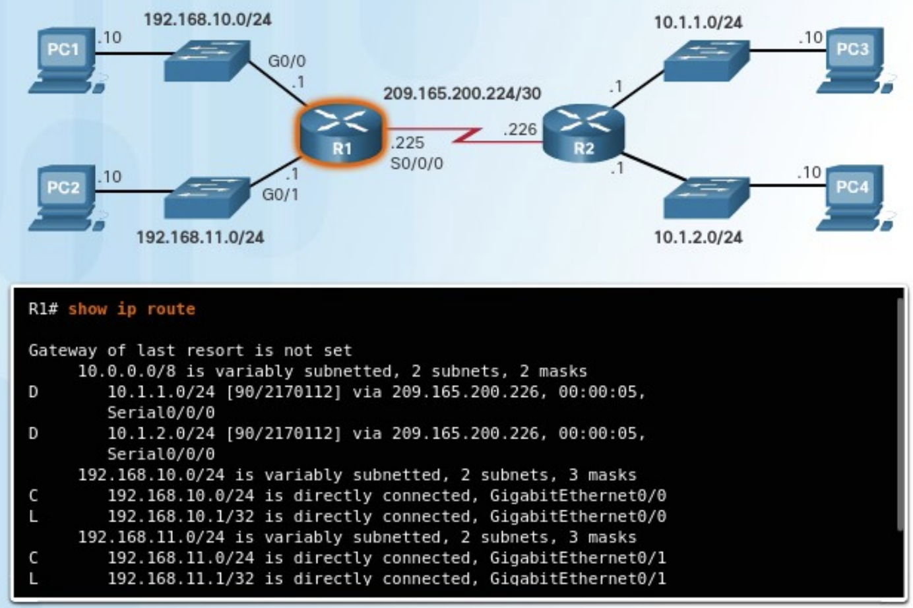
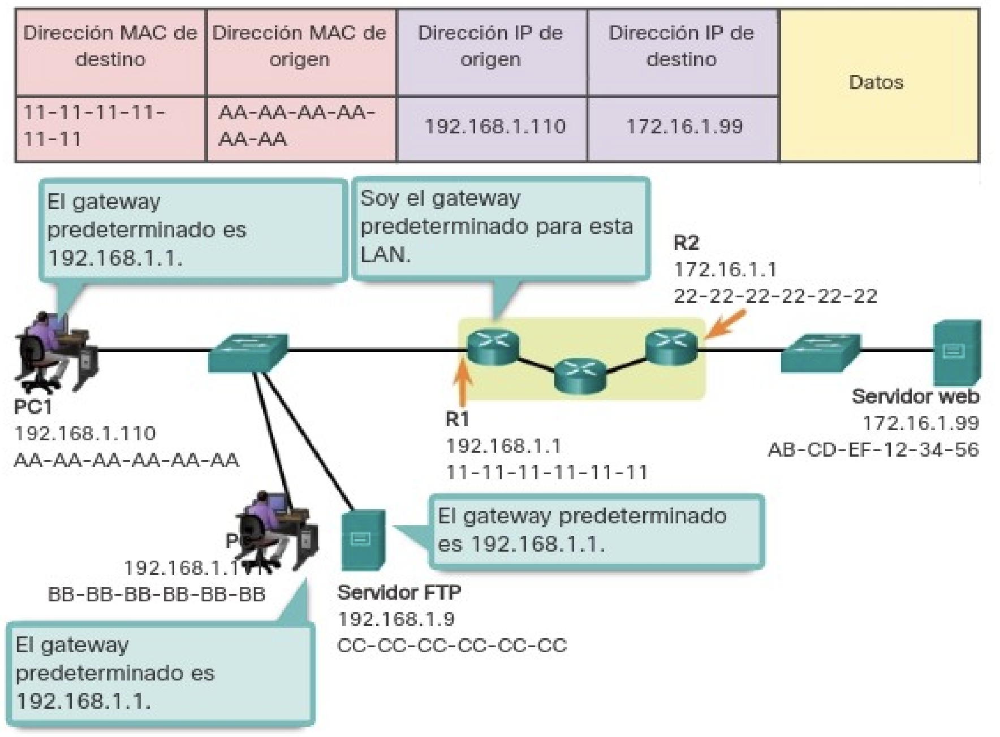
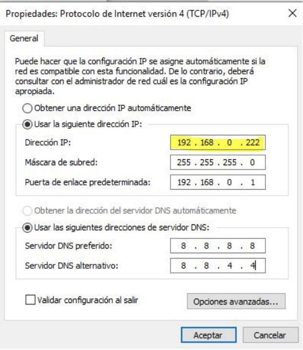

# Unidad 4 - Configuración y administración básica de routers

## Encaminamiento

Además del direccionamiento, que ya vimos en la unidad 2, la capa de red se encarga de encaminar los paquetes entre distintos hosts. Un host puede enviar un paquete a diferentes destinos posibles:

- A sí mismo. Es posible que un host se envíe datos a su propia dirección, utilizando la dirección IPv4 127.0.0.1, conocida como “interfaz de loopback” o bucle invertido.
- A un host dentro de la misma red. En este caso, el host de destino forma parte de la misma red local que el emisor, ya que comparten el mismo identificador de red. Por ejemplo, en una red doméstica pueden coexistir varios dispositivos conectados por cable o de forma inalámbrica, enlazados mediante un dispositivo intermediario como un switch LAN o un punto de acceso Wi-Fi. Este equipo actúa como puente entre los dispositivos de la misma red local. Si el host de origen envía un paquete a otro equipo dentro de la misma red IP, el paquete se transmite a través del intermediario directamente hacia su destino.
- A un host en otra red. Aquí hablamos de un equipo que se encuentra en una red distinta a la del emisor, por lo que no comparten el mismo prefijo de red. En estos casos, los routers se encargan de enlazar distintas redes entre sí. Son los responsables de trasladar los paquetes entre redes diferentes.

En la mayoría de los casos, los dispositivos necesitan comunicarse más allá de su red local, por ejemplo, al acceder a servicios en Internet. Cuando esto ocurre, es fundamental el uso de routers y del proceso de enrutamiento. El enrutamiento consiste en determinar la mejor ruta posible para hacer llegar un paquete a su destino final.

### Puerta de enlace

El router que se encuentra conectado a la red local recibe el nombre de puerta de enlace predeterminada o gateway por defecto. Este dispositivo tiene la función de dirigir el tráfico de datos hacia redes externas, es decir, fuera del ámbito de la red local.

En la mayoría de los sistemas, la tabla de enrutamiento del host incluye una entrada correspondiente a esta puerta de enlace. La dirección IPv4 del gateway puede ser asignada automáticamente mediante el protocolo DHCP o bien configurarse manualmente por el usuario o administrador. Por ejemplo, en la ilustración, tanto el PC1 como el PC2 están configurados con la dirección 192.168.10.1 como gateway predeterminado. Esta configuración genera en la tabla de enrutamiento de cada equipo una ruta predeterminada, que será utilizada para enviar paquetes dirigidos a destinos fuera de su red local.

Esta ruta predeterminada se deriva directamente de la dirección configurada como gateway y aparece en la tabla de enrutamiento del host. De este modo, tanto el PC1 como el PC2 enviarán cualquier tráfico destinado a redes remotas al router R1, siguiendo la ruta predeterminada definida.

### Tablas de enrutamiento

Una tabla de enrutamiento es una estructura de datos que almacena información sobre los posibles caminos que pueden seguir los paquetes para alcanzar un destino. El componente más importante de dicha tabla es la ruta, que identifica una red de destino junto con la dirección IP del siguiente salto, es decir, el router al que se debe enviar el paquete para continuar su trayecto.

Estas tablas están formadas por múltiples rutas y son únicas en cada dispositivo. Todos los equipos conectados a una red —ya sean PCs, routers, etc.— disponen de su propia tabla de enrutamiento. Cuando un dispositivo necesita enviar datos a otro, consulta esta tabla para determinar cuál es el mejor camino a seguir.

El funcionamiento básico de una tabla de enrutamiento se resume en los siguientes pasos:

1.	Un paquete llega al dispositivo o es generado por él (por ejemplo, un PC, router o tablet).
2.	El sistema operativo del dispositivo analiza la dirección IP de destino para identificar la red de destino y busca la ruta correspondiente en su tabla de enrutamiento.
3.	Una vez localizada la ruta, se obtiene la dirección IP del router que corresponde al siguiente salto.
4.	El paquete se envía a esa dirección, es decir, al siguiente dispositivo en la ruta hacia su destino final.

Este proceso se repite para cada paquete que debe ser transmitido por la red.

Cuando un host necesita enviar un paquete, utiliza su propia tabla de enrutamiento para decidir a dónde dirigirlo. Si el destino se encuentra en una red diferente, el paquete se envía al router que actúa como puerta de enlace predeterminada. A su vez, el router consultará su propia tabla de enrutamiento para reenviar el paquete adecuadamente.

La tabla de enrutamiento de un router puede contener varios tipos de rutas:

- **Rutas conectadas directamente**. Estas son rutas que corresponden a redes conectadas directamente a alguna de las interfaces activas del router. Cuando una interfaz es configurada con una dirección IP y está operativa, el router añade automáticamente esa red como ruta directa. Cada interfaz del router está conectada a un segmento de red distinto.
- **Rutas remotas**. Son rutas que conducen a redes que no están conectadas directamente al router, sino a través de otros routers. Estas rutas pueden configurarse de forma manual por el administrador o aprenderse de manera automática mediante protocolos de enrutamiento dinámico, que permiten a los routers intercambiar información sobre rutas.
- **Ruta predeterminada**. Igual que ocurre en los hosts, los routers también disponen de una ruta predeterminada. Esta se utiliza como último recurso para reenviar paquetes cuyo destino no coincide con ninguna de las otras rutas especificadas en la tabla.

<center>{ width="700" }</center>

Además de contener información sobre rutas hacia redes directamente conectadas y redes remotas, la tabla de enrutamiento también incluye detalles adicionales como el método mediante el cual se aprendió la ruta, su grado de confiabilidad, la métrica o coste asociado, la fecha y hora de la última actualización, así como la interfaz de red que se debe utilizar para alcanzar el destino especificado.

Cuando un paquete llega a un router, este analiza su encabezado para identificar la red de destino. Si dicha red aparece en la tabla de enrutamiento, el router reenvía el paquete utilizando los datos especificados en la entrada correspondiente. En el caso de que existan múltiples rutas posibles hacia un mismo destino, el router selecciona la mejor ruta basándose en la métrica, un valor que permite comparar la eficiencia o conveniencia relativa de cada ruta.

Dado que un router conecta diferentes redes, dispone de múltiples interfaces de red, cada una asociada a una red IP distinta. Al recibir un paquete IP a través de una de sus interfaces, el router debe determinar por cuál de sus interfaces debe reenviarlo. Esta interfaz puede estar directamente conectada a la red de destino o bien llevar el paquete hacia otro router que permitirá continuar el camino hacia su destino final.

Es importante señalar que un router puede recibir un paquete encapsulado en un tipo de trama de enlace de datos y enviarlo a través de una interfaz que utilice un formato diferente. Por ejemplo, podría recibir un paquete mediante una interfaz Ethernet y reenviarlo a través de una interfaz configurada con el protocolo PPP (Point-to-Point Protocol). La encapsulación de enlace de datos utilizada depende tanto del tipo de interfaz como del medio físico al que esta se encuentra conectada.

Entre las tecnologías de enlace de datos que pueden estar presentes en las interfaces de un router se encuentran Ethernet, PPP, Frame Relay, DSL, conexiones por cable y tecnologías inalámbricas como Wi-Fi (802.11) o Bluetooth, entre otras.

## Configuración del router

Aunque existen diversos modelos y tipos de routers, todos comparten una serie de componentes de hardware fundamentales. Estos son los siguientes:

- Unidad Central de Procesamiento (CPU). Es el componente responsable de ejecutar las instrucciones del sistema operativo del router.
- Memoria. En los routers Cisco se distinguen distintos tipos de memoria, cada uno con funciones específicas:
    - RAM. Es memoria volátil que contiene tanto las aplicaciones en ejecución como los datos necesarios para el funcionamiento del dispositivo.
    - ROM. Memoria no volátil que almacena el firmware del router, incluyendo instrucciones básicas para el arranque.
    - NVRAM. También no volátil, se utiliza para guardar el archivo de configuración de inicio (startup-config), que se carga durante el arranque del sistema.
    - Flash. Es una memoria no volátil destinada al almacenamiento permanente del sistema operativo del router (IOS) y archivos asociados. Durante el proceso de arranque, el archivo IOS se copia desde la memoria Flash a la RAM.

### Interfaces del router

Un router está provisto de distintas conexiones que se pueden clasificar en dos grupos principales:

- Puertos de administración. Estos puertos están destinados a tareas de configuración, mantenimiento y diagnóstico del equipo. No se utilizan para transmitir tráfico de red. Los dos tipos más comunes son el puerto de consola y el puerto auxiliar.
- Interfaces de banda. Son las interfaces empleadas para la transmisión y recepción de tráfico IP. Incluyen conexiones de red de área local (LAN), como Gigabit Ethernet, y conexiones de red de área extensa (WAN), como interfaces seriales o DSL. Cada una de estas interfaces, una vez configurada y activada, actúa como miembro de una red IP distinta, por lo que debe asignarse una dirección IPv4 y una máscara de subred únicas. El sistema operativo Cisco IOS no permite que dos interfaces activas del mismo router pertenezcan a la misma red IP.

Por lo general, cada red a la que se conecta un router requiere una interfaz física independiente. Estas interfaces permiten la conexión tanto a redes LAN como a redes WAN. Las redes de área local (LAN), habitualmente basadas en tecnología Ethernet, suelen estar formadas por equipos como ordenadores, impresoras o servidores. Las redes de área extensa (WAN), en cambio, se utilizan para enlazar redes locales a través de grandes distancias. Un caso común es el uso de una conexión WAN para enlazar una LAN con la infraestructura del proveedor de servicios de Internet (ISP).

### Proceso de arranque

El proceso de arranque de un router consta de tres fases principales, que se desarrollan en el siguiente orden:

1. **Ejecución del POST y carga del programa de arranque**. Al encenderse, el router realiza un procedimiento de autocomprobación conocido como POST (Power-On Self Test), mediante el cual verifica el estado de distintos componentes de hardware como la ROM, la CPU, la RAM y la NVRAM. Una vez finalizado este diagnóstico, el programa de arranque se transfiere desde la ROM a la RAM. La función principal de este programa es localizar el sistema operativo Cisco IOS y cargarlo en memoria para su posterior ejecución.
2. **Localización y carga del sistema Cisco IOS**. Habitualmente, la imagen del sistema operativo IOS se encuentra almacenada en la memoria flash. Desde allí se copia a la RAM para que la CPU pueda ejecutarla. En caso de que no se disponga de una imagen completa del IOS, el sistema carga una versión reducida que permite diagnosticar problemas y transferir una imagen completa del IOS a la memoria flash.
3. **Carga del archivo de configuración**. Una vez que el IOS está operativo, el programa de arranque localiza el archivo de configuración almacenado en la NVRAM (startup-config) y lo copia a la RAM. Este archivo se convierte en la configuración activa (running-config), es decir, aquella que se utilizará durante la sesión actual del router.

### Configuración inicial

Al igual que en el proceso de configuración inicial de un switch, al configurar un router por primera vez es necesario llevar a cabo una serie de tareas básicas para garantizar su correcta identificación y seguridad. Estas tareas incluyen:

1.	Asignar un nombre al dispositivo.
2.	Proteger el modo EXEC de usuario.
3.	Establecer contraseñas para el acceso remoto mediante Telnet y SSH.
4.	Asegurar el acceso al modo EXEC privilegiado.
5.	Ocultar las contraseñas almacenadas en el archivo de configuración.
6.	Incluir un mensaje de advertencia legal.
7.	Guardar la configuración realizada.

A continuación, se detallan los pasos correspondientes a las primeras de estas tareas.

Como ya se vio en el caso de los switches, es recomendable asignar un nombre de host al router con el fin de identificar el dispositivo en el que se está trabajando. Para ello, se utiliza el comando hostname en el modo de configuración global:

```
Router>enable  
Router#configure terminal  
Enter configuration commands, one per line. End with CNTL/Z.  
Router(config)#hostname R1  
R1(config)# 
```

Para proteger el modo EXEC de usuario, es necesario establecer una contraseña en la línea de consola del router. Esto se consigue mediante la siguiente secuencia de comandos:

```
R1(config)#line console 0  
R1(config-line)#password cisco  
R1(config-line)#login  
R1(config-line)#exit  
R1(config)#  
```

En cuanto al acceso remoto a través de Telnet o SSH, se requiere configurar una contraseña para las líneas VTY:

```
R1(config)#line vty 0 4  
R1(config-line)#password cisco  
R1(config-line)#login  
R1(config-line)#exit  
R1(config)#  
```

Cabe señalar que, al igual que con los switches, para poder acceder remotamente al router mediante Telnet o SSH, es imprescindible que el dispositivo tenga asignada una dirección IP. La configuración de las interfaces del router, necesarias para ello, se abordará en apartados posteriores.

Para asegurar el acceso al modo EXEC privilegiado, basta con establecer una contraseña mediante el comando adecuado. Esta contraseña protegerá el acceso al modo de administración avanzada del router. El comando utilizado es enable secret, y debe ejecutarse desde el modo de configuración global:

```
R1(config)#enable secret cisco  
R1(config)#  
```

Este comando cifra automáticamente la contraseña y proporciona un nivel de seguridad superior en comparación con el comando enable password, que no realiza cifrado por defecto.

#### Proteger las contraseñas en el archivo de configuración

Una vez configuradas las contraseñas en las diferentes líneas del router, es recomendable cifrarlas para evitar que se almacenen en texto plano dentro del archivo de configuración. Para ello, se utiliza el siguiente comando en el modo de configuración global:

```
R1(config)#service password-encryption  
R1(config)#  
```

A continuación, se puede establecer un mensaje de advertencia que se mostrará a los usuarios antes de acceder al sistema. Este mensaje, conocido como banner de MOTD (Message of the Day), sirve como notificación legal e indica que el acceso está restringido únicamente a personal autorizado:

```
R1(config)#banner motd #Solo personal autorizado puede acceder.#  
R1(config)#  
```

Finalmente, para conservar todos los cambios realizados, es necesario salir del modo de configuración y guardar la configuración activa en la NVRAM, asegurando que esta se mantenga tras un reinicio del dispositivo. El proceso se realiza con los siguientes comandos:

```
R1(config)#exit  
R1#  
%SYS-5-CONFIG_I: Configured from console by console  
R1#copy running-config startup-config  
Destination filename [startup-config]?  
Building configuration...  
[OK]  
R1#  
```

### Configurar interfaces del router

Para que un router sea accesible a través de la red, es necesario configurar sus interfaces en banda, es decir, aquellas que permiten el envío y recepción de paquetes IP. Los routers Cisco cuentan con una amplia variedad de interfaces, dependiendo del modelo específico.

En el caso del router Cisco de la serie 1941, por ejemplo, se dispone de las siguientes interfaces:

- Dos interfaces Gigabit Ethernet: GigabitEthernet 0/0 (G0/0) y GigabitEthernet 0/1 (G0/1).
- Una tarjeta de interfaz WAN serial (WIC), que incluye dos interfaces: Serial 0/0/0 (S0/0/0) y Serial 0/0/1 (S0/0/1).

La configuración de una interfaz de red se realiza utilizando el comando ip address, que se introduce en el modo de configuración de interfaz. Este comando se emplea para asignar una dirección IPv4 y su correspondiente máscara de subred.

A continuación, se mostrará un ejemplo práctico de configuración basado en una red específica.

<center>{ width="700" }</center>

El router R1 se conecta a LAN1, compuesta por un switch y un PC, a través de su interfaz GigabitEthernet 0/0. De manera similar, el router R2 establece conexión con LAN2, que también incluye un switch y un PC, mediante su interfaz GigabitEthernet 0/0. Finalmente, el router R3 se conecta a LAN3, la cual presenta la misma estructura de dispositivos. Siempre que un router se conecte a una red local (LAN), se emplearán interfaces de tipo GigabitEthernet, adecuadas para redes locales de alta velocidad.

Por otra parte, los routers están interconectados mediante enlaces seriales, formando una red WAN. Estas conexiones utilizan las interfaces Serial 0/0/0 (Se0/0/0). Siempre que sea posible, se recomienda usar interfaces seriales para la interconexión entre routers, reservando las interfaces Ethernet para conexiones dentro de la red local, donde ofrecen un mejor rendimiento en ese contexto.

A continuación, se presenta el esquema de direccionamiento utilizado en esta topología de red.

<table border="1">
  <thead>
    <tr>
      <th>Red</th>
      <th>Dispositivo</th>
      <th>Dirección IP</th>
      <th>Interfaz</th>
    </tr>
  </thead>
  <tbody>
    <tr>
      <td rowspan="2">LAN1</td>
      <td>PC0</td>
      <td>192.168.0.2/24</td>
      <td>NIC</td>
    </tr>
    <tr>
      <td>R1</td>
      <td>192.168.0.1/24</td>
      <td>G0/0</td>
    </tr>

    <tr>
      <td rowspan="4">WAN</td>
      <td>R1</td>
      <td>172.16.0.1/16</td>
      <td>Se0/0/0</td>
    </tr>
    <tr>
      <td>R2</td>
      <td>172.16.0.2/16</td>
      <td>Se0/0/0</td>
    </tr>
    <tr>
      <td>R2</td>
      <td>172.17.0.1/16</td>
      <td>Se0/0/1</td>
    </tr>
    <tr>
      <td>R3</td>
      <td>172.17.0.2/16</td>
      <td>Se0/0/0</td>
    </tr>

    <tr>
      <td rowspan="2">LAN2</td>
      <td>R2</td>
      <td>192.168.1.1/24</td>
      <td>G0/0</td>
    </tr>
    <tr>
      <td>PC1</td>
      <td>192.168.1.2/24</td>
      <td>NIC</td>
    </tr>

    <tr>
      <td rowspan="2">LAN3</td>
      <td>R3</td>
      <td>192.168.2.1</td>
      <td>G0/0</td>
    </tr>
    <tr>
      <td>PC2</td>
      <td>192.168.2.2</td>
      <td>NIC</td>
    </tr>
  </tbody>
</table>

Comenzamos configurando la interfaz Gi0/0 del router R1.

```
R1>enable
Password:
R1#configure terminal
Enter configuration commands, one per line. End with CNTL/Z.
R1(config)#interface g0/0
R1(config-if)#ip address 192.168.0.1 255.255.255.0
R1(config-if)#description Interfaz LAN1
R1(config-if)#no shutdown

R1(config-if)#
%LINK-5-CHANGED: Interface GigabitEthernet0/0, changed state to up

%LINEPROTO-5-UPDOWN: Line protocol on Interface GigabitEthernet0/0, changed state to up

R1(config-if)#exit
R1(config)#
```

Para configurar una interfaz en un router, es necesario acceder a ella mediante el comando interface id-interfaz. A continuación, se asigna la dirección IP correspondiente utilizando el comando:

```
ip address dirección-IP máscara
```

Opcionalmente, se puede añadir una descripción con el comando:

```
description descripción
```

El comando no shutdown permite activar la interfaz, funcionando como si se le suministrara energía. No obstante, para que la capa física se active correctamente, la interfaz debe estar conectada a otro dispositivo, como un switch o un router.

En el ejemplo anterior, se ha configurado la interfaz GigabitEthernet 0/0, que puede identificarse indistintamente con los formatos g0/0, gi0/0 o gigabitethernet 0/0, como se muestra a continuación:

```
R1(config)#interface g0/0
R1(config-if)#exit
R1(config)#interface gi0/0
R1(config-if)#exit
R1(config)#interface gigabitEthernet 0/0
```

A continuación, se procede a configurar la interfaz serial 0/0/0 del router R1, la cual establece la conexión WAN con el router R2. El procedimiento de configuración es similar al utilizado para las interfaces Ethernet, aunque en el caso de las interfaces seriales se requiere un paso adicional.

En el diagrama de red, se observa que una de las conexiones seriales incluye un icono de reloj en uno de sus extremos. Esto indica que la conexión es de tipo sincronizada, por lo que es necesario definir manualmente la velocidad del reloj en el extremo que actúa como DCE (Data Communications Equipment), es decir, el que lleva el icono del reloj. En este ejemplo, dicha función corresponde a la interfaz Serial 0/0/0 del router R1.

La configuración de esta interfaz se realiza con la siguiente secuencia de comandos:

```
R1>enable  
Password:  
R1#configure terminal  
Enter configuration commands, one per line. End with CNTL/Z.  
R1(config)#interface s0/0/0  
R1(config-if)#ip address 172.16.0.1 255.255.0.0  
R1(config-if)#clock rate 4000000  
R1(config-if)#description Conexion WAN R2  
R1(config-if)#no shutdown  
R1(config-if)#exit  
R1(config)#  
```

Como se ha observado, el comando clock rate seguido de un valor numérico permite definir la velocidad del reloj en una interfaz serial configurada como DCE. En este ejemplo se ha utilizado la velocidad máxima permitida, que es de 4.000.000 bits por segundo (bps).

Se deja al lector la tarea de configurar la interfaz GigabitEthernet 0/0 del router R2, aplicando los conceptos y comandos ya presentados previamente.

#### Verificar la configuración de la interfaz

Para comprobar que las interfaces del router han sido configuradas correctamente, se dispone de varios comandos de verificación. Uno de los más útiles es show ip interface brief, que se ejecuta desde el modo EXEC privilegiado. Este comando muestra un resumen de todas las interfaces del dispositivo, incluyendo su dirección IPv4 asignada, el método de asignación, y el estado operativo.

En condiciones normales, una interfaz correctamente configurada y conectada debe mostrar el estado “up” tanto en la columna Status como en la de Protocol. Cualquier otro valor, como “administratively down” o “down”, puede indicar un problema de configuración, de conexión física o de cableado.

Ejemplo de salida del comando:

```
R1#show ip interface brief  
Interface              IP-Address      OK? Method Status            Protocol  
GigabitEthernet0/0     192.168.0.1     YES manual up                up  
GigabitEthernet0/1     unassigned      YES unset  administratively down down  
Serial0/0/0            172.16.0.1      YES manual up                up  
Serial0/0/1            unassigned      YES unset  down              down  
Vlan1                  unassigned      YES unset  administratively down down  
R1#  
```

Además, es posible verificar la conectividad entre dispositivos mediante el comando ping, el cual permite enviar paquetes ICMP al destino especificado. Los routers Cisco envían, por defecto, cinco paquetes consecutivos y muestran el resultado con signos de exclamación (!) cuando la respuesta ha sido satisfactoria. También se indican los tiempos de ida y vuelta (RTT) mínimo, promedio y máximo.

A continuación, se muestra un ejemplo en el que el router R1 realiza una prueba de conectividad con el router R2:

```
R1#ping 172.16.0.2  
Type escape sequence to abort.  
Sending 5, 100-byte ICMP Echos to 172.16.0.2, timeout is 2 seconds:  
!!!!!  
Success rate is 100 percent (5/5), round-trip min/avg/max = 2/4/6 ms  
R1#  
```

El resultado confirma que se ha establecido correctamente la comunicación entre ambos dispositivos.

### Puerta de enlace predeterminada

Para que un dispositivo pueda comunicarse a través de una red, es necesario configurarlo con ciertos parámetros que lo identifiquen correctamente dentro de la topología. Estos elementos esenciales son:

- **Dirección IP**. Permite identificar de forma única a un host dentro de su red local.
- **Máscara de subred**. Define a qué subred pertenece el host, facilitando la segmentación y el enrutamiento.
- **Puerta de enlace predeterminada**. Es la dirección IP del router al que se deben enviar los paquetes cuyo destino no se encuentra dentro de la misma subred local.

<center>{ width="700" }</center>

Cuando un host envía un paquete dirigido a otro dispositivo ubicado dentro de su misma red IP, el paquete se entrega directamente a través de la interfaz del host hacia el dispositivo de destino. Sin embargo, si el paquete tiene como destino un dispositivo ubicado en una red diferente, el host no puede comunicarse directamente con él. En su lugar, el paquete se reenvía a la puerta de enlace predeterminada, que es la encargada de redirigirlo hacia su destino final. La puerta de enlace actúa, por tanto, como intermediario entre la red local y las redes externas, y en muchos casos permite el acceso a Internet.

Generalmente, la puerta de enlace predeterminada corresponde a la dirección IP de la interfaz del router que está conectada directamente a la red local. Este router posee una tabla de enrutamiento que contiene información tanto de las redes directamente conectadas como de aquellas remotas, y se encarga de determinar la mejor ruta para alcanzar cualquier destino.

Por ejemplo, si el PC1 desea enviar un paquete a un servidor web ubicado en la dirección 176.16.1.99, identificará que dicho servidor no pertenece a su red local. En consecuencia, el PC enviará el paquete a la dirección MAC de su puerta de enlace predeterminada. La Unidad de Datos del Protocolo (PDU) generada incluirá las direcciones MAC e IP tanto de origen como de destino, lo que permite que el paquete sea encaminado adecuadamente hasta alcanzar su objetivo.

#### Configuración de la IP en un host

Como se explicó anteriormente, para que un equipo pueda comunicarse en la red, es imprescindible que tenga configurados los parámetros IP necesarios. Estos parámetros pueden asignarse de forma estática, mediante configuración manual por parte del administrador de red, o de forma dinámica, utilizando un servidor DHCP (Dynamic Host Configuration Protocol).

Si un PC únicamente necesita comunicarse con otros dispositivos dentro de su misma red local, basta con que tenga asignadas una dirección IP y una máscara de subred. No obstante, si requiere establecer comunicación con equipos ubicados en redes distintas, también será necesario configurar la puerta de enlace predeterminada, que permitirá enviar el tráfico hacia destinos fuera de la red local.

<center>{ width="300" }</center>
