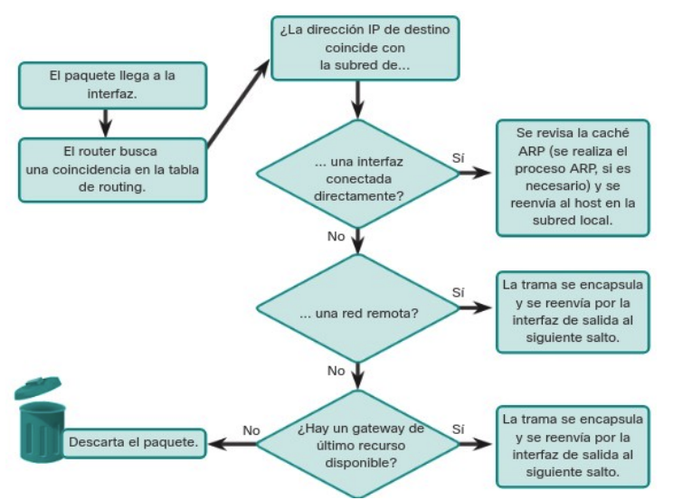
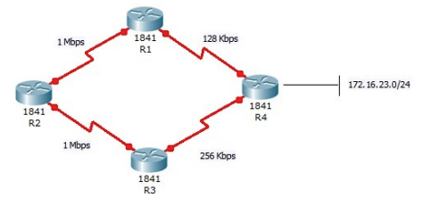
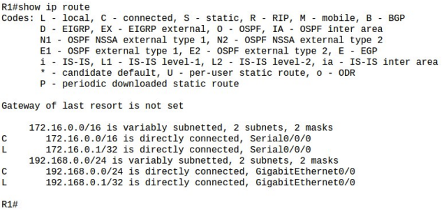
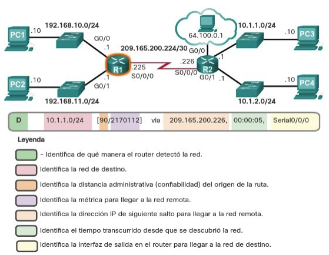
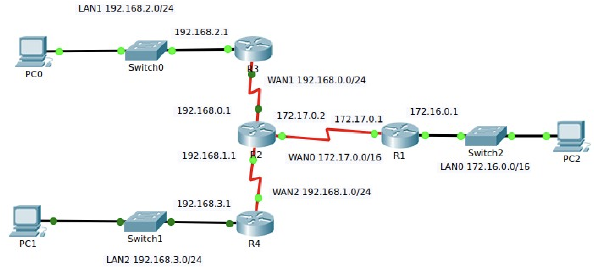
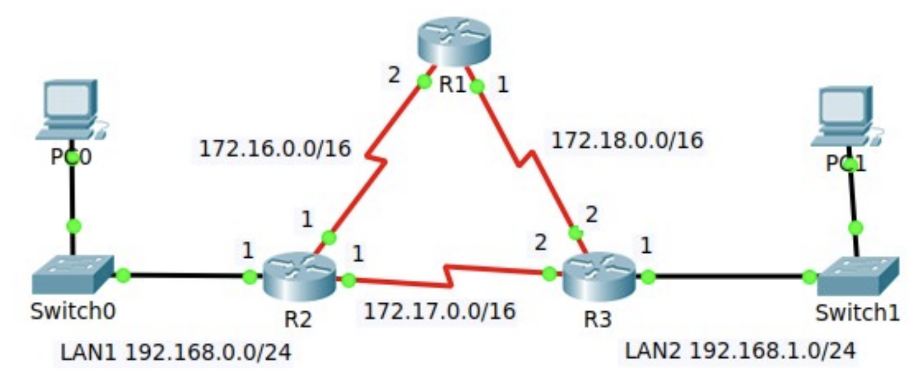
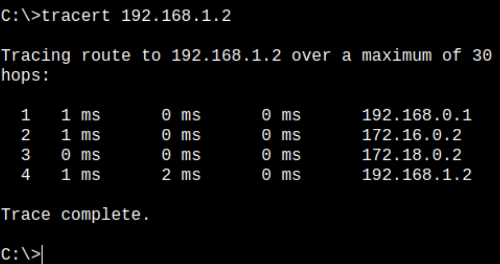

# Unidad 4 - Configuración y administración básica de routers

## Encaminamiento

Además del direccionamiento, que ya vimos en la unidad 2, la capa de red se encarga de encaminar los paquetes entre distintos hosts. Un host puede enviar un paquete a diferentes destinos posibles:

- A sí mismo. Es posible que un host se envíe datos a su propia dirección, utilizando la dirección IPv4 127.0.0.1, conocida como “interfaz de loopback” o bucle invertido.
- A un host dentro de la misma red. En este caso, el host de destino forma parte de la misma red local que el emisor, ya que comparten el mismo identificador de red. Por ejemplo, en una red doméstica pueden coexistir varios dispositivos conectados por cable o de forma inalámbrica, enlazados mediante un dispositivo intermediario como un switch LAN o un punto de acceso Wi-Fi. Este equipo actúa como puente entre los dispositivos de la misma red local. Si el host de origen envía un paquete a otro equipo dentro de la misma red IP, el paquete se transmite a través del intermediario directamente hacia su destino.
- A un host en otra red. Aquí hablamos de un equipo que se encuentra en una red distinta a la del emisor, por lo que no comparten el mismo prefijo de red. En estos casos, los routers se encargan de enlazar distintas redes entre sí. Son los responsables de trasladar los paquetes entre redes diferentes.

En la mayoría de los casos, los dispositivos necesitan comunicarse más allá de su red local, por ejemplo, al acceder a servicios en Internet. Cuando esto ocurre, es fundamental el uso de routers y del proceso de enrutamiento. El enrutamiento consiste en determinar la mejor ruta posible para hacer llegar un paquete a su destino final.

### Puerta de enlace

El router que se encuentra conectado a la red local recibe el nombre de puerta de enlace predeterminada o gateway por defecto. Este dispositivo tiene la función de dirigir el tráfico de datos hacia redes externas, es decir, fuera del ámbito de la red local.

En la mayoría de los sistemas, la tabla de enrutamiento del host incluye una entrada correspondiente a esta puerta de enlace. La dirección IPv4 del gateway puede ser asignada automáticamente mediante el protocolo DHCP o bien configurarse manualmente por el usuario o administrador. Por ejemplo, en la ilustración, tanto el PC1 como el PC2 están configurados con la dirección 192.168.10.1 como gateway predeterminado. Esta configuración genera en la tabla de enrutamiento de cada equipo una ruta predeterminada, que será utilizada para enviar paquetes dirigidos a destinos fuera de su red local.

Esta ruta predeterminada se deriva directamente de la dirección configurada como gateway y aparece en la tabla de enrutamiento del host. De este modo, tanto el PC1 como el PC2 enviarán cualquier tráfico destinado a redes remotas al router R1, siguiendo la ruta predeterminada definida.

### Tablas de enrutamiento

Una tabla de enrutamiento es una estructura de datos que almacena información sobre los posibles caminos que pueden seguir los paquetes para alcanzar un destino. El componente más importante de dicha tabla es la ruta, que identifica una red de destino junto con la dirección IP del siguiente salto, es decir, el router al que se debe enviar el paquete para continuar su trayecto.

Estas tablas están formadas por múltiples rutas y son únicas en cada dispositivo. Todos los equipos conectados a una red —ya sean PCs, routers, etc.— disponen de su propia tabla de enrutamiento. Cuando un dispositivo necesita enviar datos a otro, consulta esta tabla para determinar cuál es el mejor camino a seguir.

El funcionamiento básico de una tabla de enrutamiento se resume en los siguientes pasos:

1.	Un paquete llega al dispositivo o es generado por él (por ejemplo, un PC, router o tablet).
2.	El sistema operativo del dispositivo analiza la dirección IP de destino para identificar la red de destino y busca la ruta correspondiente en su tabla de enrutamiento.
3.	Una vez localizada la ruta, se obtiene la dirección IP del router que corresponde al siguiente salto.
4.	El paquete se envía a esa dirección, es decir, al siguiente dispositivo en la ruta hacia su destino final.

Este proceso se repite para cada paquete que debe ser transmitido por la red.

Cuando un host necesita enviar un paquete, utiliza su propia tabla de enrutamiento para decidir a dónde dirigirlo. Si el destino se encuentra en una red diferente, el paquete se envía al router que actúa como puerta de enlace predeterminada. A su vez, el router consultará su propia tabla de enrutamiento para reenviar el paquete adecuadamente.

La tabla de enrutamiento de un router puede contener varios tipos de rutas:

- **Rutas conectadas directamente**. Estas son rutas que corresponden a redes conectadas directamente a alguna de las interfaces activas del router. Cuando una interfaz es configurada con una dirección IP y está operativa, el router añade automáticamente esa red como ruta directa. Cada interfaz del router está conectada a un segmento de red distinto.
- **Rutas remotas**. Son rutas que conducen a redes que no están conectadas directamente al router, sino a través de otros routers. Estas rutas pueden configurarse de forma manual por el administrador o aprenderse de manera automática mediante protocolos de enrutamiento dinámico, que permiten a los routers intercambiar información sobre rutas.
- **Ruta predeterminada**. Igual que ocurre en los hosts, los routers también disponen de una ruta predeterminada. Esta se utiliza como último recurso para reenviar paquetes cuyo destino no coincide con ninguna de las otras rutas especificadas en la tabla.

<center>{ width="700" }</center>

Además de contener información sobre rutas hacia redes directamente conectadas y redes remotas, la tabla de enrutamiento también incluye detalles adicionales como el método mediante el cual se aprendió la ruta, su grado de confiabilidad, la métrica o coste asociado, la fecha y hora de la última actualización, así como la interfaz de red que se debe utilizar para alcanzar el destino especificado.

Cuando un paquete llega a un router, este analiza su encabezado para identificar la red de destino. Si dicha red aparece en la tabla de enrutamiento, el router reenvía el paquete utilizando los datos especificados en la entrada correspondiente. En el caso de que existan múltiples rutas posibles hacia un mismo destino, el router selecciona la mejor ruta basándose en la métrica, un valor que permite comparar la eficiencia o conveniencia relativa de cada ruta.

Dado que un router conecta diferentes redes, dispone de múltiples interfaces de red, cada una asociada a una red IP distinta. Al recibir un paquete IP a través de una de sus interfaces, el router debe determinar por cuál de sus interfaces debe reenviarlo. Esta interfaz puede estar directamente conectada a la red de destino o bien llevar el paquete hacia otro router que permitirá continuar el camino hacia su destino final.

Es importante señalar que un router puede recibir un paquete encapsulado en un tipo de trama de enlace de datos y enviarlo a través de una interfaz que utilice un formato diferente. Por ejemplo, podría recibir un paquete mediante una interfaz Ethernet y reenviarlo a través de una interfaz configurada con el protocolo PPP (Point-to-Point Protocol). La encapsulación de enlace de datos utilizada depende tanto del tipo de interfaz como del medio físico al que esta se encuentra conectada.

Entre las tecnologías de enlace de datos que pueden estar presentes en las interfaces de un router se encuentran Ethernet, PPP, Frame Relay, DSL, conexiones por cable y tecnologías inalámbricas como Wi-Fi (802.11) o Bluetooth, entre otras.

## Configuración del router

Aunque existen diversos modelos y tipos de routers, todos comparten una serie de componentes de hardware fundamentales. Estos son los siguientes:

- Unidad Central de Procesamiento (CPU). Es el componente responsable de ejecutar las instrucciones del sistema operativo del router.
- Memoria. En los routers Cisco se distinguen distintos tipos de memoria, cada uno con funciones específicas:
    - RAM. Es memoria volátil que contiene tanto las aplicaciones en ejecución como los datos necesarios para el funcionamiento del dispositivo.
    - ROM. Memoria no volátil que almacena el firmware del router, incluyendo instrucciones básicas para el arranque.
    - NVRAM. También no volátil, se utiliza para guardar el archivo de configuración de inicio (startup-config), que se carga durante el arranque del sistema.
    - Flash. Es una memoria no volátil destinada al almacenamiento permanente del sistema operativo del router (IOS) y archivos asociados. Durante el proceso de arranque, el archivo IOS se copia desde la memoria Flash a la RAM.

### Interfaces del router

Un router está provisto de distintas conexiones que se pueden clasificar en dos grupos principales:

- Puertos de administración. Estos puertos están destinados a tareas de configuración, mantenimiento y diagnóstico del equipo. No se utilizan para transmitir tráfico de red. Los dos tipos más comunes son el puerto de consola y el puerto auxiliar.
- Interfaces de banda. Son las interfaces empleadas para la transmisión y recepción de tráfico IP. Incluyen conexiones de red de área local (LAN), como Gigabit Ethernet, y conexiones de red de área extensa (WAN), como interfaces seriales o DSL. Cada una de estas interfaces, una vez configurada y activada, actúa como miembro de una red IP distinta, por lo que debe asignarse una dirección IPv4 y una máscara de subred únicas. El sistema operativo Cisco IOS no permite que dos interfaces activas del mismo router pertenezcan a la misma red IP.

Por lo general, cada red a la que se conecta un router requiere una interfaz física independiente. Estas interfaces permiten la conexión tanto a redes LAN como a redes WAN. Las redes de área local (LAN), habitualmente basadas en tecnología Ethernet, suelen estar formadas por equipos como ordenadores, impresoras o servidores. Las redes de área extensa (WAN), en cambio, se utilizan para enlazar redes locales a través de grandes distancias. Un caso común es el uso de una conexión WAN para enlazar una LAN con la infraestructura del proveedor de servicios de Internet (ISP).

### Proceso de arranque

El proceso de arranque de un router consta de tres fases principales, que se desarrollan en el siguiente orden:

1. **Ejecución del POST y carga del programa de arranque**. Al encenderse, el router realiza un procedimiento de autocomprobación conocido como POST (Power-On Self Test), mediante el cual verifica el estado de distintos componentes de hardware como la ROM, la CPU, la RAM y la NVRAM. Una vez finalizado este diagnóstico, el programa de arranque se transfiere desde la ROM a la RAM. La función principal de este programa es localizar el sistema operativo Cisco IOS y cargarlo en memoria para su posterior ejecución.
2. **Localización y carga del sistema Cisco IOS**. Habitualmente, la imagen del sistema operativo IOS se encuentra almacenada en la memoria flash. Desde allí se copia a la RAM para que la CPU pueda ejecutarla. En caso de que no se disponga de una imagen completa del IOS, el sistema carga una versión reducida que permite diagnosticar problemas y transferir una imagen completa del IOS a la memoria flash.
3. **Carga del archivo de configuración**. Una vez que el IOS está operativo, el programa de arranque localiza el archivo de configuración almacenado en la NVRAM (startup-config) y lo copia a la RAM. Este archivo se convierte en la configuración activa (running-config), es decir, aquella que se utilizará durante la sesión actual del router.

### Configuración inicial

Al igual que en el proceso de configuración inicial de un switch, al configurar un router por primera vez es necesario llevar a cabo una serie de tareas básicas para garantizar su correcta identificación y seguridad. Estas tareas incluyen:

1.	Asignar un nombre al dispositivo.
2.	Proteger el modo EXEC de usuario.
3.	Establecer contraseñas para el acceso remoto mediante Telnet y SSH.
4.	Asegurar el acceso al modo EXEC privilegiado.
5.	Ocultar las contraseñas almacenadas en el archivo de configuración.
6.	Incluir un mensaje de advertencia legal.
7.	Guardar la configuración realizada.

A continuación, se detallan los pasos correspondientes a las primeras de estas tareas.

Como ya se vio en el caso de los switches, es recomendable asignar un nombre de host al router con el fin de identificar el dispositivo en el que se está trabajando. Para ello, se utiliza el comando hostname en el modo de configuración global:

```
Router>enable  
Router#configure terminal  
Enter configuration commands, one per line. End with CNTL/Z.  
Router(config)#hostname R1  
R1(config)# 
```

Para proteger el modo EXEC de usuario, es necesario establecer una contraseña en la línea de consola del router. Esto se consigue mediante la siguiente secuencia de comandos:

```
R1(config)#line console 0  
R1(config-line)#password cisco  
R1(config-line)#login  
R1(config-line)#exit  
R1(config)#  
```

En cuanto al acceso remoto a través de Telnet o SSH, se requiere configurar una contraseña para las líneas VTY:

```
R1(config)#line vty 0 4  
R1(config-line)#password cisco  
R1(config-line)#login  
R1(config-line)#exit  
R1(config)#  
```

Cabe señalar que, al igual que con los switches, para poder acceder remotamente al router mediante Telnet o SSH, es imprescindible que el dispositivo tenga asignada una dirección IP. La configuración de las interfaces del router, necesarias para ello, se abordará en apartados posteriores.

Para asegurar el acceso al modo EXEC privilegiado, basta con establecer una contraseña mediante el comando adecuado. Esta contraseña protegerá el acceso al modo de administración avanzada del router. El comando utilizado es enable secret, y debe ejecutarse desde el modo de configuración global:

```
R1(config)#enable secret cisco  
R1(config)#  
```

Este comando cifra automáticamente la contraseña y proporciona un nivel de seguridad superior en comparación con el comando enable password, que no realiza cifrado por defecto.

#### Proteger las contraseñas en el archivo de configuración

Una vez configuradas las contraseñas en las diferentes líneas del router, es recomendable cifrarlas para evitar que se almacenen en texto plano dentro del archivo de configuración. Para ello, se utiliza el siguiente comando en el modo de configuración global:

```
R1(config)#service password-encryption  
R1(config)#  
```

A continuación, se puede establecer un mensaje de advertencia que se mostrará a los usuarios antes de acceder al sistema. Este mensaje, conocido como banner de MOTD (Message of the Day), sirve como notificación legal e indica que el acceso está restringido únicamente a personal autorizado:

```
R1(config)#banner motd #Solo personal autorizado puede acceder.#  
R1(config)#  
```

Finalmente, para conservar todos los cambios realizados, es necesario salir del modo de configuración y guardar la configuración activa en la NVRAM, asegurando que esta se mantenga tras un reinicio del dispositivo. El proceso se realiza con los siguientes comandos:

```
R1(config)#exit  
R1#  
%SYS-5-CONFIG_I: Configured from console by console  
R1#copy running-config startup-config  
Destination filename [startup-config]?  
Building configuration...  
[OK]  
R1#  
```

### Configurar interfaces del router

Para que un router sea accesible a través de la red, es necesario configurar sus interfaces en banda, es decir, aquellas que permiten el envío y recepción de paquetes IP. Los routers Cisco cuentan con una amplia variedad de interfaces, dependiendo del modelo específico.

En el caso del router Cisco de la serie 1941, por ejemplo, se dispone de las siguientes interfaces:

- Dos interfaces Gigabit Ethernet: GigabitEthernet 0/0 (G0/0) y GigabitEthernet 0/1 (G0/1).
- Una tarjeta de interfaz WAN serial (WIC), que incluye dos interfaces: Serial 0/0/0 (S0/0/0) y Serial 0/0/1 (S0/0/1).

La configuración de una interfaz de red se realiza utilizando el comando ip address, que se introduce en el modo de configuración de interfaz. Este comando se emplea para asignar una dirección IPv4 y su correspondiente máscara de subred.

A continuación, se mostrará un ejemplo práctico de configuración basado en una red específica.

<center>{ width="700" }</center>

El router R1 se conecta a LAN1, compuesta por un switch y un PC, a través de su interfaz GigabitEthernet 0/0. De manera similar, el router R2 establece conexión con LAN2, que también incluye un switch y un PC, mediante su interfaz GigabitEthernet 0/0. Finalmente, el router R3 se conecta a LAN3, la cual presenta la misma estructura de dispositivos. Siempre que un router se conecte a una red local (LAN), se emplearán interfaces de tipo GigabitEthernet, adecuadas para redes locales de alta velocidad.

Por otra parte, los routers están interconectados mediante enlaces seriales, formando una red WAN. Estas conexiones utilizan las interfaces Serial 0/0/0 (Se0/0/0). Siempre que sea posible, se recomienda usar interfaces seriales para la interconexión entre routers, reservando las interfaces Ethernet para conexiones dentro de la red local, donde ofrecen un mejor rendimiento en ese contexto.

A continuación, se presenta el esquema de direccionamiento utilizado en esta topología de red.

<table border="1">
  <thead>
    <tr>
      <th>Red</th>
      <th>Dispositivo</th>
      <th>Dirección IP</th>
      <th>Interfaz</th>
    </tr>
  </thead>
  <tbody>
    <tr>
      <td rowspan="2">LAN1</td>
      <td>PC0</td>
      <td>192.168.0.2/24</td>
      <td>NIC</td>
    </tr>
    <tr>
      <td>R1</td>
      <td>192.168.0.1/24</td>
      <td>G0/0</td>
    </tr>

    <tr>
      <td rowspan="4">WAN</td>
      <td>R1</td>
      <td>172.16.0.1/16</td>
      <td>Se0/0/0</td>
    </tr>
    <tr>
      <td>R2</td>
      <td>172.16.0.2/16</td>
      <td>Se0/0/0</td>
    </tr>
    <tr>
      <td>R2</td>
      <td>172.17.0.1/16</td>
      <td>Se0/0/1</td>
    </tr>
    <tr>
      <td>R3</td>
      <td>172.17.0.2/16</td>
      <td>Se0/0/0</td>
    </tr>

    <tr>
      <td rowspan="2">LAN2</td>
      <td>R2</td>
      <td>192.168.1.1/24</td>
      <td>G0/0</td>
    </tr>
    <tr>
      <td>PC1</td>
      <td>192.168.1.2/24</td>
      <td>NIC</td>
    </tr>

    <tr>
      <td rowspan="2">LAN3</td>
      <td>R3</td>
      <td>192.168.2.1</td>
      <td>G0/0</td>
    </tr>
    <tr>
      <td>PC2</td>
      <td>192.168.2.2</td>
      <td>NIC</td>
    </tr>
  </tbody>
</table>

Comenzamos configurando la interfaz Gi0/0 del router R1.

```
R1>enable
Password:
R1#configure terminal
Enter configuration commands, one per line. End with CNTL/Z.
R1(config)#interface g0/0
R1(config-if)#ip address 192.168.0.1 255.255.255.0
R1(config-if)#description Interfaz LAN1
R1(config-if)#no shutdown

R1(config-if)#
%LINK-5-CHANGED: Interface GigabitEthernet0/0, changed state to up

%LINEPROTO-5-UPDOWN: Line protocol on Interface GigabitEthernet0/0, changed state to up

R1(config-if)#exit
R1(config)#
```

Para configurar una interfaz en un router, es necesario acceder a ella mediante el comando interface id-interfaz. A continuación, se asigna la dirección IP correspondiente utilizando el comando:

```
ip address dirección-IP máscara
```

Opcionalmente, se puede añadir una descripción con el comando:

```
description descripción
```

El comando no shutdown permite activar la interfaz, funcionando como si se le suministrara energía. No obstante, para que la capa física se active correctamente, la interfaz debe estar conectada a otro dispositivo, como un switch o un router.

En el ejemplo anterior, se ha configurado la interfaz GigabitEthernet 0/0, que puede identificarse indistintamente con los formatos g0/0, gi0/0 o gigabitethernet 0/0, como se muestra a continuación:

```
R1(config)#interface g0/0
R1(config-if)#exit
R1(config)#interface gi0/0
R1(config-if)#exit
R1(config)#interface gigabitEthernet 0/0
```

A continuación, se procede a configurar la interfaz serial 0/0/0 del router R1, la cual establece la conexión WAN con el router R2. El procedimiento de configuración es similar al utilizado para las interfaces Ethernet, aunque en el caso de las interfaces seriales se requiere un paso adicional.

En el diagrama de red, se observa que una de las conexiones seriales incluye un icono de reloj en uno de sus extremos. Esto indica que la conexión es de tipo sincronizada, por lo que es necesario definir manualmente la velocidad del reloj en el extremo que actúa como DCE (Data Communications Equipment), es decir, el que lleva el icono del reloj. En este ejemplo, dicha función corresponde a la interfaz Serial 0/0/0 del router R1.

La configuración de esta interfaz se realiza con la siguiente secuencia de comandos:

```
R1>enable  
Password:  
R1#configure terminal  
Enter configuration commands, one per line. End with CNTL/Z.  
R1(config)#interface s0/0/0  
R1(config-if)#ip address 172.16.0.1 255.255.0.0  
R1(config-if)#clock rate 4000000  
R1(config-if)#description Conexion WAN R2  
R1(config-if)#no shutdown  
R1(config-if)#exit  
R1(config)#  
```

Como se ha observado, el comando clock rate seguido de un valor numérico permite definir la velocidad del reloj en una interfaz serial configurada como DCE. En este ejemplo se ha utilizado la velocidad máxima permitida, que es de 4.000.000 bits por segundo (bps).

#### Verificar la configuración de la interfaz

Para comprobar que las interfaces del router han sido configuradas correctamente, se dispone de varios comandos de verificación. Uno de los más útiles es show ip interface brief, que se ejecuta desde el modo EXEC privilegiado. Este comando muestra un resumen de todas las interfaces del dispositivo, incluyendo su dirección IPv4 asignada, el método de asignación, y el estado operativo.

En condiciones normales, una interfaz correctamente configurada y conectada debe mostrar el estado “up” tanto en la columna Status como en la de Protocol. Cualquier otro valor, como “administratively down” o “down”, puede indicar un problema de configuración, de conexión física o de cableado.

Ejemplo de salida del comando:

```
R1#show ip interface brief  
Interface              IP-Address      OK? Method Status            Protocol  
GigabitEthernet0/0     192.168.0.1     YES manual up                up  
GigabitEthernet0/1     unassigned      YES unset  administratively down down  
Serial0/0/0            172.16.0.1      YES manual up                up  
Serial0/0/1            unassigned      YES unset  down              down  
Vlan1                  unassigned      YES unset  administratively down down  
R1#  
```

Además, es posible verificar la conectividad entre dispositivos mediante el comando ping, el cual permite enviar paquetes ICMP al destino especificado. Los routers Cisco envían, por defecto, cinco paquetes consecutivos y muestran el resultado con signos de exclamación (!) cuando la respuesta ha sido satisfactoria. También se indican los tiempos de ida y vuelta (RTT) mínimo, promedio y máximo.

A continuación, se muestra un ejemplo en el que el router R1 realiza una prueba de conectividad con el router R2:

```
R1#ping 172.16.0.2  
Type escape sequence to abort.  
Sending 5, 100-byte ICMP Echos to 172.16.0.2, timeout is 2 seconds:  
!!!!!  
Success rate is 100 percent (5/5), round-trip min/avg/max = 2/4/6 ms  
R1#  
```

El resultado confirma que se ha establecido correctamente la comunicación entre ambos dispositivos.

### Puerta de enlace predeterminada

Para que un dispositivo pueda comunicarse a través de una red, es necesario configurarlo con ciertos parámetros que lo identifiquen correctamente dentro de la topología. Estos elementos esenciales son:

- **Dirección IP**. Permite identificar de forma única a un host dentro de su red local.
- **Máscara de subred**. Define a qué subred pertenece el host, facilitando la segmentación y el enrutamiento.
- **Puerta de enlace predeterminada**. Es la dirección IP del router al que se deben enviar los paquetes cuyo destino no se encuentra dentro de la misma subred local.

<center>{ width="700" }</center>

Cuando un host envía un paquete dirigido a otro dispositivo ubicado dentro de su misma red IP, el paquete se entrega directamente a través de la interfaz del host hacia el dispositivo de destino. Sin embargo, si el paquete tiene como destino un dispositivo ubicado en una red diferente, el host no puede comunicarse directamente con él. En su lugar, el paquete se reenvía a la puerta de enlace predeterminada, que es la encargada de redirigirlo hacia su destino final. La puerta de enlace actúa, por tanto, como intermediario entre la red local y las redes externas, y en muchos casos permite el acceso a Internet.

Generalmente, la puerta de enlace predeterminada corresponde a la dirección IP de la interfaz del router que está conectada directamente a la red local. Este router posee una tabla de enrutamiento que contiene información tanto de las redes directamente conectadas como de aquellas remotas, y se encarga de determinar la mejor ruta para alcanzar cualquier destino.

Por ejemplo, si el PC1 desea enviar un paquete a un servidor web ubicado en la dirección 176.16.1.99, identificará que dicho servidor no pertenece a su red local. En consecuencia, el PC enviará el paquete a la dirección MAC de su puerta de enlace predeterminada. La Unidad de Datos del Protocolo (PDU) generada incluirá las direcciones MAC e IP tanto de origen como de destino, lo que permite que el paquete sea encaminado adecuadamente hasta alcanzar su objetivo.

#### Configuración de la IP en un host

Como se explicó anteriormente, para que un equipo pueda comunicarse en la red, es imprescindible que tenga configurados los parámetros IP necesarios. Estos parámetros pueden asignarse de forma estática, mediante configuración manual por parte del administrador de red, o de forma dinámica, utilizando un servidor DHCP (Dynamic Host Configuration Protocol).

Si un PC únicamente necesita comunicarse con otros dispositivos dentro de su misma red local, basta con que tenga asignadas una dirección IP y una máscara de subred. No obstante, si requiere establecer comunicación con equipos ubicados en redes distintas, también será necesario configurar la puerta de enlace predeterminada, que permitirá enviar el tráfico hacia destinos fuera de la red local.

<center>{ width="300" }</center>

## Encaminamiento IPv4

Una de las funciones fundamentales de un router es determinar la ruta óptima para el envío de paquetes hacia su destino. Para ello, el router consulta su tabla de enrutamiento, en busca de una coincidencia entre la dirección IP de destino del paquete y alguna de las redes listadas en dicha tabla. El resultado de esta búsqueda puede derivar en una de las siguientes tres situaciones:

- **Red conectada directamente**. Si la dirección IP de destino pertenece a una red que está conectada de forma directa a una de las interfaces del router, el paquete se reenvía directamente al dispositivo de destino. En este caso, la IP de destino es la de un host que se encuentra en la misma red que una de las interfaces del router.

- **Red remota**. Si la dirección IP de destino corresponde a una red que no está directamente conectada, el router reenvía el paquete a otro router. Las redes remotas sólo pueden alcanzarse mediante el reenvío de paquetes hacia otras redes, a través de dispositivos intermedios.

- **Sin ruta específica**. Si la dirección IP de destino no coincide con ninguna red directamente conectada ni remota, el router verifica si dispone de una ruta predeterminada, también conocida como gateway de último recurso. Esta ruta puede ser configurada manualmente o aprendida dinámicamente. Si dicha ruta existe, el paquete se reenvía a través de ella. En caso de que no exista una ruta predeterminada, el router descarta el paquete por no tener una ruta válida para su entrega.

<center>{ width="600" }</center>

Es posible que un router disponga de múltiples rutas hacia una misma red de destino. En tal caso, debe determinar cuál de ellas representa la mejor ruta. Este proceso implica evaluar todas las rutas disponibles hacia dicha red y seleccionar la más eficiente o la que ofrezca el camino más corto. Cada una de estas rutas puede implicar el uso de una interfaz de salida distinta en el router para alcanzar el destino.

Cuando existen varias rutas hacia la misma red, el router necesita información adicional presente en la tabla de enrutamiento para tomar una decisión adecuada. Esta información se basa en dos parámetros fundamentales: la distancia administrativa y la métrica.

### Distancia administrativa

En un entorno en el que un router está configurado con varios protocolos de enrutamiento o rutas estáticas, puede suceder que diferentes métodos descubran una misma red de destino. Por ejemplo, si se habilitan simultáneamente los protocolos RIP y EIGRP, ambos pueden identificar rutas hacia la misma red.

Para resolver esta situación, el sistema operativo IOS de Cisco utiliza un valor denominado distancia administrativa (AD, por sus siglas en inglés). Esta métrica se emplea para determinar qué ruta debe ser instalada en la tabla de enrutamiento cuando hay múltiples opciones disponibles. La distancia administrativa representa el grado de confiabilidad del origen de la ruta: cuanto menor sea el valor de AD, mayor será la preferencia que el router otorgará a esa ruta.

Los valores de AD están predefinidos por el sistema según el tipo de origen de la ruta (por ejemplo, ruta estática, protocolo dinámico, ruta conectada directamente, etc.). A continuación, se proporciona una tabla con los valores típicos de distancia administrativa utilizados por diferentes métodos de enrutamiento.

| Tipo de ruta | Distancia administrativa |
| -- | -- |
| Conectada directamente | 0 |
| Estática | 1 |
| RIP | 120 |
| IGRP | 100 |
| EIGRP | 90 |
| OSPF | 110 |

La distancia administrativa es el primer criterio que utiliza un router para decidir qué ruta seleccionar cuando dos protocolos de enrutamiento distintos proporcionan información hacia el mismo destino. En estos casos, el router elige la ruta con la menor distancia administrativa, ya que representa la opción más confiable.

Como se indicaba en la tabla anterior, cuando un router debe escoger entre una ruta estática y una ruta aprendida mediante un protocolo de enrutamiento dinámico, dará preferencia a la ruta estática, ya que posee una AD más baja. De igual forma, una ruta conectada directamente, con una distancia administrativa de 0, tendrá siempre prioridad sobre una ruta estática, cuya AD es típicamente 1.

### Métrica

Una vez que se ha determinado el protocolo de enrutamiento a utilizar en función de la distancia administrativa, es posible que dicho protocolo proporcione varias rutas alternativas hacia un mismo destino. Dado que estas rutas comparten la misma AD, se requiere un segundo criterio para tomar una decisión: la métrica.

La métrica es un valor numérico que cuantifica la “distancia” o el coste asociado a una ruta específica. Este valor permite al router identificar cuál de las rutas disponibles es más eficiente. Por tanto, la mejor ruta es aquella que presenta la métrica más baja.

Cada protocolo de enrutamiento define su propia forma de calcular la métrica, y puede basarse en uno o varios parámetros, como el número de saltos, el ancho de banda, el retardo, la carga o la confiabilidad del enlace.

A continuación, se presenta un ejemplo práctico con una red compuesta por los routers R1, R2, R3 y R4, que servirá para ilustrar cómo se aplica el concepto de métrica en la selección de rutas.

<center>{ width="500" }</center>

El router R1 debe decidir cuál es la mejor ruta para alcanzar la red 172.16.23.0/24, ya que existen dos caminos posibles: uno directo a través de R4, y otro más largo que pasa por R2 → R3 → R4. A primera vista, parecería lógico suponer que el camino más corto, el que conecta directamente con R4, sería el más adecuado. De hecho, esto es precisamente lo que ocurre cuando se utiliza el protocolo de enrutamiento RIP en toda la topología.

En el caso de RIP (Routing Information Protocol), la métrica utilizada para determinar la mejor ruta es el número de saltos hasta el destino. Cuantos menos routers intermedios haya, mejor se considera la ruta. En este escenario, R1 evalúa ambas opciones y determina que llegar a 172.16.23.0/24 a través de R4 representa el mejor camino, ya que solo requiere 1 salto. En cambio, seguir la ruta R2 → R3 → R4 implica 3 saltos. Como en todos los protocolos de enrutamiento, la ruta con la métrica más baja es la preferida y es la que se instala en la tabla de enrutamiento.

Sin embargo, no todos los protocolos de enrutamiento basan su decisión exclusivamente en la cantidad de saltos. Por ejemplo, si esta misma red estuviese utilizando OSPF (Open Shortest Path First), el cálculo sería diferente. En lugar de contar los saltos, OSPF evalúa el ancho de banda acumulado de los enlaces a lo largo del camino hacia el destino. De este modo, OSPF puede optar por un camino más largo en número de saltos, siempre que tenga un mejor rendimiento en términos de ancho de banda.

El protocolo OSPF asigna a cada enlace un valor llamado costo, que representa el “precio” relativo de utilizar dicho enlace. Este valor se calcula mediante la fórmula:

```
Costo = 100.000.000 / BW
```

donde BW es el ancho de banda del enlace expresado en bits por segundo (bps). La constante 100.000.000 se utiliza como referencia para un enlace de 100 Mbps (FastEthernet).

Aplicando esta fórmula a los enlaces del ejemplo, se obtienen los siguientes costos:

- R1 → R2 = 100 (porque 100.000.000 / 1.000.000 = 100)
- R2 → R3 = 100
- R3 → R4 = 390 (100.000.000 / 256.000)
- R4 → Red de destino = 1 (enlace de 100 Mbps)
- R1 → R4 = 781 (100.000.000 / 128.000)

Sumando los costos para cada ruta completa:

- Vía R1 → R4 → destino: 781 + 1 = 782
- Vía R1 → R2 → R3 → R4 → destino: 100 + 100 + 390 + 1 = 591

Por tanto, aunque el camino que pasa por R2, R3 y R4 incluye más saltos, OSPF lo prefiere porque tiene un costo total menor, lo que se traduce en mejor eficiencia de red. El router R1 seleccionará esta ruta como la óptima y la instalará en su tabla de enrutamiento.

## Balanceo de carga

Balanceo de carga

Cuando un router detecta dos o más rutas hacia un mismo destino que presentan idéntica métrica, puede utilizar todas ellas de manera equitativa para reenviar paquetes. Este mecanismo se conoce como balanceo de carga de mismo costo (equal-cost load balancing). En estos casos, la tabla de enrutamiento del router incluye una única entrada de destino, pero asociada a varias interfaces de salida, cada una correspondiente a una de las rutas con el mismo costo.

El router distribuye el tráfico entre estas interfaces, utilizando todas las rutas disponibles de forma equilibrada, lo que permite una mejor utilización de los recursos de red y una mayor eficiencia en la transmisión de datos.

## Tabla de enrutamiento

La tabla de enrutamiento de un router es un archivo de datos almacenado en la RAM, que contiene información clave sobre cómo alcanzar diferentes redes. En concreto, almacena datos sobre:

- Rutas conectadas directamente. Corresponden a redes que están enlazadas directamente con alguna de las interfaces activas del router. Estas rutas se añaden automáticamente a la tabla cuando una interfaz se configura con una dirección IP válida y está habilitada.

- Rutas remotas. Representan redes que no están directamente conectadas al router, sino que se alcanzan a través de otros routers. Estas rutas pueden configurarse manualmente (rutas estáticas) o aprenderse dinámicamente mediante el uso de protocolos de enrutamiento como RIP, OSPF o EIGRP.

En términos generales, una tabla de enrutamiento contiene asociaciones entre redes y “siguientes saltos”. Esto significa que, para alcanzar una red de destino, el router debe reenviar el paquete a otro router específico (el siguiente salto) o a una interfaz de salida concreta que lo dirige hacia ese destino.

En los routers Cisco, se puede utilizar el comando:

```
show ip route
```

Este comando muestra la tabla de enrutamiento IPv4 del dispositivo. La salida incluye información detallada sobre cada ruta, como la forma en que fue descubierta (estática, dinámica, conectada), el tiempo de permanencia en la tabla, y la interfaz exacta que debe emplearse para reenviar paquetes hacia cada red de destino.

<center>{ width="600" }</center>

Las entradas de la tabla de enrutamiento pueden ser generadas por distintos mecanismos, dependiendo de cómo se ha configurado y gestionado la red. Las formas más comunes de añadir rutas a la tabla son las siguientes:

- Interfaces de ruta local. Se generan automáticamente cuando una interfaz del router ha sido configurada con una dirección IP válida y se encuentra activa.
- Interfaces conectadas directamente. También se agregan de forma automática cuando una interfaz está configurada y operativa. Representan redes directamente accesibles a través del router.
- Rutas estáticas. Estas entradas se crean manualmente por parte del administrador y se incorporan a la tabla de enrutamiento siempre que la interfaz de salida asociada esté activa.
- Protocolos de enrutamiento dinámico. Las rutas se añaden automáticamente cuando se implementan protocolos como EIGRP u OSPF, los cuales descubren redes de forma dinámica mediante el intercambio de información entre routers.

Cada entrada de la tabla de enrutamiento incluye un código identificador que indica el origen de dicha ruta, es decir, cómo fue aprendida o configurada. A continuación se detallan los códigos más comunes:

- L: Indica una dirección IP asignada directamente a una interfaz del router. Esta entrada permite al router identificar si un paquete está destinado a él mismo o si debe reenviarlo.
- C: Representa una red conectada directamente. Se trata de redes accesibles mediante interfaces activas del router.
- S: Hace referencia a una ruta estática, es decir, configurada manualmente para alcanzar una red específica.
- D: Señala una ruta descubierta dinámicamente mediante el protocolo EIGRP (Enhanced Interior Gateway Routing Protocol).
- O: Indica una ruta aprendida dinámicamente a través del protocolo de enrutamiento OSPF (Open Shortest Path First).

Estos códigos ayudan a interpretar y analizar el contenido de la tabla de enrutamiento, facilitando la gestión y diagnóstico de la red.

### Entrada de tabla de enrutamiento

En siguiente imagen, se muestra una entrada de la tabla de enrutamiento IPv4 en el R1 para la ruta a la red remota 10.1.1.0/24.

<center>{ width="600" }</center>

Cada entrada en la tabla de enrutamiento proporciona información detallada que permite al router tomar decisiones informadas sobre el reenvío de paquetes. Los campos más relevantes que se incluyen en una entrada son los siguientes:
	
-	**Origen de la ruta**: Indica cómo fue aprendida la ruta, ya sea de forma estática, conectada directamente o mediante un protocolo de enrutamiento dinámico.
-	**Red de destino**: Especifica la dirección de la red remota a la que se desea llegar.
-	**Distancia administrativa**: Representa el nivel de confiabilidad del origen de la ruta. Cuanto menor sea este valor, mayor será la prioridad de dicha ruta frente a otras alternativas.
-	**Métrica**: Es el valor asignado que permite determinar la eficiencia de la ruta hacia la red remota. Al igual que la distancia administrativa, los valores más bajos indican rutas preferidas.
-	**Siguiente salto**: Corresponde a la dirección IPv4 del router al que se debe reenviar el paquete en el camino hacia el destino final.
-	**Marca de tiempo (timestamp)**: Indica el tiempo transcurrido desde que la ruta fue aprendida o actualizada por el protocolo de enrutamiento.
-	**Interfaz de salida**: Es la interfaz física o lógica del router a través de la cual se debe enviar el paquete para alcanzar la red de destino.

## Enrutamiento estático

Las rutas estáticas son configuradas manualmente por el administrador de red y establecen una ruta explícita entre dos dispositivos dentro de una red. Este tipo de rutas se añaden de forma deliberada en la tabla de enrutamiento.

Existen varios tipos comunes de rutas estáticas que pueden encontrarse en una tabla de enrutamiento:

-	**Ruta estática estándar**: Dirigida a una red específica.
-	**Ruta estática predeterminada**: Utilizada cuando no se conoce una ruta específica hacia un destino.
-	**Ruta estática resumida**: Agrupa varias rutas en una sola entrada para simplificar la tabla.
-	**Ruta estática flotante**: Se emplea como respaldo de una ruta principal; solo se utiliza si la ruta preferida deja de estar disponible.

El uso de enrutamiento estático presenta una serie de ventajas frente al enrutamiento dinámico:
	
-	No se propagan a través de la red, lo cual mejora la seguridad al evitar anuncios innecesarios.
-	Consumen menos ancho de banda, ya que no se intercambia información de enrutamiento de forma continua.
-	No implican carga de CPU adicional para cálculos o actualizaciones de rutas.
-	La ruta utilizada para enviar los datos es conocida y predecible, lo que facilita el control y diagnóstico.

Sin embargo, también conlleva ciertas desventajas importantes:

-	Requiere tiempo considerable para su configuración inicial y mantenimiento posterior.
-	Es propenso a errores de configuración, especialmente en redes de gran tamaño.
-	Necesita intervención manual cada vez que cambia alguna condición en la red.
-	No es adecuado para redes en expansión, ya que su gestión se vuelve cada vez más compleja.
-	Exige un conocimiento detallado de toda la topología de red para poder implementar rutas estáticas de forma correcta y efectiva.

### Rutas estáticas estándar

Las rutas estáticas pueden configurarse para permitir el acceso a una red remota específica. En el caso de IPv4, la configuración se realiza utilizando el comando ip route desde el modo de configuración global del router:

```
Router(config)# ip route network mask { next-hop-ip | exit-intf } [AD]
```

Los parámetros que deben especificarse en este comando son los siguientes:

- **network mask**: Dirección de red de destino junto con su máscara expresada en notación decimal.
-	**next-hop-ip**: Dirección IP del siguiente salto, es decir, la IP del dispositivo al que se debe reenviar el paquete.
-	**exit-intf**: Interfaz de salida del router. En lugar de indicar la dirección IP del siguiente salto, puede especificarse la interfaz por la que se transmitirá el paquete.
-	**AD**: Distancia administrativa, aplicable únicamente en el caso de las rutas estáticas flotantes, que actúan como rutas de respaldo.

El siguiente salto puede definirse de tres formas distintas: mediante una dirección IP, una interfaz de salida, o ambos. Dependiendo de cómo se especifique, se distinguen los siguientes tipos de rutas estáticas:

-	**Ruta del siguiente salto**: Se proporciona únicamente la dirección IP del siguiente salto. Antes de reenviar el paquete, el router debe realizar una resolución de ruta, lo que implica dos búsquedas en la tabla de enrutamiento: una para encontrar la interfaz de salida correspondiente y otra para reenviar el paquete.
-	**Ruta estática conectada directamente**: Solo se indica la interfaz de salida. En este caso, el router no necesita realizar búsquedas adicionales, ya que conoce directamente por dónde debe enviar el paquete.
-	**Ruta estática especificada completamente**: Se definen tanto la dirección IP del siguiente salto como la interfaz de salida. Este tipo de configuración exige que el siguiente salto esté directamente conectado a la interfaz indicada. Es una práctica que solo se utilizaba en versiones antiguas del sistema operativo Cisco IOS.

En la tabla de enrutamiento, las rutas estáticas se representan con el código “S”.

En el contexto de la red de ejemplo, es posible configurar múltiples rutas estáticas en cada router con el objetivo de alcanzar aquellas redes remotas a las que no se tiene acceso directo. Se asume que las interfaces de cada router ya han sido configuradas correctamente.

#### Ruta estática de siguiente salto

Para configurar una ruta estática de siguiente salto, es necesario especificar la dirección IP del router al que se deben reenviar los paquetes. A continuación, se muestra el procedimiento de configuración en el router R1:

```
R1>enable  
Password:  
R1#configure terminal  
Enter configuration commands, one per line. End with CNTL/Z.  
R1(config)#ip route 192.168.1.0 255.255.255.0 172.16.0.2  
R1(config)#ip route 172.17.0.0 255.255.0.0 172.16.0.2  
R1(config)#ip route 192.168.2.0 255.255.255.0 172.16.0.2  
R1(config)#  
```

Con estos comandos se han definido rutas estáticas de siguiente salto. En el primer caso, se indica que todos los paquetes cuyo destino sea la red 192.168.1.0/24 deben ser enviados a la dirección 172.16.0.2, que corresponde a la interfaz Serial 0/0/0 del router R2, conectada directamente a la interfaz serial del router R1.

Es importante destacar que la dirección IP del siguiente salto no corresponde a la interfaz de salida del propio router, sino a la dirección IP del router vecino al que se debe reenviar el tráfico.

#### Ruta estática conectada directamente

También es posible definir una ruta estática conectada directamente indicando la interfaz de salida en lugar de la dirección IP del siguiente salto. En este caso, se especifica una interfaz del propio router R1 como punto de salida para el reenvío de paquetes:

```
R1(config)#ip route 192.168.1.0 255.255.255.0 s0/0/0  
R1(config)#  
```

Como puede observarse, desde R1 se accede a todas las redes remotas a través de su enlace serial con R2.

En el caso del router R2, también es necesario configurar rutas estáticas para alcanzar redes que no están directamente conectadas a él. Las configuraciones correspondientes serían las siguientes:

```
Router>enable  
Router#configure terminal  
Enter configuration commands, one per line. End with CNTL/Z.  
Router(config)#ip route 192.168.0.0 255.255.255.0 172.16.0.1  
Router(config)#ip route 192.168.2.0 255.255.255.0 172.17.0.2  
Router(config)#  
```

-	La primera ruta permite a R2 enviar paquetes destinados a la red 192.168.0.0/24 a través del router R1 (IP 172.16.0.1).
-	La segunda permite alcanzar la red 192.168.2.0/24 a través del router R3, utilizando como siguiente salto la dirección 172.17.0.2.

Estas rutas estáticas completan la conectividad entre redes no directamente accesibles desde R2.

#### Ruta estática completamente especificada

El uso de una ruta estática conectada directamente puede producir comportamientos incongruentes o inesperados, dependiendo de la topología de red. En el ejemplo actual, la conexión entre R1 y R2 se realiza a través de una red serial punto a punto, lo que implica que R1 tiene un único dispositivo en ese enlace: R2, ubicado en el extremo opuesto.

No obstante, si la conexión se realizara mediante interfaces Ethernet, la situación sería diferente. En una red de acceso múltiple, como ocurre con Ethernet, pueden coexistir varios dispositivos en el mismo segmento de red: hosts, switches e incluso múltiples routers. En estos casos, indicar únicamente la interfaz de salida en una ruta estática no proporciona al router información suficiente para identificar con precisión el dispositivo del siguiente salto.

Por ejemplo, si R1 estuviera conectado a R2 mediante la interfaz GigabitEthernet 0/1, y dicha interfaz estuviera enlazada a un switch compartido con otros hosts, el router sabría que debe encapsular el paquete en una trama Ethernet y enviarlo a través de GigabitEthernet 0/1. Sin embargo, R1 no tendría forma de conocer la dirección IP del siguiente salto, por lo que no podría determinar la dirección MAC a la que debe enviar dicha trama.

Según la topología y la configuración del resto de los routers, esta ruta estática podría funcionar o no. Por ello, cuando se utiliza una interfaz Ethernet como salida, se recomienda emplear una ruta estática completamente especificada, en la que se indique tanto la interfaz de salida como la dirección IP del siguiente salto.

A modo de ejemplo, las rutas estáticas en R3 se podrían configurar de la siguiente manera:

```
R3>enable  
R3#configure terminal  
Enter configuration commands, one per line. End with CNTL/Z.  
R3(config)#ip route 192.168.1.0 255.255.255.0 172.17.0.1 s0/0/0  
R3(config)#ip route 192.168.0.0 255.255.255.0 172.17.0.1 s0/0/0  
R3(config)#ip route 172.16.0.0 255.255.255.0 172.17.0.1 s0/0/0  
R3(config)#  
```

Una vez configuradas correctamente todas las rutas necesarias en los distintos routers, cualquier dispositivo de la red debería poder comunicarse mediante ping con cualquier otro, garantizando así la conectividad completa entre las diferentes redes.

### Ruta estática por defecto

Una ruta predeterminada es una entrada en la tabla de enrutamiento que coincide con cualquier dirección de destino. Se utiliza cuando un paquete no encuentra una coincidencia más específica en la tabla. Esta ruta actúa como una solución de último recurso para reenviar tráfico hacia destinos desconocidos.

Una ruta predeterminada puede ser aprendida dinámicamente mediante protocolos de enrutamiento o configurada manualmente como una ruta estática. En este último caso, la ruta se define utilizando la red de destino 0.0.0.0/0, lo que indica que aplica a cualquier dirección IP. Al configurar esta ruta, el router establece un gateway de último recurso.

Para crear una ruta estática predeterminada IPv4, se emplea la misma sintaxis utilizada para las rutas estáticas estándar, con la diferencia de que se especifica 0.0.0.0 como dirección de red y 0.0.0.0 como máscara de subred:

```
Router(config)# ip route 0.0.0.0 0.0.0.0 { exit-intf | next-hop-ip }
```

A continuación, se muestra un ejemplo práctico utilizando la misma red anterior. Supongamos que en R3 no se han configurado rutas estáticas para alcanzar las redes remotas. Dado que R3 accede al resto de las redes a través de su conexión con R2, una alternativa más sencilla es definir una única ruta predeterminada en lugar de múltiples rutas estáticas.

La configuración sería la siguiente:

```
R3>enable  
Password:  
R3#configure terminal  
Enter configuration commands, one per line. End with CNTL/Z.  
R3(config)#ip route 0.0.0.0 0.0.0.0 172.17.0.1  
R3(config)#  
```

De este modo, cualquier paquete cuyo destino no coincida con otra ruta más específica será reenviado a través del router R2, utilizando como siguiente salto la dirección 172.17.0.1.

Una vez aplicada esta configuración, se puede comprobar la conectividad realizando un ping desde PC2 a PC0, verificando que ambos dispositivos pueden comunicarse correctamente a través de la red.

### Ruta estática resumida

Para reducir el número de entradas en la tabla de enrutamiento, es posible agrupar varias rutas estáticas en una única entrada mediante una técnica conocida como resumen de rutas estáticas (static route summarization). Esta opción se puede aplicar siempre que se cumplan las siguientes condiciones:

-	Las redes de destino sean contiguas, es decir, puedan representarse mediante una sola dirección de red con una máscara de subred adecuada.
-	Todas las rutas que se desean resumir utilicen la misma interfaz de salida o el mismo siguiente salto.

Este enfoque permite optimizar la tabla de enrutamiento, reduciendo su tamaño y facilitando su mantenimiento. A continuación, se presentará un ejemplo basado en una topología de red específica.

<center>{ width="700" }</center>

En el ejemplo mostrado, el router R1 necesita configurar cuatro rutas estáticas individuales para alcanzar las redes comprendidas entre 192.168.0.0/24 y 192.168.3.0/24. No obstante, estas rutas pueden reemplazarse por una única ruta estática resumida, lo que permite reducir el número de entradas en la tabla de enrutamiento y, en consecuencia, mejorar la eficiencia del proceso de reenvío de paquetes.

Para determinar una ruta estática resumida que sustituya a varias rutas individuales, es necesario identificar la parte común de las direcciones de red involucradas. Esta parte compartida permitirá establecer una sola entrada que abarque el mismo rango de direcciones mediante el uso de una máscara de subred adecuada. En nuestro ejemplo:

<table border="1">
  <thead>
    <tr>
      <th rowspan="2" style="text-align: center; vertical-align: middle;">Red</th>
      <th colspan="3" style="text-align: center; vertical-align: middle;">Parte de Red</th>
      <th style="text-align: center; vertical-align: middle;">Parte de host</th>
    </tr>
    <tr>
      <th style="text-align: center; vertical-align: middle;">Octeto 1</th>
      <th style="text-align: center; vertical-align: middle;">Octeto 2</th>
      <th style="text-align: center; vertical-align: middle;">Octeto 3</th>
      <th style="text-align: center; vertical-align: middle;">Octeto 4</th>
    </tr>
  </thead>
  <tbody>
    <tr>
      <td>192.168.0.0/24</td>
      <td>11000000</td>
      <td>10101000</td>
      <td>00000000</td>
      <td>00000000</td>
    </tr>
    <tr>
      <td>192.168.1.0/24</td>
      <td>11000000</td>
      <td>10101000</td>
      <td>00000001</td>
      <td>00000000</td>
    </tr>
    <tr>
      <td>192.168.2.0/24</td>
      <td>11000000</td>
      <td>10101000</td>
      <td>00000010</td>
      <td>00000000</td>
    </tr>
    <tr>
      <td>192.168.3.0/24</td>
      <td>11000000</td>
      <td>10101000</td>
      <td>00000011</td>
      <td>00000000</td>
    </tr>
    <tr>
      <td>Parte común</td>
      <td>11000000</td>
      <td>10101000</td>
      <td>000000</td>
      <td></td>
    </tr>
  </tbody>
</table>

Al analizar los bits binarios de las redes, se observa que los primeros 22 bits son idénticos en todas ellas, mientras que los dos últimos bits del tercer octeto varían. Esto indica que es posible agrupar las redes 192.168.0.0/24 hasta 192.168.3.0/24 mediante una única ruta resumida.

Completando con ceros la parte común, se obtiene la dirección de red 192.168.0.0/22, que abarca todas las redes mencionadas. De esta manera, en lugar de configurar cuatro rutas estáticas individuales en el router R1, basta con configurar una única ruta estática resumida, como se muestra a continuación:

```
R1>enable  
R1#configure terminal  
Enter configuration commands, one per line. End with CNTL/Z.  
R1(config)#ip route 192.168.0.0 255.255.252.0 172.17.0.2  
R1(config)#  
```

Esta configuración optimiza la tabla de enrutamiento y simplifica el mantenimiento de la red.

### Ruta estática flotante

Las rutas estáticas flotantes son rutas estáticas configuradas con una distancia administrativa mayor que la de otra ruta existente, ya sea estática o dinámica. Su propósito principal es actuar como rutas de respaldo, que solo se utilizan en caso de que la ruta principal deje de estar disponible.

Por defecto, las rutas estáticas tienen una distancia administrativa de 1, lo que las convierte en preferidas frente a rutas aprendidas mediante protocolos de enrutamiento dinámico. A modo de referencia, a continuación se muestran las distancias administrativas predeterminadas de algunos protocolos de enrutamiento dinámico comunes:

-	EIGRP: 90
-	IGRP: 100
-	OSPF: 110
-	IS-IS: 115
-	RIP: 120

La distancia administrativa de una ruta estática puede modificarse para hacer que dicha ruta tenga menor prioridad, de forma que no se utilice mientras exista una ruta con mejor precedencia. En este caso, la ruta estática se considera “flotante” porque permanece inactiva hasta que se pierde la ruta de preferencia, momento en el cual puede activarse automáticamente y asumir el tráfico como vía alternativa.

Para implementar este comportamiento, se configura la ruta estática con una distancia administrativa mayor que la de la ruta principal. El router evaluará todas las rutas disponibles hacia un destino y seleccionará siempre aquella con la distancia administrativa más baja, ya que representa la opción más confiable.

Para configurar una ruta estática flotante IPv4, se utiliza el comando ip route en modo de configuración global, añadiendo explícitamente la distancia administrativa como parámetro adicional. Si no se especifica este valor, el router aplicará el valor predeterminado (1).

A continuación, se presentará un ejemplo práctico basado en una topología de red concreta.

<center>{ width="700" }</center>

En este escenario, la ruta predeterminada preferida para ir desde la red 192.168.0.0/24 hacia la 192.168.1.0/24 es a través del enlace entre R2 y R3. La conexión con R1 se debe usar únicamente como respaldo.

En el router R2, se configura una ruta estática principal hacia la red 192.168.1.0/24 apuntando a R3. Como no se especifica ninguna distancia administrativa, se aplica el valor predeterminado de 1, que le otorga prioridad.

A su vez, se configura una ruta estática flotante a la misma red, esta vez apuntando a R1 y con una distancia administrativa de 5, que es mayor que la de la ruta principal. Por tanto, esta ruta no se instala inicialmente en la tabla de enrutamiento, sino que queda inactiva hasta que la ruta preferente deje de estar disponible.

Configuración en R2:

```
R2>enable  
R2#configure terminal  
Enter configuration commands, one per line. End with CNTL/Z.  
R2(config)#ip route 192.168.1.0 255.255.255.0 172.17.0.2  
R2(config)#ip route 192.168.1.0 255.255.255.0 172.16.0.2 5  
R2(config)#  
```

Al ejecutar el comando show ip route, solo se muestra la ruta estática preferida:

```
R2#show ip route  
...  
S 192.168.1.0/24 [1/0] via 172.17.0.2  
...
```

No obstante, si se consulta la configuración en ejecución (show running-config), se podrán ver ambas rutas:

```
ip route 192.168.1.0 255.255.255.0 172.17.0.2  
ip route 192.168.1.0 255.255.255.0 172.16.0.2 5  
```

De forma análoga, en R3 se puede configurar el acceso a la red 192.168.0.0/24 utilizando una ruta principal y una flotante:

```
R3>enable  
R3#configure terminal  
Enter configuration commands, one per line. End with CNTL/Z.  
R3(config)#ip route 192.168.0.0 255.255.255.0 172.17.0.1  
R3(config)#ip route 192.168.0.0 255.255.255.0 172.18.0.1 5  
R3(config)#  
```

En condiciones normales, la comunicación entre ambas LANs se realiza por la ruta más corta. Sin embargo, si el enlace entre R2 y R3 falla, entran en funcionamiento las rutas estáticas flotantes como respaldo. Para que el enrutamiento funcione correctamente en esta situación, también es necesario que R1 tenga configuradas rutas adecuadas hacia ambas redes.

Supongamos ahora que se produce un fallo en el enlace entre R2 y R3, por ejemplo, desactivando la interfaz Serial 0/0/1 en R2:

```
R2(config)#interface s0/0/1  
R2(config-if)#shutdown  
%LINK-5-CHANGED: Interface Serial0/0/1, changed state to administratively down  
%LINEPROTO-5-UPDOWN: Line protocol on Interface Serial0/0/1, changed state to down  
```

A continuación, si consultamos nuevamente la tabla de enrutamiento de R2, observaremos que la ruta flotante ha sido activada:

```
R2(config-if)#do show ip route  
...  
S 192.168.1.0/24 [5/0] via 172.16.0.2  
...
```

Esto demuestra que, ante una caída de la ruta principal, el router es capaz de utilizar automáticamente la ruta estática flotante para mantener la conectividad. En la siguiente imagen podemos ver la traza de conectividad de PC0 a PC1:

<center>{ width="600" }</center>

### Verificar las rutas estáticas

Además de utilizar comandos como ping y traceroute para comprobar la conectividad entre PCs ubicados en redes distintas, es posible verificar directamente las rutas estáticas configuradas en el router mediante diversos comandos show.

Entre los más utilizados se encuentran:

- **show ip route**: muestra toda la tabla de enrutamiento, incluyendo rutas conectadas, dinámicas y estáticas.
- **show ip route static**: lista únicamente las rutas estáticas.
- **show ip route [red]**: permite visualizar información detallada sobre una ruta específica hacia una red concreta.

A continuación, se muestran varios ejemplos ejecutados en R1:

```
R1(config)#do show ip route  
Codes: L - local, C - connected, S - static, R - RIP, M - mobile, B - BGP  
       D - EIGRP, EX - EIGRP external, O - OSPF, IA - OSPF inter area  
       N1 - OSPF NSSA external type 1, N2 - OSPF NSSA external type 2  
       E1 - OSPF external type 1, E2 - OSPF external type 2, E - EGP  
       i - IS-IS, L1 - IS-IS level-1, L2 - IS-IS level-2, ia - IS-IS inter area  
       * - candidate default, U - per-user static route, o - ODR  
       P - periodic downloaded static route  

Gateway of last resort is 172.16.0.2 to network 0.0.0.0  

 172.16.0.0/16 is variably subnetted, 2 subnets, 2 masks  
C    172.16.0.0/16 is directly connected, Serial0/0/0  
L    172.16.0.1/32 is directly connected, Serial0/0/0  

S    172.17.0.0/16 [1/0] via 172.16.0.2  

192.168.0.0/24 is variably subnetted, 2 subnets, 2 masks  
C    192.168.0.0/24 is directly connected, GigabitEthernet0/0  
L    192.168.0.1/32 is directly connected, GigabitEthernet0/0  
S    192.168.1.0/24 [1/0] via 172.16.0.2  
S    192.168.2.0/24 [1/0] via 172.16.0.2  
S*   0.0.0.0/0 [1/0] via 172.16.0.2  
R1(config)#  
```

En la última línea se puede observar la ruta predeterminada configurada anteriormente, identificada por el asterisco * y con la dirección IP del siguiente salto.

Para mostrar solamente las rutas estáticas, se puede usar:

```
R1(config)#do show ip route static  
S    192.168.1.0/24 [1/0] via 172.16.0.2  
R1(config)#  
```

Por último, para examinar la ruta hacia una red específica, se emplea:

```
R1(config)#do show ip route 192.168.1.0  
Routing entry for 192.168.1.0/24  
  Known via "static", distance 1, metric 0  
  Routing Descriptor Blocks:  
  * 172.16.0.2  
      Route metric is 0, traffic share count is 1  
R1(config)#  
```

Estos comandos permiten verificar no solo qué rutas están activas, sino también cómo fueron aprendidas, su distancia administrativa, la métrica, y el siguiente salto o interfaz utilizada para alcanzar el destino.
