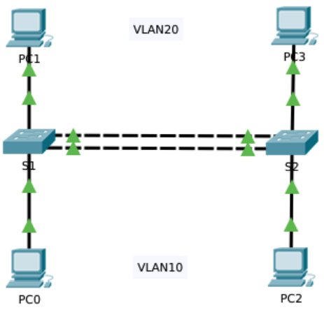
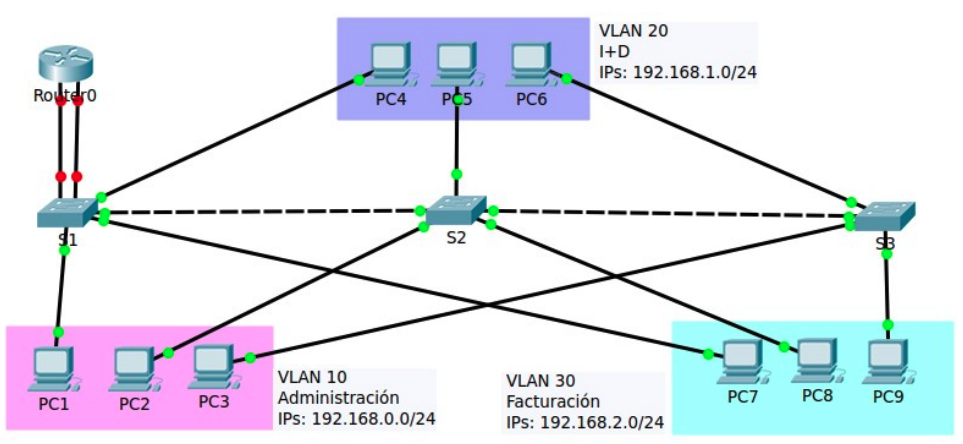
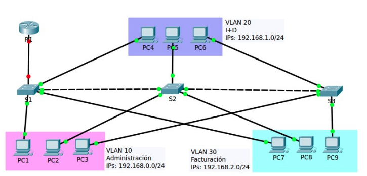
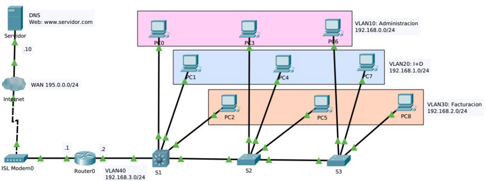
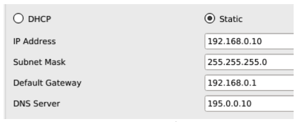
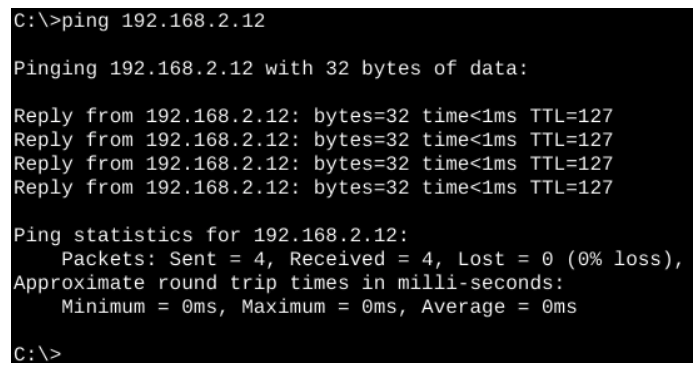
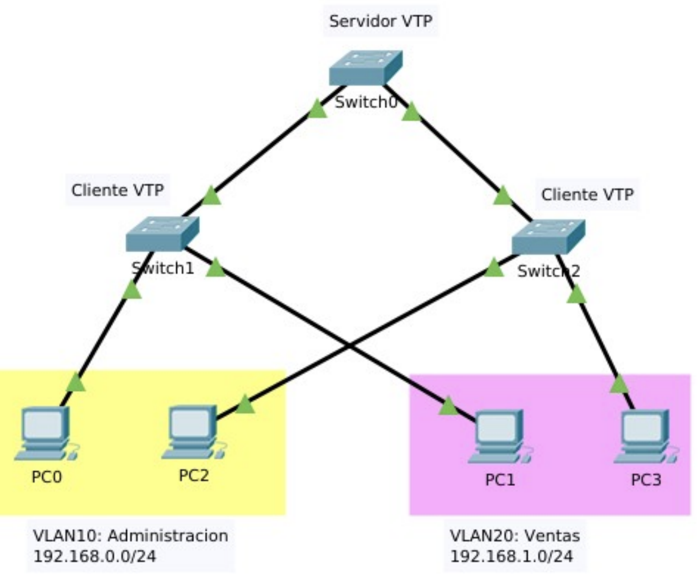

# Unidad 5 - Redes locales virtuales

## Introducción

El rendimiento de la red es un aspecto clave para la productividad de cualquier organización. Una de las estrategias más eficaces para mejorar dicho rendimiento consiste en dividir grandes dominios de difusión en dominios más pequeños. Por diseño, los routers no reenvían tramas de difusión entre interfaces, ya que su función principal es interconectar redes, no proporcionar conectividad directa a los dispositivos finales.

La provisión de acceso a la red local (LAN) recae normalmente en los switches de capa de acceso. A través de un switch de capa 2 es posible crear una VLAN (Red de Área Local Virtual), permitiendo así segmentar el dominio de difusión, de forma similar a como lo haría un dispositivo de capa 3.

Las VLANs permiten organizar la red de forma lógica, independientemente de la ubicación física de los dispositivos, y se integran habitualmente en el diseño de red para alinearse con la estructura organizativa.

Sin embargo, al segmentar la red en VLANs, es necesario un mecanismo de nivel 3 que permita la comunicación entre ellas. Este proceso de enrutamiento entre VLANs puede llevarse a cabo mediante un router o una interfaz de un switch de capa 3, facilitando así el control y la gestión del tráfico inter-VLAN.

Este capítulo se divide en dos partes:

- La primera trata sobre la configuración, administración y resolución de problemas relacionados con VLANs y enlaces troncales.
- La segunda se centra en la implementación del enrutamiento entre VLANs utilizando un router.

### Necesidad de utilizar VLANs

En un entorno conmutado, las VLANs permiten segmentar la red y ofrecen mayor flexibilidad organizativa. Permiten agrupar dispositivos lógicamente, de forma que los equipos dentro de una misma VLAN se comunican como si estuvieran conectados directamente al mismo medio físico, aunque en realidad estén dispersos físicamente.

Las VLANs facilitan al administrador la división de la red basándose en criterios como:

- Función de los usuarios.
- Equipos de proyecto.
- Aplicaciones concretas.

Esto se logra sin depender de la ubicación física de los dispositivos. A pesar de compartir la misma infraestructura física, los dispositivos pertenecientes a distintas VLANs funcionan como si estuvieran en redes separadas. Los paquetes de unidifusión, difusión y multidifusión se transmiten únicamente dentro de la VLAN de origen.

Cada VLAN se considera una red lógica independiente. Para que los dispositivos en diferentes VLANs puedan comunicarse, es necesario un dispositivo que proporcione funcionalidad de enrutamiento.

Una VLAN define un dominio de difusión lógico que puede extenderse a múltiples segmentos LAN físicos. Esto mejora el rendimiento de la red al limitar el alcance del tráfico de difusión a cada VLAN.

### Beneficios de una VLAN

Entre las principales ventajas del uso de VLANs se incluyen:

- **Seguridad**: Permiten aislar grupos con datos sensibles, reduciendo el riesgo de acceso no autorizado o pérdida de información confidencial.
- **Reducción de costos**: Al disminuir la necesidad de realizar actualizaciones de infraestructura y al optimizar el uso del ancho de banda y los enlaces existentes, se reducen los costos operativos.
- **Mejor rendimiento**: La segmentación lógica de la red en dominios de difusión más pequeños reduce el tráfico innecesario, lo que mejora el rendimiento general.
- **Control de dominios de difusión**: Limitar el número de dispositivos en un mismo dominio de difusión aumenta la eficiencia de la red.

En una red conmutada, cada VLAN corresponde a una red IP independiente. Por ello, el diseño de VLANs debe estar alineado con un esquema de direccionamiento jerárquico, lo que permite una asignación ordenada de bloques de direcciones IP a segmentos específicos de la red. Esta planificación facilita la administración y la escalabilidad de la infraestructura.

{ width="600" }

### Formato de trama

Los switches operan en la capa 2 del modelo OSI, y toman decisiones de reenvío utilizando la información contenida en el encabezado de la trama Ethernet. A diferencia de los routers, no utilizan tablas de enrutamiento para determinar el destino de los paquetes.

Las tramas Ethernet estándar no contienen información sobre VLANs. Por esta razón, cuando una trama debe atravesar un enlace troncal (que transporta tráfico de múltiples VLANs), es necesario añadir información adicional que identifique a qué VLAN pertenece. Este proceso se denomina etiquetado (tagging).

El etiquetado se realiza mediante la inserción de un encabezado conforme al estándar IEEE 802.1Q, el cual añade una etiqueta de 4 bytes a la trama Ethernet. Esta etiqueta especifica la VLAN de pertenencia de la trama.

Cuando un switch recibe una trama desde un puerto en modo acceso que pertenece a una VLAN, el switch:

- Añade la etiqueta VLAN correspondiente al encabezado de la trama.
- Recalcula la FCS (secuencia de verificación de trama).
- Envía la trama etiquetada por el enlace troncal correspondiente.

#### Detalles del campo de etiqueta de la VLAN

La etiqueta VLAN de 802.1Q contiene diversos subcampos que permiten identificar y clasificar el tráfico:

- **Tipo (TPID)**: Campo de 2 bytes denominado “Identificador de protocolo de etiqueta”. Para tramas Ethernet etiquetadas, este valor se establece en 0x8100 en hexadecimal.
- **Prioridad de usuario**: Campo de 3 bits que permite implementar niveles de calidad de servicio (QoS) para el tráfico.
- **Identificador de formato canónico (CFI)**: Campo de 1 bit utilizado para habilitar la compatibilidad con tramas Token Ring en enlaces Ethernet.
- **ID de VLAN (VID)**: Campo de 12 bits que identifica la VLAN a la que pertenece la trama. Este valor permite definir hasta 4096 VLANs diferentes.

{ width="600" }

Una vez insertada la etiqueta 802.1Q, el switch vuelve a calcular la FCS (Frame Check Sequence) y la reemplaza en la trama, asegurando así la integridad de los datos antes de su retransmisión.

### Tipos de VLAN

Existen distintos tipos de VLANs, clasificadas según el tipo de tráfico que gestionan o la función que cumplen dentro de la red. A continuación se describen los tipos más comunes:

#### VLAN de datos

Una VLAN de datos es aquella configurada para transportar el tráfico generado por los usuarios finales. No debe confundirse con las VLANs utilizadas para tráfico de administración o de voz. Por ello, es habitual mantener el tráfico de voz y de administración separado del tráfico de datos de usuario.

- A veces se conoce también como VLAN de usuario.
- Su función principal es dividir la red en grupos lógicos de usuarios o dispositivos, facilitando así la segmentación y gestión del tráfico.

#### VLAN predeterminada

En el arranque inicial de un switch, todos los puertos pertenecen a la VLAN predeterminada, que corresponde a la VLAN 1.

- Esta VLAN no puede eliminarse ni renombrarse.
- Todo el tráfico de control de capa 2 se asocia a la VLAN 1 por defecto.
- Aunque cumple con todas las funciones básicas de una VLAN, es recomendable no usarla para la operación normal de la red, por motivos de seguridad y buenas prácticas.

#### VLAN nativa

Una VLAN nativa es aquella asociada a un puerto de enlace troncal. Estos puertos permiten la transmisión de tráfico de múltiples VLANs entre switches.

- Los enlaces troncales transportan tanto tramas etiquetadas (con identificador 802.1Q) como tramas sin etiquetar.
- El tráfico sin etiquetar que entra a través de un puerto troncal se asigna automáticamente a la VLAN nativa de ese puerto.
- De forma predeterminada, la VLAN nativa es la VLAN 1.
- Las tramas de la VLAN nativa no llevan etiqueta cuando se transmiten por el enlace troncal, y el switch receptor las asocia a su VLAN nativa local.
- Este mecanismo se diseñó para asegurar la interoperabilidad con dispositivos antiguos que no son compatibles con 802.1Q.

Por motivos de seguridad, se recomienda:

- No utilizar la VLAN 1 como VLAN nativa.
- Crear una VLAN dedicada exclusivamente como nativa, sin que se asigne a ningún otro propósito en la red.

#### VLAN de administración

Una VLAN de administración es aquella que se utiliza para acceder remotamente a la gestión del switch.

- Por defecto, la VLAN 1 actúa como VLAN de administración.
- Para habilitar el acceso remoto, se debe configurar una dirección IP y una máscara de subred en la interfaz virtual (SVI) de la VLAN correspondiente.
- Esto permite gestionar el dispositivo mediante protocolos como HTTP, Telnet, SSH o SNMP.
- Aunque la VLAN 1 se utiliza por defecto, se recomienda asignar otra VLAN para funciones de administración, con el fin de mejorar la seguridad y el aislamiento del tráfico de gestión.

### Enlace troncal

Un enlace troncal (trunk) es una conexión punto a punto entre dos dispositivos de red que permite transportar tráfico de múltiples VLANs a través de un solo enlace físico.

Este tipo de enlace es fundamental para extender las VLANs a lo largo de toda la red, permitiendo que los dispositivos ubicados en distintos switches, pero pertenecientes a la misma VLAN, puedan comunicarse entre sí sin necesidad de pasar por un router.

Cisco implementa el estándar IEEE 802.1Q como protocolo de etiquetado de VLANs para los enlaces troncales. Este protocolo es compatible con interfaces Fast Ethernet, Gigabit Ethernet y 10-Gigabit Ethernet.

Las VLANs perderían gran parte de su funcionalidad sin los enlaces troncales, ya que estos enlaces permiten que:

- El tráfico de todas las VLANs configuradas se propague entre los switches.
- Los switches mantengan la separación lógica de las VLANs, incluso cuando los dispositivos están distribuidos en diferentes ubicaciones físicas.

Un enlace troncal no está asignado a una VLAN específica. En su lugar, actúa como canal común para el tráfico de varias VLANs entre switches o entre un switch y un router. También es posible configurar un enlace troncal entre un switch y un servidor o dispositivo con una interfaz de red (NIC) compatible con 802.1Q.

En los switches Cisco Catalyst, por defecto todos los puertos de enlace troncal aceptan tráfico de todas las VLANs, salvo que se especifique lo contrario mediante configuración. Esto facilita la interoperabilidad y la expansión de las VLANs dentro de un dominio conmutado.

## Gestión de VLANs

Para que una VLAN funcione correctamente, es necesario realizar una serie de pasos en la configuración de los dispositivos de red. Estos pasos son esenciales para garantizar que los dispositivos pertenecientes a la misma VLAN puedan comunicarse, y que el tráfico entre VLANs esté adecuadamente controlado. Las operaciones necesarias son las siguientes:

1. **Crear la VLAN**: Se debe definir la VLAN dentro del switch, asignándole un número identificador (ID) y, opcionalmente, un nombre descriptivo.
2. **Asignar puertos a la VLAN**: Los puertos del switch que se utilizarán para conectar dispositivos a la VLAN deben configurarse explícitamente para formar parte de esa VLAN. Esta asignación puede ser estática (manual) o dinámica (mediante protocolos como VMPS).
3. **Crear enlaces troncales (si es necesario)**: En entornos con varios switches interconectados, es imprescindible establecer enlaces troncales entre ellos. Esto permite que el tráfico de diferentes VLANs pueda circular entre switches, asegurando la conectividad entre dispositivos de una misma VLAN ubicados en diferentes puntos de la red.
4. **Verificar la conectividad**: Una vez completada la configuración, es importante comprobar el correcto funcionamiento de las VLANs. Esto incluye validar que los dispositivos asignados a una misma VLAN puedan comunicarse entre sí y que no exista comunicación entre VLANs distintas (salvo que esté configurado un router o un switch de capa 3 para tal fin).

A continuación, se explicarán en detalle cada uno de estos pasos utilizando una red de ejemplo que permitirá ilustrar de forma práctica el proceso completo de configuración de VLANs.

{ width="600" }

La tabla de asignación de puertos a las VLANs e IPs de los ordenadores se muestra a continuación:

| VLAN | Nombre | Red | Puertos |
| -- | -- | -- | -- |
| VLAN10 | Administración | 192.168.0.0/24 | S1 -> 1 a 8, S2 -> 1 a 8, S3 -> 1 a 8 |
| VLAN20 | I+D | 192.168.1.0/24 | S1 -> 9 a 16, S2 -> 9 a 16, S3-> 9 a 16 |
| VLAN30 | Facturación | 192.168.2.0/24 | S1 -> 17 a 24, S2 -> 17 a 24, S3 -> 17 a 24 |

Los enlaces troncales se crean con los puertos GigabitEthernet. El primero es de S1-G0/1 a S2-G0/1 y el segundo de S2-G0/2 a S3-G0/1.

### Creación de VLANs

Al configurar VLANs en un switch, los parámetros definidos se almacenan de forma persistente en la memoria flash del dispositivo, concretamente en un archivo llamado vlan.dat. Esta memoria no se borra al apagar el switch, por lo que no es necesario ejecutar el comando copy running-config startup-config para conservar las VLANs creadas.

Sin embargo, dado que la creación de VLANs suele ir acompañada de otras configuraciones (como la asignación de puertos, enlaces troncales o direcciones de administración), sí se recomienda guardar los cambios de la configuración en ejecución para asegurar que el resto de la configuración también se mantenga tras un reinicio.

La creación de una VLAN se realiza desde el modo de configuración global, utilizando el comando:

```
vlan <id-vlan>
```

Donde <id-vlan\> es un número entero que identifica de forma única a la VLAN.

Una vez creada, es una buena práctica asignar un nombre descriptivo mediante el comando:

```
name <nombre>
```

Este comando se introduce en el modo de configuración de VLAN.

Las VLANs deben configurarse de forma coherente en todos los switches del entorno conmutado, especialmente si se desea que tengan conectividad a través de enlaces troncales.

A continuación se muestra un ejemplo de configuración básica de VLANs en el switch S1:

```
S1>enable  
S1#configure terminal  
Enter configuration commands, one per line. End with CNTL/Z.  
S1(config)#vlan 10  
S1(config-vlan)#name Administracion  
S1(config-vlan)#exit  

S1(config)#vlan 20  
S1(config-vlan)#name I+D  
S1(config-vlan)#exit  

S1(config)#vlan 30  
S1(config-vlan)#name Facturacion  
S1(config-vlan)#exit  
```

Con estos comandos, se han creado tres VLANs distintas, cada una con un nombre representativo de su función dentro de la organización.

#### Identificadores de VLAN

Los switches Cisco admiten una cantidad variable de VLANs, aunque este número suele ser más que suficiente para cubrir las necesidades de la mayoría de las organizaciones. En total, pueden definirse hasta 4096 VLANs, ya que el campo de identificación de VLAN (VID) en el encabezado 802.1Q es de 12 bits (2¹² = 4096).

Las VLANs se dividen en dos rangos:

- **VLANs de rango normal**: Identificadas por valores del 1 al 1005.
- **VLANs de rango extendido**: Identificadas por valores del 1006 al 4094.

##### VLANs de rango normal

Estas VLANs se utilizan comúnmente en redes de pequeñas y medianas empresas. Sus características principales son:

- Se identifican mediante un ID de VLAN entre 1 y 1005.
- Los ID del 1002 al 1005 están reservados para tecnologías heredadas como Token Ring y FDDI (Fiber Distributed Data Interface).
- Las VLANs con ID 1 y del 1002 al 1005 se crean de forma automática y no pueden eliminarse.
- La configuración de estas VLANs se almacena en la memoria flash, dentro del archivo vlan.dat.
- El protocolo VTP (VLAN Trunking Protocol), que facilita la gestión de VLANs entre múltiples switches, solo admite VLANs de este rango.

##### VLANs de rango extendido

Estas VLANs están pensadas para escenarios de mayor escala, como entornos gestionados por proveedores de servicios o grandes empresas multinacionales. Sus características son:

- Se identifican mediante un ID de VLAN entre 1006 y 4094.
- No se almacenan en el archivo vlan.dat, sino que, por defecto, se guardan en la configuración en ejecución.
- Admiten menos funciones en comparación con las VLANs de rango normal.
- VTP no detecta ni propaga VLANs de este rango.

Este comportamiento hace que las VLANs de rango extendido sean menos versátiles en entornos donde se requiere gestión centralizada mediante VTP, pero útiles cuando se necesita una gran cantidad de identificadores VLAN para segmentación avanzada.

### Asignación de puertos

Una vez creada una VLAN, el siguiente paso consiste en asignar puertos del switch a dicha VLAN. Cada puerto de acceso puede pertenecer únicamente a una VLAN a la vez.

En el contexto de una VLAN, existen dos tipos principales de puertos:

- **Puerto de acceso**: Se utiliza para conectar dispositivos finales como PCs, impresoras o teléfonos IP. Las tramas que circulan por este tipo de puerto no están etiquetadas con información VLAN.
- **Puerto troncal**: Se utiliza para establecer enlaces entre switches, permitiendo el transporte de tráfico de múltiples VLANs. Las tramas que se envían o reciben a través de un puerto troncal sí llevan etiquetas VLAN (802.1Q).

Este apartado se centra en la configuración de puertos de acceso. La configuración de puertos troncales se abordará más adelante.

#### Configuración de puertos de acceso

De forma predeterminada, todos los puertos de un switch Cisco se encuentran en modo acceso. No obstante, es una buena práctica configurar explícitamente este modo como medida de seguridad, utilizando el comando:

```
switchport mode access
```

A continuación, se debe asignar el puerto a una VLAN específica mediante:

```
switchport access vlan <id-vlan>
```

Por ejemplo, para asignar el puerto FastEthernet 0/1 a la VLAN 10 en el switch S1, se utilizarían los siguientes comandos:

```
S1>enable  
S1#configure terminal  
Enter configuration commands, one per line. End with CNTL/Z.  
S1(config)#interface fa0/1  
S1(config-if)#switchport mode access  
S1(config-if)#switchport access vlan 10  
S1(config-if)#exit  
```

#### Configuración de varios puertos simultáneamente

La asignación individual de puertos puede resultar lenta y repetitiva. Para agilizar el proceso, se puede utilizar el comando interface range, que permite configurar múltiples interfaces a la vez.

A continuación se muestra cómo asignar varios puertos a diferentes VLANs en un solo bloque de comandos:

```
S1(config)#interface range fa0/2 - 8  
S1(config-if-range)#switchport mode access  
S1(config-if-range)#switchport access vlan 10  
S1(config-if-range)#exit  

S1(config)#interface range fa0/9 - 16  
S1(config-if-range)#switchport mode access  
S1(config-if-range)#switchport access vlan 20  
S1(config-if-range)#exit  

S1(config)#interface range fa0/17 - 24  
S1(config-if-range)#switchport mode access  
S1(config-if-range)#switchport access vlan 30  
S1(config-if-range)#exit  
```

Con esta configuración, los puertos FastEthernet 0/2 al 0/8 se asignan a la VLAN 10, los puertos 0/9 al 0/16 a la VLAN 20, y los puertos 0/17 al 0/24 a la VLAN 30. Esta técnica es especialmente útil para realizar configuraciones rápidas y consistentes en switches con muchos puertos.

### Cambio de pertenencia de puertos a una VLAN

Es posible modificar la pertenencia VLAN de un puerto de forma sencilla, sin necesidad de eliminar previamente su configuración actual.

Una opción consiste en utilizar el comando:

```
no switchport access vlan
```

Este comando, ejecutado desde el modo de configuración de interfaz, devuelve el puerto a su estado predeterminado, asignándolo nuevamente a la VLAN 1.

En cualquier caso, no es necesario eliminar una VLAN de un puerto antes de reasignarlo a otra VLAN. Basta con asignar una nueva VLAN al puerto, lo que reemplaza automáticamente su pertenencia anterior. Esto permite reconfigurar rápidamente la topología lógica de una red sin necesidad de pasos intermedios.

### Eliminación de VLANs

Para eliminar una VLAN del switch, se utiliza el siguiente comando desde el modo de configuración global:

```
no vlan <id-vlan>
```

Este comando elimina la VLAN especificada solo si no tiene puertos asignados. Por ello, antes de eliminar una VLAN es necesario reasignar todos sus puertos a otra VLAN activa. Si no se realiza esta reasignación, los puertos que permanecen sin VLAN quedarán inactivos y sin capacidad de comunicación hasta que se les asigne una nueva VLAN válida.

#### Eliminación completa del archivo vlan.dat

También se puede restablecer completamente la configuración de VLANs eliminando el archivo vlan.dat, que contiene la base de datos de VLANs del switch. Para ello, desde el modo EXEC privilegiado, se ejecuta:

```
delete flash:vlan.dat
```

Si el archivo vlan.dat no ha sido movido de su ubicación por defecto, se puede utilizar la versión abreviada:

```
delete vlan.dat
```

Una vez eliminado este archivo, es necesario reiniciar el switch para que los cambios surtan efecto. Tras el reinicio, las VLANs configuradas anteriormente ya no estarán presentes y el switch volverá a su estado predeterminado en cuanto a VLANs.

Para restaurar por completo el switch a su configuración de fábrica, también se recomienda borrar el archivo de configuración de inicio mediante:

```
erase startup-config
```

Y, a continuación, reiniciar el dispositivo con el comando:

```
reload
```

Esta combinación de comandos restablece el switch a sus condiciones iniciales, eliminando tanto las VLANs como cualquier otra configuración almacenada.

### Verificación de la información de VLAN

Una vez configuradas las VLANs en un switch, es posible verificar su estado y propiedades utilizando distintos comandos del modo EXEC privilegiado del sistema operativo Cisco IOS.

El comando principal para consultar esta información es:

```
show vlan [brief | id <id-vlan> | name <nombre> | summary]
```

Donde cada argumento permite visualizar información específica:

- **brief**: Muestra un resumen de todas las VLANs, indicando su nombre, estado y los puertos asociados.
- **id**: Muestra los detalles de una VLAN concreta, identificada por su ID.
- **name**: Presenta la información de una VLAN específica, utilizando su nombre.
- **summary**: Proporciona una vista condensada de todas las VLANs.

Ejemplo de salida del comando show vlan

El siguiente ejemplo muestra la ejecución del comando sin argumentos adicionales, lo que genera una tabla completa con todas las VLANs configuradas:

```
S1>enable
S1#show vlan

VLAN Name                             Status    Ports
---- -------------------------------- --------- -------------------------------
1    default                          active    Gig0/1, Gig0/2
10   Administracion                   active    Fa0/1, Fa0/2, Fa0/3, Fa0/4
                                                 Fa0/5, Fa0/6, Fa0/7, Fa0/8
20   I+D                              active    Fa0/9, Fa0/10, Fa0/11, Fa0/12
                                                 Fa0/13, Fa0/14, Fa0/15, Fa0/16
30   Facturacion                      active    Fa0/17, Fa0/18, Fa0/19, Fa0/20
                                                 Fa0/21, Fa0/22, Fa0/23, Fa0/24
1002 fddi-default                     active    
1003 token-ring-default               active    
1004 fddinet-default                  active    
1005 trnet-default                    active    

VLAN Type  SAID     MTU  Parent RingNo BridgeNo Stp BrdgMode Trans1 Trans2
---- ----- -------- ----- ------ ------ -------- ---- -------- ------ ------
1    enet  100001   1500    -      -       -       -     -      0      0
10   enet  100010   1500    -      -       -       -     -      0      0
20   enet  100020   1500    -      -       -       -     -      0      0
30   enet  100030   1500    -      -       -       -     -      0      0
1002 fddi  101002   1500    -      -       -       -     -      0      0
1003 tr    101003   1500    -      -       -       -     -      0      0
1004 fdnet 101004   1500    -      -       -     ieee    -      0      0
1005 trnet 101005   1500    -      -       -     ibm     -      0      0
```

**Consultas específicas**

Para visualizar solo la información de una VLAN concreta, se puede utilizar:

```
S1#show vlan id 10
```

Salida esperada:

```
VLAN Name             Status    Ports
---- ---------------- --------- -------------------------------
10   Administracion    active    Fa0/1, Fa0/2, Fa0/3, Fa0/4
                                 Fa0/5, Fa0/6, Fa0/7, Fa0/8

VLAN Type  SAID     MTU  Parent RingNo BridgeNo Stp BrdgMode Trans1 Trans2
---- ----- -------- ----- ------ ------ -------- ---- -------- ------ ------
10   enet  100010   1500    -      -       -       -     -      0      0
```

Este mismo resultado se puede obtener usando el nombre de la VLAN en lugar de su ID:

```
S1#show vlan name Administracion
```

Ambos comandos son útiles para validar que los puertos han sido asignados correctamente a cada VLAN y que la configuración está activa.

### Configuración de enlaces troncales

Un enlace troncal de VLAN es una conexión entre dos switches que permite el tránsito de tráfico correspondiente a múltiples VLANs. Por defecto, todos los tráficos de VLANs son transportados por el enlace, salvo que se restrinjan las VLANs permitidas de forma manual o dinámica.

Para configurar una interfaz como puerto troncal, se utiliza el siguiente comando desde el modo de configuración de interfaz:

```
switchport mode trunk
```

Este comando configura la interfaz en modo troncal permanente, permitiendo el etiquetado de tramas conforme al estándar IEEE 802.1Q.

Ejemplo de configuración de un enlace troncal entre S1 y S2

Supongamos que los switches S1 y S2 están interconectados mediante sus interfaces GigabitEthernet0/1. Ambos puertos deben configurarse como troncales. La configuración sería la siguiente:

En S1:

```
S1>enable
S1#configure terminal
Enter configuration commands, one per line. End with CNTL/Z.
S1(config)#interface g0/1
S1(config-if)#switchport mode trunk
```

Al aplicar esta configuración, es posible que aparezcan mensajes indicando el cambio de estado del protocolo de línea:

```
%LINEPROTO-5-UPDOWN: Line protocol on Interface GigabitEthernet0/1, changed state to down
%LINEPROTO-5-UPDOWN: Line protocol on Interface GigabitEthernet0/1, changed state to up
```

En S2:

```
S2>enable
S2#configure terminal
Enter configuration commands, one per line. End with CNTL/Z.
S2(config)#interface g0/1
S2(config-if)#switchport mode trunk
```

Una vez configurado el enlace troncal entre S1 y S2, será necesario repetir el mismo procedimiento para establecer el enlace troncal entre S2 y S3, utilizando las interfaces correspondientes de cada switch.

Esta configuración asegura que las VLANs puedan propagarse correctamente entre los distintos switches del entorno conmutado.

#### VLAN nativa

Como se explicó anteriormente, la VLAN nativa es aquella a la que se asignan las tramas que llegan por un puerto troncal sin etiqueta VLAN. Por defecto, esta VLAN es la número 1, aunque por motivos de seguridad se recomienda utilizar una VLAN diferente.

La asignación de una VLAN nativa distinta se realiza desde el modo de configuración de interfaz con el siguiente comando:

```
switchport trunk native vlan id-vlan
```

Por ejemplo, para configurar la VLAN 99 como VLAN nativa en el puerto troncal del switch S1:

```
S1(config)#interface g0/1
S1(config-if)#switchport trunk native vlan 99
```

Si el puerto correspondiente en el otro extremo del enlace (en este caso, en el switch S2) aún tiene configurada la VLAN nativa por defecto (1), aparecerá una advertencia:

```
%CDP-4-NATIVE_VLAN_MISMATCH: Native VLAN mismatch discovered on GigabitEthernet0/1 (99), with S2 GigabitEthernet0/1 (1).
```

Esto indica una discrepancia entre las VLAN nativas en ambos extremos del troncal. Para corregirlo, se debe configurar también en S2 la misma VLAN nativa:

```
S2(config)#interface g0/1
S2(config-if)#switchport trunk native vlan 99
```

#### Seguridad VLAN

Para limitar el tráfico de VLANs que puede transitar por un enlace troncal, se puede definir una lista explícita de VLANs permitidas. Esto se hace con el siguiente comando:

```
switchport trunk allowed vlan lista-vlan
```

Por ejemplo, si se desea permitir únicamente el tráfico etiquetado de las VLANs 10, 20, 30, y la VLAN nativa 99 en el puerto troncal g0/1 del switch S1, se configuraría así:

```
S1(config-if)#switchport trunk allowed vlan 10,20,30,99
```

#### EtherChannel como enlace troncal

Dado que los enlaces entre switches suelen manejar un volumen de tráfico considerable, es recomendable utilizar puertos Gigabit Ethernet. Sin embargo, los switches suelen tener un número limitado de estos puertos. Para superar esta limitación y aumentar el ancho de banda, se puede utilizar un EtherChannel.

Un EtherChannel agrupa varias interfaces físicas en una única interfaz lógica, lo que permite sumar el ancho de banda de las interfaces agrupadas. Por ejemplo, un EtherChannel compuesto por cuatro interfaces FastEthernet proporciona un ancho de banda de 400 Mbps.

{ width="400" }

Es posible utilizar un EtherChannel como enlace troncal entre switches. En el siguiente ejemplo, se agrupan las interfaces GigabitEthernet0/1 y GigabitEthernet0/2 del switch S1:

```
S1(config)#interface port-channel 1
S1(config-if)#exit
S1(config)#interface range g0/1-2
S1(config-if-range)#channel-group 1 mode on
```

En el switch S2 deben ejecutarse los mismos comandos para formar el EtherChannel.

Una vez creado, se configura como troncal de la misma manera que se haría con una interfaz física:

```
S1(config)#interface port-channel 1
S1(config-if)#switchport mode trunk
```

Los mismos comandos deben ejecutarse también en el switch S2 para completar la configuración del enlace troncal sobre EtherChannel.

### Restablecimiento del enlace troncal al estado predeterminado

Si se desea devolver un puerto configurado como enlace troncal a su estado por defecto, es necesario restablecer los parámetros que se hayan modificado, como la lista de VLANs permitidas, la VLAN nativa y el modo de operación del puerto.

Para ello, se deben ejecutar los siguientes comandos:

```
S1(config)#interface g0/1
S1(config-if)#no switchport trunk allowed vlan 10,20,30,99
S1(config-if)#no switchport trunk native vlan 99
S1(config-if)#switchport mode access
```

Con esta configuración:

- Se elimina la lista de VLANs permitidas personalizada.
- Se restaura la VLAN nativa a la predeterminada (VLAN 1).
- El puerto se configura nuevamente como puerto de acceso, saliendo del modo troncal.

## Enrutamiento entre VLANs

Los dispositivos ubicados en diferentes VLANs no pueden comunicarse entre sí sin la intervención de un dispositivo de capa 3 que realice funciones de enrutamiento. Los switches de capa 2 tienen capacidades limitadas en lo que respecta al procesamiento de IPv4 e IPv6, por lo que no son adecuados para esta tarea, especialmente cuando se requiere enrutamiento dinámico.

Para proporcionar conectividad entre VLANs, es necesario utilizar un router o un switch de capa 3 (también conocido como switch multicapa). El proceso de envío de tráfico entre VLANs mediante un dispositivo de capa 3 se denomina enrutamiento entre VLANs.

Existen tres métodos principales para implementar el enrutamiento entre VLANs:

- Enrutamiento entre VLANs tradicional (obsoleto).
- Router-on-a-stick.
- Enrutamiento mediante interfaces virtuales de switch (SVI).

### Enrutamiento entre VLANs tradicional

En este método, ya en desuso, se utiliza un router con múltiples interfaces físicas, cada una conectada a un puerto del switch configurado en una VLAN específica. Cada puerto del switch debe estar en modo acceso y vinculado a una VLAN determinada.

Por cada VLAN que se desea enrutar, se requiere una interfaz física distinta en el router. Esta interfaz se configura con una dirección IP perteneciente a la subred asociada a la VLAN correspondiente. De esta forma, el router actúa como puerta de enlace (gateway) para los dispositivos de la VLAN.

Limitaciones:

- Escalabilidad muy reducida: el número de VLANs enrutables está limitado por la cantidad de interfaces físicas disponibles en el router.
- Uso poco eficiente del hardware disponible.

Ejemplo de configuración

{ width="600" }

En la topología propuesta, se conecta el router R1 al switch S1 con dos interfaces físicas:

- La interfaz G0/0 del router se conecta al puerto Fa0/2 del switch (asignado a la VLAN 10).
- La interfaz G0/1 se conecta al puerto Fa0/9 del switch (asignado a la VLAN 20).

Configuración del router:

```
R1>enable
R1#configure terminal
R1(config)#interface g0/0
R1(config-if)#ip address 192.168.0.1 255.255.255.0
R1(config-if)#no shutdown

R1(config-if)#interface g0/1
R1(config-if)#ip address 192.168.1.1 255.255.255.0
R1(config-if)#no shutdown
```

Una vez configurado, los dispositivos de ambas VLANs pueden utilizar el router como gateway y comunicarse entre sí a través de él.

Verificación:

Al configurar adecuadamente las direcciones IP en los PCs (por ejemplo, PC1 y PC4), se puede verificar la conectividad mediante el comando ping.

Este método resulta ineficiente y está obsoleto en entornos modernos, donde se utilizan soluciones como router-on-a-stick o switches multicapa con SVI para ofrecer mayor escalabilidad y flexibilidad.

### Enrutamiento entre VLANs mediante Router-on-a-Stick

El enrutamiento entre VLANs utilizando interfaces físicas individuales presenta una clara limitación: los routers disponen de un número reducido de interfaces físicas. A medida que crece el número de VLANs en una red, asignar una interfaz física por VLAN se vuelve inviable.

Una solución eficiente es implementar subinterfaces virtuales sobre una única interfaz física del router, configurada como enlace troncal. Este método se denomina router-on-a-stick y permite enrutar tráfico entre múltiples VLANs a través de una sola interfaz física.

{ width="600" }

Funcionamiento:

- Una única interfaz física del router se conecta al switch mediante un enlace troncal.
- En esa interfaz física se configuran varias subinterfaces, una por cada VLAN.
- Cada subinterfaz se configura con:
    - Una dirección IP correspondiente a la subred de la VLAN.
    - Una identificación de VLAN mediante encapsulation dot1Q.

Ejemplo de implementación

Supongamos la siguiente conexión:

- Router R1 (G0/0) ↔ Switch S1 (G0/2)

Configuración del switch S1

```
S1>enable
S1#configure terminal
S1(config)#interface g0/2
S1(config-if)#switchport mode trunk
```

Configuración del router R1

```
R1>enable
R1#configure terminal

R1(config)#interface g0/0.10
R1(config-subif)#encapsulation dot1Q 10
R1(config-subif)#ip address 192.168.0.1 255.255.255.0

R1(config)#interface g0/0.20
R1(config-subif)#encapsulation dot1Q 20
R1(config-subif)#ip address 192.168.1.1 255.255.255.0

R1(config)#interface g0/0.30
R1(config-subif)#encapsulation dot1Q 30
R1(config-subif)#ip address 192.168.2.1 255.255.255.0

R1(config)#interface g0/0
R1(config-if)#no shutdown
```

Explicación de la configuración:

- **Subinterfaces**: se crean con el comando interface g0/0.X, donde X suele coincidir con el ID de la VLAN correspondiente.
- **Encapsulación**: encapsulation dot1Q asocia la subinterfaz a una VLAN específica.
- **Dirección IP**: cada subinterfaz recibe una IP de su respectiva subred.
- **Activación**: el comando no shutdown se aplica sobre la interfaz física. Las subinterfaces se activan automáticamente si la interfaz principal está activa.

Ventajas:

- Requiere solo una interfaz física en el router.
- Permite enrutar entre múltiples VLANs con una solución eficiente y escalable.
- Simplifica la gestión y mantenimiento en redes medianas y grandes.


Una vez aplicada esta configuración, los dispositivos ubicados en diferentes VLANs pueden comunicarse entre sí, ya que el router enruta internamente el tráfico a través de las subinterfaces correspondientes.

### Switch de capa 3

Es habitual que los switches incorporen funciones de nivel 3. Este tipo de switches admite funciones básicas de nivel de red, como el enrutamiento estático.
Cuando en una topología de red se crea una VLAN, el switch dispone de una interfaz virtual (SVI) a la que podemos asignar una dirección IP. Todos los dispositivos conectados a la VLAN pueden utilizar la dirección IP de la VLAN como puerta de enlace. Además, al configurar la SVI del switch con una dirección IP y activar el enrutamiento, se añade automáticamente a su tabla de enrutamiento una ruta directamente conectada para la red de la VLAN.

Para ilustrar este tipo de topología, vamos a emplear la siguiente red de ejemplo.

{ width="750" }

| VLAN | Nombre | Red | Puertos | SVI |
| -- | -- | -- | -- | -- |
| VLAN10 | Administración | 192.168.0.0/24 | SW1 -> Fa0/1-9, SW2 -> Fa0/1-9, SW3 -> Fa0/1-9 | 192.168.0.1 | 
| VLAN20 | I+D | 192.168.1.0/24 | SW1 -> Fa0/10-19, SW2 -> Fa0/10-19, SW3 -> Fa0/10-19 | 192.168.1.1 |
| VLAN30 | Facturación | 192.168.2.0/24 | SW1 -> Fa0/20-24, SW2 -> Fa0/20-24, SW3 -> Fa0/20-24 | 192.168.2.1 |
| VLAN40 | Router | 192.168.3.0/24 | SW3 -> G0/1 | 192.168.3.1 |

Es común que muchos switches modernos incluyan capacidades de nivel 3, lo que les permite realizar funciones básicas de red, como el enrutamiento estático.

Cuando se crea una VLAN en una red, el switch genera una interfaz virtual (SVI) a la que se le puede asignar una dirección IP. Esta dirección puede ser utilizada como puerta de enlace por todos los dispositivos conectados a esa VLAN. Al asignar una dirección IP a la SVI y habilitar el enrutamiento, el switch añade automáticamente una ruta directamente conectada a su tabla de enrutamiento para esa red.

Para ilustrar este tipo de configuración, trabajaremos con una topología en la que uno de los switches es de capa 3 y será el encargado de gestionar el enrutamiento entre VLANs. El router que aparece conectado a este switch tiene como función proporcionar salida a Internet para todos los dispositivos de la red. En la red también se incluye un servidor que ofrece servicios DNS y HTTP, lo cual nos permitirá comprobar la conectividad desde cualquier equipo cliente. En cada VLAN, los dispositivos empezarán a recibir direcciones IP a partir del valor 10.

Primero, se procede a crear las VLAN en cada uno de los switches. En el switch S1, la configuración sería la siguiente:

```
S1(config)#vlan 10
S1(config-vlan)#name Administracion
S1(config-vlan)#exit
S1(config)#vlan 20
S1(config-vlan)#name I+D
S1(config-vlan)#exit
S1(config)#vlan 30
S1(config-vlan)#name Facturacion
S1(config-vlan)#exit
S1(config)#vlan 40
S1(config-vlan)#name Router
S1(config-vlan)#exit
```

Se repite la misma configuración en los switches S2 y S3, creando las mismas VLAN con sus respectivos nombres.

A continuación, se configuran los enlaces troncales entre los switches. El enlace entre S1 y S2 se establece a través de las interfaces GigabitEthernet 0/1 en ambos dispositivos. En el switch S1, los comandos serían:

```
S1(config)#interface g0/1
S1(config-if)#switchport trunk encapsulation dot1q
S1(config-if)#switchport mode trunk
S1(config-if)#switchport trunk native vlan 99
S1(config-if)#switchport trunk allowed vlan 10,20,30,40,99
```

Y en S2:

```
S2(config)#interface g0/1
S2(config-if)#switchport trunk encapsulation dot1q
S2(config-if)#switchport mode trunk
S2(config-if)#switchport trunk native vlan 99
S2(config-if)#switchport trunk allowed vlan 10,20,30,40,99
```

El mismo proceso se realiza para enlazar S2 con S3, utilizando las interfaces G0/2. Luego se procede a asignar los puertos de acceso a cada VLAN en todos los switches.

Por ejemplo, en el switch S1:

```
S1(config)#interface range fa0/1-9
S1(config-if-range)#switchport mode access
S1(config-if-range)#switchport access vlan 10
...
```

El siguiente paso consiste en configurar las interfaces virtuales para cada VLAN en el switch de capa 3 (S1). A cada interfaz SVI se le asigna una dirección IP:

```
S1(config)#interface vlan10
S1(config-if)#ip address 192.168.0.1 255.255.255.0
...
```

Finalmente, para habilitar la función de enrutamiento entre VLANs, es necesario activar el enrutamiento en el switch mediante:

```
S1(config)#ip routing
```

Una vez hecho esto, se puede comprobar que la tabla de enrutamiento del switch contiene rutas conectadas para todas las redes de las VLAN creadas.

Cada PC debe tener como puerta de enlace la dirección IP correspondiente a la VLAN en la que se encuentra conectado. Por ejemplo, en el PC0 sería así:

{ width="450" }

Podemos comprobar la conectividad en la red haciendo ping desde el PC0 al PC8.

{ width="450" }

Una vez establecido el enrutamiento entre las VLANs, se procede a habilitar el acceso a Internet desde los dispositivos de la topología, utilizando enrutamiento estático tanto en el switch multicapa como en el router.

Primero se configuran las interfaces del router con las siguientes instrucciones:

```
Router(config)#interface g0/0  
Router(config-if)#ip address 192.168.2.1 255.255.255.0  
Router(config-if)#no shutdown  
Router(config-if)#interface g0/1  
Router(config-if)#ip address 195.0.0.1 255.255.255.0  
Router(config-if)#no shutdown  
Router(config-if)#  
```

A continuación, en el switch multicapa se añade una ruta por defecto utilizando como siguiente salto la IP del router en la VLAN 40:

```
S1(config)#ip route 0.0.0.0 0.0.0.0 192.168.3.2  
S1(config)#  
```

La tabla de enrutamiento del switch S1 quedaría así:

```
S1#show ip route  
Codes: C - connected, S - static, I - IGRP, R - RIP, M - mobile, B - BGP  
       D - EIGRP, EX - EIGRP external, O - OSPF, IA - OSPF inter area  
       N1 - OSPF NSSA external type 1, N2 - OSPF NSSA external type 2  
       E1 - OSPF external type 1, E2 - OSPF external type 2, E - EGP  
       i - IS-IS, L1 - IS-IS level-1, L2 - IS-IS level-2, ia - IS-IS inter area  
       * - candidate default, U - per-user static route, o - ODR  
       P - periodic downloaded static route  
  
Gateway of last resort is 192.168.3.2 to network 0.0.0.0  
  
C 192.168.0.0/24 is directly connected, Vlan10  
C 192.168.1.0/24 is directly connected, Vlan20  
C 192.168.2.0/24 is directly connected, Vlan30  
C 192.168.3.0/24 is directly connected, Vlan40  
S* 0.0.0.0/0 [1/0] via 192.168.3.2  
```

Esto permite a los paquetes procedentes de cualquier VLAN alcanzar el exterior. Para el tráfico de retorno, se configura en el router una ruta estática resumida que abarque todas las VLAN internas, utilizando como siguiente salto la dirección IP del switch en la VLAN 40:

```
Router(config)#ip route 192.168.0.0 255.255.252.0 192.168.3.1  
Router(config)#  
```

Con esta configuración, el acceso a Internet se encuentra plenamente habilitado. Se puede verificar accediendo desde el navegador del PC0 al servidor web, siempre que este tenga correctamente definida la puerta de enlace con la dirección IP 195.0.0.1.

## Administración centralizada

VTP (Virtual Trunking Protocol) permite gestionar VLANs de forma centralizada. Sin VTP, cada vez que se crea, modifica o elimina una VLAN es necesario realizar esa configuración manualmente en cada switch de la red.

VTP es un protocolo de Capa 2 del modelo OSI (enlace de datos) que garantiza la coherencia en la creación, gestión y eliminación de VLANs dentro de un dominio común, evitando errores de configuración, duplicación y mejorando la seguridad. Existen tres versiones de VTP: 1, 2 y 3.

### Terminología VTP

Antes de configurar VTP es necesario conocer su terminología básica:

- **Dominio VTP**: Conjunto de switches bajo una administración común. Un switch solo puede pertenecer a un dominio VTP. Por defecto, no pertenece a ninguno hasta que se configure como servidor o reciba una actualización. Las actualizaciones se intercambian por enlaces troncales y contienen el nombre del dominio y un número de revisión. Si un switch recibe una actualización de otro dominio o con número de revisión inferior, la ignora.
- **Modos VTP**:
    - **Servidor VTP**: Puede crear, modificar y eliminar VLANs. Es el modo por defecto. Participa activamente en el envío, recepción y sincronización de actualizaciones.
    - **Cliente VTP**: Recibe y reenvía actualizaciones VTP, pero no puede realizar cambios en la configuración de VLANs.
    - **VTP Transparente**: No procesa actualizaciones, pero en versiones 2 y 3 puede reenviarlas por los enlaces troncales. No participa en la propagación ni modificación de VLANs.
    - **VTP Off**: Similar al modo transparente, pero no reenvía ningún tipo de actualización.

### Configuración VTP

El escenario de red que se empleará requiere la configuración del protocolo VTP y sigue estos pasos:

1. **Configuración de los puertos troncales**: Se deben configurar los enlaces entre los tres switches en modo troncal. Además, todos los demás puertos deben configurarse en modo acceso como medida de seguridad.
2. **Configuración del protocolo VTP**:
    - Se establecerá un dominio VTP común para los tres switches.
    - Uno de los switches se configurará en modo servidor VTP.
    - Los otros dos switches se configurarán en modo cliente VTP.
    - Las VLANs se crearán únicamente en el switch configurado como servidor.
    - Finalmente, se asignarán los puertos a las VLAN correspondientes en cada switch.

{ width="500" }

#### Configuración de los puertos troncales

Los enlaces que conectan los switches deben configurarse en modo troncal para permitir el reenvío de tráfico de todas las VLANs. El resto de puertos debe establecerse en modo acceso como medida de seguridad.

En el switch0 (Servidor VTP) se configura lo siguiente:

```
ServidorVTP>enable
ServidorVTP#configure terminal
ServidorVTP(config)#interface g0/1
ServidorVTP(config-if)#switchport mode trunk
ServidorVTP(config-if)#interface g0/2
ServidorVTP(config-if)#switchport mode trunk
ServidorVTP(config-if)#interface range fa0/1-24
ServidorVTP(config-if-range)#switchport mode access
```

En el switch1 se establece la siguiente configuración:

```
switch1>enable
switch1#configure terminal
switch1(config)#interface g0/1
switch1(config-if)#switchport mode trunk
switch1(config-if)#interface range fa0/1-24
switch1(config-if-range)#switchport mode access
```

Finalmente, en el switch2, la configuración sería:

```
switch2>enable
switch2#configure terminal
switch2(config)#interface g0/2
switch2(config-if)#switchport mode trunk
switch2(config-if)#interface range fa0/1-24
switch2(config-if-range)#switchport mode access
```

#### Configuración del protocolo VTP en los switches

Para establecer el protocolo VTP, primero se define el dominio con el comando vtp domain nombre. Este parámetro es sensible a mayúsculas y minúsculas. Luego se asigna una contraseña al dominio con vtp password, y se indica el modo de operación con vtp mode {server | client | transparent}.

En el switch servidor se configura lo siguiente:

```
ServidorVTP(config)#vtp domain ejemplo
Changing VTP domain name from NULL to ejemplo
ServidorVTP(config)#vtp password clave1234
Setting device VLAN database password to clave1234
ServidorVTP(config)#vtp mode server
Device mode already VTP SERVER.
```

En switch1 se ejecuta:

```
switch1(config)#vtp domain ejemplo
Domain name already set to ejemplo.
switch1(config)#vtp password clave1234
Setting device VLAN database password to clave1234
switch1(config)#vtp mode client
Setting device to VTP CLIENT mode.
```

En switch2 se realiza la misma configuración:

```
switch2(config)#vtp domain ejemplo
Domain name already set to ejemplo.
switch2(config)#vtp password clave1234
Setting device VLAN database password to clave1234
switch2(config)#vtp mode client
Setting device to VTP CLIENT mode.
```

A continuación se crean las VLANs en el switch servidor, que las propagará automáticamente a los demás switches configurados como clientes:

```
ServidorVTP(config)#vlan 10
ServidorVTP(config-vlan)#name Administracion
ServidorVTP(config-vlan)#vlan 20
ServidorVTP(config-vlan)#name Ventas
```

Las VLANs creadas se pueden verificar con el comando show vlan brief.

Salida en el switch servidor:

```
10  Administracion  active
20  Ventas         active
```

Salida en switch1 y switch2:

```
10  Administracion  active
20  Ventas         active
```

Esto confirma que las VLANs fueron correctamente propagadas mediante VTP.

#### Asignación de puertos a las VLANs

En este último paso se asignan los puertos a las VLAN correspondientes. En los switches 1 y 2, los puertos FastEthernet del 1 al 13 se asignan a la VLAN de Administración (VLAN 10), y los puertos del 14 al 24 a la VLAN de Ventas (VLAN 20).

En switch1 se ejecuta:

```
switch1(config)#interface range fa0/1-13
switch1(config-if-range)#switchport access vlan 10
switch1(config-if-range)#interface range fa0/14-24
switch1(config-if-range)#switchport access vlan 20
```

En switch2 la configuración es idéntica:

```
switch2(config)#interface range fa0/1-13
switch2(config-if-range)#switchport access vlan 10
switch2(config-if-range)#interface range fa0/14-24
switch2(config-if-range)#switchport access vlan 20
```

Una vez asignados los puertos a sus respectivas VLANs, se puede verificar la conectividad entre los PCs pertenecientes a la misma VLAN.