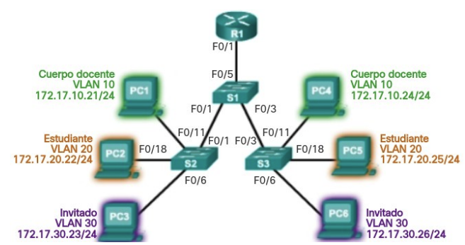
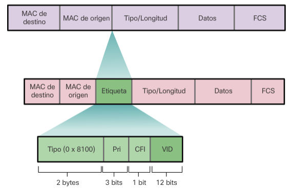
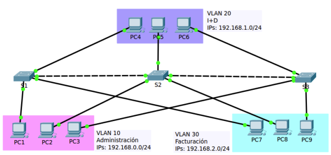

# Unidad 5 - Redes locales virtuales

## Introducción

El rendimiento de la red es un aspecto clave para la productividad de cualquier organización. Una de las estrategias más eficaces para mejorar dicho rendimiento consiste en dividir grandes dominios de difusión en dominios más pequeños. Por diseño, los routers no reenvían tramas de difusión entre interfaces, ya que su función principal es interconectar redes, no proporcionar conectividad directa a los dispositivos finales.

La provisión de acceso a la red local (LAN) recae normalmente en los switches de capa de acceso. A través de un switch de capa 2 es posible crear una VLAN (Red de Área Local Virtual), permitiendo así segmentar el dominio de difusión, de forma similar a como lo haría un dispositivo de capa 3.

Las VLANs permiten organizar la red de forma lógica, independientemente de la ubicación física de los dispositivos, y se integran habitualmente en el diseño de red para alinearse con la estructura organizativa.

Sin embargo, al segmentar la red en VLANs, es necesario un mecanismo de nivel 3 que permita la comunicación entre ellas. Este proceso de enrutamiento entre VLANs puede llevarse a cabo mediante un router o una interfaz de un switch de capa 3, facilitando así el control y la gestión del tráfico inter-VLAN.

Este capítulo se divide en dos partes:

- La primera trata sobre la configuración, administración y resolución de problemas relacionados con VLANs y enlaces troncales.
- La segunda se centra en la implementación del enrutamiento entre VLANs utilizando un router.

### Necesidad de utilizar VLANs

En un entorno conmutado, las VLANs permiten segmentar la red y ofrecen mayor flexibilidad organizativa. Permiten agrupar dispositivos lógicamente, de forma que los equipos dentro de una misma VLAN se comunican como si estuvieran conectados directamente al mismo medio físico, aunque en realidad estén dispersos físicamente.

Las VLANs facilitan al administrador la división de la red basándose en criterios como:

- Función de los usuarios.
- Equipos de proyecto.
- Aplicaciones concretas.

Esto se logra sin depender de la ubicación física de los dispositivos. A pesar de compartir la misma infraestructura física, los dispositivos pertenecientes a distintas VLANs funcionan como si estuvieran en redes separadas. Los paquetes de unidifusión, difusión y multidifusión se transmiten únicamente dentro de la VLAN de origen.

Cada VLAN se considera una red lógica independiente. Para que los dispositivos en diferentes VLANs puedan comunicarse, es necesario un dispositivo que proporcione funcionalidad de enrutamiento.

Una VLAN define un dominio de difusión lógico que puede extenderse a múltiples segmentos LAN físicos. Esto mejora el rendimiento de la red al limitar el alcance del tráfico de difusión a cada VLAN.

### Beneficios de una VLAN

Entre las principales ventajas del uso de VLANs se incluyen:

- **Seguridad**: Permiten aislar grupos con datos sensibles, reduciendo el riesgo de acceso no autorizado o pérdida de información confidencial.
- **Reducción de costos**: Al disminuir la necesidad de realizar actualizaciones de infraestructura y al optimizar el uso del ancho de banda y los enlaces existentes, se reducen los costos operativos.
- **Mejor rendimiento**: La segmentación lógica de la red en dominios de difusión más pequeños reduce el tráfico innecesario, lo que mejora el rendimiento general.
- **Control de dominios de difusión**: Limitar el número de dispositivos en un mismo dominio de difusión aumenta la eficiencia de la red.

En una red conmutada, cada VLAN corresponde a una red IP independiente. Por ello, el diseño de VLANs debe estar alineado con un esquema de direccionamiento jerárquico, lo que permite una asignación ordenada de bloques de direcciones IP a segmentos específicos de la red. Esta planificación facilita la administración y la escalabilidad de la infraestructura.

<center>{ width="600" }</center>

### Formato de trama

Los switches operan en la capa 2 del modelo OSI, y toman decisiones de reenvío utilizando la información contenida en el encabezado de la trama Ethernet. A diferencia de los routers, no utilizan tablas de enrutamiento para determinar el destino de los paquetes.

Las tramas Ethernet estándar no contienen información sobre VLANs. Por esta razón, cuando una trama debe atravesar un enlace troncal (que transporta tráfico de múltiples VLANs), es necesario añadir información adicional que identifique a qué VLAN pertenece. Este proceso se denomina etiquetado (tagging).

El etiquetado se realiza mediante la inserción de un encabezado conforme al estándar IEEE 802.1Q, el cual añade una etiqueta de 4 bytes a la trama Ethernet. Esta etiqueta especifica la VLAN de pertenencia de la trama.

Cuando un switch recibe una trama desde un puerto en modo acceso que pertenece a una VLAN, el switch:

- Añade la etiqueta VLAN correspondiente al encabezado de la trama.
- Recalcula la FCS (secuencia de verificación de trama).
- Envía la trama etiquetada por el enlace troncal correspondiente.

#### Detalles del campo de etiqueta de la VLAN

La etiqueta VLAN de 802.1Q contiene diversos subcampos que permiten identificar y clasificar el tráfico:

- **Tipo (TPID)**: Campo de 2 bytes denominado “Identificador de protocolo de etiqueta”. Para tramas Ethernet etiquetadas, este valor se establece en 0x8100 en hexadecimal.
- **Prioridad de usuario**: Campo de 3 bits que permite implementar niveles de calidad de servicio (QoS) para el tráfico.
- **Identificador de formato canónico (CFI)**: Campo de 1 bit utilizado para habilitar la compatibilidad con tramas Token Ring en enlaces Ethernet.
- **ID de VLAN (VID)**: Campo de 12 bits que identifica la VLAN a la que pertenece la trama. Este valor permite definir hasta 4096 VLANs diferentes.

<center>{ width="600" }</center>

Una vez insertada la etiqueta 802.1Q, el switch vuelve a calcular la FCS (Frame Check Sequence) y la reemplaza en la trama, asegurando así la integridad de los datos antes de su retransmisión.

### Tipos de VLAN

Existen distintos tipos de VLANs, clasificadas según el tipo de tráfico que gestionan o la función que cumplen dentro de la red. A continuación se describen los tipos más comunes:

#### VLAN de datos

Una VLAN de datos es aquella configurada para transportar el tráfico generado por los usuarios finales. No debe confundirse con las VLANs utilizadas para tráfico de administración o de voz. Por ello, es habitual mantener el tráfico de voz y de administración separado del tráfico de datos de usuario.

- A veces se conoce también como VLAN de usuario.
- Su función principal es dividir la red en grupos lógicos de usuarios o dispositivos, facilitando así la segmentación y gestión del tráfico.

#### VLAN predeterminada

En el arranque inicial de un switch, todos los puertos pertenecen a la VLAN predeterminada, que corresponde a la VLAN 1.

- Esta VLAN no puede eliminarse ni renombrarse.
- Todo el tráfico de control de capa 2 se asocia a la VLAN 1 por defecto.
- Aunque cumple con todas las funciones básicas de una VLAN, es recomendable no usarla para la operación normal de la red, por motivos de seguridad y buenas prácticas.

#### VLAN nativa

Una VLAN nativa es aquella asociada a un puerto de enlace troncal. Estos puertos permiten la transmisión de tráfico de múltiples VLANs entre switches.

- Los enlaces troncales transportan tanto tramas etiquetadas (con identificador 802.1Q) como tramas sin etiquetar.
- El tráfico sin etiquetar que entra a través de un puerto troncal se asigna automáticamente a la VLAN nativa de ese puerto.
- De forma predeterminada, la VLAN nativa es la VLAN 1.
- Las tramas de la VLAN nativa no llevan etiqueta cuando se transmiten por el enlace troncal, y el switch receptor las asocia a su VLAN nativa local.
- Este mecanismo se diseñó para asegurar la interoperabilidad con dispositivos antiguos que no son compatibles con 802.1Q.

Por motivos de seguridad, se recomienda:

- No utilizar la VLAN 1 como VLAN nativa.
- Crear una VLAN dedicada exclusivamente como nativa, sin que se asigne a ningún otro propósito en la red.

#### VLAN de administración

Una VLAN de administración es aquella que se utiliza para acceder remotamente a la gestión del switch.

- Por defecto, la VLAN 1 actúa como VLAN de administración.
- Para habilitar el acceso remoto, se debe configurar una dirección IP y una máscara de subred en la interfaz virtual (SVI) de la VLAN correspondiente.
- Esto permite gestionar el dispositivo mediante protocolos como HTTP, Telnet, SSH o SNMP.
- Aunque la VLAN 1 se utiliza por defecto, se recomienda asignar otra VLAN para funciones de administración, con el fin de mejorar la seguridad y el aislamiento del tráfico de gestión.

### Enlace troncal

Un enlace troncal (trunk) es una conexión punto a punto entre dos dispositivos de red que permite transportar tráfico de múltiples VLANs a través de un solo enlace físico.

Este tipo de enlace es fundamental para extender las VLANs a lo largo de toda la red, permitiendo que los dispositivos ubicados en distintos switches, pero pertenecientes a la misma VLAN, puedan comunicarse entre sí sin necesidad de pasar por un router.

Cisco implementa el estándar IEEE 802.1Q como protocolo de etiquetado de VLANs para los enlaces troncales. Este protocolo es compatible con interfaces Fast Ethernet, Gigabit Ethernet y 10-Gigabit Ethernet.

Las VLANs perderían gran parte de su funcionalidad sin los enlaces troncales, ya que estos enlaces permiten que:

- El tráfico de todas las VLANs configuradas se propague entre los switches.
- Los switches mantengan la separación lógica de las VLANs, incluso cuando los dispositivos están distribuidos en diferentes ubicaciones físicas.

Un enlace troncal no está asignado a una VLAN específica. En su lugar, actúa como canal común para el tráfico de varias VLANs entre switches o entre un switch y un router. También es posible configurar un enlace troncal entre un switch y un servidor o dispositivo con una interfaz de red (NIC) compatible con 802.1Q.

En los switches Cisco Catalyst, por defecto todos los puertos de enlace troncal aceptan tráfico de todas las VLANs, salvo que se especifique lo contrario mediante configuración. Esto facilita la interoperabilidad y la expansión de las VLANs dentro de un dominio conmutado.

## Gestión de VLANs

Para que una VLAN funcione correctamente, es necesario realizar una serie de pasos en la configuración de los dispositivos de red. Estos pasos son esenciales para garantizar que los dispositivos pertenecientes a la misma VLAN puedan comunicarse, y que el tráfico entre VLANs esté adecuadamente controlado. Las operaciones necesarias son las siguientes:

1. **Crear la VLAN**: Se debe definir la VLAN dentro del switch, asignándole un número identificador (ID) y, opcionalmente, un nombre descriptivo.
2. **Asignar puertos a la VLAN**: Los puertos del switch que se utilizarán para conectar dispositivos a la VLAN deben configurarse explícitamente para formar parte de esa VLAN. Esta asignación puede ser estática (manual) o dinámica (mediante protocolos como VMPS).
3. **Crear enlaces troncales (si es necesario)**: En entornos con varios switches interconectados, es imprescindible establecer enlaces troncales entre ellos. Esto permite que el tráfico de diferentes VLANs pueda circular entre switches, asegurando la conectividad entre dispositivos de una misma VLAN ubicados en diferentes puntos de la red.
4. **Verificar la conectividad**: Una vez completada la configuración, es importante comprobar el correcto funcionamiento de las VLANs. Esto incluye validar que los dispositivos asignados a una misma VLAN puedan comunicarse entre sí y que no exista comunicación entre VLANs distintas (salvo que esté configurado un router o un switch de capa 3 para tal fin).

A continuación, se explicarán en detalle cada uno de estos pasos utilizando una red de ejemplo que permitirá ilustrar de forma práctica el proceso completo de configuración de VLANs.

<center>{ width="600" }</center>

La tabla de asignación de puertos a las VLANs e IPs de los ordenadores se muestra a continuación:

| VLAN | Nombre | Red | Puertos |
| -- | -- | -- | -- |
| VLAN10 | Administración | 192.168.0.0/24 | S1 -> 1 a 8, S2 -> 1 a 8, S3 -> 1 a 8 |
| VLAN20 | I+D | 192.168.1.0/24 | S1 -> 9 a 16, S2 -> 9 a 16, S3-> 9 a 16 |
| VLAN30 | Facturación | 192.168.2.0/24 | S1 -> 17 a 24, S2 -> 17 a 24, S3 -> 17 a 24 |

Los enlaces troncales se crean con los puertos GigabitEthernet. El primero es de S1-G0/1 a S2-G0/1 y el segundo de S2-G0/2 a S3-G0/1.

### Creación de VLANs

Al configurar VLANs en un switch, los parámetros definidos se almacenan de forma persistente en la memoria flash del dispositivo, concretamente en un archivo llamado vlan.dat. Esta memoria no se borra al apagar el switch, por lo que no es necesario ejecutar el comando copy running-config startup-config para conservar las VLANs creadas.

Sin embargo, dado que la creación de VLANs suele ir acompañada de otras configuraciones (como la asignación de puertos, enlaces troncales o direcciones de administración), sí se recomienda guardar los cambios de la configuración en ejecución para asegurar que el resto de la configuración también se mantenga tras un reinicio.

La creación de una VLAN se realiza desde el modo de configuración global, utilizando el comando:

```
vlan <id-vlan>
```

Donde <id-vlan\> es un número entero que identifica de forma única a la VLAN.

Una vez creada, es una buena práctica asignar un nombre descriptivo mediante el comando:

```
name <nombre>
```

Este comando se introduce en el modo de configuración de VLAN.

Las VLANs deben configurarse de forma coherente en todos los switches del entorno conmutado, especialmente si se desea que tengan conectividad a través de enlaces troncales.

A continuación se muestra un ejemplo de configuración básica de VLANs en el switch S1:

```
S1>enable  
S1#configure terminal  
Enter configuration commands, one per line. End with CNTL/Z.  
S1(config)#vlan 10  
S1(config-vlan)#name Administracion  
S1(config-vlan)#exit  

S1(config)#vlan 20  
S1(config-vlan)#name I+D  
S1(config-vlan)#exit  

S1(config)#vlan 30  
S1(config-vlan)#name Facturacion  
S1(config-vlan)#exit  
```

Con estos comandos, se han creado tres VLANs distintas, cada una con un nombre representativo de su función dentro de la organización.

#### Identificadores de VLAN

Los switches Cisco admiten una cantidad variable de VLANs, aunque este número suele ser más que suficiente para cubrir las necesidades de la mayoría de las organizaciones. En total, pueden definirse hasta 4096 VLANs, ya que el campo de identificación de VLAN (VID) en el encabezado 802.1Q es de 12 bits (2¹² = 4096).

Las VLANs se dividen en dos rangos:

- **VLANs de rango normal**: Identificadas por valores del 1 al 1005.
- **VLANs de rango extendido**: Identificadas por valores del 1006 al 4094.

##### VLANs de rango normal

Estas VLANs se utilizan comúnmente en redes de pequeñas y medianas empresas. Sus características principales son:

- Se identifican mediante un ID de VLAN entre 1 y 1005.
- Los ID del 1002 al 1005 están reservados para tecnologías heredadas como Token Ring y FDDI (Fiber Distributed Data Interface).
- Las VLANs con ID 1 y del 1002 al 1005 se crean de forma automática y no pueden eliminarse.
- La configuración de estas VLANs se almacena en la memoria flash, dentro del archivo vlan.dat.
- El protocolo VTP (VLAN Trunking Protocol), que facilita la gestión de VLANs entre múltiples switches, solo admite VLANs de este rango.

##### VLANs de rango extendido

Estas VLANs están pensadas para escenarios de mayor escala, como entornos gestionados por proveedores de servicios o grandes empresas multinacionales. Sus características son:

- Se identifican mediante un ID de VLAN entre 1006 y 4094.
- No se almacenan en el archivo vlan.dat, sino que, por defecto, se guardan en la configuración en ejecución.
- Admiten menos funciones en comparación con las VLANs de rango normal.
- VTP no detecta ni propaga VLANs de este rango.

Este comportamiento hace que las VLANs de rango extendido sean menos versátiles en entornos donde se requiere gestión centralizada mediante VTP, pero útiles cuando se necesita una gran cantidad de identificadores VLAN para segmentación avanzada.

### 2.2 Asignación de puertos

Una vez creada una VLAN, el siguiente paso consiste en asignar puertos del switch a dicha VLAN. Cada puerto de acceso puede pertenecer únicamente a una VLAN a la vez.

En el contexto de una VLAN, existen dos tipos principales de puertos:

- **Puerto de acceso**: Se utiliza para conectar dispositivos finales como PCs, impresoras o teléfonos IP. Las tramas que circulan por este tipo de puerto no están etiquetadas con información VLAN.
**Puerto troncal**: Se utiliza para establecer enlaces entre switches, permitiendo el transporte de tráfico de múltiples VLANs. Las tramas que se envían o reciben a través de un puerto troncal sí llevan etiquetas VLAN (802.1Q).

Este apartado se centra en la configuración de puertos de acceso. La configuración de puertos troncales se abordará más adelante.

#### Configuración de puertos de acceso

De forma predeterminada, todos los puertos de un switch Cisco se encuentran en modo acceso. No obstante, es una buena práctica configurar explícitamente este modo como medida de seguridad, utilizando el comando:

```
switchport mode access
```

A continuación, se debe asignar el puerto a una VLAN específica mediante:

```
switchport access vlan <id-vlan>
```

Por ejemplo, para asignar el puerto FastEthernet 0/1 a la VLAN 10 en el switch S1, se utilizarían los siguientes comandos:

```
S1>enable  
S1#configure terminal  
Enter configuration commands, one per line. End with CNTL/Z.  
S1(config)#interface fa0/1  
S1(config-if)#switchport mode access  
S1(config-if)#switchport access vlan 10  
S1(config-if)#exit  
```

#### Configuración de varios puertos simultáneamente

La asignación individual de puertos puede resultar lenta y repetitiva. Para agilizar el proceso, se puede utilizar el comando interface range, que permite configurar múltiples interfaces a la vez.

A continuación se muestra cómo asignar varios puertos a diferentes VLANs en un solo bloque de comandos:

```
S1(config)#interface range fa0/2 - 8  
S1(config-if-range)#switchport mode access  
S1(config-if-range)#switchport access vlan 10  
S1(config-if-range)#exit  

S1(config)#interface range fa0/9 - 16  
S1(config-if-range)#switchport mode access  
S1(config-if-range)#switchport access vlan 20  
S1(config-if-range)#exit  

S1(config)#interface range fa0/17 - 24  
S1(config-if-range)#switchport mode access  
S1(config-if-range)#switchport access vlan 30  
S1(config-if-range)#exit  
```

Con esta configuración, los puertos FastEthernet 0/2 al 0/8 se asignan a la VLAN 10, los puertos 0/9 al 0/16 a la VLAN 20, y los puertos 0/17 al 0/24 a la VLAN 30. Esta técnica es especialmente útil para realizar configuraciones rápidas y consistentes en switches con muchos puertos.

### Cambio de pertenencia de puertos a una VLAN

Es posible modificar la pertenencia VLAN de un puerto de forma sencilla, sin necesidad de eliminar previamente su configuración actual.

Una opción consiste en utilizar el comando:

```
no switchport access vlan
```

Este comando, ejecutado desde el modo de configuración de interfaz, devuelve el puerto a su estado predeterminado, asignándolo nuevamente a la VLAN 1.

En cualquier caso, no es necesario eliminar una VLAN de un puerto antes de reasignarlo a otra VLAN. Basta con asignar una nueva VLAN al puerto, lo que reemplaza automáticamente su pertenencia anterior. Esto permite reconfigurar rápidamente la topología lógica de una red sin necesidad de pasos intermedios.

### Eliminación de VLANs

Para eliminar una VLAN del switch, se utiliza el siguiente comando desde el modo de configuración global:

```
no vlan <id-vlan>
```

Este comando elimina la VLAN especificada solo si no tiene puertos asignados. Por ello, antes de eliminar una VLAN es necesario reasignar todos sus puertos a otra VLAN activa. Si no se realiza esta reasignación, los puertos que permanecen sin VLAN quedarán inactivos y sin capacidad de comunicación hasta que se les asigne una nueva VLAN válida.

#### Eliminación completa del archivo vlan.dat

También se puede restablecer completamente la configuración de VLANs eliminando el archivo vlan.dat, que contiene la base de datos de VLANs del switch. Para ello, desde el modo EXEC privilegiado, se ejecuta:

```
delete flash:vlan.dat
```

Si el archivo vlan.dat no ha sido movido de su ubicación por defecto, se puede utilizar la versión abreviada:

```
delete vlan.dat
```

Una vez eliminado este archivo, es necesario reiniciar el switch para que los cambios surtan efecto. Tras el reinicio, las VLANs configuradas anteriormente ya no estarán presentes y el switch volverá a su estado predeterminado en cuanto a VLANs.

Para restaurar por completo el switch a su configuración de fábrica, también se recomienda borrar el archivo de configuración de inicio mediante:

```
erase startup-config
```

Y, a continuación, reiniciar el dispositivo con el comando:

```
reload
```

Esta combinación de comandos restablece el switch a sus condiciones iniciales, eliminando tanto las VLANs como cualquier otra configuración almacenada.