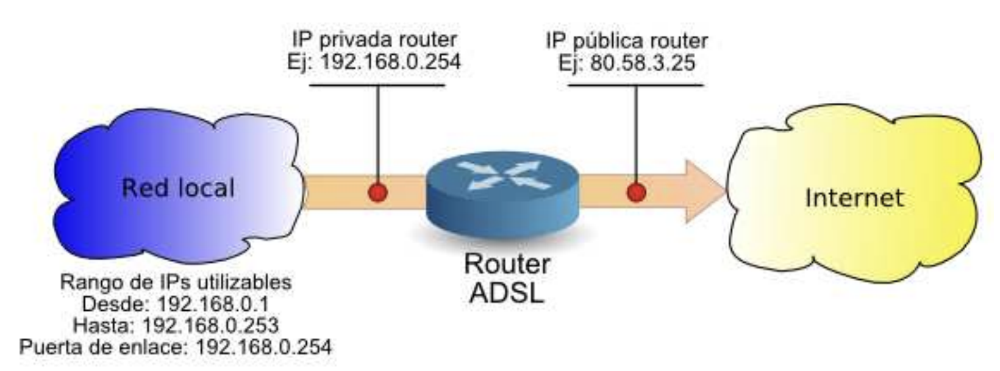
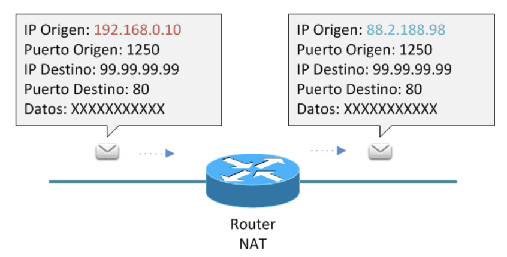
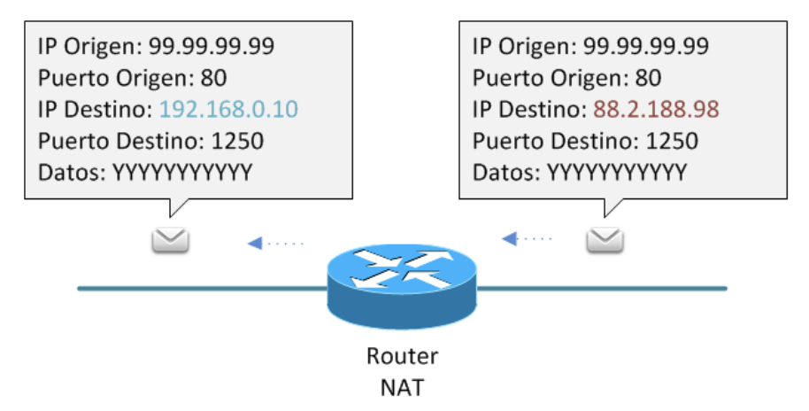
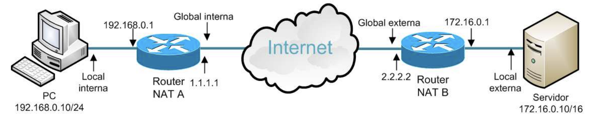
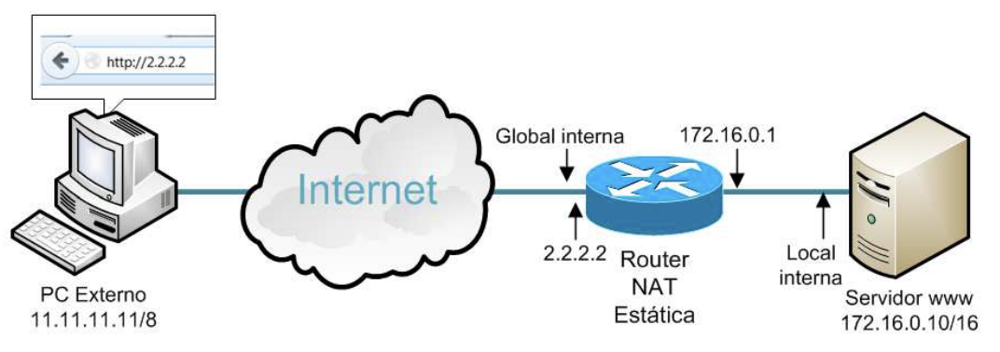
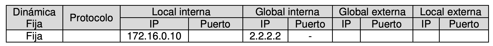
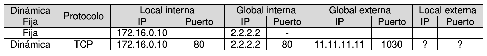
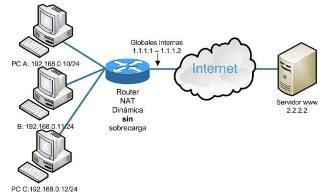
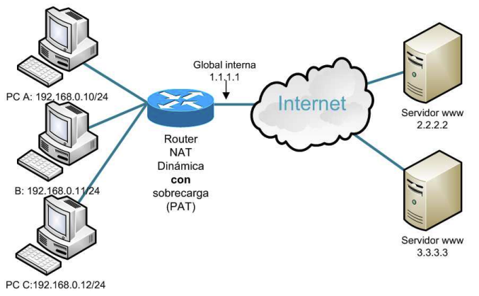
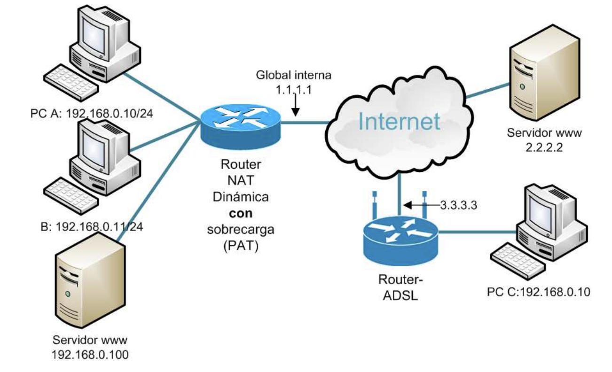

# Unidad 7 - Conexión a redes de área extensa

## Introducción

Para hacer que Internet fuese accesible y atractivo para el gran público, se han diseñado dispositivos fáciles de usar, aunque integran muchas de las funciones que se estudian en esta asignatura. Pese a su sencillez, estos dispositivos ofrecen amplias opciones de configuración: compartir la conexión, acceder remotamente al ordenador del hogar, o imprimir desde el móvil en la impresora de casa, entre otras. El conocimiento adquirido es esencial para poder realizar estas tareas.

## Direccionamiento interno y externo

La expansión masiva de Internet provocó el agotamiento de direcciones IPv4 públicas. En Europa, RIPE asignó el último bloque en 2012. Aunque existe IPv6 como solución a largo plazo, su implantación aún no es total.

Ante esta situación, se desarrollaron alternativas que permitieran seguir utilizando IPv4. La más utilizada fue NAT (Network Address Translation), una técnica que permite compartir una única dirección IPv4 pública entre múltiples dispositivos. Estos dispositivos reciben direcciones IPv4 privadas para comunicarse entre sí. Gracias a NAT, estas IP privadas quedan ocultas desde el exterior, estableciendo así dos tipos de direccionamiento: interno (privado) y externo (público).

{ width="600" }

El direccionamiento interno se emplea en redes locales privadas para permitir la comunicación entre dispositivos. Para ello, deben utilizarse direcciones IP dentro de los rangos definidos por la RFC 1918, que son los siguientes:

| CLASE | RANGO RESERVADO |
| -- | -- |
| A | 10.0.0.0 - 10.255.255.255 |
| B | 172.16.0.0 - 172.31.0.0 |
| C | 192.168.0.0 - 192.168.255.0 |

Estas direcciones están aisladas del resto de Internet. De hecho, los routers en la red global suelen estar configurados para descartar cualquier paquete que tenga como destino una dirección privada. Por tanto, las IP privadas solo tienen validez dentro de la red donde se asignan.

El uso de direcciones internas aporta seguridad, ya que impide que estas redes sean visibles directamente desde Internet. Esta característica se considera una ventaja de IPv4, frente a IPv6, donde se pretende que todos los dispositivos tengan direcciones públicas.

El direccionamiento externo corresponde a las redes públicas, que utilizan direcciones IP válidas en Internet, es decir, aquellas que no pertenecen a los rangos privados ni a las reservadas por otros fines especiales (RFC 3330). Estas direcciones públicas son accesibles desde cualquier dispositivo conectado a la red global.

## NAT

NAT (Network Address Translation) es una técnica que permite modificar las direcciones IP contenidas en los paquetes que pasan por un router, sustituyendo unas direcciones por otras.

En el proceso más común, cuando un paquete IP sale de una red privada hacia Internet, el router NAT cambia la dirección IP de origen (una IP privada) por una dirección IP pública antes de reenviar el paquete. Así, el dispositivo externo ve el paquete como si procediera del router y no del dispositivo interno.

Aunque este es el caso más habitual, NAT puede aplicarse de varias formas, incluyendo la modificación de:

- La dirección IP de origen o de destino.
- Los números de puerto.
- Traducción de muchas IPs internas a una sola IP externa (NAT overload o PAT).
- Traducción de una IP a una IP (NAT estático), entre otros.

NAT es esencial para permitir que múltiples dispositivos compartan una única dirección IP pública y, al mismo tiempo, mantener cierta seguridad y aislamiento entre la red interna y el exterior.

### NAT origen

NAT en origen (Source NAT) es un tipo de traducción de direcciones que consiste en sustituir la dirección IP de origen de un paquete por otra dirección IP diferente antes de enviarlo fuera de la red local.

Este tipo de NAT es el más habitual en redes que acceden a Internet:
cuando un dispositivo con una IP privada envía un paquete, el router sustituye su IP de origen por una IP pública (normalmente la del propio router), permitiendo así que el paquete sea aceptado en redes externas.

{ width="500" }

### NAT destino

NAT en Destino o Destination NAT consiste en sustituir la dirección IP de destino de un paquete por una diferente. Este proceso es necesario cuando un dispositivo externo accede a un recurso dentro de una red privada, como un servidor web, y se requiere que el tráfico entrante se redirija a la IP interna correspondiente.

{ width="500" }

La NAT de origen y la NAT de destino están estrechamente relacionadas, ya que toda traducción NAT en origen debe complementarse con una traducción inversa en destino al recibir la respuesta. Es decir, cuando se modifica la IP de origen de un paquete al salir, al regresar la respuesta debe restaurarse esa IP como destino, permitiendo así que el paquete llegue correctamente al dispositivo solicitante.

### Tabla NAT

El dispositivo encargado de realizar la traducción de direcciones IP mantiene un registro de dichas conversiones en una tabla NAT. Esta tabla permite identificar a qué dispositivo interno debe redirigirse una respuesta recibida desde el exterior, garantizando así la correcta continuidad de la comunicación.

En dicha tabla pueden aparecer los siguientes tipos de direcciones:

- **Dirección local interna (inside local)**: IP privada del dispositivo interno que origina la comunicación.
- **Dirección global interna (inside global)**: IP pública asignada temporalmente al dispositivo interno al salir por el router NAT.
- **Dirección global externa (outside global)**: IP pública del dispositivo externo al que se quiere acceder.
- **Dirección local externa (outside local)**: Dirección interna (en caso de uso de NAT por parte del destino) correspondiente al dispositivo externo.

Ejemplo (visto desde el router A):

| Local interna | Global interna | Global externa | Local externa |
| -- | -- | -- | -- |
| 192.168.0.10 | 1.1.1.1 | 2.2.2.2 | 172.16.0.10 |

{ width="700" }

Desde el punto de vista del router B, los conceptos de interno y externo se invertirían.

## Tipos de NAT

Existen diversas técnicas de traducción de direcciones IP y puertos, según el tipo de modificación que se realice en los paquetes. Es importante tener en cuenta que la nomenclatura puede variar dependiendo del contexto o la fuente. A continuación, se explican algunos términos y sus posibles interpretaciones:

- **SNAT**: Generalmente hace referencia a Source NAT, es decir, la traducción de la dirección IP de origen. No obstante, en algunas ocasiones también se utiliza para referirse a Static NAT, que veremos más adelante.
- **DNAT**: De forma genérica, se asocia a Destination NAT, o traducción de la IP de destino. Sin embargo, también se emplea frecuentemente para hacer referencia a la técnica de apertura de puertos o port forwarding, que se explicará más adelante.
- **NAT**: Aunque el término abarca cualquier tipo de traducción de direcciones IP, comúnmente se utiliza para referirse a NAT dinámico con sobrecarga, también conocido como PAT (Port Address Translation), que es el tipo más habitual de NAT. En este documento, se ha adoptado este uso.

### NAT estática

La NAT estática realiza una traducción uno a uno entre una dirección IP privada (local interna) y una dirección IP pública (global interna). Se denomina “estática” porque la relación entre ambas direcciones es fija y permanente: siempre se traduce la misma IP privada a la misma IP pública, y viceversa.

Esto implica que, si se desea proporcionar acceso a Internet a varios dispositivos locales usando NAT estática, será necesario disponer de tantas direcciones IP públicas como dispositivos internos, ya que no se pueden compartir.

Para configurar una NAT estática en el router, es necesario:

- Definir manualmente la correspondencia entre direcciones privadas y públicas.
- Especificar cuál de las interfaces del router conecta con la red interna (privada) y cuál con la red externa (pública).

Ejemplo:

{ width="700" }

La dirección privada 172.16.0.10 se traduce de forma permanente a 2.2.2.2.

- Cuando un paquete sale desde 172.16.0.10, el router sustituye su IP de origen por 2.2.2.2.
- Cuando un paquete llega desde el exterior dirigido a 2.2.2.2, el router traduce el destino a 172.16.0.10.

En este caso, la tabla NAT mantiene una entrada fija con esta traducción.

{ width="700" }

¿Cómo visitaría el PC externo la web alojada en el Servidor?

En una aplicación navegador se introduce la web http://2.2.2.2, no tiene sentido indicar la IP 172.16.0.10 porque es privada y porque de cara al exterior no existe. 

¿Qué entrada se producirá en la tabla NAT? 

{ width="700" }

En este caso, la entrada generada en la tabla NAT tiene las siguientes características:

- Tipo: Dinámica – aunque la IP estática esté predefinida, la entrada se activa al producirse tráfico.
- Protocolo: TCP – el protocolo utilizado por HTTP.
- IP local interna: 172.16.0.10 – dirección del servidor web en la red privada.
- IP global interna: 2.2.2.2 – dirección pública asociada al servidor web.
- Puerto local interno: 80 – puerto en el que escucha el servicio web (HTTP).
- IP global externa: 11.11.11.11, puerto: 1030 – dirección y puerto desde donde el cliente externo realizó la petición.
- IP local externa: es la misma que la global externa (11.11.11.11:1030), ya que el router NAT no puede conocer qué dispositivo hay detrás.

Respuesta del servidor web:

El servidor responde a la solicitud recibida desde 11.11.11.11:1030.
Cuando la respuesta vuelve al router NAT, éste detecta en su tabla que 2.2.2.2 corresponde a 172.16.0.10 y realiza la traducción inversa, reenviando el paquete al cliente original en 11.11.11.11:1030.

### NAT dinámica

Este tipo de NAT realiza una traducción de varios a varios, sustituyendo múltiples IPs locales internas por múltiples IPs globales internas. Es común que se trate de una relación de muchos a pocos, es decir, varios dispositivos privados comparten un conjunto limitado de direcciones públicas.

Conforme los dispositivos de la red privada generan tráfico hacia el exterior, el router les asigna dinámicamente una IP pública disponible. Una vez que la comunicación finaliza, esa IP pública queda libre para otro dispositivo. Por tanto, el número máximo de conexiones simultáneas está limitado por la cantidad de direcciones públicas configuradas.

Para implementar esta NAT dinámica, es necesario:

- Definir en el router qué interfaz corresponde a la red privada y cuál a la red pública.
- Especificar el conjunto de direcciones IP privadas y públicas que participarán en la traducción.

Ejemplo de NAT dinámica (sin sobrecarga)

{ width="700" }

En este escenario, tres PCs comparten dos direcciones IP públicas (1.1.1.1 y 1.1.1.2). Esto significa que solo dos PCs pueden estar conectados a Internet al mismo tiempo.

La tabla NAT no tiene entradas predefinidas. Las asignaciones se realizan de forma dinámica a medida que se generan conexiones.

**Caso 1: El PC A accede a la web 2.2.2.2**

El router le asigna una IP pública disponible, por ejemplo, 1.1.1.1:

| Tipo | Protocolo | IP Local Interna | Puerto | IP Global Interna | Puerto | IP Global Externa | Puerto | IP Local Externa | Puerto |
| -- | -- | -- | -- | -- | -- | -- | -- | -- | -- |
| Dinámica | TCP | 192.168.0.10 | 1300 | 1.1.1.1 | 1300 | 2.2.2.2 | 80 | ? | ? |

**Caso 2: El mismo PC abre otra ventana del navegador**

El router conserva la IP global 1.1.1.1, pero asigna un nuevo puerto:

| Tipo | Protocolo | IP Local Interna | Puerto | IP Global Interna | Puerto | IP Global Externa | Puerto | IP Local Externa | Puerto |
| -- | -- | -- | -- | -- | -- | -- | -- | -- | -- |
| Dinámica | TCP | 192.168.0.10 | 1301 | 1.1.1.1 | 1301 | 2.2.2.2 | 80 | ? | ? |

Dos aplicaciones (o ventanas) distintas usan puertos TCP distintos para evitar conflictos en las respuestas.

**Caso 3: El PC B visita también la web 2.2.2.2**

Se le asigna la siguiente IP pública libre: 1.1.1.2

| Tipo | Protocolo | IP Local Interna | Puerto | IP Global Interna | Puerto | IP Global Externa | Puerto | IP Local Externa | Puerto |
| -- | -- | -- | -- | -- | -- | -- | -- | -- | -- |
| Dinámica | TCP | 192.168.0.11 | 1300 | 1.1.1.2 | 1300 | 2.2.2.2 | 80 | ? | ? |

**Caso 4: El PC C intenta acceder a la web 2.2.2.2**

Como no hay más direcciones IP públicas disponibles, el router no puede hacer la traducción. El navegador mostrará un error tras agotar el tiempo de espera. El usuario del PC C deberá esperar a que se libere una IP pública para poder conectarse.

### NAT dinámica con sobrecarga (PAT)

Este es el tipo de NAT más común, especialmente en routers domésticos, donde suele venir configurado por defecto. Se trata de una traducción de varios a varios, como la NAT dinámica, pero con la diferencia de que también se traducen los puertos TCP/UDP. Por esta razón también se conoce como PAT (Port Address Translation).

Gracias a esta traducción adicional de puertos, se resuelve el principal problema de la NAT dinámica: el agotamiento de direcciones IP públicas. En la práctica, múltiples dispositivos privados pueden compartir una única IP pública, diferenciándose únicamente por sus puertos.

Ejemplo: funcionamiento típico de un router doméstico.

{ width="700" }

En este escenario, una única IP pública (1.1.1.1) es compartida por tres PCs con IPs privadas.

**Caso 1: El PC A accede a la web 2.2.2.2**

| Tipo | Protocolo | IP Local Interna | Puerto | IP Global Interna | Puerto | IP Global Externa | Puerto |
| -- | -- | -- | -- | -- | -- | -- | -- |
| Dinámica | TCP | 192.168.0.10 | 1300 | 1.1.1.1 | 1300 | 2.2.2.2 | 80 |

**Caso 2: El PC A accede a la web 3.3.3.3 desde otra ventana**

| Tipo | Protocolo | IP Local Interna | Puerto | IP Global Interna | Puerto | IP Global Externa | Puerto |
| -- | -- | -- | -- | -- | -- | -- | -- |
| Dinámica | TCP | 192.168.0.10 | 1301 | 1.1.1.1 | 1301 | 3.3.3.3 | 80 |

**Caso 3: El PC B accede a la web 2.2.2.2 usando el puerto 1300**

| Tipo | Protocolo | IP Local Interna | Puerto | IP Global Interna | Puerto | IP Global Externa | Puerto |
| -- | -- | -- | -- | -- | -- | -- | -- |
| Dinámica | TCP | 192.168.0.11 | 1300 | 1.1.1.1 | 1302 | 2.2.2.2 | 80 |

**Caso 4: El PC C accede a la web 2.2.2.2 también con el puerto 1300**

| Tipo | Protocolo | IP Local Interna | Puerto | IP Global Interna | Puerto | IP Global Externa | Puerto |
| -- | -- | -- | -- | -- | -- | -- | -- |
| Dinámica | TCP | 192.168.0.12 | 1300 | 1.1.1.1 | 1303 | 2.2.2.2 | 80 |

¿Qué sucede cuando llega una respuesta desde 2.2.2.2 hacia 1.1.1.1?

Dependerá del puerto de destino:

- Si es el puerto 1300, se redirige al PC A.
- Si es el puerto 1302, se redirige al PC B.
- Si es el puerto 1303, se redirige al PC C.

Gracias a PAT, una sola IP pública puede ser compartida sin conflictos mediante la asignación dinámica de puertos.

### NAT inversa (o apertura de puertos)

La expresión “abrir puertos” puede tener distintos significados. Técnicamente, hace referencia a tener una aplicación activa “escuchando” en un puerto determinado, es decir, preparada para enviar o recibir datos a través de él. También se usa para describir la acción de permitir conexiones específicas en un firewall, habilitando el tráfico entrante o saliente en ciertos puertos.

En el contexto de traducción de direcciones y puertos (NAT), “abrir puertos” se refiere a permitir el acceso desde Internet hacia un dispositivo en la red local sin que haya habido previamente una solicitud desde el interior. A esto se le denomina NAT inversa, Port Forwarding o Servidor Virtual, y es común en las interfaces de configuración de routers domésticos. Permite que servicios internos como servidores web, servidores de bases de datos, etc., puedan ser accedidos desde el exterior, configurando una entrada fija en la tabla NAT.

**Ejemplo de NAT inversa:**

Se tiene un servidor web en la red local. Para permitir el acceso desde el exterior (por ejemplo, escribiendo http://1.1.1.1 en un navegador), se debe abrir el puerto 80.

{ width="700" }


Antes de abrir el puerto:

La tabla NAT solo contendrá entradas dinámicas, si acaso algún equipo interno ha iniciado conexiones hacia Internet.

| Tipo | Protocolo | IP Local Interna | Puerto | IP Global Interna | Puerto | IP Global Externa | Puerto | IP Local Externa | Puerto |
| -- | -- | -- | -- | -- | -- | -- | -- | -- | -- |
| Dinámica | ... | ... | ... | ... | ... | ... | ... | ... | ... |

Después de abrir el puerto:

Se añade una entrada fija, que asocia el puerto 80 de la IP pública con el servidor interno.

| Tipo | Protocolo | IP Local Interna | Puerto | IP Global Interna | Puerto |
| -- | -- | -- | -- | -- | -- |
| Fija | TCP | 192.168.0.100 | 80 | 1.1.1.1 | 80 |

De este modo, cualquier petición entrante a 1.1.1.1:80 será redirigida al servidor local 192.168.0.100:80.

¿Y si queremos tener dos servidores web?

Sí es posible, pero no se puede usar el mismo puerto en la IP pública para ambos. Se usaría otro puerto (por ejemplo, el 81) para redirigir al segundo servidor:

| Tipo | Protocolo | IP Local Interna | Puerto | IP Global Interna | Puerto |
| -- | -- | -- | -- | -- | -- |
| Fija | TCP | 192.168.0.100 | 80 | 1.1.1.1 | 80 |
| Fija | TCP | 192.168.0.200 | 80 | 1.1.1.1 | 81 |

Para acceder al segundo servidor web desde el exterior, habría que escribir: http://1.1.1.1:81

### NAT masivo

El NAT masivo, también conocido como Carrier Grade NAT (CGNAT) o large-scale NAT, es una técnica utilizada por los proveedores de servicios de Internet (ISP) para compartir un conjunto limitado de direcciones IP públicas entre una gran cantidad de usuarios. Esta traducción se realiza dentro de la red del propio proveedor.

Las traducciones NAT tradicionales (como la traducción de direcciones, de puertos y la NAT con sobrecarga) se conocen como NAT44, porque implican una conversión de IPv4 a IPv4. En cambio, CGNAT se conoce como NAT444, ya que realiza una doble traducción IPv4 a IPv4 a IPv4, es decir, desde una IP privada del usuario a una IP intermedia del proveedor, y de ahí a una IP pública.

**¿Por qué surgió CGNAT?**

Inicialmente, los proveedores asignaban una IP pública a cada cliente mientras estaba conectado. Sin embargo, al generalizarse las conexiones permanentes, esas IPs públicas ya no se liberaban, provocando una escasez grave de direcciones IPv4. Para resolverlo, se implementó el NAT masivo.

**¿Cómo funciona?**

Un ISP con 10 direcciones IP públicas puede, mediante CGNAT, compartirlas entre cientos de clientes. Se basa en la idea de overbooking, asumiendo que no todos los clientes estarán conectados simultáneamente, y que cada cliente no utilizará todas las posibles combinaciones de puertos.

Cada IP pública ofrece hasta 65.536 puertos (por cada protocolo TCP/UDP), así que si el proveedor reserva 1.000 conexiones por cliente, podría atender a unos 655 usuarios por IP pública.

**Problemas para el usuario**

Con CGNAT, el usuario no tiene control directo sobre la traducción que realiza el ISP, lo que puede generar inconvenientes en aplicaciones que requieren entrada desde Internet, como servidores web o videojuegos online. Para paliarlo, algunos proveedores ofrecen interfaz web de configuración o protocolos como PCP (Port Control Protocol) que permiten cierto control sobre la asignación de puertos.

**Rango reservado para CGNAT**

La IANA ha reservado el rango 100.64.0.0/10 exclusivamente para CGNAT. Este bloque:

- No puede usarse en Internet.
- Tampoco debe usarse en redes privadas.
- Es un espacio intermedio entre redes internas y la Internet pública.

Este rango es independiente de los bloques privados clásicos, como 10.0.0.0/8, 172.16.0.0/12 y 192.168.0.0/16.

## Diagnóstico de incidencias de NAT

La manera más directa de verificar que la traducción de direcciones se está llevando a cabo correctamente es probar la conexión a Internet desde la red local. Si los dispositivos locales acceden sin problemas, se puede concluir que la configuración NAT es funcional.

En la mayoría de los casos, los routers domésticos proporcionados por los ISP ya vienen con NAT preconfigurada, y su modificación no suele estar permitida fácilmente por el usuario. Los errores más comunes suelen estar relacionados con:

- Cortafuegos (firewalls) que bloquean conexiones entrantes o salientes.
- Mala configuración de los puertos abiertos (port forwarding o NAT inversa).

Para detectar posibles incidencias en la configuración de NAT, es imprescindible consultar la tabla de traducciones del router, donde se reflejan las asociaciones dinámicas o estáticas entre IPs y puertos que se están aplicando en tiempo real.

## Tecnologías de acceso a la WAN

Una WAN (Wide Area Network) es una red que conecta múltiples ubicaciones físicas, permitiendo la comunicación entre redes locales (LAN) distribuidas en diferentes áreas geográficas, desde una ciudad hasta varios continentes. Estas redes pueden ser privadas, creadas por empresas, o gestionadas por proveedores de internet (ISP) para ofrecer conectividad a sus clientes.

**Clasificación de los accesos a la WAN**

### Acceso cableado

- **RTC (Red Telefónica Conmutada)**: Sistema obsoleto que utilizaba la red telefónica analógica y un módem para convertir señales digitales en analógicas y viceversa.
- **RDSI (Red Digital de Servicios Integrados)**: Línea telefónica completamente digital que utiliza adaptadores de red en lugar de módems, mejorando la calidad de la transmisión.
- **ADSL (Asymmetric Digital Subscriber Line)**: Aprovecha la línea telefónica para transmitir voz y datos simultáneamente mediante tres canales independientes (subida, bajada y voz). Es asimétrica porque el canal de descarga tiene mayor capacidad que el de subida.
- **BPL (Broadband over Power Lines)**: Tecnología que utiliza la red eléctrica para transmitir datos. Su uso es limitado debido a las interferencias y a la competencia con tecnologías más eficientes.
- **FTTx (Fiber to the x)**: Tecnologías basadas en fibra óptica, como FTTH (hasta el hogar) o FTTB (hasta el edificio). Permiten conexiones de alta velocidad mediante una topología en estrella o una red óptica pasiva (PON).
- **Cable coaxial**: Utiliza el cable de televisión para ofrecer conexión a internet.

### Acceso inalámbrico

- **WPAN (Wireless Personal Area Network)**: Redes de corto alcance, como Bluetooth.
- **WLAN (Wireless Local Area Network)**: Alcance de varios centenares de metros, usado en oficinas o edificios (ej. WiFi).
- **WMAN (Wireless Metropolitan Area Network)**: Cubre zonas metropolitanas, enlazando varios edificios (ej. WiMAX).
- **WWAN (Wireless Wide Area Network)**: Redes de gran cobertura, como países o regiones enteras (ej. HSDPA).

#### Acceso inalámbrico WPAN

Además de las tecnologías habituales de acceso a la WAN, existen otras tecnologías utilizadas en redes personales (PAN):

- **Bluetooth**: Permite la comunicación entre dispositivos con corto alcance y baja capacidad. Se usa para conectar equipos informáticos y transferir pequeñas cantidades de datos.
- **NFC**: Diseñado para teléfonos y dispositivos móviles. Permite transferencias casi instantáneas sin emparejamiento previo. Tiene un alcance máximo de 20 cm y una velocidad de hasta 424 kbit/s, lo que lo hace útil para identificación y validación rápida.
- **ZigBee**: Se utiliza en entornos como la domótica. Ofrece comunicación segura con bajo consumo energético y velocidades reducidas de transmisión.
- **Infrarrojos**: Tecnología óptica de corto alcance, bajo coste y consumo. Requiere línea de visión directa entre dispositivos. Aunque antigua, sigue en uso en algunos entornos.
- **HomeRF**: Especificación que permite conectar dispositivos como ordenadores, teléfonos o electrodomésticos dentro de un espacio reducido.

#### Acceso inalámbrico WLAN

Aunque existen otras tecnologías como HiperLAN, la más utilizada con diferencia es Wi-Fi (Wireless Fidelity), evolución natural de las redes Ethernet cableadas.

Wi-Fi permite conectarse a una red local o a Internet mediante radiofrecuencia. Solo se necesita un punto de acceso o router Wi-Fi conectado físicamente a la red, y una tarjeta Wi-Fi en el dispositivo a conectar. Esto elimina la necesidad de cableado extenso, siendo ideal para hogares y oficinas. Hoy en día, la mayoría de los dispositivos incluyen conectividad Wi-Fi de serie.

Estándares más comunes:

- 802.11b, 802.11g, 802.11n, 802.11ac, 802.11ax.
- Nuevos estándares: 802.11be (Wi-Fi 7).

Para conectar equipos de distintos estándares, el punto de acceso debe operar en modo mixto.

##### Principales conceptos sobre WiFi

- **SSID (Service Set Identifier)**: Es el identificador único que permite a los dispositivos cliente distinguir entre diferentes redes Wi-Fi que estén dentro del alcance. Es el nombre visible de la red inalámbrica.
- **Canal**: El espectro de frecuencias autorizado para la transmisión Wi-Fi se divide en 11 canales. Los dispositivos seleccionan uno de estos canales para emitir y recibir datos, evitando interferencias con otras redes cercanas.

Topologías de redes inalámbricas:

- **BSS (Basic Service Set)**: Es una célula básica compuesta por un punto de acceso (AP) y los dispositivos conectados a él. El AP centraliza toda la comunicación y se identifica mediante un BSSID (identificador único de 48 bits).
- **IBSS (Independent Basic Service Set)**: Red formada por dos o más estaciones que se comunican directamente sin un punto de acceso. Es una red ad-hoc en la que los dispositivos se enlazan entre sí de forma directa.
- **ESS (Extended Service Set)**: Agrupación de varias BSS interconectadas. Permite el roaming, es decir, que un usuario pueda moverse entre diferentes puntos de acceso dentro de la misma red manteniendo la conectividad.

Modos operativos según el estándar 802.11:

- **Modo infraestructura**: Los dispositivos cliente se conectan a través de un punto de acceso. Es el modo más habitual y el que se configura por defecto.
- **Modo ad-hoc**: Los dispositivos se conectan directamente entre ellos sin necesidad de un punto de acceso. Se emplea para redes temporales o entre pocos dispositivos.

**WDS (Wireless Distribution System):**

Es un estándar que permite a dos puntos de acceso enlazarse inalámbricamente entre sí. Así, además de ofrecer acceso a clientes, estos AP también pueden comunicar datos entre ellos, extendiendo la cobertura de la red sin necesidad de cables adicionales.


##### Modos de seguridad en redes Wi-Fi

- **Redes abiertas**: No requieren contraseña para conectarse. No se recomienda su uso bajo ningún concepto por motivos evidentes de seguridad.
- **WEP (Wired Equivalent Privacy)**:
    - **WEP de 64 bits**: Estándar antiguo y completamente vulnerable.
    - **WEP de 128 bits**: Ofrece un cifrado mayor, pero igual de inseguro.
- **WPA (Wi-Fi Protected Access)**: Mejora la seguridad respecto a WEP e incorpora autenticación mediante servidor o clave compartida (PSK). Sin embargo, ya no se considera seguro.
- **WPA2**: Soluciona las debilidades de WPA. Es el estándar más recomendado actualmente, especialmente con AES como cifrado.
- **WPA3**: Último estándar. Refuerza la seguridad con cifrado individual por conexión y protección frente a ataques de fuerza bruta. Su adopción es aún limitada por requerir hardware compatible.

Mecanismos de encriptación:

- **TKIP (Temporal Key Integrity Protocol)**: Obsoleto y menos seguro.
- **AES (Advanced Encryption Standard)**: Recomendado por su robustez y eficiencia.

Medidas de seguridad recomendadas:

- Ocultar el SSID desactivando su difusión.
- Activar el filtrado por direcciones MAC.
- Utilizar WPA2-PSK con cifrado AES.
- Evitar parámetros por defecto (como SSID o contraseñas predeterminadas).
- Otras prácticas recomendadas:
    - Apagar el router en ausencias prolongadas.
    - Supervisar los accesos a la red desde el panel de administración del router.

#### Acceso WMAN (Wireless Metropolitan Area Network)

- **WiMAX (Worldwide Interoperability for Microwave Access)**: Estándar de comunicación inalámbrica basado en IEEE 802.16. Similar al Wi-Fi, pero diseñado para ofrecer cobertura a gran escala mediante estaciones base que conectan múltiples usuarios a través de paneles exteriores. Aunque su uso ha disminuido en favor de LTE y 5G, sigue empleándose en entornos rurales y conexiones empresariales donde no hay acceso por cable.
- **LMDS (Local Multipoint Distribution Service)**: Tecnología de altas frecuencias que requiere visibilidad directa entre el emisor y el receptor. Es menos común hoy día por sus altos costes y menor eficiencia frente a tecnologías como fibra o 5G fijo inalámbrico (Fixed Wireless Access).
- **Radioenlace (Microwave Link)**: Utiliza microondas de alta frecuencia. Necesita línea de visión directa. Se emplea como solución de respaldo o en entornos sin cobertura de fibra o móvil, especialmente para conectar ubicaciones remotas o rurales.

#### Acceso inalámbrico WWAN (Wireless Wide Area Network)

- **2G / GSM** (obsoleto en la mayoría de países):
    - CSD, GPRS, EDGE: Tecnologías ya en desuso debido a sus bajas velocidades.
- **3G / UMTS, HSPA, HSPA+**:
    - UMTS: Hasta 2 Mbps.
    - HSDPA/HSUPA: Mejoras en bajada y subida. En fase de retirada en muchos países.
- **4G / LTE** (Long Term Evolution):
    - Tecnología dominante aún en muchas zonas.
    - Velocidades reales de hasta 100 Mbps (descarga) y 50 Mbps (subida).
	- Soporta servicios como VoLTE y redes de emergencia.
- **4G+ / LTE Advanced / LTE-A Pro**:
	- Mejora el rendimiento de LTE mediante agregación de portadoras y MIMO avanzado.
	- Velocidades teóricas de hasta 1 Gbps.
	- Utilizado como base de transición a 5G.
- **5G NR (New Radio)**:
    - Desde 2020
	- Release 15 y 16: Ya desplegadas.
	- Release 17 y 18 (en 2024–2025): Incluyen mejoras en latencia, eficiencia energética, soporte para redes privadas, y conectividad masiva para IoT.
	- Velocidades de hasta 10–20 Gbps en condiciones ideales.
	- Latencia inferior a 1 ms.
	- Clave en vehículos autónomos, realidad aumentada/virtual, telemedicina, industria 4.0.
- **5G FWA (Fixed Wireless Access)**:
    - Alternativa al FTTH en zonas rurales y suburbanas.
    - Ofrece velocidades similares a la fibra con menor coste de despliegue.
- **6G (en fase de investigación y desarrollo)**:
	•	Se espera su estandarización en torno a 2028.
	•	Promete velocidades de hasta 1 Tbps, latencias del orden de microsegundos, comunicaciones holográficas, inteligencia artificial integrada en red, y cobertura satelital total.
- **Acceso por satélite (LEO - Low Earth Orbit)**:
	- Empresas como Starlink (SpaceX), OneWeb, o Amazon Kuiper están desplegando constelaciones de satélites de baja órbita para ofrecer acceso global a Internet.
	- Latencia menor que el satélite geoestacionario tradicional.
	- Ideal para zonas sin infraestructura terrestre.

## Utilización de NAT en los routers CISCO

A continuación se muestran los comandos utilizados para configurar los distintos tipos de NAT según el estándar de Cisco. En todos los casos, es necesario especificar qué interfaz es interna y cuál es externa.

Para definir la interfaz interna:

```
Router(config)# interface xx/xx  
Router(config-if)# ip nat inside
```

Para definir la interfaz externa:

```
Router(config)# interface xx/xx  
Router(config-if)# ip nat outside
```

**NAT estática**

Para realizar siempre la misma traducción entre una IP interna y una IP externa:

```
Router(config)# ip nat inside source static ipinterna ipexterna
```

Además, como se ha comentado, es necesario definir cuál es la interfaz interna y cuál la externa.

**NAT dinámica**

En este caso, suele haber pocas IPs externas y muchas IPs internas. A medida que se necesita el acceso al exterior, se van realizando las traducciones. Hay que llevar a cabo varias configuraciones.

Primero se definen las IPs internas, usando una lista de acceso estándar:

```
Router(config)# ip access-list standard IPs_internas  
Router(config-std-nacl)# permit ip wildcard
```

Después, se definen las IPs externas como un pool:

```
Router(config)# ip nat pool IPs_externas primeraip ultimaip netmask máscara
```

A continuación, se configura la traducción:

```
Router(config)# ip nat inside source list IPs_internas pool IPs_externas
```

También hay que indicar cuál es la interfaz interna y cuál la externa.

**NAT dinámica con sobrecarga**

La configuración es igual que en la NAT dinámica, pero al definir la traducción se añade la palabra overload, lo cual permite traducir también los puertos:

```
Router(config)# ip nat inside source list IPs_internas pool IPs_externas overload
```

Si se quiere abrir un puerto en esta configuración, se utiliza el siguiente comando:

```
Router(config)# ip nat inside source static tcp IP_interna IP_externa puertoaabrir
```
